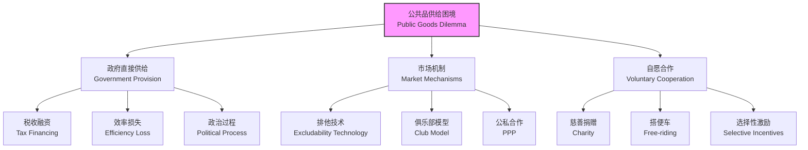

---
aliases:
  - 公共经济学
  - Public Economics
  - 公共财政
  - 政府经济学
  - 福利经济学
  - 公共政策
tags:
  - economics
  - public_economics
  - public_goods
  - taxation
  - externalities
  - government_intervention
  - welfare_economics
  - public_choice
---

# 公共经济学 (Public Economics)

公共经济学研究政府在经济体系中的角色与职能，分析公共部门如何通过资源配置、收入分配与经济稳定三大职能影响市场运行与社会福利。它整合了微观经济学的效率分析工具与政治经济学的制度视角，系统探讨公共品供给、税收设计、外部性矫正、社会保障与财政分权等核心议题，为理解现代混合经济的运作逻辑提供了不可或缺的知识框架。

## 市场失灵与政府干预 (Market Failure and Government Intervention)

### 市场效率的理论基准

在完全竞争市场的理想条件下，**福利经济学第一基本定理 (First Fundamental Theorem of Welfare Economics)** 确立了市场效率的基准命题：若不存在外部性、公共品与信息不对称，且所有市场均完全竞争，则竞争性均衡是帕累托最优的——即不存在任何人在不损害他人福利的前提下增进自身福利的余地。

然而，现实世界广泛存在 **市场失灵 (Market Failure)**，为政府干预提供了经济学上的正当性依据：

| 市场失灵类型 (Type) | 核心问题 (Core Problem) | 政府干预手段 (Policy Instruments) |
| :--- | :--- | :--- |
| 公共品 (Public Goods) | 非排他性与非竞争性导致私人供给不足、搭便车 | 政府直接提供或公共资助 |
| 外部性 (Externalities) | 私人成本/收益与社会成本/收益系统性偏离 | 税收、补贴、可交易许可、产权界定 |
| 垄断与市场势力 (Monopoly) | 价格扭曲、产量不足、福利净损失 | 反垄断执法、价格管制、国有化 |
| 信息不对称 (Asymmetric Information) | 逆向选择、道德风险、信号失灵 | 强制信息披露、许可证、社会保险 |
| 收入分配不公 (Inequality) | 市场结果不符合社会公平标准 | 累进所得税、转移支付、社会保障 |
| 宏观经济波动 (Macro Fluctuations) | 失业、通货膨胀、经济周期 | 财政政策、货币政策、自动稳定器 |

### 政府失灵的风险

政府干预并非总能纠正市场失灵，甚至可能加剧问题。**政府失灵 (Government Failure)** 的主要表现包括：

- **官僚低效 (Bureaucratic Inefficiency)**：政府部门缺乏利润激励与市场竞争压力，导致 X-非效率（X-inefficiency）——组织内部资源未充分利用。
- **寻租与腐败 (Rent-seeking and Corruption)**：利益集团通过非生产性游说、贿赂与政治献金获取政府创造的垄断租金或政策特权，造成社会福利净损失。
- **投票悖论 (Voting Paradox)**：Condorcet 悖论表明，在多元偏好下，多数投票可能无法产生传递性的集体偏好排序，导致民主决策的内在困难。
- **信息不对称的逆向问题**：政府同样面临信息不足，中央计划者往往不如分散的市场主体了解局部条件与个体偏好。

## 公共品理论 (Theory of Public Goods)

### 公共品的定义与分类

Paul Samuelson (1954) 的经典定义区分了消费品的两大属性：

- **非竞争性 (Non-rivalry)**：一个人对某物品的消费不减少他人可消费的同种物品数量。即增加一个消费者的边际成本为零：$MC_{\text{additional consumer}} = 0$。
- **非排他性 (Non-excludability)**：无法以合理成本将不愿付费者排除在该物品的消费之外。

| 分类 (Classification) | 竞争性 | 排他性 | 经济学性质 | 示例 |
| :--- | :--- | :--- | :--- | :--- |
| 私人品 (Private Goods) | 是 | 是 | 市场有效供给 | 面包、衣服、汽车 |
| 纯公共品 (Pure Public Goods) | 否 | 否 | 市场供给不足/缺失 | 国防、灯塔、基础科学研究 |
| 俱乐部品 (Club Goods) | 否 | 是 | 市场或集体供给可行 | 有线电视、收费公路、健身房 |
| 公共池塘资源 (Common Pool Resources) | 是 | 否 | 过度使用、租金耗散 | 渔业资源、清洁空气、地下水 |

### 公共品的最优供给条件

公共品的最优供给要求所有消费者的边际替代率之和等于边际转换率：

$$
\sum_{i=1}^{n} MRS_i = MRT
$$

对于私人品，帕累托效率要求所有消费者的边际替代率相等且等于边际转换率（$MRS_A = MRS_B = MRT$），这对应需求曲线的 **水平加总**。而对于公共品，由于非竞争性使所有消费者消费同一数量，社会边际收益为个人边际收益之和，故需需求曲线的 **垂直加总**。

### 搭便车问题与林达尔均衡

**搭便车问题 (Free-rider Problem)** 是公共品供给的核心困境：由于非排他性，理性个体有动机隐瞒真实支付意愿，期待他人承担成本而自己免费享用。这导致公共品的市场供给严重不足甚至完全缺失。

Erik Lindahl (1919) 提出 **林达尔均衡 (Lindahl Equilibrium)** 作为理论参照：若每个个体如实报告其边际支付意愿，并按比例分担公共品成本，则可实现公共品的有效供给。然而，**激励相容 (Incentive Compatibility)** 问题使得真实显示偏好成为机制设计的核心挑战——个体有动机低报支付意愿以减少自身分担额。

## 外部性 (Externalities)

### 外部性的分类与实例

外部性是指经济活动对非直接参与交易的第三方产生的、未通过市场价格反映的间接影响：

- **负外部性 (Negative Externalities)**：社会成本 > 私人成本。如工业污染、交通拥堵、噪音、过度捕捞。
- **正外部性 (Positive Externalities)**：社会收益 > 私人收益。如教育、基础研究、疫苗接种、蜜蜂授粉。

| 类型 | 生产外部性 | 消费外部性 |
| :--- | :--- | :--- |
| 正外部性 | 养蜂业为果园授粉、企业研发溢出 | 接种疫苗降低传染病传播风险、教育提升社会文明程度 |
| 负外部性 | 工厂排放污染物、农业面源污染 | 吸烟者危害被动吸烟者、驾驶汽车造成拥堵与排放 |

### 外部性的内部化机制

#### Pigouvian 税与补贴

Arthur Pigou (1920) 提出通过对负外部性征税（或对正外部性补贴），使私人成本/收益与社会成本/收益一致：

$$
t^* = MEC(q^*) = MSC(q^*) - MPC(q^*)
$$

其中 $t^*$ 为最优税率，等于边际外部成本 (Marginal External Cost)。若边际外部成本恒定，则定额税即可实现最优；若边际外部成本随产量递增，则税率应相应调整。

Pigouvian 税的优势在于：持续激励企业开发清洁技术以降低税负；为政府创造收入（可用于降低其他扭曲性税收）；若信息充分可达到社会最优。但其挑战在于：准确估计边际外部成本极为困难；面临强大的政治阻力；可能引发国际竞争力问题（碳泄漏）。

#### Coase 定理

Ronald Coase (1960) 提出了截然不同的解决路径：若产权明确且交易成本为零，则无论初始产权如何分配，市场交易均可达到社会最优的污染水平，无需政府干预。

然而，在现实世界中，Coase 定理面临根本性限制：

- **交易成本往往显著高昂**：多方谈判、信息获取、合约执行与监督的成本可能使市场交易不可行。
- **产权界定困难**：清洁空气、生物多样性等公共环境资源难以清晰界定与有效保护。
- **收入分配效应**：产权初始配置影响财富分配，进而影响社会福利评估。
- **策略性行为与搭便车**：受影响者可能采取 hold-up 策略或 free-ride 于他人谈判成果。

因此，Coase 定理更多是理论基准与思想实验，而非可直接操作的政策处方。

### 污染控制的政策工具比较

| 政策工具 (Instrument) | 作用机制 (Mechanism) | 核心优点 | 主要缺点 |
| :--- | :--- | :--- | :--- |
| 排放税 (Emission Tax) | 对单位排放量征税 | 成本效益、持续技术创新激励 | 需准确估计边际损害曲线 |
| 可交易排污许可 (Tradable Permits) | 设定总量上限，允许市场交易 | 确定总排放量、成本最小化 | 初始分配政治敏感、市场操纵风险 |
| 技术标准 (Technology Standards) | 强制使用特定减排技术 | 监管简单、技术确定性 | 缺乏灵活性、抑制创新、成本高 |
| 绩效标准 (Performance Standards) | 设定排放/产出比率上限 | 一定程度的企业灵活性 | 无连续边际激励、合规成本不确定 |

## 税收理论 (Taxation Theory)

### 税收的效率与公平权衡

税收制度设计面临 **效率 (Efficiency)** 与 **公平 (Equity / Justice)** 的双重目标：

- **超额负担 (Excess Burden / Deadweight Loss)**：税收扭曲相对价格信号，导致消费者剩余与生产者剩余的净损失，超出实际缴纳的税款。
- **拉姆齐规则 (Ramsey Rule)**：为使总体超额负担最小化，应对需求弹性较低的商品课以较高税率：

$$
\frac{t_i}{1 + t_i} \cdot \varepsilon_i = \lambda \quad \text{（对所有商品 } i \text{ 成立）}
$$

其中 $\varepsilon_i$ 为商品 $i$ 的补偿需求价格弹性，$\lambda$ 为公共收入的影子成本。该规则意味着，对生活必需品（需求缺乏弹性）应课以较高税率，对奢侈品（需求富有弹性）应课以较低税率。

### 最优所得税理论

James Mirrlees (1971) 的开创性最优所得税模型在激励相容约束下最大化社会福利：

- **边际税率结构**：最优边际税率并非简单单调递增，而是呈现复杂的非单调形态，取决于技能分布与劳动供给弹性。
- **顶端边际税率**：若最高收入者的技能分布无上界，传统模型推导出顶端最优边际税率可能趋近于零（以保留最高技能者的工作激励）；但后续研究在考虑更多现实因素后对此结论提出重要修正。
- **劳动供给弹性**：劳动供给弹性越大，最优边际税率应越低，以减少效率损失。

### 税收归宿分析

税收归宿 (Tax Incidence) 分析谁最终承担税负，区分 **法定归宿 (Statutory Incidence)**（法律上规定由谁缴纳）与 **经济归宿 (Economic Incidence)**（实际负担由谁承担）：

$$
\text{消费者税负比例} = \frac{E_s}{E_s + |E_d|}
$$

其中 $E_s$ 为供给价格弹性，$E_d$ 为需求价格弹性。供给弹性越大 / 需求弹性越小，消费者承担的税负比例越高。

## 公共选择与财政分权

### 公共选择理论

公共选择理论 (Public Choice Theory) 将经济学分析方法（理性选择、效用最大化）应用于政治决策过程：

- **中位选民定理 (Median Voter Theorem)**：在两党竞争、单峰偏好与多数投票规则下，政党政策趋向中位选民 (median voter) 的偏好位置。
- **利益集团理论 (Interest Group Theory)**：Mancur Olson (1965) 指出，小集团因人均收益高、组织成本低，更容易克服搭便车问题，对政策施加不成比例的影响。
- **官僚预算最大化模型 (Bureaucratic Budget Maximization)**：William Niskanen (1971) 认为官僚追求预算最大化而非社会福利最大化，导致公共部门过度扩张。

### 财政联邦主义

Charles Tiebout (1956) 的 "用脚投票" 模型提出：若存在大量地方辖区且居民可自由流动，则居民通过迁移选择最符合自身偏好的税收-公共品组合，实现地方公共品的准市场效率——仿佛存在一个地方公共品的 "市场"。

Wallace Oates (1972) 的 **分权定理 (Decentralization Theorem)** 指出：若不存在显著的规模经济或跨辖区外部性，公共品由地方政府分权供给更优，因为地方政府更了解辖区居民的具体偏好与本地条件。

| 政府层级 (Government Level) | 适宜职能 (Appropriate Functions) | 理由 (Rationale) |
| :--- | :--- | :--- |
| 中央/联邦 (Central/Federal) | 国防、宏观经济稳定、收入再分配、跨国/跨区外部性 | 全国性公共品、统一货币与贸易政策 |
| 地方/市政 (Local/Municipal) | 地方教育、治安、消防、地方基础设施 | 接近居民、信息优势、偏好匹配 |
| 区域/州 (Regional/State) | 流域管理、区域性交通网络、高等教育 | 规模经济、跨地方协调 |

## 社会保障与福利制度

### 社会保险

社会保险通过强制缴费与风险 pooling（风险共担）应对市场失灵：

- **养老金制度**：现收现付制 (Pay-As-You-Go, PAYG) 与完全积累制 (Fully Funded) 的权衡。Auerbach-Kotlikoff 世代交叠模型分析不同制度对资本积累、代际公平与经济效率的影响。
- **医疗保险**：逆向选择导致市场失灵，强制参保与风险调整机制 (risk adjustment) 是关键设计要素。
- **失业保险**：在提供消费平滑 (consumption smoothing) 与维持搜寻激励之间寻求平衡，最优替代率需权衡保险价值与道德风险。

### 贫困与收入再分配

- **贫困线测量**：绝对贫困线（满足基本需求的货币成本）vs. 相对贫困线（收入中位数的固定比例，如 50% 或 60%）。
- **负所得税 (Negative Income Tax, NIT)**：Milton Friedman 提出的方案，对低于贫困线的低收入者提供补贴，边际税率平滑过渡以减少劳动供给扭曲。
- **劳动收入税收抵免 (Earned Income Tax Credit, EITC)**：美国的实践，仅对有工作收入者提供补贴，在收入达到一定阈值后逐步退出，有效激励劳动参与。

## 结语

公共经济学为理解政府在现代经济中的角色提供了系统的分析框架。从公共品的非排他性困境到外部性的内部化机制，从最优税收的拉姆齐规则到财政分权的 Tiebout-Oates 理论，公共经济学深刻揭示了市场与政府之间的复杂互动关系。在气候变化、数字公共品、全球税收竞争与人口老龄化等新挑战面前，公共经济学持续演进，为设计更高效、更公平、更可持续的公共政策提供着坚实的理论基石。
