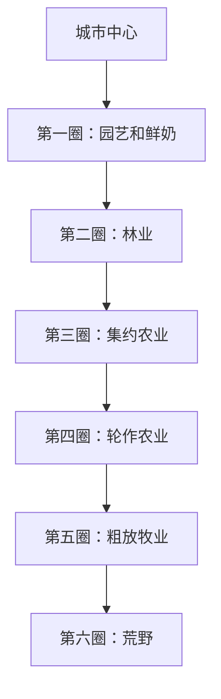
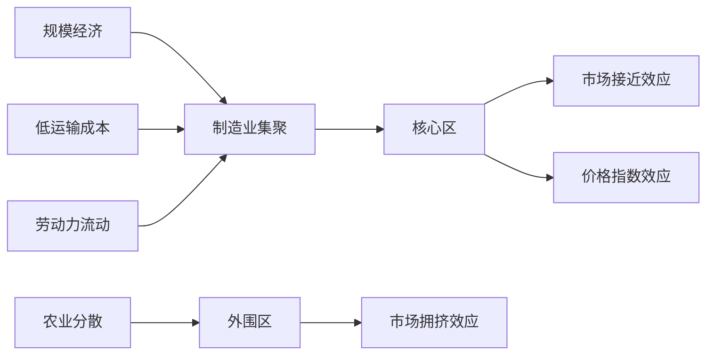

# 区域经济学 (Regional Economics)

## 一、区域经济学概述

### 1.1 定义与研究对象

区域经济学（Regional Economics）是研究经济活动的空间分布和区域差异规律的学科。它分析资源在空间上的配置、区域经济增长的不平衡以及区域之间的经济联系，为区域发展政策提供理论依据。

### 1.2 区域经济学的核心问题

| 问题 | 内容 |
|------|------|
| 空间集聚 | 经济活动为什么集中在某些地区？ |
| 区域差异 | 为什么地区间收入水平存在差异？ |
| 区域增长 | 区域经济增长的动力和机制是什么？ |
| 区域联系 | 区域间的贸易、资本和劳动力如何流动？ |
| 区域政策 | 政府如何促进区域协调发展？ |

## 二、区位理论

### 2.1 杜能的农业区位论

杜能（Von Thünen）的农业区位模型解释了围绕城市中心的农业土地利用模式：

**地租函数**：$R(d) = (P - C) - t \times d$

### 2.2 韦伯的工业区位论

韦伯（Alfred Weber）分析了工业选址的运输成本和劳动力成本最小化问题：

**原料指数**：

$$
\text{原料指数} = \frac{\text{局部原料重量}}{\text{产品重量}}
$$

原料指数越大，企业越倾向于靠近原料产地。

### 2.3 克里斯塔勒的中心地理论

克里斯塔勒（Christaller）的中心地理论（Central Place Theory）解释城镇的规模等级和空间分布，不同等级的中心地提供不同范围和门槛的货物和服务。

## 三、区域经济增长理论

### 3.1 收敛假说

**收敛假说**（Convergence Hypothesis）：在自由市场条件下，落后地区经济增长快于发达地区，最终趋于收敛。

**条件收敛**：$g_i = \alpha + \beta \log(y_{i,0}) + \gamma X_i + \varepsilon_i$，$\beta < 0$ 表明初始收入越低增长越快。

### 3.2 累积因果理论

缪尔达尔（Myrdal）的累积因果理论（Cumulative Causation Theory）：

| 效应 | 定义 | 结果 |
|------|------|------|
| 回流效应（Backwash Effect） | 发达地区吸走落后地区资源 | 扩大差距 |
| 扩散效应（Spread Effect） | 发达地区带动落后地区发展 | 缩小差距 |

### 3.3 增长极理论

佩鲁（Perroux）的增长极理论（Growth Pole Theory）主张通过培育增长极带动区域发展。

### 3.4 新经济地理学

克鲁格曼（Krugman）的新经济地理学（New Economic Geography, NEG）将规模报酬递增、运输成本和要素流动纳入空间经济分析：

**核心-外围模型**：

| 驱动力 | 效应方向 |
|--------|----------|
| 市场接近效应 | 集聚 |
| 价格指数效应 | 集聚 |
| 市场拥挤效应 | 分散 |

## 四、区域产业结构

### 4.1 区域产业结构演进

| 阶段 | 主导产业 | 特征 |
|------|----------|------|
| 农业阶段 | 第一产业 | 资源密集型 |
| 工业化阶段 | 第二产业 | 资本密集型 |
| 后工业化阶段 | 第三产业 | 知识密集型 |
| 知识经济阶段 | 信息技术、创意产业 | 创新驱动 |

### 4.2 产业集聚与集群

**波特钻石模型**（Porter's Diamond Model）：

$$
\text{集群竞争力} = f(\text{要素条件}, \text{需求条件}, \text{相关支持产业}, \text{企业战略与竞争})
$$

### 4.3 地方化经济与城市化经济

| 类型 | 定义 | 来源 |
|------|------|------|
| 地方化经济 | 同一行业集聚带来的成本节约 | 劳动力池、知识溢出 |
| 城市化经济 | 城市整体规模带来的成本节约 | 基础设施共享、多样化服务 |

## 五、区域经济发展战略

### 5.1 平衡增长与不平衡增长

| 战略 | 主张 | 理论依据 |
|------|------|----------|
| 平衡增长 | 各地区均衡投资 | 纳克斯贫困恶性循环 |
| 不平衡增长 | 优先发展重点地区 | 赫尔希曼关联效应 |
| 增长极战略 | 培育区域增长中心 | 佩鲁增长极理论 |

### 5.2 区域政策工具

| 政策工具 | 类型 | 示例 |
|----------|------|------|
| 基础设施投资 | 硬性支持 | 交通、通信、能源设施 |
| 税收优惠 | 财政激励 | 开发区税收减免 |
| 产业园区 | 空间载体 | 高新区、自贸区 |
| 转移支付 | 财政平衡 | 中央对地方财政转移 |
| 人力资本投资 | 软性支持 | 教育、培训、人才引进 |

## 六、区域经济一体化

### 6.1 区域经济一体化的形式

| 形式 | 特征 | 示例 |
|------|------|------|
| 自由贸易区 | 成员间取消关税 | NAFTA |
| 关税同盟 | 共同对外关税 | 欧盟早期 |
| 共同市场 | 要素自由流动 | 欧盟 |
| 经济同盟 | 统一经济政策 | 欧盟 |
| 完全经济一体化 | 统一货币和财政政策 | 欧元区 |

### 6.2 贸易创造与贸易转移

$$
\text{净福利效应} = \text{贸易创造} - \text{贸易转移}
$$

## 七、城市经济学

### 7.1 城市规模分布

**齐普夫定律**（Zipf's Law）：城市规模与其排名成反比：$\text{人口}_i \propto \frac{1}{\text{排名}_i}$

### 7.2 城市地租与土地利用

城市内部土地竞标租金函数：$R(d) = R_0 e^{-\tau d}$

### 7.3 城市最优规模

**集聚效应**与**拥挤效应**之间的权衡决定最优城市规模。

## 八、区域政策与治理

### 8.1 中国区域协调发展战略

- 西部大开发
- 东北等老工业基地振兴
- 中部地区崛起
- 东部地区率先发展
- 乡村振兴战略

### 8.2 区域治理

区域治理涉及跨行政区划的公共事务协调机制，包括府际合作、区域规划、生态补偿、流域治理等。

## 九、区域经济前沿议题

### 9.1 区域创新系统

区域创新系统（Regional Innovation System, RIS）强调创新网络、知识溢出和制度环境对区域竞争力的作用。硅谷、中关村等创新集群的成功表明，创新生态系统的建设对区域发展具有核心意义。

### 9.2 收缩城市

收缩城市（Shrinking Cities）指人口持续减少的城市。德国莱比锡、美国底特律和中国东北部分城市是典型案例。应对策略包括精明收缩（Smart Shrinkage）、绿色空间改造和城市功能重组。

### 9.3 数字经济与空间经济

数字经济对传统区位理论形成挑战——远程工作使部分经济活动的空间约束减弱，但数字平台和数据中心又产生新的集聚效应。

### 9.4 城市群与都市圈

城市群和都市圈是区域一体化的主要空间形式。中国已形成京津冀、长三角、粤港澳大湾区、成渝地区双城经济圈等国家级城市群。

## 十、中国区域经济战略

中国区域经济战略经历了从均衡发展到非均衡发展再到协调发展的演变：

| 阶段 | 战略 | 重点区域 |
|------|------|----------|
| 1949-1978 | 均衡布局 | 三线建设 |
| 1979-1998 | 沿海优先 | 经济特区、沿海开放城市 |
| 1999-2012 | 区域协调 | 西部大开发、东北振兴、中部崛起 |
| 2013至今 | 高质量发展 | 一带一路、京津冀协同、长三角一体化、粤港澳大湾区 |

## 相关条目

- [[03_HumanitiesAndSocialSciences/Economics/DevelopmentEconomics|DevelopmentEconomics]]
- [[03_HumanitiesAndSocialSciences/Economics/InternationalEconomics|InternationalEconomics]]
- [[03_HumanitiesAndSocialSciences/Economics/IndustrialOrganization|IndustrialOrganization]]
- [[PoliticalEconomy]]
- [[INDEX|当前目录索引]]

## 深入阅读与扩展分析
该领域的知识体系经过长期积累已相当丰富。
以下内容旨在帮助读者进一步把握核心要点。

### 知识结构导引
该学科的理论框架是多层次的。
从最抽象的本体论假设。
到中程理论的实证假设。
再到操作化的研究假设。
每一层都有其独特功能。

### 主要研究范式对比
| 维度 | 实证主义 | 解释主义 | 批判范式 |
|------|---------|---------|---------|
| 本体论 | 实在论 | 建构论 | 历史实在论 |
| 认识论 | 客观主义 | 主观主义 | 解放认知 |
| 方法论 | 定量为主 | 定性为主 | 对话辩证 |
| 目标 | 解释预测 | 理解意义 | 揭露解放 |

### 经典研究案例分析
案例研究的价值在于展示理论的实践应用。
以下是该领域中几个具有代表性的研究。
它们的方法设计和理论贡献值得深入分析。
每个案例都对学科的后续发展产生了影响。

### 跨文化比较视角
不同文化背景下存在显著的差异。
这些差异对理论普适性提出了挑战。
跨文化研究设计需要特别注意文化偏见。
本地化概念的使用需要细致定义。

### 当代前沿热点
1. 数字化与人工智能的社会影响
2. 全球不平等的新形态
3. 气候变化的社会回应
4. 身份政治与民主危机
5. 后疫情时代的社会变迁
6. 技术伦理与人文关怀

### 方法论工具箱
研究人员可以根据研究问题选择方法。
定量方法适合检验假设和推断总体。
定性方法适合探索意义和生成理论。
混合方法整合两类优势以增强说服力。
实验方法旨在建立因果关系。
纵向设计追踪变化和过程。
比较策略揭示制度和文化的差异。

### 学术资源推荐
主要学术期刊发表该领域的前沿研究。
专业学会组织学术会议和交流活动。
在线数据库提供文献检索服务。
开放获取资源降低了知识获取门槛。
学术博客和播客提供了非正式的学习渠道。

### 学习路径设计
初学者应从通论性教材开始学习。
在建立基本框架后阅读经典原著。
然后选择感兴趣的方向深入阅读。
参与讨论和写作有助于深化理解。
独立研究是培养学术能力的核心环节。

### 批判性思维训练
学会质疑前提假设是学术训练的关键。
考察证据是否充分支持结论。
辨别因果关系与相关关系的区别。
识别论证中的逻辑谬误。
评估不同解释的合理性。
反思自身的认知偏见。

### 学术职业发展
学术道路需要长期投入和持续学习。
发表论文是学术生涯的必经之路。
学术网络的建设需要主动参与。
教学与研究之间的平衡值得关注。
跨学科能力在当代学术市场日益重要。

### 研究的公共价值
学术研究应当服务于公共福祉。
知识创新推动社会进步。
政策咨询将学术转化为实践。
公众科普缩小知识鸿沟。
社会批评促进反思和改进。

### 未来展望
该领域将继续回应时代提出的新问题。
技术进步为研究提供了新的工具。
全球化使比较研究更加重要。
跨学科整合是未来的主要趋势。
学术民主化需要更多元的参与者。

## 关键概念辨析
概念定义的清晰度直接影响研究的质量。
以下是该领域中若干容易混淆的概念。

**概念一与概念二的区分**：
前者侧重于外在的形式特征。
后者关注内在的运作机制。
两者在实际分析中往往需要结合使用。

**微观与宏观层面的联系**：
微观现象是宏观结构的基础。
宏观结构又约束微观行为。
理解两者的相互作用是社会分析的核心。

**静态分析与动态分析**：
静态分析关注某一时点的截面特征。
动态分析关注过程和变化的轨迹。
两种视角互补而非替代。

## 综合思考题
1. 该领域与其他相关学科的关系是什么？
2. 该领域最核心的学术贡献有哪些？
3. 经典理论在当代的有效性如何？
4. 该领域的研究方法有什么特点？
5. 数字技术如何改变该领域的研究实践？
6. 该领域存在哪些未解决的重要问题？
7. 全球化如何影响该领域的研究议程？
8. 该领域的知识如何应用于公共政策？
9. 跨学科整合面临哪些机遇和挑战？
10. 未来十年该领域可能有哪些突破？

## 相关条目
- [[INDEX|当前目录索引]]
