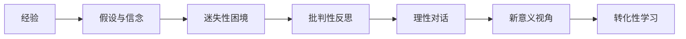
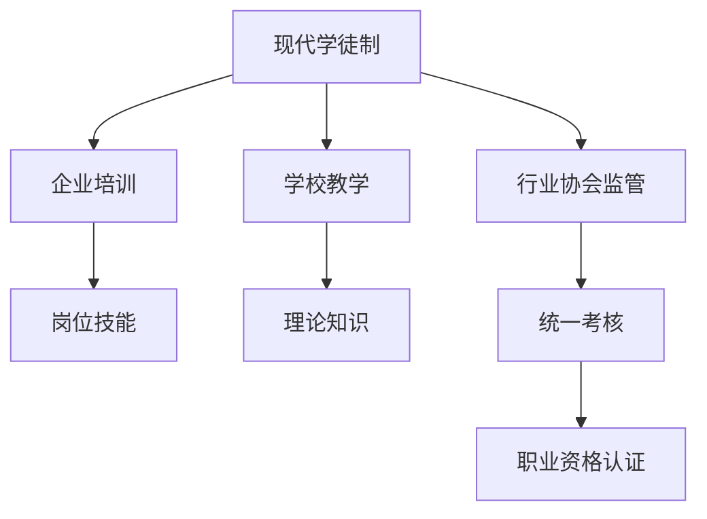
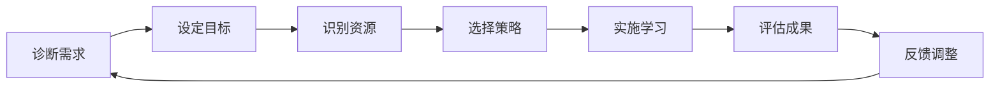
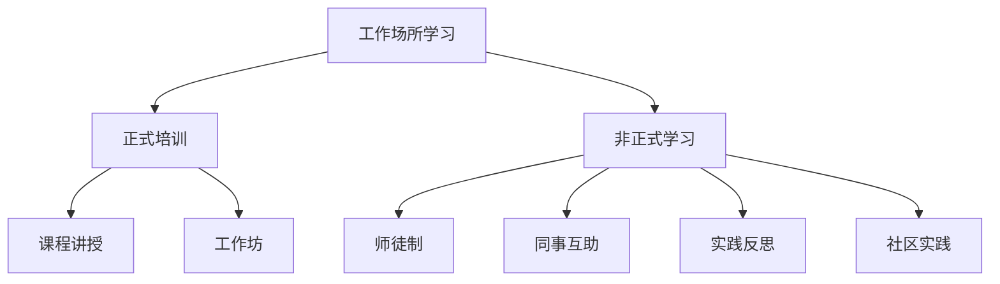

---
aliases:
  - 成人教育
  - Adult Education
  - 继续教育
  - Continuing Education
  - 终身学习
  - Lifelong Learning
tags:
created: 2026-05-17
updated: 2026-05-17
  - education
  - adult-education
  - lifelong-learning
  - vocational-training
  - andragogy
---

# 成人教育 (Adult Education)

成人教育 (Adult Education) 是指针对已完成初始教育、进入社会生活的成年人所实施的系统性教育活动。成人教育涵盖继续教育 (Continuing Education)、职业培训 (Vocational Training)、社区教育 (Community Education) 与终身学习 (Lifelong Learning) 等多重形态，旨在满足成年人更新知识、提升技能、实现自我发展与适应社会变革的需求。

## 成人教育学的理论基础 (Theoretical Foundations of Andragogy)

### 诺尔斯成人教育学理论 (Knowles' Andragogy)

马尔科姆·诺尔斯 (Malcolm Knowles) 于1968年提出成人教育学 (Andragogy) 概念，以区别于儿童教育学 (Pedagogy)。诺尔斯提出成人学习者的六个基本假设：

1. **需要知道 (Need to Know)**：成人需要了解学习的目的与价值
2. **自我概念 (Self-concept)**：成人具有自我导向的自主人格
3. **经验 (Experience)**：成人拥有丰富的生活与工作经验，是学习资源
4. **准备就绪 (Readiness to Learn)**：成人的学习准备度与其社会角色任务相关
5. **定向学习 (Orientation to Learning)**：成人倾向于问题中心而非学科中心的学习
6. **内在动机 (Internal Motivation)**：成人更受内在因素（自尊、自我实现）驱动

诺尔斯的成人学习模型可表示为：

$$
L_a = f(S, E, R, P, M)
$$

其中 $L_a$ 为成人学习成效，$S$ 为自我导向程度，$E$ 为经验整合，$R$ 为角色相关准备度，$P$ 为问题导向，$M$ 为内在动机强度。

### 转化性学习理论 (Transformative Learning Theory)

杰克·麦基罗 (Jack Mezirow) 提出转化性学习理论，认为成人学习的关键在于意义视角 (meaning perspectives) 的转变。当学习者遭遇“迷失性困境”(disorienting dilemma) 时，原有的假设、信念与价值观受到挑战，通过批判性反思 (critical reflection) 与理性对话 (rational discourse) 建构新的意义体系。

## 终身学习体系 (Lifelong Learning System)

### 终身学习的概念框架 (Conceptual Framework)

终身学习 (Lifelong Learning) 是指个体从出生到死亡的持续学习过程，贯穿正规教育 (formal education)、非正规教育 (non-formal education) 与非正式学习 (informal learning) 三种形态。

| 学习形态 | 场所 | 特征 | 认证方式 |
| :--- | :--- | :--- | :--- |
| 正规教育 | 学校、大学 | 制度化、课程化、学历认证 | 学位、文凭 |
| 非正规教育 | 培训机构、企业大学 | 有组织但非学历导向 | 证书、资格 |
| 非正式学习 | 工作场所、社区、网络 | 自发、经验性、嵌入式 | 通常无认证 |

### 欧盟终身学习战略 (EU Lifelong Learning Strategy)

欧盟将终身学习作为应对知识经济挑战的核心战略，提出四大支柱：

1. **欧盟学分转换系统 (ECTS)**：促进学习与资格的跨国互认
2. **欧洲资格框架 (EQF)**：将各国资格纳入8个等级标准
3. **先前学习认可 (RPL)**：认可非正规与非正式学习成果
4. **关键能力框架 (Key Competences)**：定义终身学习所需的核心素养

终身学习参与率指标：

$$
P_{ll} = \frac{N_{participating}}{N_{adult}} \times 100\%
$$

其中 $P_{ll}$ 为成人终身学习参与率，$N_{participating}$ 为过去12个月参加过教育与培训的25-64岁人口数，$N_{adult}$ 为该年龄段总人口。

## 职业培训与技能发展 (Vocational Training and Skill Development)

### 现代学徒制 (Modern Apprenticeship)

现代学徒制 (Modern Apprenticeship) 是将 workplace-based training 与 school-based instruction 相结合的职业教育模式。德国“双元制”(Dual System) 是现代学徒制的典范：

| 培训场所 | 培训内容 | 时间占比 | 负责主体 |
| :--- | :--- | :--- | :--- |
| 企业 (Betrieb) | 实践技能训练 | 约70% | 雇主与师傅 |
| 职业学校 (Berufsschule) | 理论教学与通识教育 | 约30% | 州政府 |

学徒制培训遵循《职业教育法》(Berufsbildungsgesetz, BBiG)，由行业协会组织统一的中期考试与结业考试，合格者获全国认可的职业资格证书。

### 技能形成体系 (Skill Formation Systems)

根据劳资关系与国家角色的不同，学者区分三种技能形成模式：

1. **集体主义技能形成 (Collective Skill Formation)**：以德国为代表，雇主协会与工会合作共建培训体系，国家提供法律框架与财政支持
2. **自由主义技能形成 (Liberal Skill Formation)**：以美国、英国为代表，市场驱动为主，企业各自为政，通用技能 (general skills) 由高等教育提供
3. **国家主义技能形成 (State-led Skill Formation)**：以新加坡为代表，政府直接规划技能发展，强制推行国家资格框架

### 微证书与数字徽章 (Micro-credentials and Digital Badges)

微证书是对特定技能或知识模块的认证，体量小于传统学位课程，具有灵活性、模块化与可堆叠 (stackable) 特征。数字徽章 (digital badges) 以开放标准（如 Open Badges）记录学习成就，嵌入元数据展示颁发机构、评估标准与能力描述。

## 成人学习者的特征与需求 (Characteristics and Needs of Adult Learners)

### 成人发展阶段理论 (Adult Development Stages)

丹尼尔·莱文森 (Daniel Levinson) 提出成人生命结构理论，认为成人发展经历可预测的阶段性转变：

| 阶段 | 年龄 | 核心任务 |
| :--- | :--- | :--- |
| 成年早期过渡期 | 17-22岁 | 离开家庭、初步职业选择 |
| 进入成人世界 | 22-28岁 | 建立职业与亲密关系 |
| 三十岁过渡期 | 28-33岁 | 重新评估早期选择 |
| 安定时期 | 33-40岁 | 追求职业成就与家庭稳定 |
| 中年过渡期 | 40-45岁 | 质疑现有生活结构 |
| 中年安定 | 45-50岁 | 确立新的人生方向 |
| 五十岁过渡期 | 50-55岁 | 面对衰老与有限性 |
| 晚年安定 | 55-60岁 | 整合人生经验 |

### 成人学习的障碍 (Barriers to Adult Learning)

成人参与学习面临结构性、制度性与心理性障碍：

| 障碍类型 | 具体表现 | 应对策略 |
| :--- | :--- | :--- |
| 结构性障碍 | 时间冲突、经济负担、交通便利性 | 弹性学制、资助政策、在线学习 |
| 制度性障碍 | 入学门槛、资格认证、课程僵化 | 开放入学、RPL、模块化课程 |
| 心理性障碍 | 学习焦虑、自我效能感低、刻板印象 | 学习支持、成功体验、正面反馈 |
| 信息性障碍 | 不了解学习机会、信息获取困难 | 职业指导、学习顾问、信息平台 |

## 成人教育的教学模式 (Teaching Models in Adult Education)

### 自我导向学习 (Self-directed Learning, SDL)

自我导向学习是成人教育的核心模式，指学习者在他人协助下主动诊断学习需求、制定学习目标、识别学习资源、选择学习策略并评估学习成果的过程。

诺尔斯提出的自我导向学习流程：

### 体验式学习 (Experiential Learning)

大卫·库伯 (David Kolb) 提出体验式学习循环 (Experiential Learning Cycle)：

$$
\text{具体经验 (CE)} \rightarrow \text{反思观察 (RO)} \rightarrow \text{抽象概念化 (AC)} \rightarrow \text{主动实验 (AE)} \rightarrow \text{具体经验}
$$

成人教育者应设计包含四种能力的综合学习活动，适应不同学习风格 (learning styles) 的成人学习者。

### 行动学习 (Action Learning)

瑞文斯 (Reg Revans) 提出的行动学习公式：

$$
L = P + Q
$$

其中 $L$ 为学习 (Learning)，$P$ 为程序化知识 (Programmed Knowledge)，$Q$ 为质疑性洞察 (Questioning Insight)。行动学习通过解决真实工作问题促进学习，小组 (set) 在催化者 (facilitator) 引导下进行结构化反思。

## 工作场所学习 (Workplace Learning)

### 非正式工作场所学习 (Informal Workplace Learning)

研究表明，成人所获得的工作技能中，约70%-80%来自非正式工作场所学习，而非正规培训。非正式学习发生于日常工作实践中，通过观察、模仿、试错、同伴互动与反思获得。

### 学习型组织 (Learning Organization)

彼得·圣吉 (Peter Senge) 在《第五项修炼》中提出学习型组织的五项核心修炼：

1. **系统思考 (Systems Thinking)**：理解事物之间的相互关联与动态复杂性
2. **个人 mastery (Personal Mastery)**：持续澄清与深化个人愿景
3. **心智模式 (Mental Models)**：反思与挑战深层的假设与成见
4. **共同愿景 (Shared Vision)**：建立组织成员共同持有的未来图景
5. **团队学习 (Team Learning)**：通过对话与讨论提升集体智慧

## 成人教育的政策与治理 (Policy and Governance)

### 资格框架体系 (Qualifications Framework)

国家资格框架 (National Qualifications Framework, NQF) 是整合各类教育成果、促进纵向衔接与横向沟通的制度工具。资格框架通常包含多个等级 (levels)，每个等级对应特定的知识、技能与能力标准。

| 等级 | 描述 | 对应教育层次 |
| :--- | :--- | :--- |
| 1-2级 | 基础操作技能 | 义务教育后基础职业培训 |
| 3-4级 | 熟练技术工人 | 中等职业教育 |
| 5-6级 | 技术员与助理专业人员 | 高等职业教育、副学士学位 |
| 7级 | 专业人员 | 学士学位 |
| 8级 | 高级专业人员 | 硕士学位 |
| 9-10级 | 专家与原创研究者 | 博士学位 |

### 成人教育的未来趋势 (Future Trends)

- 人工智能驱动的个性化学习路径
- 零工经济 (gig economy) 背景下的技能快速迭代
- 老年教育 (educational gerontology) 与积极老龄化
- 开放教育资源 (OER) 与大规模开放在线课程 (MOOC)
- 技能预测与劳动力市场情报系统
