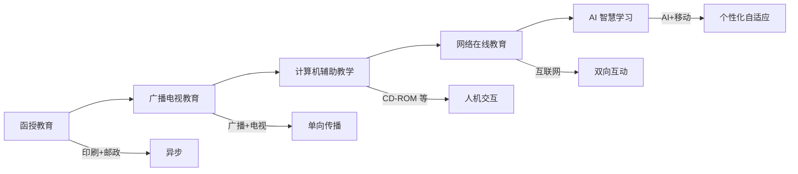
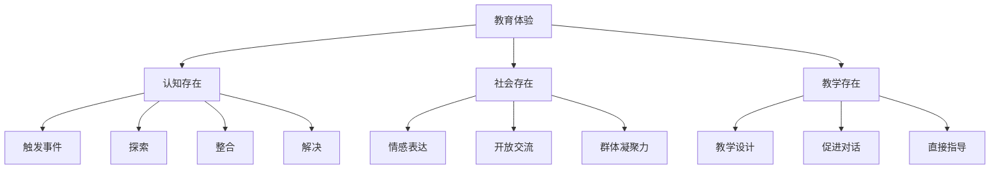

# 远程教育 (Distance Education)

## 一、远程教育概述

### 1.1 定义与范畴

远程教育（Distance Education / Distance Learning）是指师生在时空上分离，通过技术手段实现教学互动的教育形式。它突破了传统课堂的空间限制，使学习者能够不受地理约束接受教育。

### 1.2 远程教育的特征

| 特征 | 说明 |
|------|------|
| 时空分离 | 教师和学习者不在同一地点和时间 |
| 媒体中介 | 依赖技术媒介传递教学内容 |
| 双向沟通 | 师生之间、生生之间互动交流 |
| 自主学习 | 学习者自我管理学习进程 |
| 开放灵活 | 入学门槛低、学习方式灵活 |

### 1.3 远程教育的代际演变

| 代际 | 时期 | 主要技术 | 代表形式 |
|------|------|----------|----------|
| 第一代 | 1840s-1960s | 印刷品和邮政 | 函授课程 |
| 第二代 | 1960s-1980s | 广播电视 | 广播电视大学 |
| 第三代 | 1980s-1990s | 计算机和多媒体 | 计算机辅助教学 |
| 第四代 | 1990s-2010s | 互联网 | 网络教育、MOOC |
| 第五代 | 2010s 至今 | AI、移动技术 | 智慧学习、泛在学习 |

## 二、远程教育理论

### 2.1 独立学习理论

魏德迈（Wedemeyer）提出独立学习的六项原则：学习者在时间和地点上有更多自由，对自己的学习速度负责。

### 2.2 教学对话理论

霍姆伯格（Holmberg）的有指导教学对话（Guided Didactic Conversation）强调师生互动是远程教育的核心。模拟对话通过精心设计的教材实现，真实对话通过电话、邮件和视频交流实现。

### 2.3 交互距离理论

穆尔（Moore）的交互距离理论（Transactional Distance Theory）：

$$
\text{交互距离} = f(\text{结构}, \frac{1}{\text{对话}})
$$

| 维度 | 定义 | 高 vs 低 |
|------|------|----------|
| 对话（Dialogue） | 师生之间的互动程度 | 高对话→低距离 |
| 结构（Structure） | 课程设计的灵活程度 | 高结构→高距离 |
| 自主性（Autonomy） | 学习者的自我管理程度 | 高自主→适合高距离 |

### 2.4 探究社区模型

加里森（Garrison）的探究社区模型（Community of Inquiry, CoI）：

## 三、远程教育的技术

### 3.1 同步与异步技术

| 类型 | 技术工具 | 特点 | 适用场景 |
|------|----------|------|----------|
| 同步 | 视频会议（Zoom、腾讯会议） | 实时互动 | 直播授课、讨论 |
| 同步 | 虚拟教室 | 白板、分组、投票 | 互动教学 |
| 同步 | 实时聊天 | 即时交流 | 答疑解惑 |
| 异步 | 视频点播 | 随时观看 | 录播课程 |
| 异步 | 讨论论坛 | 深度交流 | 课后讨论 |
| 异步 | 电子邮件 | 正式沟通 | 作业提交 |

### 3.2 学习管理系统

学习管理系统（LMS）的功能包括课程管理、学生管理、评估工具、沟通工具和数据分析。典型系统有 Moodle（开源）、Blackboard、Canvas、超星学习通、雨课堂。

### 3.3 大规模开放在线课程

| 类型 | 特征 | 代表平台 |
|------|------|----------|
| cMOOC | 关联主义，强调知识创造和连接 | 早期 MOOCs |
| xMOOC | 行为主义，强调知识传递和测试 | Coursera、edX、中国大学 MOOC |
| SPOC | 小规模私人在线课程 | 高校专属课程 |
| DOCC | 分布式合作课程 | 多校联合开课 |

## 四、远程教学设计

### 4.1 ADDIE 模型

| 阶段 | 活动 | 产出 |
|------|------|------|
| 分析（Analysis） | 需求评估、学习者和环境分析 | 需求分析报告 |
| 设计（Design） | 学习目标、评估策略、内容结构 | 教学设计方案 |
| 开发（Development） | 制作学习材料和活动 | 课程内容 |
| 实施（Implementation） | 教学交付和学习支持 | 教学运行 |
| 评估（Evaluation） | 形成性和总结性评估 | 改进建议 |

### 4.2 多媒体学习原则

梅耶（Mayer）的多媒体学习认知理论提出12条设计原则：

| 原则 | 含义 |
|------|------|
| 多媒体原则 | 图文结合优于纯文字 |
| 空间邻近原则 | 文字和对应图片靠近排列 |
| 时间邻近原则 | 文字和图片同时呈现 |
| 一致性原则 | 去除无关材料 |
| 模态原则 | 动画+旁白优于动画+屏幕文字 |
| 冗余原则 | 动画+旁白优于动画+旁白+屏幕文字 |
| 分段原则 | 信息分段呈现优于连续呈现 |

### 4.3 远程课程设计策略

- **模块化设计**：将课程分解为独立的学习单元
- **交互性设计**：嵌入测验、讨论和协作活动
- **可视化设计**：使用图表、动画和视频增强理解
- **无障碍设计**：确保所有学习者可访问
- **移动友好设计**：适配手机和平板学习

## 五、远程教育的质量保障

| 维度 | 指标 |
|------|------|
| 教学资源 | 内容准确性、更新频率、互动性 |
| 教学支持 | 教师响应速度、辅导质量 |
| 技术支持 | 平台稳定性、易用性 |
| 学习支持 | 学术指导、心理支持、职业指导 |
| 学习成果 | 完成率、满意度、知识迁移 |

### 5.1 退学率问题

远程教育退学率普遍高于面授教育（可达40-80%），影响因素包括：

$$
\text{退学风险} = f(\text{学习动机}, \text{时间管理}, \text{技术支持}, \text{社会支持}, \text{课程设计})
$$

### 5.2 在线评估

| 评估类型 | 方法 | 远程教育特点 |
|----------|------|-------------|
| 形成性评估 | 测验、作业、讨论 | 自动评分、同伴互评 |
| 总结性评估 | 期末考试、项目 | 在线监考、防作弊 |
| 真实性评估 | 作品集、项目报告 | 电子档案袋（e-Portfolio） |

## 六、远程教育的趋势

- **人工智能**：智能导师系统（ITS）、自适应学习路径、自动评估
- **学习分析**：学习行为数据驱动的个性化干预和预测
- **虚拟现实/增强现实**：沉浸式虚拟实验、虚拟实训
- **区块链**：学习成果认证和学分互认，防篡改学历证书
- **微学习**：碎片化、模块化的学习单元，5-10分钟
- **混合学习模式**：线上线下融合的最佳实践

## 七、远程教育的挑战

### 7.1 数字鸿沟

数字鸿沟（Digital Divide）体现在三个层面：
1. **接入鸿沟**：网络覆盖和设备可及性
2. **使用鸿沟**：数字素养和技能差异
3. **结果鸿沟**：数字技术带来的收益差异

### 7.2 学习自律性

远程学习对自我管理能力要求高，缺乏监督和互动可能导致学习动力下降。自我调节学习（Self-Regulated Learning, SRL）能力是远程学习成功的关键。

### 7.3 社交缺失

人际互动不足影响学习的社会建构过程。建立学习社区、促进同伴互动和定期线下活动是重要应对策略。

## 八、远程教育中的评价

### 8.1 在线考试防作弊

| 措施 | 原理 | 局限性 |
|------|------|--------|
| 远程监考 | 摄像头实时监控 | 隐私问题、设备要求 |
| 屏幕录制 | 记录考生屏幕活动 | 数据量大、分析难度高 |
| AI 行为分析 | 检测异常行为模式 | 误报率、公平性争议 |
| 开卷设计 | 设计高认知水平题目 | 命题难度大 |

### 8.2 学习分析

学习分析（Learning Analytics）利用教育数据挖掘技术分析学习行为模式，为教学改进和个性化干预提供依据。

## 九、远程教育的未来展望

| 趋势 | 影响 | 挑战 |
|------|------|------|
| AI 自适应学习 | 个性化学习路径 | 算法偏见、数据隐私 |
| VR/AR 沉浸学习 | 增强学习体验 | 设备成本、内容开发 |
| 区块链认证 | 学历证书不可篡改 | 技术成熟度、标准统一 |
| 5G+教育 | 高清实时互动 | 网络覆盖、资费 |
| 元宇宙教育 | 虚拟校园社区 | 基础设施、认知负担 |

## 相关条目

- [[AdultEducation]]
- [[HigherEducation]]
- [[EducationalPhilosophy]]
- [[TeacherEducation]]
- [[INDEX|当前目录索引]]
