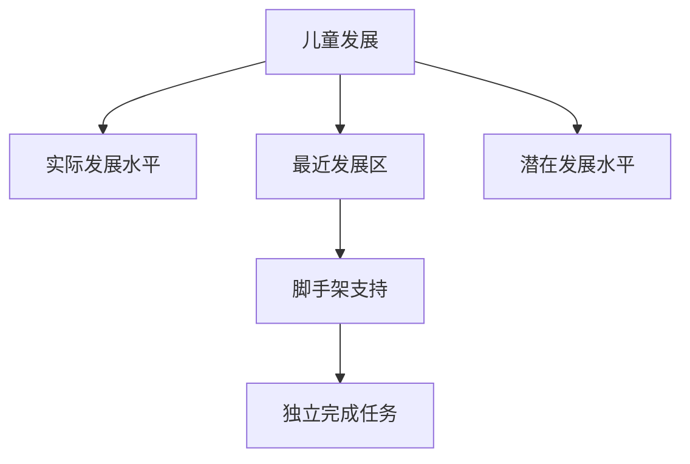
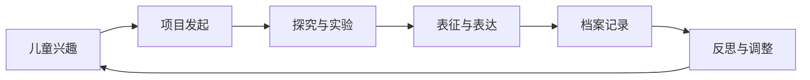
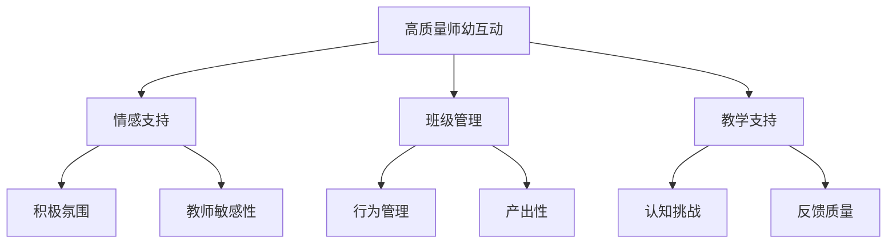

---
aliases:
  - 幼儿教育
  - Early Childhood Education
  - 学前教育
  - Preschool Education
  - 儿童早期发展
  - Early Childhood Development
tags:
  - education
  - early-childhood
  - child-development
  - pedagogy
  - play-based-learning
---

# 幼儿教育 (Early Childhood Education)

幼儿教育 (Early Childhood Education, ECE) 是指对0-8岁儿童实施的有目的、有计划的教育活动，涵盖托儿所 (nursery)、幼儿园 (kindergarten/preschool) 与小学低年级阶段。幼儿教育是终身学习的奠基阶段，对儿童的认知发展、社会情感形成与学习能力培养具有深远影响。

## 儿童发展理论 (Child Development Theories)

### 皮亚杰认知发展理论 (Piaget's Theory of Cognitive Development)

让·皮亚杰 (Jean Piaget) 提出儿童认知发展的四阶段理论，认为儿童通过同化 (assimilation) 与顺应 (accommodation) 建构对世界的理解：

| 阶段 | 年龄 | 核心特征 | 教育启示 |
| :--- | :--- | :--- | :--- |
| 感知运动阶段 (Sensorimotor) | 0-2岁 | 通过感觉与动作认识世界，发展客体永久性 | 提供感官探索机会 |
| 前运算阶段 (Preoperational) | 2-7岁 | 象征思维、自我中心、直觉推理 | 使用具体形象教学 |
| 具体运算阶段 (Concrete Operational) | 7-11岁 | 守恒概念、分类排序、可逆思维 | 提供具体操作材料 |
| 形式运算阶段 (Formal Operational) | 11岁以上 | 抽象逻辑、假设演绎推理 | 鼓励批判性思考 |

皮亚杰的平衡化模型：

$$
\text{认知发展} = f(\text{同化}, \text{顺应}, \text{平衡})
$$

当儿童遇到无法用现有图式 (schema) 理解的新经验时，产生认知失衡 (disequilibrium)，通过顺应调整图式，达到新的平衡 (equilibration)。

### 维果茨基社会文化理论 (Vygotsky's Sociocultural Theory)

列夫·维果茨基 (Lev Vygotsky) 强调社会互动与文化工具在认知发展中的核心作用。他提出两个关键概念：

- **最近发展区 (Zone of Proximal Development, ZPD)**：儿童独立解决问题的实际发展水平与在成人指导或同伴合作下达到的潜在发展水平之间的差距
- **脚手架 (Scaffolding)**：更有能力的他人提供的临时性支持，帮助儿童完成超出其独立能力范围的任务

最近发展区的数学表达：

$$
ZPD = L_{potential} - L_{actual}
$$

其中 $L_{potential}$ 为潜在发展水平，$L_{actual}$ 为实际发展水平。有效的教学应瞄准ZPD的上限，而非儿童已掌握的内容。

### 埃里克森心理社会发展理论 (Erikson's Psychosocial Theory)

埃里克·埃里克森 (Erik Erikson) 提出八阶段心理社会发展理论，幼儿期涵盖前三阶段：

| 阶段 | 年龄 | 核心冲突 | 积极解决结果 |
| :--- | :--- | :--- | :--- |
| 信任对不信任 (Trust vs. Mistrust) | 0-1岁 | 基本安全感的建立 | 希望 (Hope) |
| 自主对羞怯怀疑 (Autonomy vs. Shame) | 1-3岁 | 自我控制与独立 | 意志 (Will) |
| 主动对内疚 (Initiative vs. Guilt) | 3-6岁 | 探索与承担责任 | 目的 (Purpose) |

## 幼儿教育的课程模式 (Curriculum Models)

### 发展适宜性实践 (Developmentally Appropriate Practice, DAP)

全美幼儿教育协会 (NAEYC) 提出的DAP框架包含三个维度：

1. **年龄适宜性 (Age-appropriateness)**：符合特定年龄阶段儿童的普遍发展规律
2. **个体适宜性 (Individual-appropriateness)**：尊重每个儿童的独特气质、兴趣与发展节奏
3. **文化适宜性 (Cultural-appropriateness)**：尊重儿童家庭与社区的文化背景

DAP的实施原则：

$$
DAP = A_{age} \cap A_{individual} \cap A_{cultural}
$$

### 瑞吉欧教学法 (Reggio Emilia Approach)

意大利瑞吉欧·艾米利亚 (Reggio Emilia) 市政教育体系以以下核心特征闻名：

- **儿童的一百种语言 (The Hundred Languages of Children)**：儿童拥有多种表达与认知方式，包括绘画、雕塑、戏剧、音乐、建构等
- **项目式学习 (Project Approach)**：基于儿童兴趣开展长期、深入的探究项目
- **环境作为第三位教师 (Environment as Third Teacher)**：精心设计的物理空间激发探索与学习
- **档案记录 (Documentation)**：教师通过照片、笔记、作品收集记录儿童的学习过程，用于反思与家校沟通

### 蒙台梭利教育法 (Montessori Method)

玛丽亚·蒙台梭利 (Maria Montessori) 创立的教育法强调：

| 核心要素 | 说明 | 实施方式 |
| :--- | :--- | :--- |
| 有准备的环境 (Prepared Environment) | 秩序、美观、适宜儿童尺寸 | 特制教具、低矮家具 |
| 自发活动 (Spontaneous Activity) | 儿童通过自主选择与重复操作学习 | 自由工作时间 |
| 敏感期 (Sensitive Periods) | 特定能力发展的最佳时机 | 提供对应教具与活动 |
| 混龄编班 (Mixed-age Grouping) | 3-6岁儿童同班 | 大孩子教小孩子 |
| 教师作为观察者 (Teacher as Observer) | 尊重儿童内在发展节律 | 最小干预原则 |

蒙台梭利教室分为五大区域：日常生活区、感官区、数学区、语言区、科学文化区。

### 高瞻课程 (HighScope Curriculum)

高瞻课程以“计划-操作-回顾”(Plan-Do-Review) 为核心环节，强调儿童的主动学习 (active learning)。课程围绕58条关键发展指标 (Key Developmental Indicators, KDIs) 展开，涵盖学习方式、社会情感发展、身体发展与健康、语言读写与交流、数学、创造性艺术、科学与技术、社会学习八个领域。

## 游戏本位学习 (Play-based Learning)

### 游戏的类型与发展价值 (Types and Developmental Value of Play)

游戏是幼儿的基本活动形式，也是最主要的学习方式。不同类型的游戏促进不同方面的发展：

| 游戏类型 | 特征 | 发展价值 |
| :--- | :--- | :--- |
| 功能游戏 (Functional Play) | 重复性感觉运动活动 | 感官探索、大肌肉发展 |
| 建构游戏 (Constructive Play) | 使用材料创造物体 | 空间认知、问题解决 |
| 象征游戏 (Symbolic Play) | 以物代物、角色扮演 | 想象力、语言发展 |
| 规则游戏 (Games with Rules) | 遵循约定规则 | 社会理解、自我调节 |

### 游戏中的学习品质 (Learning Dispositions in Play)

“学习品质”(learning dispositions) 指儿童面对学习任务时表现出的态度与倾向，而非具体知识技能。重要的学习品质包括：

- **好奇心与兴趣 (Curiosity and Interest)**
- **主动性 (Initiative)**
- **坚持与注意 (Persistence and Attention)**
- **创造与发明 (Creativity and Invention)**
- **反思与解释 (Reflection and Explanation)**

游戏支持学习品质发展的机制：

$$
Q_{learning} = \alpha C + \beta P + \gamma R + \delta S
$$

其中 $Q_{learning}$ 为学习品质，$C$ 为选择自主权，$P$ 为挑战性任务，$R$ 为反思机会，$S$ 为社交互动，$\alpha, \beta, \gamma, \delta$ 为权重系数。

## 幼儿教师的角色与专业发展 (Teacher's Role and Professional Development)

### 教师作为关系建设者 (Teacher as Relationship Builder)

幼儿教育质量的核心在于师幼互动 (teacher-child interaction) 的质量。有效的师幼互动特征：

CLASS (Classroom Assessment Scoring System) 将师幼互动质量分为三大领域九个维度，广泛用于幼儿教育质量评估与研究。

### 观察、记录与评估 (Observation, Documentation and Assessment)

幼儿评估应遵循“真实性评估”(authentic assessment) 原则，即在自然情境中通过持续观察收集儿童的学习与发展证据。主要评估工具包括：

| 评估工具 | 特点 | 适用场景 |
| :--- | :--- | :--- |
| 轶事记录 (Anecdotal Records) | 简洁描述特定事件 | 日常观察 |
| 检核表 (Checklists) | 对照发展指标逐一勾选 | 发展筛查 |
| 作品档案 (Portfolios) | 收集儿童代表性作品 | 长期发展追踪 |
| 学习故事 (Learning Stories) | 叙事性记录学习片段 | 项目评估 |
| 发展量表 (Rating Scales) | 标准化评分 | 研究与政策评估 |

## 家庭与社区参与 (Family and Community Engagement)

### 家校合作模式 (Models of Family-School Partnership)

爱泼斯坦 (Joyce Epstein) 提出家校合作的六种类型：

1. **养育 (Parenting)**：帮助家庭建立支持儿童发展的家庭环境
2. **沟通 (Communicating)**：建立有效的家校双向沟通渠道
3. **志愿服务 (Volunteering)**：邀请家长参与学校活动与课堂
4. **在家学习 (Learning at Home)**：向家长提供在家支持学习的资源与方法
5. **决策 (Decision Making)**：吸纳家长参与学校决策
6. **社区合作 (Collaborating with Community)**：整合社区资源服务儿童与家庭

### 全纳教育 (Inclusive Education)

幼儿教育中的全纳教育 (Inclusive Education) 主张所有儿童，无论其能力、背景或需求如何，都应在一起接受教育。全纳教育的实施要素：

- **普遍学习设计 (Universal Design for Learning, UDL)**：预先设计适应多样性需求的课程与环境
- **个别化教育计划 (Individualized Education Plan, IEP)**：为有特殊需要的儿童制定针对性支持方案
- **协作教学 (Co-teaching)**：普通教师与特教教师协同工作
- **同伴支持 (Peer Support)**：培养包容接纳的同伴关系

## 幼儿教育的质量保障 (Quality Assurance)

### 质量维度框架 (Quality Dimensions Framework)

幼儿教育质量是多维度的综合概念：

| 维度 | 具体指标 | 测量工具 |
| :--- | :--- | :--- |
| 结构性质量 | 师幼比、班级规模、教师资质、物理环境 | 行政数据、环境量表 |
| 过程性质量 | 师幼互动、课程实施、班级氛围 | CLASS、ECERS |
| 结果性质量 | 儿童发展成果、学习准备度 | 发展评估工具 |

ECERS (Early Childhood Environment Rating Scale) 是广泛使用的幼儿环境评估工具，评估空间与陈设、个人护理常规、语言推理、活动、互动、课程结构、家长与教师等维度。

### 投资幼儿教育的经济回报 (Economic Returns)

赫克曼方程 (Heckman Equation) 指出，对0-5岁幼儿的投资具有最高的经济回报率：

$$
ROI_{ECE} > ROI_{school} > ROI_{job\ training} > ROI\_{adult}
$$

佩里学前教育项目 (Perry Preschool Project) 与高瞻学前教育项目 (HighScope Perry Preschool Study) 的长期追踪研究表明，优质的幼儿教育可显著提升受教育年限、就业收入，并降低犯罪率与福利依赖。

## 幼儿教育的未来方向 (Future Directions)

- 数字化工具与幼儿教育的审慎整合
- 神经科学成果向教育实践的转化
- 气候变化与可持续发展教育的早期融入
- 幼儿教师专业地位与薪酬待遇的提升
- 0-3岁托育服务体系的建设与完善
