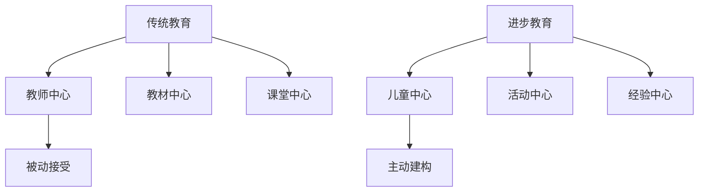
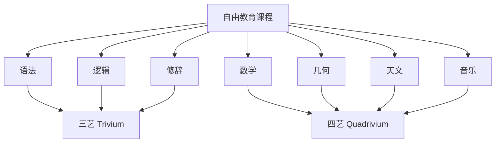
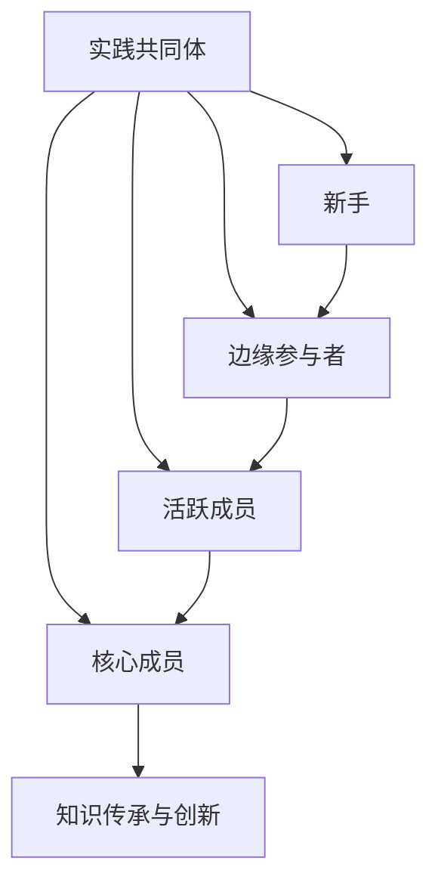
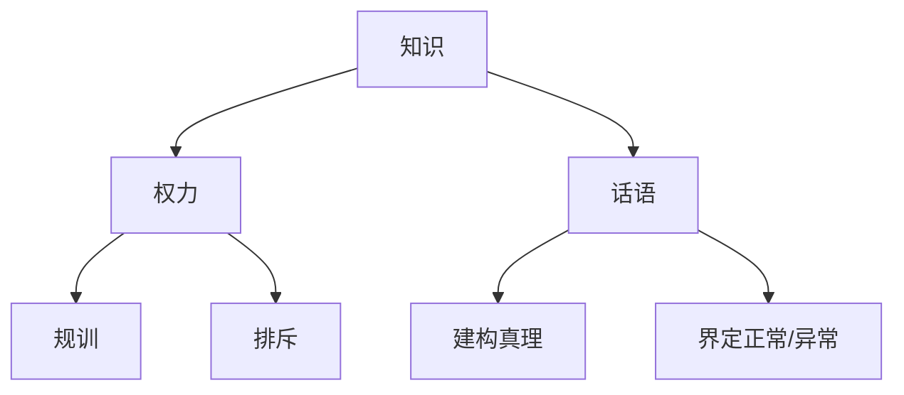

---
aliases:
  - 教育哲学
  - Educational Philosophy
  - 教育思想
  - Philosophy of Education
  - 教育理论
tags:
  - education
  - philosophy
  - pedagogy
  - progressive-education
  - constructivism
---

# 教育哲学 (Educational Philosophy)

教育哲学 (Educational Philosophy / Philosophy of Education) 是运用哲学方法反思教育目的、内容、方法与价值的学科。教育哲学追问教育的根本问题：什么是教育？教育应当培养什么样的人？知识是如何获得的？教育与社会的关系是什么？不同的哲学立场形成了多元的教育思想流派。

## 进步主义教育 (Progressive Education)

### 杜威的经验主义教育哲学 (Dewey's Experiential Philosophy)

约翰·杜威 (John Dewey, 1859-1952) 是进步主义教育运动的核心人物。杜威提出“教育即生活”(Education is life)、“教育即生长”(Education is growth)、“教育即经验的不断改组与改造”(Education is the continuous reconstruction of experience)。

杜威的经验学习模型强调互动 (interaction) 与连续性 (continuity) 两大原则：

$$
E = f(I, C)
$$

其中 $E$ 为教育性经验 (educative experience)，$I$ 为学习者与环境的互动，$C$ 为经验的连续性。有效的学习发生于学习者主动与环境互动、并将新经验与已有经验整合的过程中。

### 儿童中心教育 (Child-centered Education)

进步主义教育反对传统教育的教师中心、教材中心与课堂中心，主张以儿童的兴趣、需要与经验为教育出发点。杜威在《儿童与课程》(The Child and the Curriculum) 中提出，教育的挑战在于将学科知识的逻辑组织转化为儿童经验的心理组织。

### 问题本位学习与项目式学习 (PBL and Project-based Learning)

进步主义教育倡导问题本位学习 (Problem-based Learning, PBL) 与项目式学习 (Project-based Learning)。学习者围绕真实世界的问题开展探究，在解决问题的过程中建构知识、发展技能与培养态度。

PBL的核心特征：

| 特征 | 说明 | 教育价值 |
| :--- | :--- | :--- |
| 真实问题 | 源于现实情境的复杂问题 | 提升学习动机与迁移能力 |
| 小组协作 | 学习者团队合作解决问题 | 发展社交与合作技能 |
| 教师作为促进者 | 不直接提供答案，引导探究 | 培养自主学习能力 |
| 多维度评估 | 过程性评估与成果展示结合 | 全面评价学习成效 |

## 永恒主义教育 (Perennialism)

### 经典人文教育的复兴 (Revival of Classical Liberal Education)

永恒主义 (Perennialism) 认为教育的目的是培养人的理性 (rationality)，使其理解并参与人类文明的永恒对话。该流派以罗伯特·赫钦斯 (Robert Hutchins) 与莫蒂默·阿德勒 (Mortimer Adler) 为代表，主张回归西方经典名著 (Great Books)。

永恒主义的核心主张：

1. **人性不变论**：人性是普遍的、永恒的，不因时代变迁而改变
2. **知识等级论**：存在客观的真理等级，理性知识高于实用技能
3. **教育的理性目的**：教育的首要任务是发展理性，而非职业训练
4. **经典名著课程**：通过研读历代伟大思想家的著作，与最优秀的心灵对话

### 自由教育的理念 (Liberal Education)

永恒主义继承古希腊的“自由教育”(liberal education / liberal arts) 传统，认为真正的教育是解放心灵、使其免于偏见与谬误的教育。赫钦斯提出，大学不应是职业培训机构，而应是智力训练与思想交流的社区。

永恒主义课程结构：

## 要素主义教育 (Essentialism)

### 文化要素的传承 (Transmission of Cultural Essentials)

要素主义 (Essentialism) 由威廉·巴格莱 (William Bagley) 在20世纪30年代提出，作为对进步主义过度放纵的回应。要素主义认为，教育的基本功能是将人类文化遗产中的核心要素 (essentials) 传递给下一代。

要素主义与进步主义的比较：

| 维度 | 要素主义 | 进步主义 |
| :--- | :--- | :--- |
| 教育目的 | 传递核心知识与技能 | 促进儿童生长与经验改造 |
| 课程重点 | 学科知识体系 | 儿童兴趣与经验 |
| 教师角色 | 知识权威与课堂主导者 | 学习促进者与指导者 |
| 学生角色 | 虚心接受与刻苦学习 | 主动探究与自我表达 |
| 教学方法 | 系统讲授、练习、考试 | 活动、项目、经验整合 |
| 纪律观 | 强调纪律与努力 | 尊重自由与兴趣 |

### 学术 disciplinary 的结构 (Structure of Disciplines)

要素主义强调掌握各门学科 (disciplines) 的基本结构 (structure)，包括核心概念、关键事实与基本技能。布鲁纳 (Jerome Bruner) 虽常被视为结构主义教育家，但其“任何学科都可以某种诚实的方式教给任何年龄的儿童”的观点与要素主义有共通之处。

## 建构主义教育 (Constructivism)

### 个人建构主义 (Individual Constructivism)

个人建构主义源于皮亚杰 (Jean Piaget) 的认知发展理论，认为知识不是被动接受的，而是认知主体主动建构的。学习是同化与顺应的动态平衡过程：

$$
\text{知识建构} = \text{同化} (Assimilation) + \text{顺应} (Accommodation)
$$

教学启示：提供认知冲突情境，促使儿童重组原有图式；尊重儿童的发展阶段，提供适宜的挑战。

### 社会建构主义 (Social Constructivism)

社会建构主义以维果茨基 (Lev Vygotsky) 为代表，强调知识建构的社会性与文化性。高级心理功能首先出现于社会层面（人际间），然后内化至个体层面（个体内部）。

社会建构主义的核心概念：

| 概念 | 定义 | 教学应用 |
| :--- | :--- | :--- |
| 最近发展区 (ZPD) | 实际发展水平与潜在发展水平之间的差距 | 提供脚手架支持 |
| 脚手架 (Scaffolding) | 更有能力者提供的临时性支持 | 教师示范、提示、简化任务 |
| 内化 (Internalization) | 社会互动转化为个体心理工具 | 合作学习、对话 |
| 文化工具 (Cultural Tools) | 语言、符号、工具等中介 | 使用多种表征方式 |

### 情境认知与学习 (Situated Cognition and Learning)

情境认知理论 (Situated Cognition Theory) 认为，知识根植于其所产生与运用的活动、文化与社会情境之中。让·莱夫 (Jean Lave) 与艾蒂安·温格 (Etienne Wenger) 提出“合法的边缘性参与”(legitimate peripheral participation) 概念，描述新手通过参与实践共同体 (community of practice) 逐渐成长为专家的过程。

## 批判教育学 (Critical Pedagogy)

### 弗莱雷的解放教育学 (Freire's Pedagogy of the Liberation)

保罗·弗莱雷 (Paulo Freire) 在《被压迫者教育学》(Pedagogy of the Oppressed) 中提出，传统教育是“储蓄式教育”(banking education)，将学生视为被动接受知识的容器，压制其批判意识 (critical consciousness / conscientização)。

解放教育学的核心主张：

1. **对话 (Dialogue)**：教育是基于相互尊重的平等对话，而非单向灌输
2. **问题化 (Problem-posing)**：以学习者的生活问题为出发点，而非预设的标准答案
3. **批判意识 (Conscientization)**：帮助学习者认识到社会现实的压迫性结构
4. **行动与反思的统一 (Praxis)**：理论反思与社会变革行动不可分割

弗莱雷的教育循环：

$$
\text{行动 (Action)} \leftrightarrow \text{反思 (Reflection)} \rightarrow \text{批判意识 (Conscientization)} \rightarrow \text{解放行动 (Liberating Action)}
$$

### 批判种族教育学 (Critical Race Pedagogy)

批判种族教育学将批判种族理论 (Critical Race Theory) 应用于教育领域，揭示学校中的种族不平等结构：课程中的白人中心主义 (Eurocentrism)、能力分轨 (tracking) 中的种族隔离、纪律处分中的种族差异、标准化考试中的文化偏见。

## 后现代主义教育哲学 (Postmodern Educational Philosophy)

### 对宏大叙事的质疑 (Questioning Grand Narratives)

后现代主义教育哲学质疑启蒙理性所承诺的教育进步叙事，反对教育的单一目的论与标准化。让-弗朗索瓦·利奥塔 (Jean-François Lyotard) 将后现代定义为“对元叙事 (metanarratives) 的不信任”，包括进步、解放、科学真理等宏大叙事。

### 知识的不确定性与多元性 (Uncertainty and Plurality of Knowledge)

后现代主义强调知识的局部性、情境性与权力嵌入性。米歇尔·福柯 (Michel Foucault) 的知识考古学揭示，所谓“真理体制”(regimes of truth) 实为权力运作的产物。教育不应追求传递客观真理，而应培养对知识建构过程的批判性反思。

### 多元智能与差异政治 (Multiple Intelligences and Politics of Difference)

霍华德·加德纳 (Howard Gardner) 的多元智能理论 (Theory of Multiple Intelligences) 从心理学角度支持了后现代主义对单一智商观的批判。加德纳提出九种相对独立的智能：

| 智能类型 | 核心能力 | 代表性职业 |
| :--- | :--- | :--- |
| 语言智能 (Linguistic) | 言语理解与表达 | 作家、律师 |
| 逻辑数学智能 (Logical-Mathematical) | 逻辑推理与数学运算 | 科学家、工程师 |
| 空间智能 (Spatial) | 空间感知与心理旋转 | 建筑师、飞行员 |
| 音乐智能 (Musical) | 音高、节奏、音色感知 | 作曲家、演奏家 |
| 身体动觉智能 (Bodily-Kinesthetic) | 身体协调与精细动作 | 运动员、外科医生 |
| 人际智能 (Interpersonal) | 理解他人意图与情感 | 教师、政治家 |
| 内省智能 (Intrapersonal) | 自我认知与元认知 | 哲学家、心理学家 |
| 自然观察智能 (Naturalistic) | 识别与分类自然模式 | 生物学家、园艺家 |
| 存在智能 (Existential) | 思考终极问题 | 宗教领袖、哲学家 |

## 教育目的的价值取向 (Value Orientations of Educational Aims)

### 个人本位论与社会本位论 (Individual vs. Social Orientation)

关于教育目的的价值取向，存在两种经典对立：

| 取向 | 代表人物 | 核心观点 |
| :--- | :--- | :--- |
| 个人本位论 | 卢梭、裴斯泰洛齐、福禄贝尔 | 教育目的是发展人的自然本性，促进个人自我实现 |
| 社会本位论 | 柏拉图、涂尔干、凯兴斯泰纳 | 教育目的是培养社会所需公民，维持社会稳定与进步 |

杜威试图超越这一二元对立，提出教育无目的之外的目的，生长本身就是目的，而个人发展与社会进步是同一过程的两个方面。

### 教育目的的层次结构 (Hierarchy of Educational Aims)

教育目的可分为不同层次：

$$
A_{national} \rightarrow A_{school} \rightarrow A_{curriculum} \rightarrow A_{lesson}
$$

- **教育目的 (Aims)**：国家或社会层面的总体人才培养规格
- **培养目标 (Goals)**：各级各类学校的具体培养要求
- **课程目标 (Objectives)**：特定课程或学科的学习结果
- **教学目标 (Targets)**：单次教学活动期望达成的具体行为变化

## 当代教育哲学的议题 (Contemporary Issues)

- 教育公平 (educational equity) 与机会平等
- 全球公民教育 (global citizenship education)
- 环境教育与可持续发展
- 数字素养与人工智能时代的教育
- 教育的商品化与市场化批判
- 去殖民化教育 (decolonizing education) 与知识多元化
