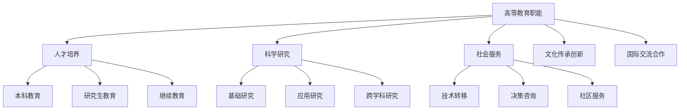
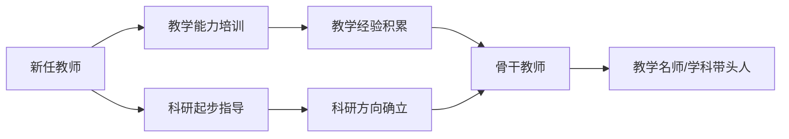

---
aliases: [HigherEducation]
tags: ['03_HumanitiesAndSocialSciences', 'Education']
created: 2026-05-17
updated: 2026-05-17
---

# 高等教育学 (Higher Education)

## 一、高等教育概述

### 1.1 定义与范畴

高等教育（Higher Education / Tertiary Education）是在完成中等教育之后，在高等学校中实施的专门教育和学术训练。它包括大学、学院、高等专科学校和职业技术学院等机构提供的各类教育和培训。

### 1.2 高等教育的职能

### 1.3 高等教育的分类

| 分类标准 | 类型 | 特征 |
|----------|------|------|
| 办学层次 | 专科、本科、硕士、博士 | 学历层次递进 |
| 办学主体 | 公立、私立、混合 | 资金和治理模式差异 |
| 学科范围 | 综合性、多科性、单科性 | 学科覆盖面 |
| 研究强度 | 研究型、教学研究型、教学型 | 科研与教学侧重 |

## 二、高等教育发展历史

### 2.1 世界高等教育发展

| 时期 | 重大事件 | 制度演变 |
|------|----------|----------|
| 中世纪 | 1088年博洛尼亚大学、巴黎大学 | 学者行会/学生行会 |
| 文艺复兴 | 人文主义教育 | 自由教育传统 |
| 19世纪 | 洪堡大学改革——柏林大学 | 教学与研究统一 |
| 19世纪末 | 赠地大学运动（美国） | 大学服务社会 |
| 20世纪 | 高等教育大众化 | 精英→大众→普及 |
| 21世纪 | 全球化、数字化 | 知识经济中的核心角色 |

**马丁·特罗的高等教育发展阶段理论**：

$$
\text{毛入学率} < 15\% \implies \text{精英化阶段} \\
15\% \leq \text{毛入学率} < 50\% \implies \text{大众化阶段} \\
\text{毛入学率} \geq 50\% \implies \text{普及化阶段}
$$

### 2.2 中国高等教育发展

- **1949-1977**：院系调整，学习苏联模式
- **1977-1998**：恢复高考，精英化教育
- **1999-2019**：扩招政策，大众化进程
- **2020至今**：普及化阶段，高质量发展

中国高等教育毛入学率从1999年的10%左右上升到2020年的50%以上。

## 三、大学治理与管理

### 3.1 大学治理结构

| 治理模式 | 权力分配 | 代表国家 |
|----------|----------|----------|
| 欧洲大陆模式 | 教授治校，国家管理 | 德国、法国 |
| 英美模式 | 董事会治理，学术自治 | 美国、英国 |
| 亚洲模式 | 政府主导，校长负责 | 中国、日本 |

### 3.2 学术自由与大学自治

学术自由（Academic Freedom）是教师有研究、教学和发表研究成果的自由。大学自治（University Autonomy）是大学自主决定学术事务和内部管理。

### 3.3 高等教育质量保障

| 机制 | 工具 | 功能 |
|------|------|------|
| 内部质量保障 | 课程评估、学生评价 | 持续改进 |
| 外部质量保障 | 认证、评估、排名 | 问责和信息公开 |
| 第三方评估 | 专业认证机构 | 同行评议 |

## 四、大学课程与教学

### 4.1 本科教育

| 模式 | 特点 | 代表 |
|------|------|------|
| 通识教育 | 宽口径、跨学科 | 美国文理学院 |
| 专业教育 | 深度专业化 | 欧洲、中国 |
| 通专结合 | 大类招生+专业分流 | 近年中国高校改革 |

### 4.2 研究生教育

| 学位层次 | 培养目标 | 学习方式 | 学制 |
|----------|----------|----------|------|
| 硕士 | 专业能力和学术基础 | 课程+论文 | 2-3年 |
| 博士 | 独立科研创新能力 | 课程+原创性研究+论文 | 3-6年 |

### 4.3 教学方法改革

研究性教学、翻转课堂、项目式学习、混合式教学、服务性学习。

## 五、大学教师发展

### 5.1 教师角色

| 角色 | 职责 | 发展阶段 |
|------|------|----------|
| 教学者 | 知识传授和能力培养 | 新教师→成熟教师 |
| 研究者 | 知识创造和学术发表 | 研究新手→学科带头人 |
| 服务者 | 学术和行政服务 | 专业服务→领导力 |

### 5.2 学术职业

学术职业的特征：学术自由、同行评议、出版或灭亡（Publish or Perish）、终身教职制（Tenure）。

### 5.3 大学教师的专业发展

## 六、高等教育公平

### 6.1 入学机会公平

| 维度 | 不公平表现 | 政策干预 |
|------|------------|----------|
| 地域公平 | 城乡、区域入学率差异 | 专项招生计划 |
| 阶层公平 | 家庭背景影响入学机会 | 助学金、奖学金 |
| 民族公平 | 少数民族入学率偏低 | 少数民族预科 |

### 6.2 学生资助体系

奖助学金、助学贷款、勤工助学、学费减免。

## 七、高等教育国际化

### 7.1 国际化的维度

| 维度 | 形式 | 影响 |
|------|------|------|
| 学生流动 | 留学生、交换生 | 跨文化能力 |
| 教师流动 | 访问学者、国际师资 | 学术网络 |
| 课程国际化 | 英文授课、国际课程 | 全球视野 |
| 学术合作 | 国际合作研究 | 科研产出 |
| 跨境教育 | 中外合作办学 | 教育出口 |

### 7.2 国际化的双刃剑

积极影响：提升学术水平、促进文化交流、增强国际竞争力。
消极影响：人才流失（Brain Drain）、文化同质化、教育商品化。

## 八、高等教育的挑战

- **经费压力**：政府投入不足，办学成本上升
- **就业压力**：毕业生就业难，供需结构性矛盾
- **技术冲击**：MOOC 和在线教育对传统模式的挑战
- **质量问责**：社会对高等教育质量的质疑
- **学术不端**：科研诚信问题的日益凸显
- **心理健康**：大学生心理健康问题的增长

## 九、中国高等教育的改革发展

### 9.1 "双一流"建设

"双一流"建设是中国高等教育强国战略的核心内容，旨在建设世界一流大学和一流学科，提升中国高等教育的国际竞争力。

### 9.2 高考改革

高考综合改革旨在打破"一考定终身"，推行综合评价和多元录取机制，促进教育公平和学生全面发展。

## 十、高等教育研究方法

### 10.1 比较高等教育

比较高等教育（Comparative Higher Education）通过跨国比较分析高等教育系统的共性和差异。研究的核心议题包括：高等教育治理模式、经费来源结构、入学选拔机制和质量保障体系。

### 10.2 高等教育政策分析

高等教育政策分析研究政策制定、实施和评估的全过程。主要理论框架包括：

| 理论框架 | 核心关注 | 代表学者 |
|----------|----------|----------|
| 新制度主义 | 制度约束与组织同构 | DiMaggio & Powell |
| 资源依赖理论 | 组织对外部资源的依赖 | Pfeffer & Salancik |
| 利益相关者理论 | 多方利益的平衡 | Freeman |
| 政策扩散理论 | 政策的跨国传播 | Dobbin & Simmons |

## 十一、高等教育热点问题

| 问题 | 表现 | 研究前沿 |
|------|------|----------|
| 大学排名 | 排名竞争影响大学行为 | 排名的替代方案 |
| 学术资本主义 | 市场逻辑侵蚀学术传统 | 公共性维护 |
| 学生参与 | 学生作为教育共同创造者 | 学生体验研究 |
| 高等教育私有化 | 私立大学扩张 | 教育公平影响 |
| 终身教职改革 | 非终身制教师比例上升 | 教师职业发展 |

## 相关条目

- [[AdultEducation]]
- [[DistanceEducation]]
- [[TeacherEducation]]
- [[03_HumanitiesAndSocialSciences/Education/ComparativeEducation/ComparativeEducation|ComparativeEducation]]
- [[INDEX|当前目录索引]]

## 深入阅读与扩展分析
该领域的知识体系经过长期积累已相当丰富。
以下内容旨在帮助读者进一步把握核心要点。

### 知识结构导引
该学科的理论框架是多层次的。
从最抽象的本体论假设。
到中程理论的实证假设。
再到操作化的研究假设。
每一层都有其独特功能。

### 主要研究范式对比
| 维度 | 实证主义 | 解释主义 | 批判范式 |
|------|---------|---------|---------|
| 本体论 | 实在论 | 建构论 | 历史实在论 |
| 认识论 | 客观主义 | 主观主义 | 解放认知 |
| 方法论 | 定量为主 | 定性为主 | 对话辩证 |
| 目标 | 解释预测 | 理解意义 | 揭露解放 |

### 经典研究案例分析
案例研究的价值在于展示理论的实践应用。
以下是该领域中几个具有代表性的研究。
它们的方法设计和理论贡献值得深入分析。
每个案例都对学科的后续发展产生了影响。

### 跨文化比较视角
不同文化背景下存在显著的差异。
这些差异对理论普适性提出了挑战。
跨文化研究设计需要特别注意文化偏见。
本地化概念的使用需要细致定义。

### 当代前沿热点
1. 数字化与人工智能的社会影响
2. 全球不平等的新形态
3. 气候变化的社会回应
4. 身份政治与民主危机
5. 后疫情时代的社会变迁
6. 技术伦理与人文关怀

### 方法论工具箱
研究人员可以根据研究问题选择方法。
定量方法适合检验假设和推断总体。
定性方法适合探索意义和生成理论。
混合方法整合两类优势以增强说服力。
实验方法旨在建立因果关系。
纵向设计追踪变化和过程。
比较策略揭示制度和文化的差异。

### 学术资源推荐
主要学术期刊发表该领域的前沿研究。
专业学会组织学术会议和交流活动。
在线数据库提供文献检索服务。
开放获取资源降低了知识获取门槛。
学术博客和播客提供了非正式的学习渠道。

### 学习路径设计
初学者应从通论性教材开始学习。
在建立基本框架后阅读经典原著。
然后选择感兴趣的方向深入阅读。
参与讨论和写作有助于深化理解。
独立研究是培养学术能力的核心环节。

### 批判性思维训练
学会质疑前提假设是学术训练的关键。
考察证据是否充分支持结论。
辨别因果关系与相关关系的区别。
识别论证中的逻辑谬误。
评估不同解释的合理性。
反思自身的认知偏见。

### 学术职业发展
学术道路需要长期投入和持续学习。
发表论文是学术生涯的必经之路。
学术网络的建设需要主动参与。
教学与研究之间的平衡值得关注。
跨学科能力在当代学术市场日益重要。

### 研究的公共价值
学术研究应当服务于公共福祉。
知识创新推动社会进步。
政策咨询将学术转化为实践。
公众科普缩小知识鸿沟。
社会批评促进反思和改进。

### 未来展望
该领域将继续回应时代提出的新问题。
技术进步为研究提供了新的工具。
全球化使比较研究更加重要。
跨学科整合是未来的主要趋势。
学术民主化需要更多元的参与者。

## 关键概念辨析
概念定义的清晰度直接影响研究的质量。
以下是该领域中若干容易混淆的概念。

**概念一与概念二的区分**：
前者侧重于外在的形式特征。
后者关注内在的运作机制。
两者在实际分析中往往需要结合使用。

**微观与宏观层面的联系**：
微观现象是宏观结构的基础。
宏观结构又约束微观行为。
理解两者的相互作用是社会分析的核心。

**静态分析与动态分析**：
静态分析关注某一时点的截面特征。
动态分析关注过程和变化的轨迹。
两种视角互补而非替代。

## 综合思考题
1. 该领域与其他相关学科的关系是什么？
2. 该领域最核心的学术贡献有哪些？
3. 经典理论在当代的有效性如何？
4. 该领域的研究方法有什么特点？
5. 数字技术如何改变该领域的研究实践？
6. 该领域存在哪些未解决的重要问题？
7. 全球化如何影响该领域的研究议程？
8. 该领域的知识如何应用于公共政策？
9. 跨学科整合面临哪些机遇和挑战？
10. 未来十年该领域可能有哪些突破？

## 相关条目
- [[INDEX|当前目录索引]]

