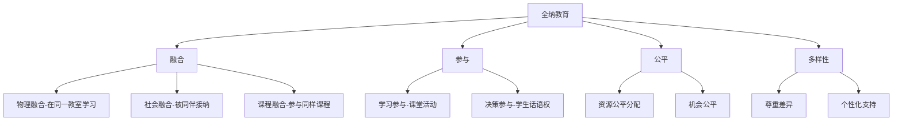
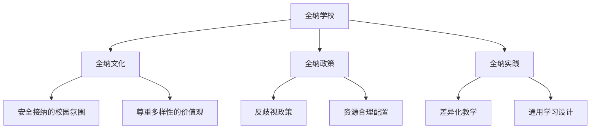

# 全纳教育 (Inclusive Education)

## 一、全纳教育概述

### 1.1 定义与核心理念

全纳教育（Inclusive Education）是联合国教科文组织倡导的教育理念，主张所有儿童——无论其身体、智力、社会、情感、语言或其他条件——都应在普通学校中与同龄人一起接受教育。它强调教育系统的改革以满足所有学习者的多样化需求，而非要求学生适应现有系统。

### 1.2 全纳教育的基本原则

| 原则 | 内涵 |
|------|------|
| 权利原则 | 教育是每个人的基本人权 |
| 平等原则 | 所有人都有平等的受教育机会 |
| 参与原则 | 所有学生都有权参与学校生活 |
| 多样性原则 | 差异是正常的，应被尊重和支持 |
| 系统变革原则 | 学校需要变革以适应学生，而非学生适应学校 |

### 1.3 全纳教育的核心概念

### 1.4 全纳教育与相关概念的区别

| 概念 | 含义 | 关键差异 |
|------|------|----------|
| 全纳教育 | 改革学校体系服务所有学生 | 系统变革 |
| 融合教育 | 将特殊需要儿童放入普通班级 | 个体适应 |
| 一体化 | 将特殊儿童纳入主流教育 | 安置方式 |
| 隔离教育 | 特殊学校独立办学 | 分离式 |

## 二、全纳教育的历史与发展

### 2.1 从隔离到全纳

| 阶段 | 特征 | 政策 |
|------|------|------|
| 隔离阶段（-1970s） | 特殊儿童在专门机构 | 特殊学校体系 |
| 一体化阶段（1970s-1990s） | 特殊儿童融入普通学校 | 回归主流运动 |
| 全纳阶段（1990s-至今） | 学校系统为所有儿童而改变 | 全纳教育政策 |

### 2.2 重要国际文件

| 文件 | 年份 | 核心内容 |
|------|------|----------|
| 《萨拉曼卡宣言》 | 1994 | 全纳教育的里程碑文件 |
| 《联合国残疾人权利公约》 | 2006 | 残疾人教育权法律保障 |
| 《2030年教育行动框架》 | 2015 | 包容和公平的优质教育 |

### 2.3 理论基础

**社会模式**（Social Model）：

$$
\text{残疾} = \text{个体损伤} + \text{社会障碍}
$$

**神经多样性**（Neurodiversity）：神经系统差异（如自闭症、ADHD、阅读障碍）是自然的人类变异，而非需要"治愈"的疾病。

## 三、全纳教育的实施

### 3.1 全纳学校框架

### 3.2 障碍类型与应对

| 障碍类型 | 表现 | 应对策略 |
|----------|------|----------|
| 物理障碍 | 建筑、设施不可达 | 无障碍改造、坡道、电梯 |
| 课程障碍 | 课程内容不易接近 | 课程调整、替代材料 |
| 教学方法障碍 | 教学方式不适应 | 差异化教学、多感官教学 |
| 态度障碍 | 歧视、偏见、刻板印象 | 全纳文化建设、意识提升 |
| 制度障碍 | 入学门槛、分班制度 | 政策改革、弹性学制 |

### 3.3 特殊需要类型与支持

| 需要类型 | 说明 | 支持措施 |
|----------|------|----------|
| 学习困难（LD） | 阅读困难、计算困难 | 多感官教学、辅助技术 |
| 自闭症谱系（ASD） | 社交和沟通障碍 | 结构化教学、社交故事 |
| ADHD | 注意力不集中、多动 | 行为管理策略、结构化环境 |
| 感官障碍 | 视力/听力障碍 | 盲文/手语、辅助设备 |
| 情绪行为障碍 | 焦虑、抑郁、对立违抗 | 积极行为支持、心理咨询 |

## 四、全纳教学策略

### 4.1 差异化教学

差异化教学（Differentiated Instruction）根据学生的准备水平、兴趣和学习偏好调整：

| 调整维度 | 策略 |
|----------|------|
| 内容调整 | 不同阅读水平材料、多模态呈现 |
| 过程调整 | 不同学习活动、灵活分组 |
| 产品调整 | 多样化评估方式、选择展示形式 |
| 环境调整 | 灵活的座位安排、减少干扰 |

### 4.2 通用学习设计（UDL）

通用学习设计（Universal Design for Learning, UDL）三大原则：
1. **提供多种参与方式**（Engagement）：激发学习动机
2. **提供多种表征方式**（Representation）：灵活呈现信息
3. **提供多种行动和表达方式**（Action & Expression）：多样化表达

### 4.3 合作教学

合作教学（Co-Teaching）的模式：

| 模式 | 描述 |
|------|------|
| 一教一助 | 一位主教，一位巡回支持 |
| 平行教学 | 班级分成两组，各教一组 |
| 站台教学 | 设置多个学习站 |
| 备选教学 | 一组学习新内容，一组复习巩固 |
| 团队教学 | 两位教师共同授课 |

### 4.4 个别化教育计划（IEP）

- 当前学业和功能表现
- 年度目标和短期目标
- 特殊教育服务和支持
- 普通教育参与程度
- 评估调整
- 过渡计划

## 五、教师角色与培训

### 5.1 全纳教师素养

| 素养维度 | 具体能力 |
|----------|----------|
| 知识 | 理解多样化需求和全纳原则 |
| 态度 | 相信所有学生都能学习 |
| 技能 | 差异化教学、行为管理、合作 |
| 反思 | 持续反思和改进教学实践 |

### 5.2 全纳教育的影响

| 学生群体 | 积极影响 |
|----------|----------|
| 特殊需要学生 | 更好的学业成就和社会技能 |
| 普通学生 | 提升同理心和对多样性的理解 |
| 所有学生 | 更丰富的学习共同体、社会责任感 |

## 六、全纳教育的实施模式

### 6.1 随班就读（中国模式）

| 支持类型 | 内容 |
|----------|------|
| 资源教室 | 个别化辅导和康复训练 |
| 巡回指导 | 特殊教育教师定期指导 |
| 同伴支持 | 学生结对互助 |
| 课程调整 | 教学内容、方法和评价调整 |

### 6.2 国际比较

| 国家 | 政策特点 | 实施特色 |
|------|----------|----------|
| 意大利 | 1977年关闭大多数特殊学校 | 完全全纳模式 |
| 英国 | 《儿童与家庭法》2014 | 教育、健康和护理计划（EHCP） |
| 美国 | IDEIA法案 | IEP制度完善、LRE原则 |
| 日本 | 特别支援教育 | 通级指导教室 |
| 中国 | 随班就读为主体 | 特殊教育学校为骨干 |

## 七、全纳教育的挑战

- 资源不足：缺乏专业人员、设备和资金
- 教师准备不足：缺乏全纳教育的知识和技能
- 班级规模过大：难以提供个性化关注
- 态度障碍：教师和家长的疑虑和抵触
- 评价体系单一：标准化考试难以适应多样化
- 政策的可持续性：全纳改革缺乏长期投入

## 相关条目

- [[SpecialEducation]]
- [[EarlyChildhoodEducation]]
- [[TeacherEducation]]
- [[EducationalPhilosophy]]
- [[INDEX|当前目录索引]]
