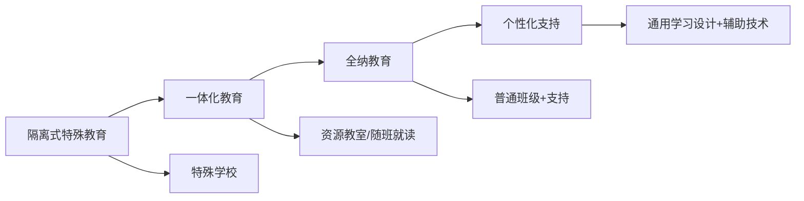

# 特殊教育 (Special Education)

## 一、特殊教育概述

### 1.1 定义与范围

特殊教育（Special Education）是为有特殊教育需要的儿童和青少年提供的专门设计的教学和支持服务，涵盖智力障碍、感官障碍、学习困难、情绪行为障碍、沟通障碍及超常天赋等多种类型。

### 1.2 特殊教育的基本原则

| 原则 | 含义 |
|------|------|
| 零拒绝（Zero Reject） | 不因任何残疾拒绝儿童入学 |
| 无歧视评估（Nondiscriminatory Evaluation） | 公平、全面、非歧视性的评估 |
| 适当教育（Appropriate Education） | 提供适合个体需要的教育 |
| 最少限制环境（LRE） | 在最大可能范围内与普通儿童一起学习 |
| 正当程序（Due Process） | 家长参与决策，保障合法权利 |
| 个别化教育（Individualized Education） | 制定和实施个别化教育计划（IEP） |

### 1.3 特殊教育的发展趋势

## 二、特殊需要分类

### 2.1 智力障碍

| 程度 | IQ范围 | 支持需求 | 教育安置 |
|------|--------|----------|----------|
| 轻度 | 50-70 | 间歇性支持 | 普通班级+资源教室 |
| 中度 | 35-49 | 有限支持 | 特殊班级/特殊学校 |
| 重度 | 20-34 | 广泛支持 | 特殊学校 |
| 极重度 | < 20 | 全面支持 | 特殊学校+护理 |

### 2.2 学习困难

学习困难（Learning Disabilities, LD）包括：
- **阅读困难**（Dyslexia）：文字解码和阅读流畅性问题
- **书写困难**（Dysgraphia）：书写和文字表达困难
- **计算困难**（Dyscalculia）：数学概念和运算困难
- **非语言学习困难**（NLD）：视空间信息和社交理解困难

### 2.3 注意缺陷多动障碍（ADHD）

ADHD三大核心症状：

$$
\text{ADHD} = \text{注意力不集中} + \text{多动} + \text{冲动}
$$

教育干预策略：
- 结构和可预测的课堂环境
- 任务分解为小步骤
- 自我监控策略
- 行为契约和正向强化
- 合理座位安排（远离干扰）

### 2.4 自闭症谱系障碍（ASD）

教育策略：

| 策略 | 说明 |
|------|------|
| 结构化教学（TEACCH） | 可视化日程、结构化环境和任务 |
| 应用行为分析（ABA） | 基于强化原理的行为干预 |
| 社交故事 | 用简单故事教授社交情境 |
| 视觉支持 | 图片、图表等视觉辅助 |
| 感觉统合训练 | 调节感觉输入 |

### 2.5 感官障碍

| 类型 | 沟通方式 | 辅助技术 |
|------|----------|----------|
| 视觉障碍 | 盲文、听觉学习 | 屏幕阅读器、放大设备、导盲犬 |
| 听力障碍 | 手语、口语、唇读 | 助听器、人工耳蜗、字幕 |

### 2.6 情绪行为障碍

干预策略：
- **积极行为支持**（PBS）：通过系统环境调整减少问题行为
- **认知行为治疗**（CBT）：改变消极思维模式
- **社交—情绪学习**（SEL）：培养情绪管理、同理心和人际交往能力

### 2.7 超常儿童

超常儿童（Gifted and Talented）的教育方案：

| 方案 | 描述 |
|------|------|
| 加速制 | 跳级、提前入学、压缩课程 |
| 丰富制 | 拓展课程、独立研究、深度探索 |
| 特殊分组 | 天才班、资优学校、夏令营 |

## 三、特殊教育的评估

### 3.1 评估目的

1. **识别**：确定是否需要特殊教育
2. **分类**：确定特殊需要的类型
3. **计划**：为IEP制定提供依据
4. **监测**：追踪学生进展
5. **转衔**：为下一阶段教育或就业做准备

### 3.2 评估方法

**标准化评估**：
- 韦氏智力测验（WISC-V）：智力评估
- 适应性行为评定量表（ABAS）：日常生活适应能力
- 学业成就测验（WIAT）：阅读、数学、书写

**非正式评估**：
- 课堂观察：自然情境中的行为记录
- 作品分析：学生作业和作品
- 访谈：教师、家长和学生访谈
- 功能性行为评估（FBA）：分析问题行为的功能和原因

## 四、特殊教育的法律框架

### 4.1 美国IDEIA

《残疾人教育法改进法》（IDEIA, 2004）六项核心原则：零拒绝、无歧视评估、适当教育（IEP）、最少限制环境、家长参与、正当程序。

### 4.2 中国特殊教育政策

| 政策/法律 | 核心内容 |
|-----------|----------|
| 《残疾人保障法》 | 保障受教育权利 |
| 《残疾人教育条例》 | 具体实施规定 |
| 《特殊教育提升计划》 | 质量提升目标（三期计划） |

**中国特殊教育体系**：
- 特殊教育学校（集中教育）
- 普通学校随班就读（融合教育）
- 送教上门（重度残疾儿童）

## 五、特殊教育的教学方法

### 5.1 应用行为分析（ABA）

| 策略 | 描述 |
|------|------|
| ABC分析 | 前因—行为—后果分析 |
| 强化 | 正向/负向强化增加期望行为 |
| 惩罚 | 减少非期望行为 |
| 塑造 | 逐步逼近目标行为 |
| 离散单元教学（DTT） | 结构化的单元教学 |
| 自然情境教学 | 在日常环境中教学 |

### 5.2 多感官教学

$$
\text{多感官学习} = V(\text{视觉}) + A(\text{听觉}) + K(\text{动觉}) + T(\text{触觉})
$$

### 5.3 辅助技术

| 技术类型 | 用途 | 示例 |
|----------|------|------|
| 沟通辅助（AAC） | 替代或辅助沟通 | PECS、语音输出设备、沟通板 |
| 读写辅助 | 辅助阅读和书写 | 文字转语音、语音识别、拼写检查 |
| 行动辅助 | 辅助移动和操作 | 轮椅、特殊键盘、眼动追踪 |
| 无障碍多媒体 | 富媒体学习材料 | 手语视频、有声教材、高对比度 |

## 六、特殊教育的支持体系

**多学科团队**成员包括：特殊教育教师、普通教育教师、学校心理学家、语言治疗师、作业治疗师、物理治疗师、社会工作者和家长。

**早期干预**（Early Intervention, 0-3岁）是黄金期，对特殊需要儿童的长期发展至关重要。

## 七、特殊教育中的争议

| 争议议题 | 支持方 | 反对方 |
|---------|--------|--------|
| 标签效应 | 标签可获得资源和服务 | 标签导致污名化 |
| 全纳程度 | 完全全纳促进公平 | 不同的需要可能需要不同环境 |
| 药物干预 | 药物有效控制症状 | 副作用和过度用药 |
| 循证实践 | 科学证据指导实践 | 忽视个体差异和情境 |
| 文化差异 | 特殊教育应具文化敏感性 | 标准化评估和干预 |

## 八、特殊教育的未来趋势

- **早期识别与干预**：新生儿筛查、发育监测
- **辅助技术创新**：AI辅助沟通设备、脑机接口、自适应学习系统
- **全纳教育的深化**：从物理融合→社会融合→课程融合
- **家长参与增强**：家长作为教育决策的重要伙伴
- **教师培养改革**：将特殊教育纳入普通教师培养核心课程
- **生涯转衔服务**：从学校到就业的过渡支持

## 相关条目

- [[InclusiveEducation]]
- [[EarlyChildhoodEducation]]
- [[TeacherEducation]]
- [[EducationalPhilosophy]]
- [[INDEX|当前目录索引]]
