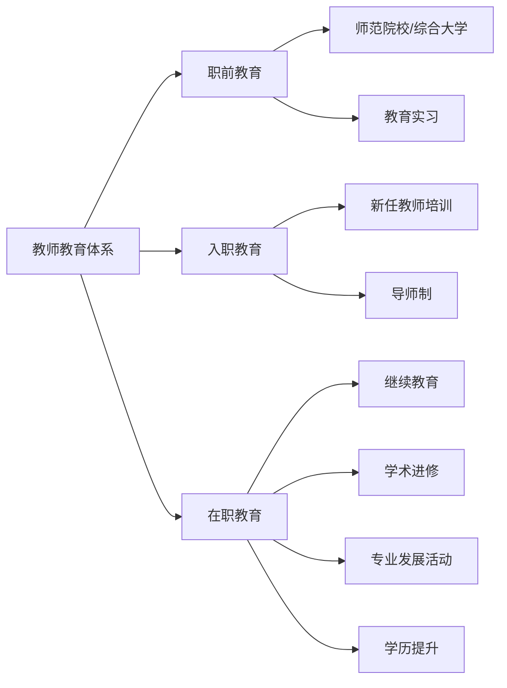
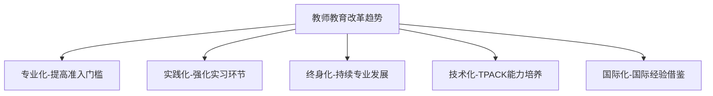

# 教师教育 (Teacher Education)

## 一、教师教育概述

### 1.1 定义与范围

教师教育（Teacher Education）是培养和培训合格教师的全部过程，包括职前培养（Pre-service Education）、入职培训（Induction）和在职专业发展（In-service Professional Development）。

### 1.2 教师教育的意义

| 层面 | 意义 |
|------|------|
| 个体层面 | 教师的专业发展和职业成就感 |
| 学生层面 | 教师质量是影响学生学业成就的最重要学校因素 |
| 社会层面 | 优质教师队伍是国家教育竞争力的核心 |
| 经济层面 | 教师培养具有长期社会回报率 |

### 1.3 教师教育体系

## 二、教师专业素养

### 2.1 教师知识结构

舒尔曼（Shulman）提出的教师知识基础框架：

| 知识类型 | 内容 |
|----------|------|
| 学科内容知识 | 所教学科的知识体系 |
| 一般教学知识 | 通用的教学原理和策略 |
| 课程知识 | 课程设计、教材和资源 |
| 教学内容知识（PCK） | 将学科知识转化为教学形式的核心能力 |
| 学习者知识 | 学生发展和学习心理 |
| 教育情境知识 | 班级、学校、社区和文化的理解 |
| 教育目的知识 | 教育的价值和目标 |

$$
\text{PCK} = \text{学科内容知识} \times \text{教学法知识}
$$

### 2.2 教师能力框架

| 能力维度 | 具体能力 |
|----------|----------|
| 教学能力 | 教学设计、课堂实施、评估反馈 |
| 管理能力 | 课堂管理、时间管理、资源管理 |
| 沟通能力 | 师生沟通、家校沟通、同事协作 |
| 反思能力 | 教学反思、行动研究、持续改进 |
| 创新能力 | 课程创新、方法创新、技术应用 |
| 情感能力 | 同理心、情绪管理、职业热情 |

### 2.3 教师专业伦理

教师专业伦理（Professional Ethics of Teaching）的核心：对学生负责（关爱学生、尊重差异）、对专业负责（持续学习）、对社会负责（传递价值观）、对同事负责（合作共赢）。

## 三、职前教师教育

### 3.1 培养模式

| 模式 | 特征 | 代表 |
|------|------|------|
| 师范院校模式 | 独立师范院校定向培养 | 中国、俄罗斯 |
| 综合大学模式 | 大学教育学院培养 | 美国、英国 |
| 混合模式 | 师范大学+综合性培养 | 芬兰、新加坡 |

### 3.2 课程设置

教师教育课程通常包括三大模块：通识教育课程（20-30%）、学科专业课程（40-50%）和教育专业课程（20-30%）。教育专业课程包括教育心理学、课程与教学论、学科教学法、教育技术、班级管理和教育研究方法。

### 3.3 教育实习

教育实习（Teaching Practicum）是职前教师教育的核心环节，包括见习（1-2周）、试教（4-6周）和独立教学（8-16周）。实习指导包括合作教师带领、大学督导和反思日记。

## 四、教师专业发展

### 4.1 教师发展阶段

**富勒（Fuller）的教师关注阶段**：职前关注→早期生存关注→教学情境关注→学生关注

**柏林纳（Berliner）的阶段**：新手→高级新手→胜任者→熟练者→专家

### 4.2 在职专业发展

| 形式 | 特点 | 有效性 |
|------|------|--------|
| 工作坊/培训 | 短期集中学习 | 低 |
| 学习共同体 | 教师合作研究和学习 | 高 |
| 课堂观察 | 同行观察和反馈 | 高 |
| 行动研究 | 教师研究自己的教学实践 | 高 |
| 导师制 | 经验教师指导新任教师 | 高 |
| 在线课程 | 灵活自主学习 | 中 |

### 4.3 教师专业发展共同体

专业学习共同体（Professional Learning Community, PLC）：

$$
\text{PLC} = \text{共享愿景} + \text{合作学习} + \text{反思对话} + \text{共同实践}
$$

## 五、教师评价

### 5.1 评价目的

形成性评价（促进专业发展）、总结性评价（聘任和薪酬决策）、问责性评价（确保教学质量）。

### 5.2 评价方法

| 方法 | 优点 | 局限 |
|------|------|------|
| 课堂观察 | 直接了解教学行为 | 观察者偏见 |
| 学生评价 | 多方视角 | 学生成熟度影响 |
| 同行评价 | 专业判断 | 人际关系因素 |
| 学生学业成绩 | 量化效果 | 忽略非学业成果 |
| 教学档案袋 | 全面反映工作 | 费时费力 |
| 自我反思报告 | 促进自我改进 | 主观性 |

## 六、教师教育改革

### 6.1 全球趋势

### 6.2 教师教育的挑战

| 挑战 | 表现 |
|------|------|
| 吸引力不足 | 教师社会地位和薪酬相对偏低 |
| 理论与实践的脱节 | 大学课程与学校实际需求不匹配 |
| 师资培养质量参差 | 不同院校培养水平差异大 |
| 教师流失率高 | 新任教师前五年离职率较高 |
| 技术冲击 | 教师需掌握日益复杂的数字教学技术 |
| 职业倦怠 | 工作压力大导致职业倦怠问题突出 |

### 6.3 TPACK框架

技术教学内容知识（TPACK）是技术时代教师核心能力框架：

| 知识类型 | 含义 |
|----------|------|
| TK（技术知识） | 运用技术工具的能力 |
| PK（教学知识） | 教学方法和策略知识 |
| CK（内容知识） | 学科知识 |
| PCK（教学内容知识） | 将学科内容转化为教学形式 |
| TPK（技术教学知识） | 技术如何促进教学 |
| TCK（技术内容知识） | 技术如何呈现学科内容 |

## 七、教师心理健康与职业幸福

### 7.1 教师压力源

| 压力源 | 影响因素 |
|--------|----------|
| 工作负荷 | 课时多、班级规模大、非教学事务多 |
| 学生管理 | 纪律问题、学习差异、家校沟通 |
| 职业发展 | 职称评审、专业发展机会 |
| 社会评价 | 社会地位、薪酬待遇、家长期望 |
| 教育改革 | 课程改革、评价变革、技术更新 |

### 7.2 国际比较

| 国家 | 培养模式 | 资格要求 | 专业发展 |
|------|----------|----------|----------|
| 芬兰 | 研究型硕士 | 硕士学历 | 以学校为基础 |
| 新加坡 | 国立教育学院统一培养 | 本科+文凭 | 每年100小时培训 |
| 美国 | 大学教育学院 | 本科+认证 | 学分割继续教育 |
| 英国 | 大学+学校合作 | PGCE+QTS | 早期职业框架 |
| 日本 | 教职大学院 | 教师资格证+研修 | 10年经验者研修 |
| 中国 | 师范院校为主 | 教师资格考试 | 360学分割继续教育 |

## 八、中国教师教育体系

中国教师教育体系包括师范院校（师范大学、师范学院、师范专科学校）和综合性大学教育学院。近年来推行师范专业认证制度，提升教师培养质量。中国实行教师资格考试制度，分为笔试和面试两部分。在职教师须定期注册和参加继续教育。

## 相关条目

- [[EducationalPhilosophy]]
- [[EducationalPsychology]]
- [[HigherEducation]]
- [[InclusiveEducation]]
- [[INDEX|当前目录索引]]
