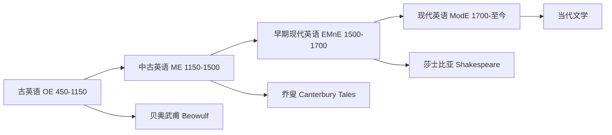

# EnglishLanguageAndLiterature

**英语语言文学**
(English Language and Literature)
涵盖英语语言的历史演变
以及以英语创作的文学作品的系统研究。
英语文学是世界文学中最具影响力的传统之一。
英国和美国均有极为丰富的文学贡献。

## 英语语言史
(History of English Language)

### 古英语时期
(Old English, 450–1150)

日耳曼部落入侵不列颠。
包括盎格鲁、撒克逊、朱特。
他们带来了西日耳曼语言。
主要文献是史诗《贝奥武甫》(~1000)。
阿尔弗雷德大帝 (849-899) 推动英语散文。
古英语是综合性语言。
名词有四个格：主格、宾格、与格、属格。

### 中古英语时期
(Middle English, 1150–1500)

诺曼征服 (1066) 带来大量法语借词。
涉及政府、法律、烹饪、时尚等领域。
乔叟 (1343-1400) 创作《坎特伯雷故事集》。
*坎特伯雷故事集*包含 24 个故事。
元音大推移 (Great Vowel Shift, 1400-1700)。
伦敦方言成为标准英语的基础。
印刷术的引入促进了语言标准化。
威廉·卡克斯顿建立了英国第一家印刷厂。

### 现代英语
(Modern English, 1700–至今)

Samuel Johnson 出版《英语词典》(1755)。
英语成为全球通用语 (Lingua Franca)。
世界英语 (World Englishes) 包括多种变体：
美式英语、英式英语、澳式英语。
印度英语、新加坡英语、尼日利亚英语等。
全球约 15 亿人使用英语。
英语是互联网上使用最多的语言。

## 英国文学史
(British Literary History)

### 中世纪文学
(Medieval, ~500–1500)

*Sir Gawain and the Green Knight* (~1400)。
*Piers Plowman* 宗教寓言诗。
民谣 (Ballads) 民间叙事传统。
奇迹剧和道德剧是中世纪戏剧。
*Everyone* 是著名道德剧。

### 文艺复兴
(Renaissance, 1500–1660)

莎士比亚 (1564-1616):
创作 37 部戏剧和 154 首十四行诗。
创造了约 1700 个英语词汇。
典型词语："lonely"、"gloomy"、"fashionable"。
四大悲剧: *哈姆雷特*、*奥赛罗*。
*李尔王*、*麦克白*。
克里斯托弗·马洛发展了无韵诗。
*浮士德博士*的马洛式悲剧。
玄学派诗人: John Donne 使用奇喻手法。
George Herbert 的宗教诗歌。
弥尔顿 *Paradise Lost* (1667) 英语史诗。
斯宾塞 *The Faerie Queene* 寓言史诗。
弗朗西斯·培根发展了英语散文。
*随笔集* (Essays, 1597)。

### 新古典主义
(Neoclassicism, 1660–1785)

复辟喜剧: 康格里夫 *如此世道*。
威廉·威彻利的乡村妻子。
讽刺文学: 蒲柏 *卷发遇劫记*。
斯威夫特 *格列佛游记* (1726)。
小说兴起 (Rise of the Novel):
笛福 *鲁滨逊漂流记* (1719)。
理查森 *帕梅拉* (1740)。
亨利·菲尔丁 *汤姆·琼斯* (1749)。
劳伦斯·斯特恩 *项狄传*。
塞缪尔·约翰逊的文学批评。
*诗人列传* (Lives of the Poets)。
詹姆斯·鲍斯威尔的 *约翰逊传*。

### 浪漫主义
(Romanticism, 1785–1830)

华兹华斯与柯勒律治:
*Lyrical Ballads* (1798) 浪漫主义宣言。
布莱克 *天真与经验之歌* (1794)。
拜伦 (Lord Byron) 的浪漫英雄。
*唐璜* (Don Juan) 讽刺史诗。
雪莱 (Shelley) *西风颂*。
*解放了的普罗米修斯*。
济慈 (Keats) *夜莺颂*。
*希腊古瓮颂*。
简·奥斯汀 *傲慢与偏见* (1813)。
*理智与情感* (1811) *爱玛* (1815)。
*曼斯菲尔德庄园* *诺桑觉寺*。
沃尔特·司各特的历史小说。
*艾凡赫* (Ivanhoe, 1819)。

### 维多利亚时期
(Victorian Era, 1837–1901)

狄更斯 *大卫·科波菲尔* (1850)。
*远大前程* (1861) *双城记* (1859)。
*雾都孤儿* *圣诞颂歌*。
乔治·艾略特 *米德尔马契* (1871)。
*弗洛斯河上的磨坊*。
勃朗特姐妹:
夏洛蒂 *简·爱* (1847)。
艾米莉 *呼啸山庄* (1847)。
安妮 *阿格尼斯·格雷*。
托马斯·哈代的威塞克斯小说。
*德伯家的苔丝* *无名的裘德*。
丁尼生的维多利亚诗歌。
*悼念集* (In Memoriam)。
布朗宁夫妇的戏剧独白诗。
阿诺德 *多佛海滩* 文化批评。
王尔德的唯美主义 *道林·格雷的画像*。

### 现代主义
(Modernism, 1901–1945)

T.S. 艾略特 *The Waste Land* (1922)。
*J. Alfred Prufrock 的情歌* (1915)。
詹姆斯·乔伊斯 *Ulysses* (1922)。
*都柏林人* *一个青年艺术家的画像*。
弗吉尼亚·伍尔夫 *达洛维夫人*。
*到灯塔去* *奥兰多*。
D.H. 劳伦斯 *儿子与情人*。
*查泰莱夫人的情人*。
W.B. 叶芝爱尔兰诗歌现代主义。
E.M. 福斯特 *印度之行*。
约瑟夫·康拉德 *黑暗之心*。

### 战后与当代
(Postmodern & Contemporary, 1945–至今)

塞缪尔·贝克特 *Waiting for Godot*。
哈罗德·品特的威胁喜剧。
石黑一雄 *长日将尽* (2017 诺奖)。
萨尔曼·拉什迪 *午夜的孩子*。
希拉里·曼特尔 *狼厅* (布克奖)。
多丽丝·莱辛 *金色笔记* (2007 诺奖)。
V.S. 奈保尔 *毕斯沃斯先生* (2001 诺奖)。
爱丽丝·门罗短篇小说 (2013 诺奖)。
朱利安·巴恩斯 *终结的感觉*。
伊恩·麦克尤恩 *赎罪*。

## 美国文学传统
(American Literature)

### 19 世纪

清教文学: 布拉福德 *普利茅斯开拓史*。
本杰明·富兰克林 *自传*。
美国文艺复兴 (1840-1860):
爱默生超验主义 *论自然*。
梭罗 *瓦尔登湖* (1854)。
霍桑 *红字* (1850)。
麦尔维尔 *白鲸* (1851)。
惠特曼 *草叶集* (1855)。
狄金森诗歌创新。
马克·吐温 *哈克贝利·费恩历险记*。

### 20 世纪至今

迷惘的一代:
海明威 *老人与海* (1954 诺奖)。
菲茨杰拉德 *了不起的盖茨比* (1925)。
南方文学: 福克纳 *喧哗与骚动* (1949 诺奖)。
哈莱姆文艺复兴: 兰斯顿·休斯。
*黑人的灵魂*。
后现代: 品钦 *万有引力之虹*。
当代: 莫里森 *宠儿* (1993 诺奖)。
菲利普·罗斯 *美国牧歌*。
唐·德里罗 *白噪音*。
乔纳森·弗兰岑 *纠正*。

## 相关领域

- [[WorldLiterature|世界文学]]
- [[../Linguistics/AppliedLinguistics|应用语言学]]
- [[../ChineseLanguageAndLiterature/LiteraryCriticism|文学批评]]

---

- [[../../INDEX|当前目录索引]]
