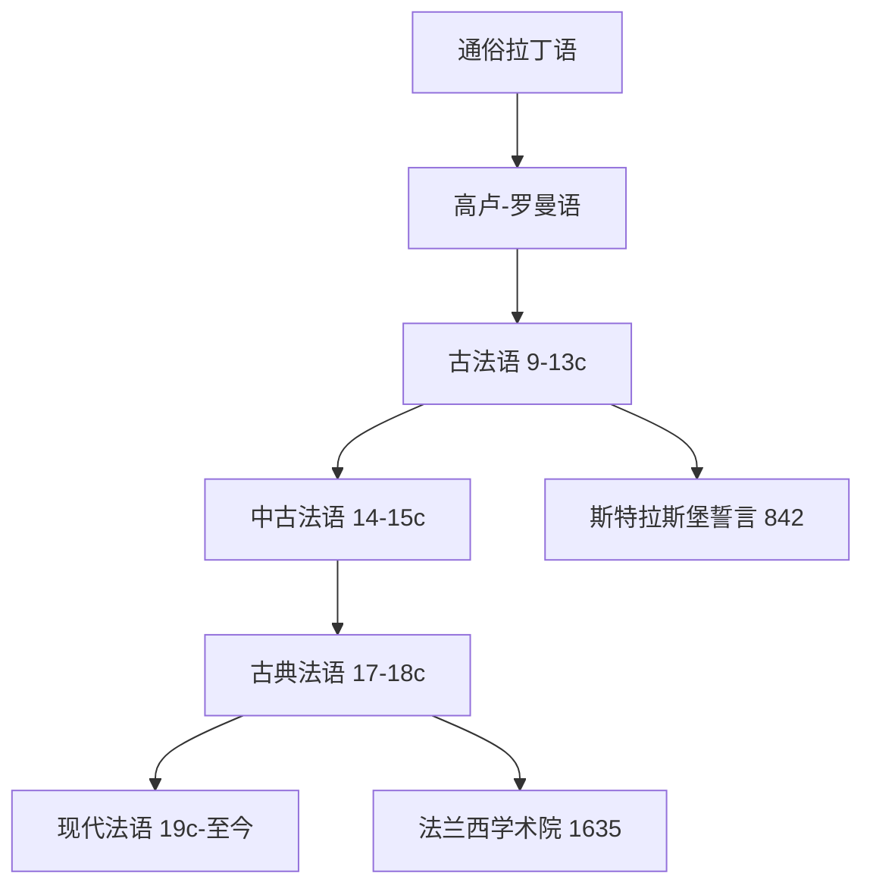

# FrenchLanguageAndLiterature

**法语语言文学**
(French Language and Literature)
涵盖法语的历史演变和法语文学传统。
法语属于印欧语系罗曼语族。
由通俗拉丁语演变而来。
法国文学有丰富的中世纪、古典、现代传统。

## 法语的历史演变

### 从拉丁语到法语

斯特拉斯堡誓言 (842):
最早的罗曼语文献之一。
法兰西学术院 (1635):
负责法语规范化与词典编纂。
法语曾是欧洲外交语言。
法国在全球有 3 亿法语使用者。
杜邦法 (1994) 保护法语地位。
法语在非洲影响深远。

## 法国文学史

### 中世纪文学 (9–15c)

英雄史诗 *罗兰之歌*(~1100)。
骑士文学: 克雷蒂安·德·特鲁瓦。
亚瑟王传奇与圣杯故事。
*玫瑰传奇* 寓言式爱情诗。
*列那狐的故事* 市民文学。
维庸 *大 Testament* 抒情诗杰作。

### 文艺复兴 (16c)

龙沙和七星诗社革新法语诗歌。
拉伯雷 *巨人传* 人文主义讽刺。
蒙田 *随笔集*(1580) 创立随笔文体。
*Essais* 意为"尝试"。

### 古典主义 (17c)

戏剧三一律:
高乃依 *熙德* (1637)。
拉辛 *费德尔* (1677)。
莫里哀 *伪君子*(1664) *吝啬鬼*(1668)。
*厌世者* *贵人迷*。
拉封丹寓言诗 12 卷。
帕斯卡尔 *思想录*。
布瓦洛 *诗的艺术* 古典主义法典。
拉罗什富科 *箴言录*。

### 启蒙时代 (18c)

伏尔泰 *老实人* (1759)。
*哲学书简* (1734)。
卢梭 *社会契约论* (1762)。
*忏悔录* *新爱洛伊丝*。
狄德罗主编 *百科全书*(1751-1772)。
*宿命论者雅克和他的主人*。
孟德斯鸠 *波斯人信札* (1721)。
*论法的精神* (1748)。
博马舍 *费加罗的婚礼* (1784)。

### 19 世纪

夏多布里昂 *基督教精神*。
雨果 *巴黎圣母院*(1831)。
*悲惨世界*(1862) *九三年*。
司汤达 *红与黑*(1830) *巴马修道院*。
巴尔扎克 *人间喜剧* 91 部小说。
*高老头* *欧也妮·葛朗台*。
福楼拜 *包法利夫人*(1857)。
*情感教育* *萨朗波*。
左拉 *萌芽* *小酒店*。
自然主义理论与实践。
波德莱尔 *恶之花*(1857) 象征主义。
马拉美 *牧神的午后*。
魏尔伦 *无言浪漫曲*。
兰波 *地狱一季* *灵光集*。

### 20-21 世纪

普鲁斯特 *追忆似水年华*(1913-1927)。
萨特 *恶心*(1938) *存在与虚无*。
加缪 *局外人*(1942 *西西弗神话*。
*鼠疫* (1957 诺奖)。
尤奈斯库 *秃头歌女*。
贝克特 *等待戈多* (1969 诺奖)。
罗伯-格里耶 *橡皮* 新小说。
杜拉斯 *情人* (1984 龚古尔奖)。
波伏娃 *第二性*(1949) 女性主义。
*名士风流* (1954 龚古尔奖)。
勒克莱齐奥 (2008 诺奖)。
莫迪亚诺 (2014 诺奖)。
阿涅斯·瓦尔达 新浪潮电影。

### 法语文学理论

结构主义: 列维-斯特劳斯、巴特。
后结构/解构: 德里达 *论文字学*。
精神分析: 拉康 三界结构。
话语理论: 福柯 *词与物*。
女性书写: 西苏、伊里加蕾。
后现代: 利奥塔 *后现代状况*。

### 法语诗歌格律

亚历山大诗行 (Alexandrin):
12 音节的基本格律。
"Je fais souvent ce rêve étrange et pénétrant"。

## 相关领域

- [[WorldLiterature|世界文学]]
- [[EnglishLanguageAndLiterature|英语语言文学]]
- [[../Linguistics/AppliedLinguistics|应用语言学]]

---

- [[../../INDEX|当前目录索引]]
