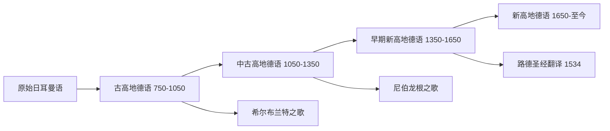

# GermanLanguageAndLiterature

**德语语言文学**
(German Language and Literature)
研究德语语言的历史演变
以及德语国家的文学传统。
德国、奥地利、瑞士都有丰富文学。
德语属于日耳曼语族西日耳曼语支。

## 德语语言史

### 语言发展阶段

### 德语的关键特征

名词三性: 阳性 der、阴性 die、中性 das。
四格系统: 主格、宾格、与格、属格。
动词框架结构: 从句句末动词。
长复合词传统:
*Donaudampfschifffahrtsgesellschaftskapitän*。

### 第二次辅音推移

高地与低地德语的分界线。
p→pf/f: apple→Apfel, ship→Schiff。
t→ts/s: water→Wasser, eat→essen。
k→ch: make→machen, book→Buch。

## 德国文学史

### 中世纪文学

*尼伯龙根之歌*(~1200) 英雄史诗。
Minnesang 骑士爱情诗。
瓦尔特·冯·德·福格威德。
沃尔夫拉姆 *帕西法尔*。
哈特曼·冯·奥厄。

### 宗教改革与巴洛克 (1500–1720)

马丁·路德语圣经 (1534)。
奠定新高地德语的基础。
格里梅尔斯豪森 *痴儿西木传*。
奥皮茨 *德国诗论*。

### 启蒙与狂飙突进 (1720–1785)

莱辛 *智者纳旦* *汉堡剧评*。
狂飙突进:
青年歌德 *少年维特的烦恼*(1774)。
席勒 *强盗*(1781) *阴谋与爱情*。

### 魏玛古典文学 (1786–1832)

歌德 *浮士德* (I 1808, II 1832)。
*威廉·迈斯特的学习时代*。
*亲和力* (1809)。
席勒 *威廉·退尔* (1804)。
*审美教育书简* *华伦斯坦*。
魏玛古典主义以和谐人道为理想。

### 浪漫主义 (1798–1835)

施莱格尔兄弟理论奠基。
诺瓦利斯 *亨利希·冯·奥弗特丁根*。
E.T.A. 霍夫曼 *雄猫穆尔*。
格林兄弟 *儿童与家庭童话集*。
阿尔尼姆和布伦塔诺 *男孩的神奇号角*。

### 现实主义 (1815–1890)

毕德迈耶尔: 施蒂夫特 *晚夏*。
诗意的现实主义:
冯塔纳 *埃菲·布里斯特* (1895)。
凯勒 *绿衣亨利*。
施托姆 *白马骑士*。
海涅 *德国，一个冬天的童话*。

### 现代主义 (1890–1945)

自然主义: 霍普特曼 *织工*。
象征主义: 里尔克 *杜伊诺哀歌*。
*献给奥尔甫斯的十四行诗*。
表现主义: 卡夫卡 *审判* *变形记*。
*城堡* *诉讼*。
托马斯·曼 *魔山* (1924)。
*布登勃洛克一家* (1929 诺奖)。
*威尼斯之死*。
黑塞 *荒原狼* *玻璃珠游戏*(1946 诺奖)。
*悉达多* *德米安*。
布莱希特 史诗剧场 *伽利略传*。
*大胆妈妈和她的孩子们*。
穆齐尔 *没有个性的人*。

### 战后与当代 (1945–至今)

废墟文学: 伯尔 *女士及众生相*(1972 诺奖)。
君特·格拉斯 *铁皮鼓* (1999 诺奖)。
*猫与鼠* *狗年月*。
彼得·汉德克 (2019 诺奖)。
*骂观众* *痛苦的中国人*。
赫塔·米勒 (2009 诺奖)。
移民文学: 萨沙·斯坦尼希奇。
策兰 *死亡赋格* 大屠杀诗歌。

### 德语哲学传统

康德三大批判。
黑格尔辩证法。
尼采 *查拉图斯特拉如是说*。
叔本华 *作为意志和表象的世界*。
海德格尔 *存在与时间*。
阿多诺 *启蒙辩证法*。
本雅明 *机械复制时代的艺术作品*。
哈贝马斯 *交往行为理论*。

## 相关领域

- [[WorldLiterature|世界文学]]
- [[EnglishLanguageAndLiterature|英语语言文学]]
- [[FrenchLanguageAndLiterature|法语语言文学]]

---

- [[../../INDEX|当前目录索引]]
