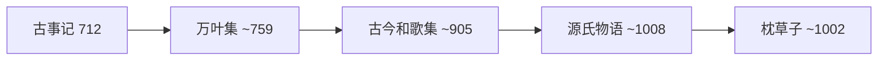

# JapaneseLanguageAndLiterature

**日语语言文学**
(Japanese Language and Literature)
涵盖日语的语言结构与发展演变。
以及从古代到当代的日本文学传统。
日语系属未定，使用汉字、平假名和片假名。

## 日语语言概述

### 文字系统

汉字 (Kanji): 来自中文的表意文字。
常用汉字约 2000-3000 个。
每个汉字有音读和训读。
平假名 (Hiragana) 用于语法助词。
片假名 (Katakana) 用于外来语。
罗马字 (Rōmaji) 用于拉丁转写。

### 语言结构

语序: SOV（主语-宾语-谓语）。
话题-说明结构使用助词「は」(wa)。
敬语系统 (Keigo):
尊敬语 (Sonkeigo) 抬高对方。
谦让语 (Kenjōgo) 降低自己。
丁宁语 (Teineigo) 礼貌表达。
简体与敬体两种语体。
$$\text{私}\xrightarrow{\text{は}}
   \text{本}\xrightarrow{\text{を}}\text{読む}$$

### 音系特征

五元音系统: a, i, u, e, o。
拍 (Mora) 等时性。
日语是莫拉计时语言。
促音 (Sokuon) 和长音 (Chōon)。
无声化元音。
音节结构简单 (CV(n))。

## 日本文学史

### 古代文学 (Ancient, ~710–1185)

奈良时代:
《古事记》(712) 最早史书。
《万叶集》(759) 4500 首和歌。

平安时代:
紫式部《源氏物语》(~1008)。
世界最早的长篇小说之一。
清少纳言《枕草子》(~1002)。
和歌/短歌: 31 音节 (5-7-5-7-7)。
假名文学让女性作家崭露头角。

### 中世文学 (Medieval, 1185–1600)

《平家物语》战争文学经典。
能剧: 世阿弥 *风姿花传*。
随笔: 吉田兼好 *徒然草*。
连歌集体创作诗歌。

### 近世文学 (Early Modern, 1600–1868)

松尾芭蕉俳谐:
「古池や 蛙飛びこむ 水の音」。
井原西鹤 *好色一代男*。
近松门左卫门人形净琉璃。
洒落本、黄表纸、滑稽本。

### 近代文学 (Modern, 1868–1945)

言文一致运动。
文学语言口语化。
二叶亭四迷 *浮云* 近代小说开端。
森鸥外 *舞姬* *雁*。
夏目漱石 *我是猫* *少爷* *心*。
*三四郎* *从此以后* *门*。
尾崎红叶 *金色夜叉*。

大正:
芥川龙之介 *罗生门* *竹林中*。
*河童* *鼻子*。
谷崎润一郎 *痴人之爱*。
*阴翳礼赞* *细雪*。
志贺直哉 *暗夜行路*。
宫泽贤治 *银河铁道之夜*。
*不怕风雨*。

### 战后与当代 (1945–至今)

川端康成 *雪国* *古都*。
*伊豆的舞女* (1968 诺奖)。
太宰治 *人间失格* *斜阳*。
三岛由纪夫 *金阁寺* *丰饶之海*。
*假面的告白* *潮骚*。
大江健三郎 *个人的体验*。
*万延元年的足球队* (1994 诺奖)。
村上春树 *挪威的森林* *1Q84*。
*海边的卡夫卡* *且听风吟*。
村上龙 *无限近似于透明的蓝*。
吉本芭娜娜 *厨房*。

### 日本文艺美学

物哀 (Mono no Aware): 稍纵即逝的哀感。
幽玄 (Yūgen): 深邃含蓄的美。
侘寂 (Wabi-Sabi): 残缺朴素无常之美。
粹 (Iki): 通晓人情的潇洒格调。

## 相关领域

- [[WorldLiterature|世界文学]]
- [[../ChineseLanguageAndLiterature/AncientChineseLiterature|中国古代文学]]
- [[../History/CulturalHistory|文化史]]

---

- [[../../INDEX|当前目录索引]]
