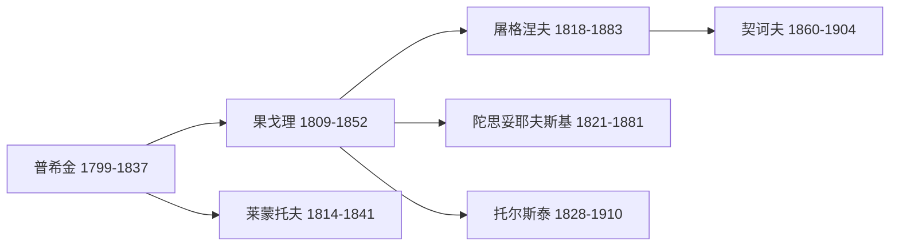

# RussianLanguageAndLiterature

**俄语语言文学**
(Russian Language and Literature)
研究俄语的语言系统和俄罗斯文学的伟大传统。
俄语属于斯拉夫语族东斯拉夫语支。
19 世纪的"黄金时代"最具世界影响力。

## 俄语语言概述

### 历史演变

古东斯拉夫语: 基辅罗斯时期 (9-13c)。
中古俄语: 莫斯科公国时期 (14-17c)。
现代俄语: 普希金时代确立 (18-19c)。
西里尔字母包含 33 个字母。
圣西里尔和美多德 9 世纪创制。
彼得大帝 1708-1710 年改革字体。

### 语言结构

名词六格: 主格、属格、与格、宾格。
工具格、前置格。
动词体: 完成体与未完成体。
三种性: 阳性、阴性、中性。
辅音硬软对立。
自由可移动重音系统。

元音弱化:
$$\text{хорошо́} [xərɐˈʂo]$$

## 俄罗斯文学史

### 古俄罗斯文学 (~1000–1700)

*伊戈尔出征记*(~1185) 最重要史诗。
*往年纪事*(~1113) 编年史传统。
阿瓦库姆自传 17 世纪散文杰作。

### 18 世纪: 近代化

罗蒙诺索夫: 三种风格论。
冯维辛 *纨绔少年*。
卡拉姆津 *可怜的丽莎*。

### 19 世纪: 黄金时代

普希金 *叶甫盖尼·奥涅金*。
*上尉的女儿* *黑桃皇后*。
果戈理 *死魂灵* *钦差大臣*。
莱蒙托夫 *当代英雄*。
屠格涅夫 *父与子* *猎人笔记*。
陀思妥耶夫斯基 *罪与罚* (1866)。
*卡拉马佐夫兄弟* (1880)。
*白痴* *群魔* *地下室手记*。
托尔斯泰 *战争与和平* (1869)。
*安娜·卡列尼娜* (1877)。
*复活* *伊万·伊里奇之死*。
契诃夫短篇小说和戏剧。
*樱桃园* *三姐妹* *万尼亚舅舅*。

主题: "谁之罪"、"怎么办"。
多余人 (Superfluous Man) 母题。
小人物 (Little Man) 母题。

### 白银时代 (1890–1920)

象征主义: 勃洛克 *十二个*。
别雷 *彼得堡*。
阿克梅主义: 阿赫玛托娃 *安魂曲*。
曼德尔施塔姆 *石头*。
未来主义: 马雅可夫斯基 *穿裤子的云*。
*好！* 革命诗歌。

### 苏联时代 (1917–1991)

高尔基 *母亲* *海燕*。
马雅可夫斯基革命诗歌。
肖洛霍夫 *静静的顿河*(1965 诺奖)。
*被开垦的荒地*。
帕斯捷尔纳克 *日瓦戈医生*(1958 诺奖)。
索尔仁尼琴 *古拉格群岛*(1970 诺奖)。
*伊万·杰尼索维奇的一天*。
布尔加科夫 *大师与玛格丽特*。
*狗心* *白卫军*。
布罗茨基诗歌 (1987 诺奖)。

### 当代 (1991–至今)

佩列文 *百事一代* (Generation P)。
乌利茨卡娅 *美狄亚和她的孩子们*。
索罗金 *冰*。
阿列克谢耶维奇 *战争中没有女性*(2015 诺奖)。
*二手时间* *切尔诺贝利的祈祷*。

### 俄语文学理论

俄罗斯形式主义 (1915-1930):
什克洛夫斯基 "陌生化"。
雅各布森诗学功能。
巴赫金: 复调小说理论。
对话理论、狂欢化。
普罗普 *故事形态学* 31 功能。
洛特曼塔尔图-莫斯科符号学派。

## 相关领域

- [[WorldLiterature|世界文学]]
- [[EnglishLanguageAndLiterature|英语语言文学]]
- [[../Linguistics/HistoricalLinguistics|历史语言学]]

---

- [[../../INDEX|当前目录索引]]
