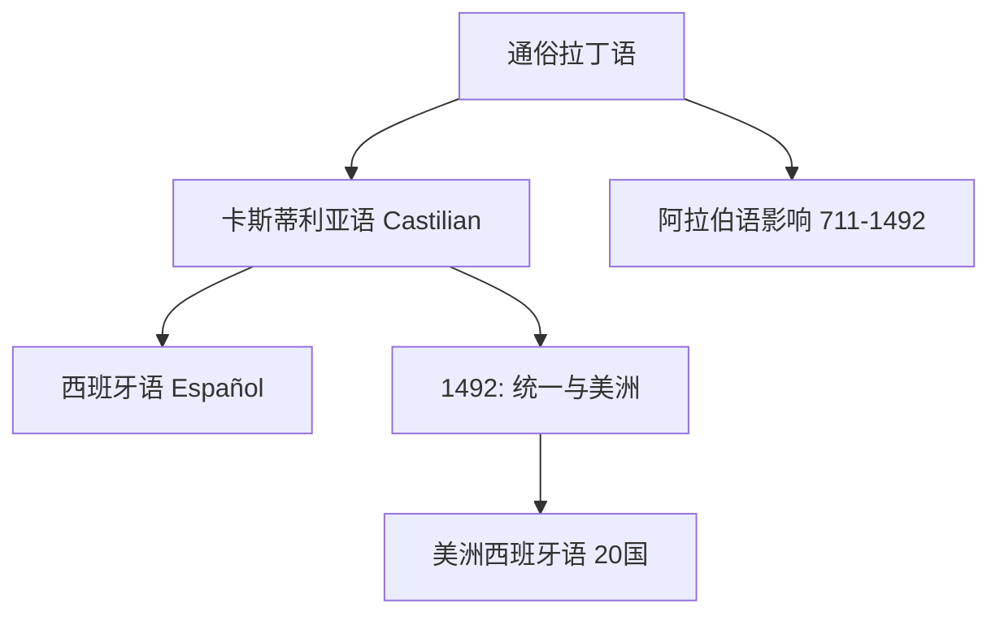
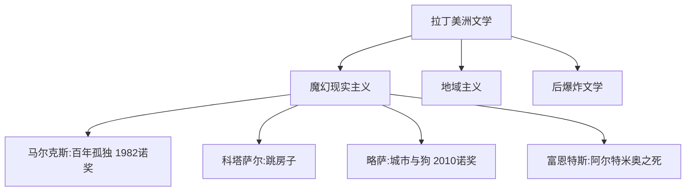

# SpanishLanguageAndLiterature

**西班牙语语言文学**
(Spanish Language and Literature)
研究西班牙语的语言系统及其文学遗产。
全球第二大语言，近 5 亿母语者。
西班牙与拉丁美洲文学传统极为丰厚。

## 西班牙语语言概述

### 从拉丁语到西班牙语

1492 年最重要:
伊莎贝尔统一西班牙。
哥伦布抵达美洲。
内布里哈首部西班牙语法。

### 语言特征

名词分阴阳性，有单复数。
三种动词结尾: -ar, -er, -ir。
虚拟语气 (Subjuntivo) 广泛使用。
六个人称。

### 西班牙语变体

卡斯蒂利亚: /θ/ 与 /s/ 区分。
安达卢西亚: /s/ 弱化。
墨西哥: 纳瓦特尔语词汇。
阿根廷: voseo、yeísmo /ʃ/。
加勒比: /r/ 与 /l/ 交替。

## 西班牙文学史

### 中世纪文学 (~1000–1492)

*熙德之歌*(~1140) 民族史诗。
*好心爱情诗*(1330)。
曼里克 *悼亡父歌*。
阿方索十世推动西班牙语散文。

### 黄金时代 (Siglo de Oro, 1492–1681)

流浪汉小说: *小癞子*(1554)。
神秘主义: 圣十字若望、圣特蕾莎。
塞万提斯 *堂吉诃德*(1605/1615)。
现代小说的奠基之作。
洛佩·德·维加 *羊泉村*。
卡尔德隆 *人生如梦*。
贡戈拉夸饰主义 vs 克维多概念主义。
蒂尔索·德·莫利纳 *塞维利亚的嘲弄者*。

### 18-19 世纪

新古典主义: 莫拉廷喜剧。
浪漫主义: 埃斯普龙塞达。
贝克尔 *诗韵集*。
现实主义: 加尔多斯 *Fortunata y Jacinta*。
*国家轶事*系列历史小说。
克拉林 *庭长夫人* (*La Regenta*)。

### 现代主义与 98 一代

达里奥 (Rubén Darío) *蓝*。
达里奥 *生命与希望之歌*。
98 一代: 乌纳穆诺 *人生的悲剧感*。
*堂吉诃德与桑乔的生平*。
马查多 *卡斯蒂利亚的田野*。
阿索林、巴列-因克兰。

### 27 一代与战后

加西亚·洛尔迦 *吉普赛谣曲*。
*血的婚礼* *叶尔玛* *贝尔纳达之家*。
拉蒙·德尔·巴列-因克兰。
塞拉 *蜂房*(1989 诺奖)。
战后社会现实主义。

### 拉丁美洲文学

马尔克斯 *百年孤独*(1967, 1982 诺奖)。
*霍乱时期的爱情* *族长的秋天*。
聂鲁达 *漫歌*(1971 诺奖)。
*二十首情诗和一支绝望的歌*。
博尔赫斯 *小径分岔的花园*。
*虚构集* *阿莱夫*。
科塔萨尔 *跳房子*。*万火归一*。
富恩特斯 *阿尔特米奥·克罗斯之死*。
略萨 *城市与狗* *绿房子*(2010 诺奖)。
帕斯 *太阳石* *孤独的迷宫*(1990 诺奖)。
波拉尼奥 *2666* *荒野侦探*。

## 相关领域

- [[WorldLiterature|世界文学]]
- [[FrenchLanguageAndLiterature|法语语言文学]]
- [[../Linguistics/AppliedLinguistics|应用语言学]]

---

- [[../../INDEX|当前目录索引]]
