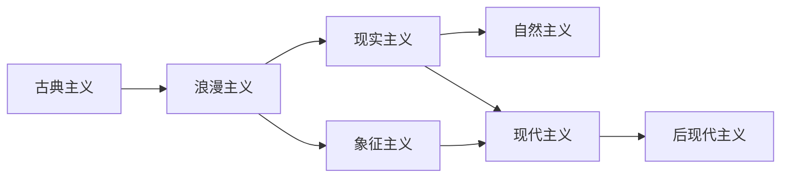

# WorldLiterature

**世界文学**
(World Literature / Weltliteratur)
指全球各民族、各文化的文学创作总汇。
歌德在 1827 年提出这一概念。
"民族文学的时代已经过去。"

## 世界文学的理论视角

### 歌德的世界文学

歌德认为世界文学是各民族的对话。
他在阅读中国小说后提出此概念。
强调文学超越民族界限。

### 比较文学

法国学派: 影响研究 (实证源流传播)。
美国学派: 平行研究 (无直接影响的对比)。
中国学派: 跨文明研究方法论。

### 当代拓展

Casanova "文学世界共和国"：
文学资本由传统深度、语言地位决定。
Damrosch: 世界文学是"源文化之外流通的作品"。
Moretti "远读" (Distant Reading):
用数据分析和宏观视角研究文学史。

## 经典作品

### 古代史诗

| 作品 | 文明 | 年代 | 意义 |
|-----|------|------|------|
| 吉尔伽美什 | 美索不达米亚 | ~2100 BCE | 最古老史诗 |
| 伊利亚特/奥德赛 | 古希腊 | ~750 BCE | 西方文学源头 |
| 摩诃婆罗多 | 古印度 | ~400 BCE-400 | 最长史诗 |
| 埃涅阿斯纪 | 古罗马 | 19 BCE | 罗马史诗 |
| 贝奥武甫 | 英国 | ~1000 | 日耳曼史诗 |

### 东方文学经典

中国: 诗经、楚辞、红楼梦、西游记。
日本: 源氏物语、平家物语、雪国。
印度: 沙恭达罗、吉檀迦利。
波斯: 菲尔多西 *列王记*。
鲁米神秘诗、哈菲兹抒情诗。

### 主要文学潮流

### 非洲文学

阿契贝 *瓦解*(1958) 非洲小说奠基。
*再也不得安宁* *神箭*。
索因卡 (1986 诺奖) 尼日利亚戏剧。
马哈福兹 (1988 诺奖) 开罗三部曲。
戈迪默 (1991 诺奖) 南非批判。
库切 *耻* (2003 诺奖)。
古尔纳 (2021 诺奖) 难民叙事。

### 阿拉伯文学

*一千零一夜* (Alf Layla wa-Layla)。
阿多尼斯现代诗歌革命。
达尔维什巴勒斯坦抵抗诗歌。
马哈福兹阿拉伯小说之父。

### 南亚文学

泰戈尔 *吉檀迦利*(1913 诺奖)。
拉什迪 *午夜的孩子* 后殖民魔幻。
*撒旦诗篇* *摩尔人的最后叹息*。
洛伊 *微物之神* (布克奖)。
赛斯 *如意郎君*。

### 东亚文学

川端康成 (1968 诺奖)。
大江健三郎 (1994 诺奖)。
莫言 *蛙*(2012 诺奖)。
*红高粱家族* *丰乳肥臀* *生死疲劳*。
高行健 *灵山*(2000 诺奖)。
韩江 *素食者*(2024 诺奖)。

## 翻译与世界文学

翻译是世界文学流通的核心。
本雅明 *译者的任务* 哲学翻译论。
庞德翻译中国诗歌影响现代主义。
"翻译即再创作"——跨文化阐释。
译者的创造性叛逆是文学传播的条件。
翻译文学在世界文学中占据核心位置。

## 世界文学的重要主题

**流散与身份** (Diaspora & Identity):
家园与流亡的张力、移民书写。
**殖民与后殖民** (Colonial & Postcolonial):
帝国叙事与去殖民化。
**女性写作** (Women's Writing):
伍尔夫、莫里森、波伏娃。
**生态批评** (Ecocriticism):
气候危机时代文学思考。
**世界主义** (Cosmopolitanism):
普遍人性与差异文化的平衡。

## 相关领域

- [[EnglishLanguageAndLiterature|英语语言文学]]
- [[../ChineseLanguageAndLiterature/AncientChineseLiterature|中国古代文学]]
- [[../History/CulturalHistory|文化史]]

---

- [[../../INDEX|当前目录索引]]
