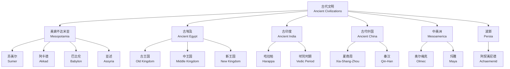

# 古代史 (Ancient History)

## 概述 (Overview)

古代史 (Ancient History) 研究从最早文字记录出现（约公元前 3400 年）到公元 500 年左右的漫长历史时期。古代文明 (Ancient Civilizations) 在美索不达米亚 (Mesopotamia)、古埃及 (Ancient Egypt)、印度河流域 (Indus Valley)、中国 (China)、希腊 (Greece) 和罗马 (Rome) 等地诞生，奠定了人类政治、法律、宗教、科学和艺术的基础框架。

## 大河文明与主要文明分布

## 文明对比 (Civilization Comparison)

| 文明 | 河流域 | 起始时间 | 文字系统 | 核心贡献 | 衰落时间 |
|:---|:---|:---:|:---|:---|:---:|
| 美索不达米亚 | 幼发拉底河、底格里斯河 | ~3500 BCE | 楔形文字 (Cuneiform) | 法典、天文、数学 | 539 BCE |
| 古埃及 | 尼罗河 | ~3100 BCE | 象形文字 (Hieroglyph) | 金字塔、历法、医学 | 332 BCE |
| 古印度 | 印度河 | ~2600 BCE | 哈拉帕文字 | 城市规划、"零"概念 | ~1700 BCE |
| 古代中国 | 黄河、长江 | ~2070 BCE | 甲骨文 (Oracle Bone) | 青铜、丝绸、四大发明原型 | 589 CE |
| 奥尔梅克 | 墨西哥湾沿岸 | ~1500 BCE | 尚未破译 | 历法、球戏、巨石头像 | ~400 BCE |

## 大河文明 (River Civilizations)

### 美索不达米亚 (~3500–539 BCE)
- 苏美尔人 (Sumerians) 创造楔形文字 (Cuneiform)，世界上最早的文字系统之一
- 城邦 (City-States)：乌尔 (Ur)、乌鲁克 (Uruk)、拉伽什 (Lagash)
- 汉谟拉比法典 (Code of Hammurabi)：282 条法律，"以眼还眼，以牙还牙"是该法典的核心原则
- 阿卡德帝国 (Akkadian Empire)：萨尔贡大帝 (Sargon the Great) 建立人类历史上第一个帝国
- 亚述帝国 (Assyrian Empire)：以军事统治著称，尼尼微 (Nineveh) 图书馆藏有 3 万块泥板
- 新巴比伦 (Neo-Babylon)：尼布甲尼撒二世建造空中花园 (Hanging Gardens)
- 文学：《吉尔伽美什史诗》(Epic of Gilgamesh) 是已知最早的文学巨著

### 古埃及 (~3100–332 BCE)
- 法老 (Pharaoh) 神权政治：法老既是国家元首又是最高祭司
- 象形文字 (Hieroglyphics)：罗塞塔石碑 (Rosetta Stone) 成为破译关键
- 金字塔 (Pyramids)：胡夫金字塔建于 ~2560 BCE，高达 146.6 m，千年内为世界最高建筑
- 中王国时期文学繁荣，新王国时期帝国扩张至西亚
- 阿肯纳顿 (Akhenaten) 一神教改革：最早的一神论尝试之一
- 拉美西斯二世 (Ramesses II)：统治 66 年，与赫梯签署世界最早和平条约
- 图坦卡蒙墓 (Tomb of Tutankhamun)：1922 年被发现，保存完好的法老墓葬
- 四大成就：金字塔建筑、木乃伊制作 (Mummification)、太阳历 (Solar Calendar, 365 天)、文字系统

### 古印度 (~2600 BCE 起)
- 印度河流域文明 (Indus Valley Civilization)：哈拉帕 (Harappa)、摩亨佐达罗 (Mohenjo-Daro)，规划典范
- 吠陀时代 (Vedic Period, ~1500 BCE)：雅利安人 (Aryans) 入侵，四部吠陀形成
- 种姓制度 (Caste System)：婆罗门 (Brahmins)、刹帝利 (Kshatriyas)、吠舍 (Vaishyas)、首陀罗 (Shudras)
- 佛教 (Buddhism)：释迦牟尼佛陀 (Siddhartha Gautama, ~563–483 BCE)，四圣谛与八正道
- 耆那教 (Jainism)：大雄 (Mahavira) 倡导非暴力 (Ahimsa)
- 孔雀王朝 (Maurya Empire)：阿育王 (Ashoka) 统一印度次大陆并推崇佛教

### 古代中国 (~2070 BCE–589 CE)
- 夏朝 (Xia Dynasty)：传说中第一个王朝，开启了国家起源
- 商朝 (Shang Dynasty)：甲骨文 (Oracle Bone Script) 确证了中国最早的文字，青铜文明高度发达
- 周朝 (Zhou Dynasty)：分封制 (Enfeoffment) 与礼乐制度 (Ritual Music System)
- 春秋战国 (Spring and Autumn / Warring States)：百家争鸣，孔子 (Confucius)、老子 (Laozi)、孙子 (Sunzi) 等思想巨匠
- 秦朝 (Qin Dynasty)：秦始皇 (Qin Shi Huang) 统一六国，书同文车同轨
- 汉朝 (Han Dynasty)：丝绸之路 (Silk Road) 开辟，独尊儒术确立官方意识形态

## 古典文明 (Classical Civilizations)

### 古希腊 (~800–146 BCE)
- 城邦 (Polis)：雅典 (Athens) 民主制 (Democracy)、斯巴达 (Sparta) 寡头制 (Oligarchy)
- 波斯战争 (Persian Wars)：马拉松 (Marathon, 490 BCE)、温泉关 (Thermopylae, 480 BCE)、萨拉米斯海战 (Salamis)
- 伯罗奔尼撒战争 (Peloponnesian War, 431–404 BCE)：雅典 vs 斯巴达，修昔底德 (Thucydides) 记录
- 亚历山大大帝 (Alexander the Great, 356–323 BCE)：征服波斯至印度，开创希腊化时代 (Hellenistic Period)

**哲学三杰**：
| 哲学家 | 主要贡献 | 著名学生/作品 |
|:---|:---|:---|
| 苏格拉底 (Socrates) | 问答法、伦理哲学 | 柏拉图 |
| 柏拉图 (Plato) | 理型论、理想国 | 亚里士多德 |
| 亚里士多德 (Aristotle) | 逻辑学、形而上学、科学分类 | 《形而上学》、《尼各马可伦理学》 |

- 史学：希罗多德 (Herodotus, "历史之父")、修昔底德 (Thucydides, 政治史)
- 戏剧：三大悲剧家——埃斯库罗斯 (Aeschylus)、索福克勒斯 (Sophocles)、欧里庇得斯 (Euripides)
- 奥林匹克运动会 (Olympic Games)：始于公元前 776 年，每四年举办一次

### 古罗马 (753 BCE–476 CE)

**共和国时期 (509–27 BCE)**：
- 布匿战争 (Punic Wars, 264–146 BCE)：罗马 vs 迦太基，最终摧毁迦太基
- 凯撒 (Julius Caesar)：征服高卢 (Gaul)，跨过卢比孔河成为终身独裁官

**帝国时期 (27 BCE–476 CE)**：
- 奥古斯都 (Augustus)：元首政治 (Principate)，"罗马和平" (Pax Romana)
- 五贤帝 (Five Good Emperors)：涅尔瓦到马可·奥勒留，帝国黄金时代
- 罗马法：十二铜表法 (Twelve Tables)、《民法大全》(Corpus Juris Civilis)
- 拉丁文学：维吉尔 (Virgil)《埃涅阿斯纪》(Aeneid)、奥维德 (Ovid)《变形记》

**衰落与分治**：
- 戴克里先 (Diocletian) 四帝共治 (Tetrarchy)
- 君士坦丁 (Constantine) 迁都拜占庭 (Byzantium)，更名君士坦丁堡
- 410 年西哥特人 (Visigoths) 攻陷罗马，476 年西罗马帝国灭亡

### 古典科学成就 (Classical Science)

| 学科 | 人物 | 贡献 | 公式/定理 |
|:---|:---|:---|:---:|
| 几何学 | 欧几里得 (Euclid) | 《几何原本》奠定公理化体系 | $a^2 + b^2 = c^2$ |
| 力学 | 阿基米德 (Archimedes) | 浮力原理、杠杆原理 | $F_b = \rho g V$ |
| 天文学 | 托勒密 (Ptolemy) | 地心说模型、《天文学大成》 | — |
| 医学 | 希波克拉底 (Hippocrates) | 体液说、希波克拉底誓言 | — |

## 古代文明联系 (Ancient Connections)

- 丝绸之路 (Silk Road)：张骞出使西域（公元前 138 年），连接中国与中亚、西亚和欧洲
- 希腊化时代 (Hellenistic Period)：亚历山大东征促进东西方文化大融合
- 罗马道路系统："条条大路通罗马"（All roads lead to Rome），总长约 40 万 km

**重力加速度 (Galileo 的推导，虽然晚于古代，但对古典力学总结)**：

$$
s = \frac{1}{2}gt^2
$$

## 古代文明的时间坐标 (Timeline)

| 年份 | 事件 | 文明 |
|:---:|:---|:---:|
| ~3100 BCE | 那尔迈统一上下埃及 | 埃及 |
| ~2600 BCE | 胡夫大金字塔建造 | 埃及 |
| ~2100 BCE | 乌尔纳姆法典 | 苏美尔 |
| ~1754 BCE | 汉谟拉比法典颁布 | 巴比伦 |
| ~1046 BCE | 武王伐纣，周朝建立 | 中国 |
| 776 BCE | 第一届奥林匹克运动会 | 希腊 |
| 753 BCE | 罗马建城（传说） | 罗马 |
| 509 BCE | 罗马共和国建立 | 罗马 |
| 221 BCE | 秦始皇统一中国 | 中国 |
| 27 BCE | 奥古斯都建立罗马帝国 | 罗马 |
| 476 CE | 西罗马帝国灭亡 | 欧洲 |

## 古代波斯 (Ancient Persia)

### 阿契美尼德帝国 (~550–330 BCE)
- 居鲁士大帝 (Cyrus the Great) 建立人类历史上第一个横跨亚欧非三大洲的帝国
- 大流士一世 (Darius I) 改革：行省制 (Satrapy)、驿道系统（波斯御道 2699 km）、统一度量衡
- 波希战争 (Greco-Persian Wars)：马拉松、温泉关、萨拉米斯海战，最终希腊胜利
- 帝国语言：阿拉姆语 (Aramaic) 作为行政通用语，贝希斯敦铭文 (Behistun Inscription) 三语对照
- 宗教：琐罗亚斯德教 (Zoroastrianism)——善恶二元论，火神庙，影响犹太教和基督教

### 帕提亚与萨珊帝国 (~247 BCE–651 CE)
- 帕提亚（安息）帝国：丝绸之路上中国与罗马之间的贸易中转站
- 萨珊帝国：复兴波斯文化和琐罗亚斯德教，与罗马/拜占庭长期对抗
- 文化成就：波斯地毯、金属工艺、《列王纪》史诗传统起源

## 中美洲古代文明 (Mesoamerican Civilizations)

### 奥尔梅克文明 (~1500–400 BCE)
- "中美洲之母文明"（Mother Culture of Mesoamerica）
- 巨石头像（重达 20–40 吨），玄武岩雕刻而成
- 发明中美洲历法和球戏 (Mesoamerican Ballgame)
- 零的符号概念，独立于旧大陆的书写系统尝试

### 玛雅文明 (~2000 BCE–900 CE)
- 古典时期 (~250–900 CE) 达到鼎盛，城邦如蒂卡尔 (Tikal)、帕伦克 (Palenque)
- 玛雅历法：卓尔金历 (260 天) + 哈布历 (365 天) = 历法循环 (52 年)
- 玛雅数学：二十进制 (Vigesimal)，明确使用零符号
- 象形文字：约 800 个字形，部分已破译
- 2012 年误解的"世界末日"实际是历法周期的结束
- 9–10 世纪古典玛雅崩溃，可能原因包括干旱、过度开发和政治动荡

### 阿兹特克帝国 (1345–1521 CE)
- 特诺奇蒂特兰 (Tenochtitlan) 建在特斯科科湖的人工岛上，人口 20 万
- 社会：统治者 (Tlatoani) → 贵族 → 祭司 → 商人 → 平民 → 奴隶
- 农业：奇南帕 (Chinampa，浮动园地) 提供高效农业生产
- 1521 年被西班牙征服者科尔特斯 (Cortés) 联合土著盟友击败

## 古代南美洲文明 (Ancient South America)

### 查文文明 (~900–200 BCE)
- 查文德万塔尔 (Chavín de Huántar) 宗教中心，地下通道和猫科动物神祇崇拜

### 印加帝国 (~1200–1572 CE)
- 库斯科 (Cusco) 首都，马丘比丘 (Machu Picchu) 是标志性遗址
- 基普 (Quipu) 结绳记事系统，未破译的"印加文字"
- 道路系统：4 万 km 的 Qhapaq Ñan 御道网
- 农业：梯田农业和冻干土豆 (Chuño) 存储技术
- 1532 年被西班牙征服者皮萨罗 (Pizarro) 击败

## 古代科技与文化成就总览

| 文明 | 建筑 | 科技 | 数学 | 医学 |
|:---|:---|:---|:---|:---|
| 美索不达米亚 | 金字形神塔 (Ziggurat) | 灌溉系统、战车 | 六十进制、二次方程 | 草药、占星医学 |
| 古埃及 | 金字塔、神庙 | 防腐木乃伊、造纸 | 几何测量、分数 | 外科手术、牙科 |
| 古希腊 | 帕特农神庙 | 阿基米德螺旋 | 欧几里得几何、素数 | 希波克拉底誓言 |
| 古罗马 | 万神殿、斗兽场 | 混凝土、拱券、输水道 | 罗马数字 | 盖伦医学体系 |
| 古代中国 | 长城、兵马俑 | 四大发明、青铜冶炼 | 十进制、九章算术 | 针灸、(神农)本草 |
| 玛雅 | 金字塔式神庙 | 天文观测台 | 二十进制、零 | 草药、颅骨手术 |

**欧拉公式的古代几何来源**：古希腊的 $e^{i\pi} + 1 = 0$ 虽未出现，但 $\pi$ 已在阿基米德计算中得到逼近 $3.1416$，圆周率是中国刘徽和祖冲之（3.1415926）的杰出贡献。

## 相关条目 (Related Entries)

- [[MedievalHistory|中世纪史]]
- [[CulturalHistory|文化史]]
- [[Archaeology/WorldArchaeology|世界考古]]
- [[GreekPhilosophy]]
- [[RomanLaw]]

---

- [[../../INDEX|当前目录索引]]
