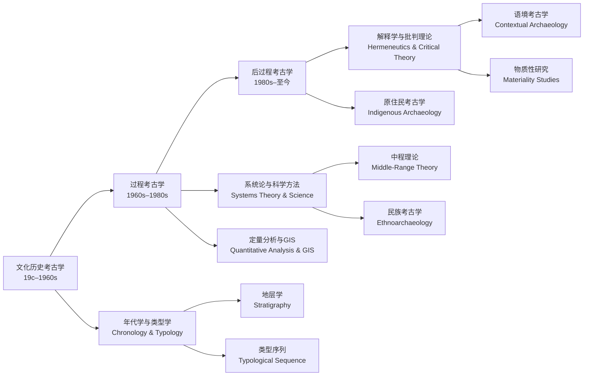

---
aliases:
  - Archaeological Theory
  - 考古学理论
  - 考古学方法论
tags:
  - Archaeology
  - ArchaeologicalTheory
  - CulturalEvolution
  - ResearchMethodology
---

# 考古学理论（Archaeological Theory）

考古学理论（Archaeological Theory）是关于如何解释考古材料的方法论体系。与单纯的技术操作（如发掘、测年、器物分类）不同，理论层面解决的是"我们如何从物质遗存中推导出关于过去社会的知识"这一核心认识论问题。考古学理论经历了从文化历史考古学（Culture-Historical Archaeology）到过程考古学（Processual Archaeology）、再到后过程考古学（Post-Processual Archaeology）的三大范式转换，每一阶段都在回应前一种范型的局限性，同时丰富着考古学的解释工具箱。当代考古学的特征是多元理论并存——不同研究问题需要不同的理论框架。

## 考古学理论演进谱系

## 文化历史考古学（Culture-Historical Archaeology）

### 核心目标

文化历史考古学的首要任务是建立时空框架（Chronological-Spatial Framework），将考古材料分类、排序并归入特定的文化群体。这一范式在 19 世纪末至 20 世纪中期主导全球考古学，至今仍是许多地区考古学的基础性工作。它的根本假设是：相似的器物类型反映共同的文化传统，而文化的变迁主要通过传播（Diffusion）和迁移（Migration）解释。

### 方法基础

- **类型学（Typology）**：依据器物形态特征建立类型序列，通过类型演变推断相对年代。类型学的理论基础源自生物分类学和进化论——器物形态随时间呈有规律的渐变。奥斯卡·蒙特柳斯（Oscar Montelius）在 19 世纪末建立了北欧青铜器的类型序列，开启了考古类型学的方法论传统。
- **地层学（Stratigraphy）**：依据叠压定律（Law of Superposition）判断遗迹的相对年代——下层早于上层。地层学是考古发掘的物理基础，也是相对年代判断中最基本的逻辑工具。爱德华·哈里斯（Edward Harris）在 1970 年代系统化了哈里斯矩阵（Harris Matrix），为地层关系的数字化分析提供了工具。
- **文化传播论（Diffusionism）**：文化特征通过传播和迁移扩散——考古学上的相似性往往被归因于文化接触或人群迁徙。这一理论在 20 世纪初广泛用于解释全球范围内的文化相似性，但在后过程考古学中被认为过于简化。

### 代表人物与贡献

Gordon Childe 是这一范式的集大成者，他在《欧洲文明的黎明》（The Dawn of European Civilization, 1925）和《人类创造自身》（Man Makes Himself, 1936）中将考古学数据与社会进化理论相结合，提出了"新石器时代革命"（Neolithic Revolution）和"城市革命"（Urban Revolution）两大概念——这可能是考古学史上最具影响力的理论贡献。

在中国考古学的发展中，李济（中国考古学之父）、梁思永（龙山文化发现者）和夏鼐（碳十四测年引入者）建立了中国考古学的年代框架和区系类型体系。苏秉琦提出的"区系类型"理论将中国考古学文化分为六大区系，强调"满天星斗"式的多元起源——这一理论为中国文明起源的研究提供了本土化的分析框架，区别于西方中心论的传播模式。

文化历史考古学的核心贡献在于建立了全球范围的年代框架。但其局限性也非常明显——描述性强而解释性弱，对文化变迁的内在动力（社会结构变化、经济基础转变、意识形态演变）缺乏系统性的机制分析。

## 过程考古学（Processual Archaeology, 1960s–1980s）

### 新考古学宣言

Lewis Binford 在 1960 年代发起了"新考古学"（New Archaeology）运动，核心主张是考古学应当从描述走向解释——成为一门科学而非史料的补充。过程考古学深受系统论（Systems Theory）、文化生态学（Cultural Ecology）和新进化论（Neoevolutionism）的影响。

过程考古学的核心信条包含以下四个维度：

1. **假设-演绎方法（Hypothetico-Deductive Method）**：提出可检验的假说，通过考古证据予以验证或证伪。这一方法论直接来自卡尔·波普尔（Karl Popper）的证伪主义科学哲学——一个理论是否有价值不在于它能否"被证明"，而在于它是否具有可证伪性。
2. **文化是适应系统（Culture as Adaptive System）**：文化不是随意的习俗集合，而是群体为适应环境而采取的行为策略。文化的变迁因此被理解为适应压力和反馈调节的结果，而非随机变异或传播。
3. **关注长期变迁（Long-Term Change）**：考古学的时间深度使其能够研究数百年至数千年的社会演变过程——这是文献史学无法企及的独特优势。通过研究长时段的结构变迁，考古学可以识别出短期的局部事件所不能揭示的深层规律。
4. **中程理论（Middle-Range Theory）**：连接静态考古记录与动态过去行为的"桥梁"。主要包括民族考古学（Ethnoarchaeology）——通过观察现代社会中物质文化形成的过程来建立解释过去的类比框架；以及实验考古学（Experimental Archaeology）——通过控制实验模拟古代技术过程。

### 代表人谱与贡献

| 学者 | 核心贡献 | 代表性工作 |
|------|---------|-----------|
| Lewis Binford | 理论奠基、新考古学宣言 | 《考古学的视角》（1962）、《追寻过去》（1983） |
| Colin Renfrew | 社会复杂化、认知考古学 | 欧洲文明独立起源论证、碳十四校正曲线 |
| Kent Flannery | 农业起源系统论 | "广谱革命"概念、系统论在考古中的首次系统应用 |
| Michael Schiffer | 遗址形成过程研究 | 区分了"系统语境"和"考古语境"——认识到考古记录是文化形成和自然改造双重作用的结果 |

### 方法论贡献

过程考古学引入了定量分析和系统论方法，将考古遗址视为开放系统的一部分。年代学方面，碳十四测年（Radiocarbon Dating）的基础公式为：

$$t = -\frac{1}{\lambda} \cdot \ln\left(\frac{N}{N_0}\right)$$

其中 $\lambda = 1.2097 \times 10^{-4} \text{ 年}^{-1}$ 为碳十四的衰变常数，$N$ 为样品中碳十四的剩余含量，$N_0$ 为初始含量，$t$ 为距今时间。树轮校正曲线（Calibration Curve, 尤其是 IntCal 系列）的建立将碳十四年龄转换为日历年龄——这一转换大大提高了测年精度。

在空间分析领域，GIS（地理信息系统）、最近邻分析（Nearest Neighbor Analysis）和视域分析（Viewshed Analysis）成为研究古代社会空间格局的标准化工具。这些方法使考古学家能够定量地检验关于聚落分布、资源控制和社会网络的假说。

## 后过程考古学（Post-Processual Archaeology, 1980s–）

### 核心批判

Ian Hodder 在《解读过去》（Reading the Past, 1986）中对过程考古学的科学主义倾向提出了系统性批判。后过程考古学并非对方法科学性的否定，而是对"纯科学足以解释人类行为"这一假设的根本质疑。

后过程考古学的主要批评立场：

1. **物质文化承载象征意义**：器物不仅是适应功能的产物，更是象征和社会意义的载体。一把铁剑不仅是切割工具，还可能是权力、地位和男性气质的符号。解读物质文化需要理解其象征语言的语法规则。
2. **历史特殊论（Historical Particularism）**：拒绝普遍主义的社会进化阶段论模式，强调每个社会都有独特的历史轨迹——"一般规律"无法捕捉文化的复杂性。
3. **当代视角影响解释**：考古学家的解释不可避免地受到自身社会立场（性别、阶层、民族、国籍）的影响——不存在绝对"客观"的考古学知识。
4. **多元声音（Multiple Voices）**：考古学应当纳入女性主义、原住民视角和殖民批判等多重声音，打破西方中心主义的叙事垄断。谁有权力讲述过去——和讲述谁的过去——本身就是政治问题。

### 主要分支领域

后过程考古学的多样化发展催生了多个活跃的研究方向：

- **语境考古学（Contextual Archaeology）**：强调物质遗存必须在具体的文化和空间语境中解读——脱离了语境的器物只是古玩，而非考古学证据。
- **象征考古学（Symbolic Archaeology）**：关注器物纹饰、墓葬布局和建筑形制的象征含义。
- **物质性研究（Materiality Studies）**：探讨物质世界如何塑造社会关系、文化认知和个体主体性——物质不是被动的"反映"，而是主动的"构成"。
- **性别考古学（Gender Archaeology）**：女性主义批判考古学中的男性中心假设，重新审视性别角色在社会演变中的地位——Margaret Conkey 和 Janet Spector 是这一领域的开创者。
- **原住民考古学（Indigenous Archaeology）**：强调考古学应当与原住民社区合作，尊重本土知识体系，回应文化遗产权利。NAGPRA（美国原住民墓葬保护与归还法案, 1990）是这一运动的制度成果。

## 主要理论取向对照

| 理论取向 | 核心关注 | 代表人物 | 关键方法 |
|---------|---------|---------|---------|
| 进化考古学 | 社会进化阶段、文化适应机制 | Service, Steward, Sahlins | 跨文化比较、生态建模 |
| 马克思主义考古学 | 阶级冲突、生产方式演变 | Childe, Trigger, McGuire | 社会分层分析、生产关系重构 |
| 认知考古学 | 符号思维、宗教与艺术起源 | Renfrew, Mithen, DeMarrais | 神经科学类比、符号系统分析 |
| 性别考古学 | 女性主义批判、劳动性别分工 | Conkey, Gero, Spector | 墓葬性别分析、日常生活重建 |
| 原住民考古学 | 社区参与、知识共生产 | Watkins, Nicholas, Atalay | 合作发掘、口头传统整合 |

## 当代中国考古学理论

| 学者/项目 | 理论贡献 |
|-----------|---------|
| 苏秉琦 | 区系类型理论——六大区系、"满天星斗"式的多元文明起源模式 |
| 张光直（K.C. Chang） | "连续性"vs"断裂性"模式——论证中国文明起源的特殊路径，挑战西方中心论 |
| 夏商周断代工程（1996–2000） | 综合碳十四测年、文献学和甲骨文构建三代年代框架 |
| 中华文明探源工程（2001–至今） | 多学科合作研究中华文明的形成机制、早期国家的特征 |
| 后过程考古学的中国接受 | 近二十年中国学者开始关注物质性、遗产政治和社区考古等议题 |

## 理论与方法的关系

考古学理论与田野实践的关系是相互塑造的——理论提供了提出问题的方式，方法提供了获取证据的途径。一种常见的误解是将考古学等同于田野发掘技术，但技术本身不产生知识——是理论框架决定了哪些观察被视作"证据"以及如何将这些证据组织成叙事。过程考古学之所以成为转折点，正是因为它的倡导者坚持认为考古学的进步不在于发现更多遗址，而在于提出更好的问题。

中国考古学在理论层面的发展路径与西方有所不同。自 1920 年代现代考古学传入以来，中国考古学长期以文化历史考古学为主导范式——这在建国初期的百废待兴中是合理且高效的：优先建立年代框架、明确文化谱系。1990 年代以来，随着中华文明探源工程等大型项目的推进，中国学者开始系统性地引入过程考古学的科学方法论（GIS 分析、植物考古、稳定同位素分析等），但后过程考古学的理论视角（象征考古学、遗产政治学）的接受仍然相对有限。

## 国际考古学理论的关键争论

当代考古学理论中存在几个持续的争论焦点：
- **科学主义 vs. 相对主义**：过程考古学以"科学"为最高标准，后过程考古学质疑"纯科学"对文化现象的解释力。这场争论至今没有完全解决——"考古学是否以及能否成为一门科学"仍然是最根本的分歧。
- **普遍规律 vs. 历史特殊**：是否存在跨文化的、普遍适用的社会进化规律？还是每个社会都沿着独特的历史轨迹运动？这一争论在 1960–80 年代最为激烈。
- **文化遗产的政治性**：谁有权解释过去？考古学知识服务于谁？NAGPRA 等遗产法案标志着这一争论从学术领域进入了公共政策层面。

## 考古推理的逻辑基础

考古学解释的核心是类比（Analogy）推理。考古推理的归纳结构为：

$$\text{观察到的关联（现代民族志）} \Rightarrow \text{推论的过去关系（史前情境）}$$

类比的有效性取决于两个条件：关系的恒定性（Cause-Effect Regularity）——因果关系在不同时间和文化中保持一致；以及背景的相关性（Contextual Relevance）——史前情境与现代对照情境在关键变量上具有可比性。

民族考古学的价值就在于系统性地建立和检验类比关系——通过观察当代社会中物质文化产生和使用的完整过程，为解释考古记录提供可以验证的"关联法则"（Correlates）。地层学相对年代判断的逻辑基础也十分简明：

$$S_a > S_b \implies \text{Age}(S_a) < \text{Age}(S_b)$$

即地层 $S_a$ 位于 $S_b$ 之上，则 $S_a$ 的形成必定晚于 $S_b$。这一简单法则是一切考古地层学推理的不可动摇的根基。

## 考古学理论的关键文献

对于希望系统了解考古学理论发展的读者，以下文献构成了从经典到当代的阅读路径：

- Gordon Childe（1936）：《人类创造自身》（Man Makes Himself）——文化历史考古学的经典表述
- Lewis Binford（1962）：《考古学作为人类学》（Archaeology as Anthropology）——过程考古学的宣言
- Colin Renfrew & Paul Bahn（1991）：《考古学：理论、方法与实务》（Archaeology: Theories, Methods and Practice）——全球最权威的考古学教材
- Ian Hodder（1986）：《解读过去》（Reading the Past）——后过程考古学的奠基之作
- Bruce Trigger（1989）：《考古学思想史》（A History of Archaeological Thought）——最全面的考古学理论史学著作
- 张光直（1986）：《考古学专题六讲》——中国考古学理论的经典入门
- 陈星灿（1997）：《中国史前考古学史研究》——中国考古学理论发展的系统梳理

## 考古学理论的当代应用

考古学理论并非书斋中的抽象思辨——它在当代社会的多个领域中具有直接的应用价值：

1. **文化遗产管理（Cultural Resource Management, CRM）**：在开发建设前进行考古评估——理论框架决定了评估的标准和方法选择。美国绝大部分考古工作属于 CRM 范畴。
2. **原住民权利与归还（Repatriation）**：NAGPRA（1990）要求博物馆将被收藏的原住民遗骸和神圣物品归还给原属部落——这一过程需要考古学理论与原住民知识体系的对话。
3. **公共考古学（Public Archaeology）**：通过社区参与和公众教育将考古知识传达给非专业公众——涉及"谁的过去"这一后过程考古学的核心问题。
4. **气候考古学（Climate Archaeology）**：利用考古学的长时段视野研究古代社会对气候变化（如中世纪暖期、小冰期）的适应策略——为当代气候适应提供历史参照。

## 考古学理论发展的未来方向

当代考古学理论正在多个前沿方向上展开新的探索：

- **大数据的考古学应用**：航空激光扫描（LiDAR）揭示被森林覆盖的古代城市——无人机遥感和大规模表面采集产生了前所未有的数据量，对考古学的解释框架提出了新的要求——我们如何从"大"数据中提炼出"深"解释？
- **古DNA与考古学的整合（Archaeogenetics）**：古基因组学能够追踪古代人群的迁徙、混合和替换——但基因数据不等于文化身份，如何将生物信息与考古文化的分类体系对接仍是一个开放的理论问题。
- **多物种考古学（Multispecies Archaeology）**：将非人类物种（动物、植物、微生物）纳入考古学的分析框架——挑战了人类中心主义的传统视角。
- **当代物质文化研究（Archaeology of the Contemporary Past）**：将考古学的方法应用于 20 世纪和 21 世纪的物质遗存——垃圾考古（Garbology）、电子垃圾、冷战遗迹——延展了"考古"的时间边界。

从文化历史到过程到后过程再到多元整合——考古学理论的演进体现了学科成熟度的提升。没有一种理论框架能够包罗万象地回答所有考古学问题——优秀的研究者应当是"理论多面手"，能够根据研究问题的性质灵活地选择和组合不同的理论资源。正如 Bruce Trigger 在《考古学思想史》的结语中所言："考古学理论不是通向单一真理的阶梯，而是照亮不同问题的多盏灯。"

中国考古学正处在一个理论意识觉醒的关键时期。随着良渚（2019）、三星堆（持续重大发现）、石峁（2012–至今）等遗址的系统发掘和多学科研究的深入，中国考古学正在从"材料积累"阶段走向"理论建构"阶段。如何在本土考古实践的基础上发展出既有中国特色又具普遍解释力的理论框架——这是当代中国考古学面临的最具挑战性的学术命题。而这一问题的解答，需要几代考古学者在田野实践与理论思辨之间不断往返校准。

从更宏观的视角看，考古学理论的历史表明了一个深刻的道理：理论不是与"实际工作"无关的奢侈品——它决定了我们能够从物质遗存中"读出"什么。没有理论框架的考古学只是"挖宝"，而有了理论自觉的考古学才能成为"关于人的科学"。

## 相关领域

- [[ChineseArchaeology|中国考古]]
- [[WorldArchaeology|世界考古]]
- [[../AncientHistory|古代史]]
- [[../CulturalHistory|文化史]]
- [[../../INDEX|TianshangKnowledgeBase 索引]]
