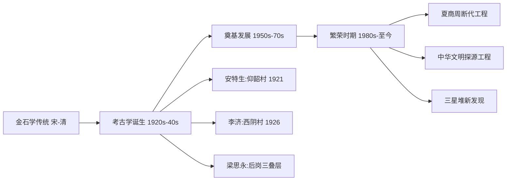

# ChineseArchaeology

**中国考古学** (Chinese Archaeology)
研究中国境内人类活动遗存。
自 20 世纪初产生以来成就卓著。

## 中国考古学简史

### 金石学

宋代吕大临《考古图》(1092)。
清代金石学鼎盛。
王国维"二重证据法":
地下材料与纸上互证。

### 诞生 (1920s–1940s)

安特森 1921 仰韶村发掘。
李济 1926 西阴村首次中国学者主持。
梁思永后岗三叠层地层学突破。
殷墟 1928-1937 十五次发掘。

### 新中国考古 (1950–至今)

国家主导配合基建。
社科院考古所体系。
苏秉琦区系类型理论。
夏鼐碳-14 引进。

## 中国旧石器时代

西侯度 ~180 万年前最早石器。
元谋人 ~170 万年前。
蓝田人 ~115 万年前。
周口店北京人 ~50-70 万年前最重要。
山顶洞人 ~3 万年前装饰品墓葬。
特点: 小型石片石器为主。

## 中国新石器时代 (~10,000–2000 BCE)

### 主要文化

仰韶 (~5000-3000 BCE): 彩陶发达。
红山 (~4500-3000 BCE): 玉龙女神庙。
良渚 (~3300-2300 BCE): 玉琮水利。
龙山 (~3000-2000 BCE): 蛋壳黑陶。
石峁 (~2300-1900 BCE): 巨型石城。

### 革命性变化

粟驯化北方。稻驯化长江流域。
定居农业手工业分化。
社会复杂化: 平等→等级→国家。

## 夏商周考古

二里头 ~1900-1500 BCE 可能夏都。
商: 殷墟甲骨文妇好墓后母戊鼎。
三星堆青铜面具神树蜀文明。
周: 周原青铜器窖藏。
曾侯乙墓编钟战国音乐。
秦公一号大墓。

## 秦汉至宋元

秦: 兵马俑长城直道。
汉: 马王堆辛追夫人满城金缕玉衣。
海昏侯墓大量金饼竹简。
唐: 长安城里坊法门寺地宫。
宋元: 南海一号泉州湾沉船。

## 中国考古特点

历史考古学证经补史。
大规模配合基建。
多学科: 碳十四古 DNA 同位素遥感。
探源工程: 古文化→古城→古国→国家。

## 相关领域

- [[ArchaeologicalTheory|考古学理论]]
- [[WorldArchaeology|世界考古]]
- [[../AncientHistory|古代史]]
- [[../CulturalHistory|文化史]]

---

- [[../../../INDEX|当前目录索引]]
