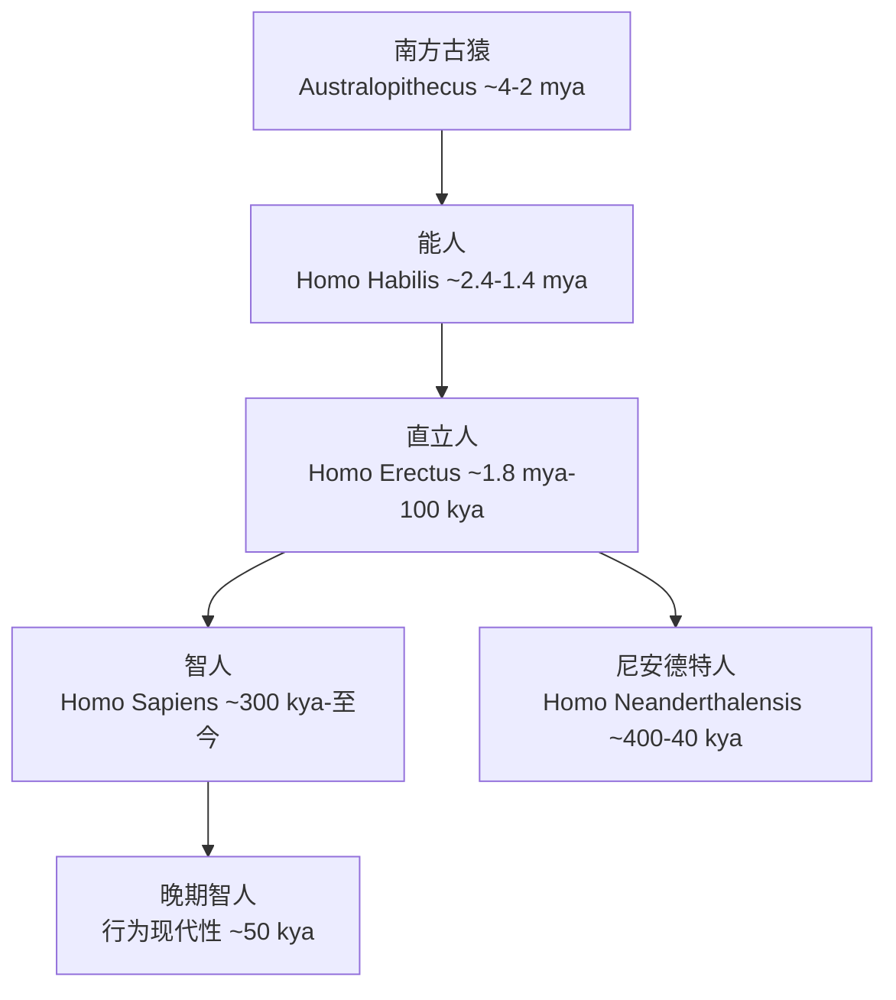

# 世界考古学

## 概述

世界考古学（World Archaeology）
是从全球视角研究人类历史的学科。
关注从最早的人类起源（Human Origins）
到历史时期文明发展（Civilization Development）
的全过程。

考古学通过分析物质文化遗存
（Material Culture Remains）。
人工制品（Artifacts）。
遗迹（Features）。
生态遗存（Ecofacts）。
遗址（Sites）。
重建过去的人类行为、社会结构、
经济模式与意识形态。

世界考古学的核心问题包括：
人类在何时何地起源？
农业革命（Agricultural Revolution）
如何改变人类社会？
早期文明（Early Civilizations）
为何在特定区域兴起并衰落？
文化交流（Cultural Exchange）
与技术传播（Technological Diffusion）
如何塑造历史进程？
古代文明的崩溃原因是什么？
这些问题的研究有助于理解人类社会的演变规律。

## 人类演化谱系

### 关键化石与遗址

**露西（Lucy）**
发现于埃塞俄比亚哈达尔。
距今约320万年。
属于南方古猿阿法种
（Australopithecus afarensis）。
是最著名的早期人类化石之一。
完整度约40%。
为理解人类直立行走提供了关键证据。

**能人（Homo habilis）**
最早制造石器——奥杜韦工业（Oldowan Industry）。
距今约260万年。
标志着人类开始主动改造环境。
脑容量约510~600cm³。

**直立人（Homo erectus）**
首次走出非洲（Out of Africa I）。
化石发现于印度尼西亚爪哇（Java Man）。
中国北京周口店（Peking Man）。
脑容量达到900~1100cm³。
使用阿舍利手斧。
开始控制火的使用。

**智人（Homo sapiens）的起源**
存在两种假说的长期争论：
非洲起源说（Recent African Origin / Out of Africa II）。
多地进化说（Multiregional Evolution）。

线粒体夏娃（Mitochondrial Eve）研究支持非洲起源说。
非洲人的线粒体DNA多样性最高。
表明现代人类约20万年前源于非洲。
古DNA研究表明非非洲人群含有1~4%的尼安德特人基因。
表明两个物种曾发生有限杂交（Interbreeding）。

丹尼索瓦人（Denisovans）是另一支古人类。
其基因在美拉尼西亚和澳大利亚原住民中存在。
比例可达3~5%。

### 旧石器时代文化序列

| 石器工业 | 时间范围 | 古人类 | 核心技术 | 代表性遗物 |
|---------|---------|--------|---------|-----------|
| 奥杜韦 | 2.6-1.7 mya | 能人 | 砾石直接敲击 | 砍斫器（Chopper） |
| 阿舍利 | 1.7 mya-200 kya | 直立人/早期智人 | 两面加工 | 手斧（Handaxe） |
| 莫斯特 | 300-40 kya | 尼安德特人 | 勒瓦娄哇技术 | 细长石叶 |
| 晚期旧石器 | 50-10 kya | 智人 | 细石器压制 | 骨角器、艺术 |

勒瓦娄哇技术（Levallois Technique）
是尼安德特人的标志性石器制作方法。
通过系统预制石核以控制石叶的形状和大小。

晚期旧石器时代的**行为现代性**
（Behavioral Modernity）包括：
符号性艺术表达。
复杂墓葬与仪式行为。
远距离贸易网络。
骨角器系统制作。
复合工具（装柄石器）。

### 象征行为与艺术

欧洲旧石器时代晚期洞穴艺术（Cave Art）
是早期智人认知能力的重要证据。

**拉斯科洞穴（Lascaux, ~17 kya）**
位于法国西南部多尔多涅地区。
以超过600幅动物壁画闻名。
被誉为"旧石器时代的西斯廷教堂"。
1940年被发现，1963年因保存问题关闭。

**阿尔塔米拉洞穴（Altamira, ~15 kya）**
位于西班牙北部坎塔布里亚。
野牛群壁画色彩丰富。
其艺术水平在发现之初被认为是现代人伪造。

**维伦多夫维纳斯（Venus of Willendorf, ~28 kya）**
发现于奥地利。
是早期人体雕塑的代表。
强调女性特征，可能与丰产崇拜有关。

**肖维岩洞（Chauvet Cave, ~32 kya）**
位于法国阿尔代什。
拥有目前已知最早的壁画。
其艺术技巧之高超挑战了
"艺术随认知进步线性发展"的传统观念。

## 农业起源

农业起源（Origins of Agriculture）
是"新石器时代革命"
（Neolithic Revolution, Childe 1936）的核心内容。

狩猎采集向农业定居的转变
是人类历史上最深刻的社会经济变革之一。
这一转变并非一蹴而就。
而是在数千年间逐步完成的。

### 全球农业起源中心

| 区域 | 驯化植物 | 驯化动物 | 时间（约） | 最早遗址 |
|------|---------|---------|-----------|---------|
| 近东新月沃地 | 小麦、大麦、扁豆 | 山羊、绵羊、牛 | 9500 BCE | 杰里科 |
| 中国北方 | 粟、黍 | 猪、狗 | 9000 BCE | 磁山、兴隆沟 |
| 中国长江流域 | 水稻（Oryza sativa） | 水牛 | 8000 BCE | 河姆渡、彭头山 |
| 中美洲 | 玉米、菜豆、南瓜 | 火鸡 | 5000 BCE | 特瓦坎谷地 |
| 安第斯地区 | 土豆、藜麦、木薯 | 羊驼、豚鼠 | 5000 BCE | 古比托 |
| 西非 | 高粱、珍珠粟 | 几内亚禽 | 3000 BCE |  |
| 新几内亚 | 芋头、香蕉 | 无 | 7000 BCE | 库克沼泽 |

### 农业起源的理论解释

$$ \text{农业转变} \approx f(\text{人口压力}, \text{气候波动}, \text{资源分布}, \text{社会复杂性}) $$

**Childe的绿洲理论（Oasis Theory）**
更新世末期气候干旱迫使人与动物集中在水源附近。
促成了驯化关系的建立。

**Braidwood的丘陵侧翼假说（Hilly Flanks）**
强调自然条件优越区域的"实验"过程。
近东的"fertile crescent"是天然起源中心。

**Flannery的系统理论（Systems Theory）**
将驯化视为人口-资源-技术系统内部反馈的结果。
人口增长加大了对资源的压力。
促使人类尝试更集约的生产方式。

**Binford的边缘地带理论（Edge Zone Theory）**
人口增长迫使群体向边缘地带迁移。
边缘地带的资源压力促成了农业尝试。

农业起源导致一系列连锁反应：
定居生活（Sedentism）。
人口密度增加。
劳动分工（Division of Labor）。
私有财产产生。
社会分层（Social Stratification）。
城邦与国家的出现。

### 杰里科与恰塔霍裕克

**杰里科（Jericho, ~9000 BCE）**
位于约旦河西岸。
已知最早的有城墙定居点。
拥有世界上最早的防御性城墙和石塔。
城墙高约4米，石塔高约8米。
居住面积约4公顷，人口约1000~2000人。

**恰塔霍裕克（Çatalhöyük, ~7000 BCE, 土耳其）**
迄今发现最大的新石器时代聚落之一。
面积约13公顷。
房屋密集排列、屋顶出入。
房屋之间没有街道。
壁画和公牛崇拜反映了复杂的社会信仰体系。
人口约5000~8000人。

## 文明与国家起源

Childe提出城市革命（Urban Revolution）的十项标准：
大型定居点。
剩余产品（Surplus）。
纪念性公共建筑（Monumental Architecture）。
社会阶级的出现。
文字（Writing）系统。
历法（Calendar）。
专业化手工业。
远距离贸易。
国家组织（State Organization）。
宗教精英阶层。

Wright进一步区分了酋邦（Chiefdom）与国家（State）。
国家拥有合法的武力垄断权。
金字塔式的官僚体系。
强制性的税收制度。

### 早期文明对比

| 文明 | 时期 | 核心区域 | 文字系统 | 标志性建筑 | 政治特征 |
|------|------|---------|---------|-----------|---------|
| 美索不达米亚 | 3500-539 BCE | 两河流域 | 楔形文字 | 金字形神塔 | 城邦→帝国 |
| 古埃及 | 3100-332 BCE | 尼罗河流域 | 象形文字 | 金字塔 | 法老中央集权 |
| 印度河文明 | 2600-1900 BCE | 印度河流域 | 印章文字（未破译） | 规划城市布局 | 未知 |
| 中国夏商 | 2070-1046 BCE | 黄河流域 | 甲骨文 | 宫殿、青铜礼器 | 世袭王朝 |
| 米诺斯文明 | 2700-1200 BCE | 克里特岛 | 线形文字A | 克诺索斯宫殿 | 海洋商业文明 |
| 奥尔梅克 | 1400-400 BCE | 墨西哥湾沿岸 | 未破译 | 巨石头像 | 酋邦/早期国家 |

## 主要考古区域概述

**欧洲**
巨石阵（Stonehenge, ~2500 BCE）是史前天文观测和仪式中心。
凯尔特文明的哈尔施塔特文化（~800-450 BCE）。
拉泰纳文化（~450-50 BCE）代表铁器时代社会复杂化。
西欧的Megalithic墓葬传统可追溯至5000 BCE。

**美洲**
克洛维斯文化（Clovis Culture, ~11500 BCE）。
卡霍基亚（Cahokia）是密西西比河流域最大的史前城市。
特奥蒂瓦坎（Teotihuacan）和蒂卡尔（Tikal）是古典玛雅文明的中心。
印加帝国是前哥伦布时期美洲最大的帝国。

**非洲**
大津巴布韦（Great Zimbabwe, 1100-1450 CE）。
撒哈拉以南非洲最宏伟的史前建筑之一。
斯瓦希里海岸城邦见证印度洋贸易网络的繁荣。
阿克苏姆帝国（Ethiopia）是非洲早期基督教文明的代表。

**大洋洲**
拉皮塔文化（Lapita, ~1500-500 BCE）以印纹陶器著称。
复活节岛（Rapa Nui）的摩艾石像（Moai）。
澳大利亚原住民有5万年定居史。
波利尼西亚人通过独木舟完成了太平洋殖民。

## 考古学方法与当代挑战

**技术方法**
水下考古（Underwater Archaeology）发掘了乌鲁布伦沉船（~1300 BCE）。
LiDAR遥感技术探测了被丛林覆盖的玛雅城市。
冰人奥茨（Ötzi the Iceman, ~3300 BCE）提供了完整信息。
稳定同位素分析可以重建古代的饮食结构与迁徙模式。
古DNA（aDNA）技术彻底改变了对人群迁徙和基因交流的认识。

**法律与伦理**
文物返还（Repatriation）是当代核心议题。
埃尔金石雕（Elgin Marbles）归属争议（大英博物馆vs希腊）。
贝宁青铜器（Benin Bronzes）返还诉求（尼日利亚要求归还）。
美国的NAGPRA法案（1990）赋予原住民对祖先遗骸和文物的权利。
盗墓和非法文物贸易对考古遗产破坏严重。

## 相关领域

- [[ArchaeologicalTheory|考古学理论]]
- [[ChineseArchaeology|中国考古]]
- [[../AncientHistory|古代史]]
- [[../CulturalHistory|文化史]]
- [[Bioarchaeology]]
- [[Paleoanthropology]]
