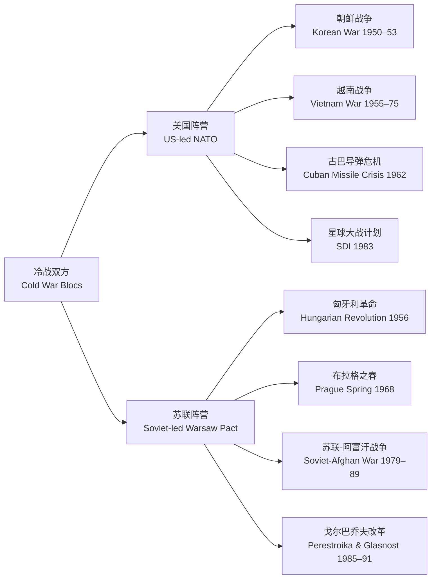

---
aliases:
  - Contemporary History
  - 当代史
  - 战后史
tags:
created: 2026-05-17
updated: 2026-05-17
  - History
  - ContemporaryHistory
  - ColdWar
  - Globalization
  - ModernWorld
---

# 当代史（Contemporary History）

当代史（Contemporary History）通常指 1945 年第二次世界大战结束至今的历史时期。这一时期的标志性主题包括：冷战（Cold War）的两极对峙、去殖民化（Decolonization）与新独立国家的涌现、全球化（Globalization）的经济整合、科技革命（Technological Revolution）对人类社会关系的全方位重塑、以及气候变化等全球性挑战的浮现。理解当代史的特殊性在于——我们既是这段历史的观察者，也是其参与者，历史距离的缺失既增加了分析的难度，也赋予了研究以直接的时代相关性。当代史学者面临的核心方法问题是如何在缺乏档案公开和事后视角的情况下做出有深度的历史判断。

## 冷战（Cold War, 1947–1991）

### 起源与制度形成

第二次世界大战结束后不久，战时盟友美苏之间的战略分歧迅速演变为全球性的制度竞争和政治对峙。冷战不仅是一场军事对峙，更是两种意识形态——自由民主资本主义与共产主义——之间关于"如何组织人类生活"的全面竞赛。

关键转折节点如下：

- **雅尔塔会议（Yalta Conference, 1945）**：美英苏三方划分战后势力范围，确定了对德分区占领和东欧的"势力边界"。雅尔塔框架实际上为战后四十年的欧洲格局奠定了基本轮廓。
- **杜鲁门主义（Truman Doctrine, 1947）**：美国承诺支持任何受到共产主义内部颠覆或外部侵略威胁的国家——标志着"遏制政策"（Containment）的正式确立，这一政策由 George Kennan 在"长电报"中理论化。
- **马歇尔计划（Marshall Plan, 1948–1951）**：美国向西欧提供约 130 亿美元的经济援助（占当时美国 GDP 的约 2%），用于战后重建和推动欧洲经济一体化——该计划不仅恢复了西欧的经济活力，而且将这些国家牢牢锚定在美国主导的制度体系和市场秩序中。
- **北约（NATO, 1949）vs. 华约（Warsaw Pact, 1955）**：两大军事同盟的正式形成使欧洲分裂为两个装备到牙齿的对峙阵营，军事分界线从波罗的海延伸至亚得里亚海。
- **柏林封锁与空运（Berlin Blockade, 1948–1949）**：第一次冷战危机——苏联封锁西柏林所有陆路通道，美国组织大规模空运在 11 个月内向西柏林运输约 230 万吨物资，成为冷战初期的标志性事件。

### 核军备竞赛（Nuclear Arms Race）

核武器的出现彻底改变了战争的性质和国际政治的运作逻辑——这是 20 世纪最重大的技术-政治事件之一。

关键里程碑：

| 时间 | 事件 | 意义 |
|------|------|------|
| 1945 年 7 月 | 美国 Trinity 核试验 | 人类首次核爆炸 |
| 1945 年 8 月 | 广岛、长崎原子弹轰炸 | 核武器的首次也是唯一一次实战使用 |
| 1949 年 8 月 | 苏联原子弹试爆（RDS-1） | 打破美国核垄断 |
| 1952 年 11 月 | 美国氢弹试验（Ivy Mike） | 热核武器时代开启 |
| 1953 年 8 月 | 苏联氢弹试验（RDS-6s） | 美苏核均势形成 |
| 1962 年 10 月 | 古巴导弹危机 | 人类最接近核战争的 13 天 |

相互确保摧毁（Mutually Assured Destruction, MAD）是冷战的核心威慑逻辑：双方均拥有在承受第一轮打击后进行毁灭性反击的"第二次打击能力"（Second-Strike Capability），任何一方发动全面核战争都等于自杀。这一看似荒谬的逻辑在四十年间维持了"核长和平"——核威慑的有效性成为国际关系理论中最被激烈争论但也最被广泛采纳的假设之一。

古巴导弹危机中的紧张程度可以量化为双方核武库的直接碰撞概率估算——事后分析显示，核战争的风险远高于当时的公开估计。危机结局：苏联撤出在古巴部署的中程弹道导弹，美国秘密撤出土耳其的 Jupiter 导弹。此次危机后，美苏建立了领导人的"热线"（Hotline, 1963）以降低误判风险，并开始了核军备控制的制度化进程。

军控条约体系：

- 部分禁止核试验条约（PTBT, 1963）——禁止大气层、外层空间和水下核试验
- 核不扩散条约（NPT, 1968）——防止核武器扩散，和平利用核能权利
- 第一阶段限制战略武器谈判（SALT I, 1972）——限制战略导弹发射器数量
- 反弹道导弹条约（ABM Treaty, 1972）——限制反导系统——维护 MAD 威慑的技术前提
- 中导条约（INF Treaty, 1987）——首次实际削减核武库——销毁中程和中短程导弹
- 第一阶段削减战略武器条约（START I, 1991）——大幅削减战略核弹头

### 冷战中的"热战"——代理人战争

朝鲜战争（1950–1953）：联合国军（主要由美国组成）vs. 中国与朝鲜。最终在三八线附近停战，朝鲜半岛分裂格局延续至今。代价约 250 万人死亡。越南战争（1955–1975）：美国深陷东南亚，最终在 1973 年撤军——这是美国历史上持续时间最长的战争（至当时），代价约 130–380 万人死亡（含平民），是美国"有限战争"理论的重大挫败。苏联-阿富汗战争（1979–1989）：十年消耗战，间接催生基地组织的兴起。

### 冷战终结

| 事件 | 时间 | 历史意义 |
|------|------|---------|
| 戈尔巴乔夫上台 | 1985 | 公开性（Glasnost）和重建（Perestroika）改革 |
| 东欧剧变 | 1989 | 波兰圆桌会议、匈牙利开放边界、柏林墙倒塌（11 月 9 日）|
| 德国统一 | 1990 | 两德正式合并——冷战在欧洲结束的象征 |
| 苏联解体 | 1991 年 12 月 | 苏联 15 国各自独立——冷战终止 |

## 去殖民化（Decolonization）

二战后全球殖民体系在民族独立运动中迅速瓦解。亚洲：印度独立（1947）——甘地非暴力不合作运动。印尼独立（1949）。非洲：万隆会议（1955）是第三世界运动的起点。1960 年"非洲年"——17 国独立。南非种族隔离制度（Apartheid, 1948–1994）——曼德拉 27 年监禁后当选总统。去殖民化至今影响国际秩序：殖民边界遗留了大量跨境民族冲突。

## 全球化与经济整合

| 制度机制 | 建立时间 | 功能 | 成员国/范围 |
|---------|---------|------|------------|
| IMF | 1944（布雷顿森林） | 货币合作与危机救助 | 190 国 |
| 世界银行 | 1944 | 战后重建与发展援助 | 189 国 |
| GATT→WTO | 1947→1995 | 多边贸易自由化与争端解决 | 164 国 |
| 欧共体→欧盟 | 1957→1993 | 欧洲经济政治一体化 | 27 国 |
| APEC | 1989 | 亚太贸易便利化 | 21 个经济体 |

尼克松冲击（1971）——美元脱离黄金——终结布雷顿森林固定汇率制。欧盟统一货币欧元（1999, 实物 2002）。

## 科技革命

| 技术突破 | 年份 | 对人类社会的结构性影响 |
|---------|------|---------------------|
| ENIAC 计算机 | 1946 | 计算自动化开端 |
| DNA 双螺旋 | 1953 | 分子生物学革命、基因工程基础 |
| ARPANET | 1969 | 互联网的前身——分布式通信网络原型 |
| 个人电脑 | 1970s–1980s | 计算能力平民化、个人生产力革命 |
| 万维网（WWW） | 1991 | 信息全球化——重塑商业、社交和知识传播 |
| 人类基因组测序 | 2003 | 精准医学、个性化治疗的基础 |
| 深度学习突破 | 2012– | AI 图像识别、自然语言处理的范式转换 |
| ChatGPT / 大语言模型 | 2022 | 生成式 AI 进入公众视野——人机交互新界面 |

## 社会变迁

民权运动——马丁·路德·金（1963）——《我有一个梦想》演讲成为 20 世纪最著名的政治演说之一；女权运动——#MeToo（2017）——全球范围内对性骚扰的系统性揭露；环保运动——从前《寂静的春天》（Rachel Carson, 1962）到巴黎气候协定（2015）；人口爆炸——25 亿（1950）→ 80 亿（2023）；中国城市化率——18%（1978）→ 66%（2023）。

### 国际组织与全球治理

| 组织 | 成立时间 | 宗旨 | 当代挑战 |
|------|---------|------|---------|
| 联合国（UN） | 1945 | 维护国际和平与安全、促进合作 | 安理会改革僵局、维和行动有效性质疑 |
| 世界卫生组织（WHO） | 1948 | 全球公共卫生治理 | COVID-19 疫情暴露的协调机制缺陷 |
| 国际刑事法院（ICC） | 2002 | 追究种族灭绝、战争罪、反人类罪 | 大国不加入、执行机制薄弱 |
| 世界贸易组织（WTO） | 1995 | 多边贸易规则与争端解决 | 争端解决机制上诉机构瘫痪、单边主义回潮 |

### 区域冲突与安全议题

当代世界的安全格局并非冷战的简单延续。后冷战时代的主要武装冲突以内战和不对称战争为主：卢旺达种族灭绝（1994）、巴尔干战争（1991–2001）、伊拉克战争（2003–2011）、叙利亚内战（2011–至今）、俄乌冲突（2014–至今全面升级为 2022 年全面战争）。恐怖主义（尤其 9/11 之后的全球反恐战争）、核扩散（朝鲜核问题、伊朗核问题）、网络战争构成了新的安全挑战光谱。

## 当代史的主要分期视角

| 分期视角 | 划分节点 | 逻辑依据 |
|---------|---------|---------|
| 冷战分期（1947–1991） | 以两极格局的形成为起点、解构为终点 | 国际政治主导叙事 |
| 长 20 世纪 | 从 1914 年一战到 1991 年苏联解体 | 以"极端的年代"（Hobsbawm）为核心框架 |
| 全球化分期 | 从 1970s 新自由主义兴起到 2008 年金融危机 | 经济整合与全球化的涨落节律 |
| 数字化分期 | 从 1991 年万维网诞生至今 | 技术革命作为社会变迁的根本驱动力 |
| 人类世（Anthropocene） | 从 1950s（大加速）至今 | 人类活动作为地质力量——超越传统史学分期 |

## 当代史的文化维度

### 大众文化与消费社会

当代史不仅是政治和经济的演变——文化转型同样深刻。战后大众文化（Mass Culture）的兴起是当代史最显著的文化现象：电视在 1950 年代进入美国家庭，到 1960 年代末覆盖率超过 90%；摇滚乐（Elvis Presley, The Beatles）成为全球青年的共同语言；好莱坞电影的全球传播与麦当劳、可口可乐一起构成了"文化全球化"的物质基础。法兰克福学派（Adorno, Horkheimer）将这一过程批判性地概括为"文化工业"（Culture Industry）——文化产品被标准化、商品化，成为社会控制的工具。

### 多元文化主义与身份政治

1960 年代以来的民权运动和移民潮推动了多元文化主义（Multiculturalism）的兴起——承认和尊重不同文化群体的独特性而非将其同化入主流文化。1990 年代以来，身份政治（Identity Politics）——基于种族、性别、性取向、宗教等身份标记的政治动员——成为当代政治中最有争议的现象之一。支持者认为它使长期被忽视的群体获得了声音，批评者认为它分裂了基于阶级的团结。

### 信息时代的知识革命

互联网和智能手机彻底改变了人类获取、生产和传播知识的方式。维基百科（2001）和搜索引擎使知识变得"免费"和"即时"，但也带来了信息过载、回音室效应（Echo Chamber）和虚假信息的挑战。社交媒体重构了公共领域的运作方式：任何事件都可以在数小时内从地方性事件演变为全球性议题——"推特外交"和"抖音政治"成为当代政治传播的新常态。

## 当代史研究的主要史学流派

当代史研究的史学方法论同样经历了重要演变：

- **社会史（Social History）转向**：从"伟大人物和重大事件"转向普通人的生活经验——E.P. Thompson《英国工人阶级的形成》（1963）是这一转向的里程碑
- **微观史（Microhistory）**：通过聚焦极端局部和边缘的个案揭示宏观结构——Carlo Ginzburg《奶酪与蛆虫》（1976）
- **全球史（Global History）**：超越民族国家的分析框架——关注跨区域联系、比较和互动——Sebastian Conrad《全球史导论》
- **口述史（Oral History）**：通过亲历者的叙述记录当代史——特别适用于书写缺少文字记录的边缘群体历史
- **数字史学（Digital History）**：利用大数据分析、文本挖掘、GIS 可视化等数字工具研究历史——尤适用于当代史因其丰富的数字档案

## 当代史的挑战性议题

当代史研究面临若干规范性问题——它们既是学术争论的对象，也是公共辩论的主题：

**历史记忆与政治**：过去的创伤如何被记忆和纪念？大屠杀记忆（Holocaust Memory）在西方形成了一套"义务性记忆"的伦理框架——"never again"成为二战后欧洲的基本道德共识。但在不同的国家和地区（如日本在亚洲的战争记忆问题、美国的联邦纪念物争论），历史记忆的选择和塑造始终是一个充满政治性的过程。Pierre Nora 的"记忆场所"（Lieux de Mémoire）概念为分析历史记忆的建构提供了重要的理论工具。

**历史终结论的兴与衰**：Francis Fukuyama 在《历史的终结与最后之人》（1992）中论证自由民主是"人类意识形态演化的终点"——这一论点在冷战结束的喜悦氛围中获得了广泛共鸣。但随后三十年的发展——中国的崛起、俄罗斯的威权化、全球民主衰退和特朗普的当选——使"历史终结论"受到了来自左右两方面的激烈质疑。这一论题从兴起到争议的过程本身就成了一段"微型思想史"。

**全球史 vs. 民族国家史**：当代史研究的一个方法论争议是：在全球化的时代，历史书写是否应当超越民族国家的分析框架？全球史学者主张跨国和跨区域的分析视角（跨境人口流动、全球商品链、国际制度）能够揭示民族国家框架所遮蔽的历史过程。批评者则认为全球史淡化甚至忽视了国家权力的持续性作用——在 2020 年代的地缘政治竞争中，国家仍然是最强有力的行为体。

## 中国当代史的关键节点

中国当代史（1949–至今）的叙述框架经历了几代学者的持续建构与争论。按主流分期可分为以下阶段：

| 时期 | 时间跨度 | 核心特征 | 关键事件 |
|------|---------|---------|---------|
| 新民主主义与过渡时期 | 1949–1956 | 政权巩固与社会主义改造 | 建国、土改、抗美援朝、一五计划 |
| 社会主义建设探索 | 1956–1966 | 大规模建设起步与政策波动 | 大跃进（1958）、困难时期（1959–1961）、调整恢复 |
| 文化大革命 | 1966–1976 | 政治运动主导的社会动荡 | 红卫兵运动、革命委员会、林彪事件（1971）|
| 改革开放 | 1978–1990s | 从计划经济向市场经济转型 | 十一届三中全会、农村改革、建立经济特区 |
| 社会主义市场经济 | 1990s–2012 | 深度融入全球经济 | 加入 WTO（2001）、国有企业改革、城市化加速 |
| 新时代 | 2012–至今 | 中国特色发展道路的全面展开 | 一带一路、脱贫攻坚、共同富裕、双循环 |

## 当代史的数字转向

数字人文（Digital Humanities）的方法正在深刻改变当代史研究的面貌。大规模数字化档案（如《人民日报》全文数据库、美国国家安全档案馆数字化文件）使研究者能够以过去无法想象的规模和时间效率检索和分析历史文本。文本挖掘（Text Mining）和主题建模（Topic Modeling）可以揭示特定概念随时间在公共话语中的升沉变化——例如，"改革"一词在《人民日报》中出现频率的年度变化与政策周期的高度相关。

数字 GIS 技术使研究者能够可视化分析人口迁移、经济网络和军事行动的空间动态。数字转向的核心承诺是：它既不是对传统史学的替代，也不是对量化方法的简单移植——而是为历史学家提供了一种"远读"（Distant Reading, Franco Moretti）的新视角——在细读单篇文献之外，获得了"俯瞰"整个文本集合的能力。

正如 Moretti 所言："细读依赖于一个经典——即那些少数值得反复阅读的文本。而远读则不需要——它旨在分析整个文学体系，而不被少数经典所束缚。"这一理念同样适用于当代史研究——在数字档案日益丰富的时代，历史学家有条件重新定义"什么是重要的历史证据"以及"什么是足够大的样本"。

当代史的数字转向不是技术决定论——技术本身不产生历史解释，但它打开了新的问题域和新的回答路径。就像年鉴学派借助计量方法打开了社会史的新维度，数字方法为当代史研究提供了从"案例"到"分布"、从"叙事"到"模式"的认知跃迁。

## 相关领域

- [[ModernHistory|近代史]]
- [[CulturalHistory|文化史]]
- [[../ChineseLanguageAndLiterature/ContemporaryChineseLiterature|当代文学]]
- [[../../INDEX|TianshangKnowledgeBase 索引]]
