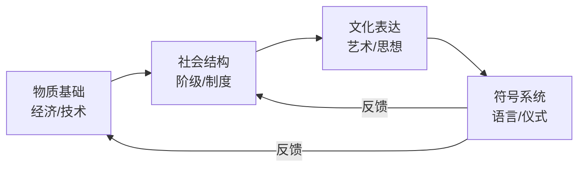
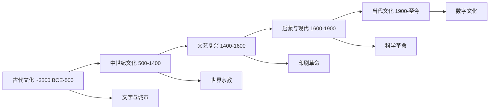
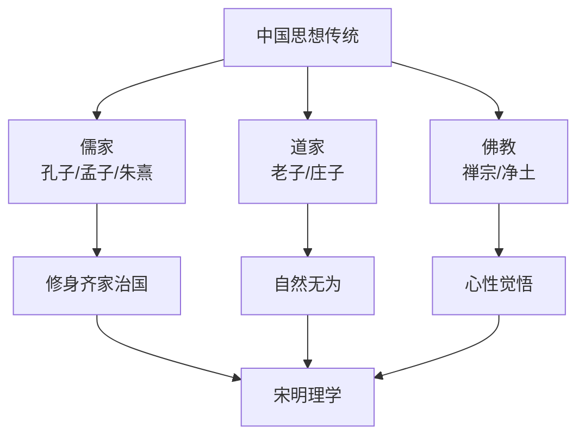

# 文化史（Cultural History）

文化史研究思想、艺术、信仰、习俗和知识传播的演变。它关注"心态"、符号系统和意义变迁，不同于政治史和经济史。文化史的视野涵盖从日常实践到高雅文化的所有人类表达。

## 一、文化史理论与方法

### 1.1 经典理论家

| 学者 | 代表作 | 核心贡献 |
|------|-------|---------|
| Jacob Burckhardt | *意大利文艺复兴时期的文化* | 文化史作为独立学科 |
| Johan Huizinga | *中世纪的衰落* | 心态史先驱 |
| Fernand Braudel | *地中海与菲利普二世时代的地中海世界* | 长时段与心态史 |
| Peter Burke | *什么是文化史* | 新文化史方法论 |
| Clifford Geertz | *文化的解释* | 深描（Thick Description） |

### 1.2 分析工具

- **象征（Symbol）**：文化意义的外在载体
- **表征（Representation）**：文化如何被呈现和建构
- **仪式（Ritual）**：集体行为中的文化表达
- **记忆（Memory）**：集体记忆与文化传承
- **文化生产（Cultural Production）**：文化产品如何被创造、流通和消费

$$ \text{文化分析: } \text{意义} = f(\text{符号}, \text{语境}, \text{权力关系}) $$

## 二、世界文化史分期

### 2.1 古代文化（~3500 BCE — 500 CE）

**文明的诞生**：文字的发明是文化史的分水岭。

| 文明 | 文字系统 | 核心文化成就 |
|------|---------|-------------|
| 美索不达米亚 | 楔形文字 | 汉谟拉比法典、吉尔伽美什史诗 |
| 古埃及 | 象形文字 | 金字塔、亡灵书 |
| 古印度 | 梵文 | 吠陀文献、奥义书 |
| 古中国 | 甲骨文/金文 | 诗经、易经、礼乐制度 |

### 2.2 轴心时代（Axial Age, ~800–200 BCE）

Karl Jaspers 提出的各大文明同时思想突破时期：

| 文明 | 核心人物 | 影响 |
|-----|---------|------|
| 古希腊 | 苏格拉底、柏拉图、亚里士多德 | 西方哲学 |
| 古以色列 | 旧约先知 | 一神教 |
| 古印度 | 佛陀、大雄（耆那教） | 轮回与非暴力 |
| 古波斯 | 琐罗亚斯德 | 善恶二元 |
| 古中国 | 孔子、老子、墨子 | 儒家、道家、墨家 |

### 2.3 中世纪文化（500–1400）

- **基督教**：修道院抄写、经院哲学、哥特建筑
- **伊斯兰**：黄金时代（8-13c）翻译运动、数学、医学、哲学
- **大学**：博洛尼亚（1088）、巴黎（1150）、牛津（1167）
- **七艺**：三艺（文法、修辞、逻辑）+ 四艺（算术、几何、音乐、天文）

### 2.4 文艺复兴（Renaissance, 1300–1600）

- **人文主义（Humanism）**：彼特拉克、伊拉斯谟、博伽丘
- **艺术**：达芬奇、米开朗基罗、拉斐尔、提香
- **印刷术**：古腾堡（1439）—— 知识革命
- **科学**：哥白尼 *天体运行论*（1543）

$$ \text{透视法: } \frac{1}{d_{\text{image}}} = \frac{1}{d_{\text{object}}} + \frac{1}{f} $$

### 2.5 早期现代（1500–1800）

**宗教改革（1517）**：
- 路德因信称义、加尔文预定论
- 反宗教改革：特利腾大公会议

**科学革命**：
- 开普勒行星定律、伽利略望远镜
- 牛顿万有引力：$$F = G\frac{m_1 m_2}{r^2}$$

**启蒙运动（Enlightenment, 1685-1815）**：
- 伏尔泰宗教宽容、卢梭社会契约论
- 康德 "Sapere aude!"（敢于认知！）
- 狄德罗 *百科全书*

**关键启蒙思想家**：

| 思想家 | 核心主张 | 代表作 |
|-------|---------|-------|
| 洛克 | 自然权利、社会契约 | *政府论* |
| 孟德斯鸠 | 三权分立 | *论法的精神* |
| 卢梭 | 人民主权 | *社会契约论* |
| 伏尔泰 | 言论自由、宗教宽容 | *哲学通信* |
| 康德 | 理性批判 | *纯粹理性批判* |

### 2.6 现代文化（1800–1945）

**浪漫主义（Romanticism）**：
- 赫尔德文化民族、格林兄弟
- 音乐：贝多芬、舒伯特、瓦格纳

**现代主义（Modernism, 1890-1945）**：
- 文学：乔伊斯、艾略特、卡夫卡、普鲁斯特
- 绘画：毕加索（立体主义）、蒙克（表现主义）、康定斯基（抽象）
- 音乐：斯特拉文斯基、勋伯格
- 建筑：包豪斯、柯布西耶
- 电影：格里菲斯、爱森斯坦

### 2.7 当代文化（1945–至今）

- **文化全球化**：好莱坞、麦当劳、流行音乐、K-pop
- **数字文化**：互联网、社交媒体、流媒体、短视频
- **后现代主义**：德里达（解构）、福柯（权力）、利奥塔（宏大叙事终结）
- **文化多元化**：女性主义批评、后殖民理论、LGBTQ+ 文化

## 三、中国文化史

### 3.1 礼乐文明

$$ \text{礼: 社会规范} \quad \text{乐: 情感教化} \quad \text{礼乐相济} $$

### 3.2 儒释道三教合流

### 3.3 科举制度与文人阶层

- 形成于隋唐，完善于宋，终结于清（1905）
- 文人阶层：士大夫文化、书画、园林
- 四艺：琴、棋、书、画
- 文房四宝：笔、墨、纸、砚

### 3.4 东西交流

- **丝绸之路**：汉代张骞通西域，唐代丝绸之路鼎盛
- **佛教东传**：汉代传入，唐代玄奘取经，宋代禅宗兴盛
- **西学东渐**：明末利玛窦，晚清洋务运动
- **中学西传**：伏尔泰推崇儒家理性，欧洲启蒙思想家借鉴中国制度

## 四、关键概念辨析

| 概念 | 定义 | 与相关概念的区别 |
|------|------|-----------------|
| 文化（Culture） | 共享的意义系统 | 区别于文明（Civilization）= 技术进步 |
| 意识形态（Ideology） | 系统化的信念体系 | 区别于文化（更广）|
| 霸权（Hegemony） | 领导权/文化支配 | 区别于直接权力（Gramsci）|
| 文化资本（Cultural Capital） | 知识/品味作为社会资源 | 区别于经济资本（Bourdieu）|

## 参考资源

- Burke, P. (2008). *What is Cultural History?* (2nd ed.). Polity.
- Burckhardt, J. (1860). *The Civilization of the Renaissance in Italy*.
- Huizinga, J. (1919). *The Autumn of the Middle Ages*.
- Jaspers, K. (1949). *The Origin and Goal of History*.
- Said, E. (1978). *Orientalism*.

## 相关领域

- [[AncientHistory|古代史]]
- [[MedievalHistory|中世纪史]]
- [[ModernHistory|近代史]]
- [[ContemporaryHistory|当代史]]

---

- [[../../INDEX|当前目录索引]]
