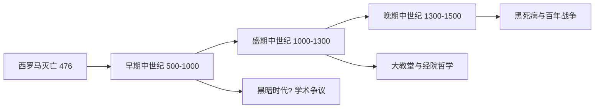

# MedievalHistory

**中世纪史** (Medieval History)
约 5 世纪至 15 世纪之间的历史。
"中世纪"由文艺复兴人文主义者首创。
分为早期、盛期和晚期三个阶段。

## 中世纪的划分

## 早期中世纪 (500–1000)

### 欧洲转型

日耳曼诸王国: 法兰克、西哥特、东哥特。
克洛维一世皈依基督教。
修道院圣本尼迪克特 *会规*。
爱尔兰-苏格兰福音书插画。

### 拜占庭帝国 (330–1453)

查士丁尼大帝 (527-565):
*查士丁尼法典* 圣索菲亚大教堂。
军区制改革。马其顿文艺复兴。
1054 年大分裂: 天主教与东正教。

### 伊斯兰文明

穆罕默德 622 年迁徙麦地那。
阿拉伯帝国: 倭马亚→阿拔斯。
巴格达智慧宫保存希腊科学。
伊本·西那 *医典*。
花拉子米代数。海什木光学。

### 加洛林帝国 (751–888)

查理曼大帝 800 年称帝。
加洛林文艺复兴: 宫廷学校。
凡尔登条约 (843) 帝国三分。
法兰西、德意志、意大利雏形。

### 维京时代 (793–1066)

北欧扩张袭击贸易殖民。
发现冰岛格陵兰文兰。
基辅罗斯留里克王朝。
诺曼征服英格兰 (1066)。

## 盛期中世纪 (1000–1300)

### 封建制度

国王→大领主→领主→骑士→农奴。
封君-封臣关系。
庄园制自给自足。
骑士制度: 军事+礼仪+基督教。

### 教会与教皇

格里高利改革反对圣职买卖。
叙任权之争教皇 vs 皇帝。
十字军东征 (1096-1291) 八次。
托钵僧团: 方济各会、多明我会。

### 中世纪大学

经院哲学:
阿伯拉尔辩证方法。
阿奎那 *神学大全*。
奥卡姆剃刀 "如无必要勿增实体"。

### 建筑

罗马式: 厚墙圆拱小窗。
哥特式: 尖拱飞扶壁玫瑰窗。
巴黎圣母院、沙特尔、科隆。

## 晚期中世纪 (1300–1500)

大饥荒 (1315-1317) 气候恶化。
黑死病 (1347-1351):
人口减少 30-60%。
农奴制衰退。
百年战争 (1337-1453) 英法冲突。
圣女贞德 (1412-1431) 民族觉醒。
教会大分裂 (1378-1417)。

晚期文学:
但丁 *神曲*(1321)。
乔叟 *坎特伯雷故事集*(~1400)。
维庸法国抒情诗。

## 非欧洲中世纪

蒙古帝国 (1206-1368):
成吉思汗最大连续帝国。
Pax Mongolica 丝路复兴。
元朝马可波罗。
中古中国: 隋唐科举、宋代理学。
马里帝国曼萨·穆萨 (~1324 朝圣)。
玛雅、阿兹特克与印加文明。

## 相关领域

- [[AncientHistory|古代史]]
- [[ModernHistory|近代史]]
- [[CulturalHistory|文化史]]
- [[Archaeology/WorldArchaeology|世界考古]]

---

- [[../../INDEX|当前目录索引]]
