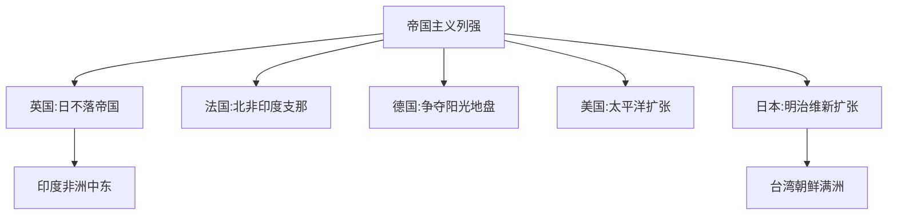

# ModernHistory

**近代史** (Modern History)
约 1500 年至 1945 年之间的历史。
地理大发现、科学革命、启蒙运动、
工业革命、民族国家、帝国主义和世界大战。

## 近代早期 (1492–1789)

### 地理大发现 (1492–1600)

哥伦布 1492 年抵达美洲。
达伽马 1498 年到印度。
麦哲伦 1519-1522 年环球航行。
阿兹特克 (1521) 和印加 (1533) 灭亡。
三角贸易: 奴隶枪炮糖。

### 宗教改革 (1517–1648)

马丁·路德 *九十五条论纲*(1517)。
因信称义。
加尔文预定论与日内瓦。
英国国教 *至尊法案*(1534)。
三十年战争 (1618-1648):
*威斯特伐利亚和约* 主权国家。

### 绝对主义与启蒙 (1600–1789)

路易十四凡尔赛宫 "朕即国家"。
英国内战与光荣革命 *权利法案*。

科学革命:
哥白尼 *天体运行论*(1543)。
伽利略实验。牛顿 *原理*(1687)。
培根经验主义。笛卡尔理性主义。

启蒙:
伏尔泰宗教宽容。卢梭社会契约。
孟德斯鸠三权分立。
狄德罗 *百科全书*。
康德 "Sapere aude!"。
亚当·斯密 *国富论*。

$$ \text{"Sapere Aude!" — 康德} $$

## 革命时代 (1776–1848)

美国革命 (1775-1783):
*独立宣言*(1776) 人人生而平等。

法国大革命 (1789-1799):
攻占巴士底狱 *人权宣言*。
雅各宾恐怖统治。
拿破仑雾月政变 *拿破仑法典*。

拿破仑时代:
1812 年征俄失败。
1815 年滑铁卢维也纳体系。

拉美独立:
玻利瓦尔、圣马丁。

## 工业革命

第一次 (1760-1840):
蒸汽机纺织铁路。
城市化工厂制度工人阶级。
自由主义 马克思主义 *共产党宣言*(1848)。

第二次 (1870-1914):
电力内燃机流水线。
垄断资本主义卡特尔。

## 帝国主义 (1870–1914)

柏林会议 (1884-1885) 瓜分非洲。
中国: 鸦片战争→甲午→八国联军。
日本明治维新 (1868) 脱亚入欧。

## 20 世纪危机

### 一战 (1914–1918)

萨拉热窝事件。
同盟国 vs 协约国。
堑壕战: 凡尔登索姆河。
坦克毒气飞机潜艇。
约 2000 万人死亡。

### 两战之间 (1919–1939)

凡尔赛条约严惩德国。
俄国革命 1917→苏联 1922。
大萧条 (1929) 全球危机。
法西斯: 墨索里尼、希特勒纳粹。
西班牙内战 (1936-1939)。

### 二战 (1939–1945)

欧洲: 波兰→法国沦陷→巴巴罗萨。
太平洋: 珍珠港→中途岛→广岛长崎。
大屠杀 (Holocaust) 600 万犹太人。
超 7000 万人死亡。
联合国建立。冷战开始。

## 近代思想史

自由主义: 洛克→密尔→罗尔斯。
民族主义: 赫尔德→马志尼。
社会主义: 马克思→列宁→毛泽东。
存在主义: 尼采→海德格尔→萨特。
进化论: 达尔文 *物种起源*(1859)。

"一切固定的东西都烟消云散了。"

## 相关领域

- [[AncientHistory|古代史]]
- [[MedievalHistory|中世纪史]]
- [[ContemporaryHistory|当代史]]
- [[CulturalHistory|文化史]]

---

- [[../../INDEX|当前目录索引]]
