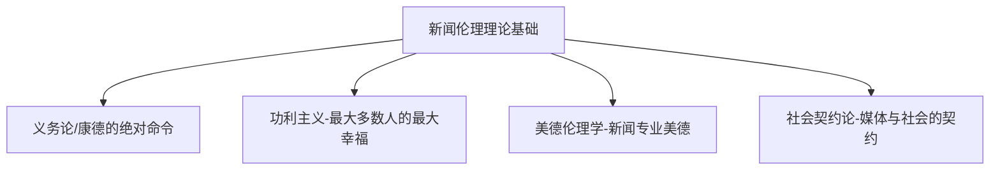
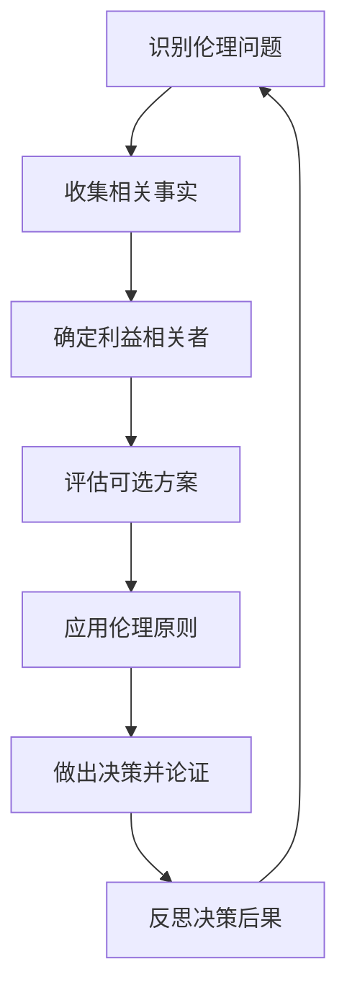

# 新闻伦理学 (Journalism Ethics)

## 一、新闻伦理学概述

### 1.1 定义与研究范围

新闻伦理学（Journalism Ethics / Media Ethics）是研究新闻传播活动中的道德原则、规范和职业道德问题的学科。它探讨新闻从业者在信息采集、制作和传播过程中应遵循的价值标准和行为准则，涉及新闻真实、客观公正、保护隐私、公共利益和社会责任等核心议题。

### 1.2 核心问题

| 核心问题 | 具体内容 |
|---------|----------|
| 真实性（Truthfulness） | 如何在时效压力下确保信息的准确和全面 |
| 客观性（Objectivity） | 新闻能否做到完全客观——事实与观点的分离 |
| 隐私权（Privacy） | 公众知情权与个人隐私权的边界在哪里 |
| 伤害避免（Minimizing Harm） | 报道可能造成伤害时如何权衡 |
| 利益冲突（Conflict of Interest） | 如何避免商业利益、政治立场影响新闻判断 |
| 社会责任（Social Responsibility） | 媒体的社会角色和责任是什么 |

### 1.3 理论基础



### 1.4 伦理决策的公式化框架

新闻伦理决策需要在多个原则之间权衡：

$$
\text{伦理决策} = \frac{\text{公共利益}}{\text{潜在伤害}} \times \text{行为正当性}
$$

## 二、新闻伦理的基本原则

### 2.1 真实性原则

真实性（Truthfulness / Accuracy）是新闻伦理的首要原则：

| 层面 | 要求 |
|------|------|
| 事实核查 | 核实关键信息、数据和来源 |
| 多方信源 | 采访多方当事人和专家 |
| 语境完整 | 不曲解、不断章取义 |
| 及时更正 | 发现错误后立即公开更正 |

**虚假新闻**（Fake News）的治理：误传（Misinformation）是无意传播的错误信息；恶意误导（Disinformation）是有意编造的虚假信息；恶意信息（Malinformation）是基于真实信息的恶意传播。

### 2.2 客观性原则

客观性（Objectivity）要求新闻从业者以中立、公正的态度报道事实。要素包括事实与观点分离、平衡报道、中立语言和透明方法。

**对客观性的批判**：完全客观难以实现，新闻选择本身包含价值判断。平衡报道可能造成"虚假平衡"（False Balance），即为了表面公平而给予边缘观点不适当的权重。

### 2.3 最小伤害原则

最小伤害原则（Minimizing Harm）要求新闻报道在追求公共利益的同时尽可能减少伤害：

| 情境 | 伦理考量 |
|------|----------|
| 灾难报道 | 尊重遇难者尊严，避免过度展示血腥画面 |
| 犯罪报道 | 保护受害者隐私，谨慎报道嫌疑人身份 |
| 未成年人报道 | 特殊保护，匿名处理 |
| 自杀报道 | 避免详细描述方式，不渲染 |
| 少数群体报道 | 避免强化刻板印象和偏见 |

### 2.4 问责与透明原则

问责（Accountability）和透明（Transparency）要求公开更正和道歉、说明新闻采编过程、公开所有权和利益关系、接受公众监督。

## 三、新闻伦理的困境

### 3.1 隐私权 vs 公众知情权

隐私权与公众知情权的冲突是新闻伦理中的经典困境：

$$
\text{是否应当报道} = \frac{\text{公共利益的强度}}{\text{隐私侵犯的程度}}
$$

考量因素：公众人物的隐私权范围比普通人小、信息是否为公共利益所必需、是否通过正当手段获取。

### 3.2 利益冲突

利益冲突（Conflict of Interest）的类型：

| 利益类型 | 表现 |
|---------|------|
| 经济利益 | 持有被报道公司的股票、收受礼品 |
| 政治利益 | 政党归属影响报道倾向 |
| 社会关系 | 亲属或朋友在被报道事件中 |
| 广告压力 | 广告主对报道内容的影响 |
| 组织利益 | 媒体自身利益与新闻判断的冲突 |

### 3.3 隐性采访的伦理边界

隐性采访（Undercover Reporting）的正当性条件：

- **必要性**：信息关系重大公共利益
- **最后手段**：无其他合法方式获取
- **相称性**：手段损害与信息价值平衡

### 3.4 战争与冲突报道

战时新闻伦理的核心原则：人道主义、准确核实、避免煽动、保护来源。战争报道还面临是否展示暴力画面的困境——展示真相的义务与避免伤害的责任之间的张力。

## 四、新闻职业道德规范

### 4.1 国际新闻职业道德准则

| 组织 | 准则名称 | 核心内容 |
|------|----------|----------|
| 国际记者联合会 | 记者行为宣言 | 尊重事实、保护来源、反对审查 |
| 美国职业记者协会 | SPJ 伦理准则 | 寻求真相、最小伤害、独立负责、透明问责 |
| 英国全国记者工会 | NUJ 行为准则 | 准确公正、更正错误 |

### 4.2 伦理决策方法

波特尔方格（Potter's Box）是新闻伦理决策的实用工具：

```
事实陈述 → 阐明价值观 → 应用伦理原则 → 确定忠诚归属
```

## 五、数字时代的新闻伦理

### 5.1 社交媒体时代的挑战

| 挑战 | 伦理问题 |
|------|----------|
| 信息茧房（Filter Bubble） | 算法推荐导致信息来源单一 |
| 后真相（Post-Truth） | 情感和信念比事实更能影响舆论 |
| 公民记者（Citizen Journalist） | 未经专业培训的传播者缺乏伦理约束 |
| 深度伪造（Deepfake） | AI 生成的虚假视频难以辨别 |
| 回音室效应（Echo Chamber） | 强化既有偏见和极端化 |

### 5.2 算法伦理

算法推荐在新闻传播中的伦理问题：算法偏见、点击量导向、过滤气泡、操纵风险。解决路径包括算法透明、人工把关、多样性推荐和用户自主选择权。

### 5.3 AI 与新闻伦理

人工智能在新闻业的应用引发新的伦理议题：

| AI 应用 | 伦理风险 |
|--------|---------|
| 自动写作 | 缺乏人文关怀和深度理解 |
| 个性化推荐 | 加剧信息茧房和社会极化 |
| 事实核查 | 算法偏见和误判风险 |
| 内容审核 | 言论自由与有害内容的平衡 |

## 六、中国新闻伦理实践

### 6.1 舆论监督

舆论监督（Supervision by Public Opinion）是中国新闻事业的重要职能。媒体通过报道揭示社会问题，推动政府改进工作。舆论监督与正面宣传相统一是基本原则。

### 6.2 新闻工作者职业道德准则

中国新闻工作者职业道德准则要点：
1. 全心全意为人民服务
2. 坚持正确舆论导向
3. 坚持新闻真实性原则
4. 发扬优良作风
5. 遵纪守法
6. 促进国际新闻交流与合作

### 6.3 新闻伦理失范案例

常见类型包括：虚假报道、有偿新闻、侵犯隐私、新闻敲诈、低俗报道、媒介审判等。这些失范行为损害新闻公信力，需要制度建设和职业自律来预防。

## 七、新闻伦理研究前沿

### 7.1 核心争议

| 争议议题 | 立场一 | 立场二 |
|---------|--------|--------|
| 匿名来源 | 为保护线人必须匿名 | 鼓励匿名可能降低可信度 |
| 付费采访 | 补偿线人的时间成本 | 可能歪曲信息来源的动机 |
| 嵌入式报道 | 深入了解军事行动 | 丧失独立性和客观性 |
| 公民新闻 | 扩大信息来源和视角 | 缺乏专业训练和伦理约束 |
| 新闻倡导 | 媒体应服务公共利益 | 记者应保持中立观察者角色 |

### 7.2 新闻伦理教育的必要性

新闻伦理教育帮助未来新闻从业者建立专业认同、培养伦理思辨能力、面对伦理困境做出明智判断、维护新闻行业公信力。

案例教学法（Case Study）是新闻伦理教育中最有效的方法：



### 7.3 跨文化新闻伦理

全球化背景下，不同文化传统的新闻伦理存在差异：
- 西方传统强调个人自由和知情权
- 亚洲传统注重社会和谐和集体利益
- 伊斯兰传统强调宗教道德规范
- 跨国报道需要文化敏感性和伦理共识

## 八、中国新闻伦理的未来方向

- **技术伦理**：AI 新闻、自动化报道中的伦理规范
- **全球伦理**：跨国新闻报道中文化差异与伦理共识
- **环境伦理**：气候变化报道的责任和框架
- **参与式伦理**：受众参与新闻生产过程中的伦理规范
- **数据伦理**：大数据新闻中的数据隐私和使用边界
- **建设性新闻**（Constructive Journalism）：关注积极解决方案的新闻范式

## 相关条目

- [[CommunicationTheory]]
- [[03_HumanitiesAndSocialSciences/JournalismAndCommunication/DigitalMedia/INDEX|DigitalMedia]]
- [[03_HumanitiesAndSocialSciences/JournalismAndCommunication/MediaStudies/INDEX|MediaStudies]]
- [[PoliticalEconomy]]
- [[INDEX|当前目录索引]]
