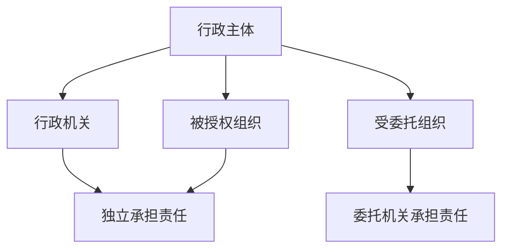
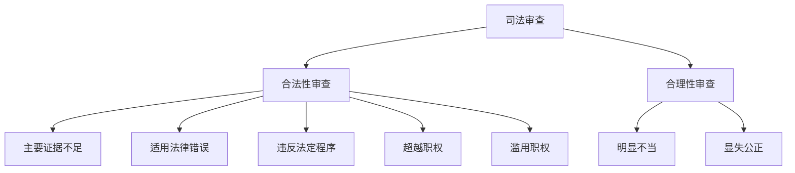

---
aliases:
  - 行政法
  - Administrative Law
  - 行政法学
  - 公法
  - Public Law
tags:
  - law
  - administrative-law
  - public-law
  - regulation
  - judicial-review
  - governance
---

# 行政法 (Administrative Law)

行政法 (Administrative Law) 是调整行政机关在行使行政权力过程中与行政相对人之间关系的法律规范总称。行政法是公法 (Public Law) 的核心组成部分，规范行政权力的设定、行使、监督与救济。

## 行政法的理论基础 (Theoretical Foundations)

### 依法行政原则 (Rule of Law in Administration)

依法行政是行政法的首要原则，要求行政机关的一切行为必须有法律依据，并受法律约束。该原则包含两层含义：

1. **法律优先 (Primacy of Law)**：行政活动不得与现行法律相抵触
2. **法律保留 (Reservation of Law)**：特定重要事项须由立法机关以法律规定，行政机关不得自行设定

### 比例原则 (Principle of Proportionality)

比例原则要求行政行为的作出应符合以下三个子原则：

$$
P = P_s \cap P_n \cap P_p
$$

其中 $P_s$ 为适当性 (Suitability)，$P_n$ 为必要性 (Necessity)，$P_p$ 为狭义比例性 (Proportionality in the strict sense)。行政机关采取的措施须有助于目的达成、在多种手段中选择对相对人损害最小的、且所追求的利益大于造成的损害。

### 信赖保护原则 (Protection of Legitimate Expectations)

行政机关作出的行政行为一经生效，非因法定事由并经法定程序不得撤销或变更。因公共利益需要撤销或变更的，应补偿相对人因此受到的信赖利益损失。

## 行政主体 (Administrative Subjects)

### 行政机关 (Administrative Organs)

行政机关是国家依法设立、行使国家行政职权的组织，包括：

| 行政机关类型 | 举例 | 职权范围 |
| :--- | :--- | :--- |
| 中央行政机关 | 国务院及其组成部门 | 全国性行政管理 |
| 地方行政机关 | 省、市、县级人民政府 | 本行政区域内行政管理 |
| 派出机关 | 行政公署、区公所、街道办事处 | 特定区域行政管理 |
| 派出机构 | 派出所、税务所、工商所 | 委托范围内执法 |

### 被授权组织与受委托组织 (Authorized and Delegated Organizations)

被授权组织 (Authorized Organization) 依法律、法规授权取得行政主体资格，独立承担法律责任。受委托组织 (Delegated Organization) 在行政机关委托范围内以委托机关名义行使职权，由委托机关承担责任。

## 行政行为 (Administrative Acts)

### 行政行为的分类 (Classification of Administrative Acts)

行政行为依不同标准可作多种分类：

1. **依职权与依申请行政行为**：前者由行政机关主动作出，后者须相对人申请
2. **抽象与具体行政行为**：抽象行政行为针对不特定对象（如制定规章），具体行政行为针对特定对象（如行政处罚）
3. **羁束与裁量行政行为**：羁束行为法律要件与效果均已确定，裁量行为行政机关有一定判断空间
4. **授益与负担行政行为**：授益行为赋予相对人利益，负担行为课以义务或限制权利

### 行政许可 (Administrative Licensing)

行政许可是行政机关根据公民、法人或其他组织的申请，经依法审查，准予其从事特定活动的行为。行政许可遵循以下原则：合法原则、公开公平公正原则、便民原则、救济原则、信赖保护原则、监督原则。

| 许可类型 | 适用情形 | 程序特点 |
| :--- | :--- | :--- |
| 普通许可 | 直接关系安全的事项 | 一般程序 |
| 特许 | 有限自然资源开发 | 招标、拍卖 |
| 认可 | 资格资质认定 | 考试、考核 |
| 核准 | 技术标准审定 | 检验、检测 |
| 登记 | 主体资格确立 | 形式审查 |

### 行政处罚 (Administrative Penalty)

行政处罚是行政机关对违反行政管理秩序的公民、法人或其他组织给予行政制裁的行为。处罚种类包括：警告、通报批评、罚款、没收违法所得与非法财物、暂扣或吊销许可证件、降低资质等级、限制开展生产经营活动、责令停产停业、责令关闭、限制从业、行政拘留。

行政处罚的适用规则：

$$
P = P_{base} \times (1 + A - M) \times F
$$

其中 $P$ 为最终处罚额，$P_{base}$ 为基准处罚额，$A$ 为从重处罚情节系数，$M$ 为从轻减轻处罚情节系数，$F$ 为其他调整因素。

### 行政强制 (Administrative Coercion)

行政强制包括行政强制措施 (Administrative Coercive Measures) 与行政强制执行 (Administrative Enforcement) 两类。

| 类型 | 特征 | 种类 |
| :--- | :--- | :--- |
| 行政强制措施 | 暂时性控制 | 限制人身自由、查封、扣押、冻结 |
| 行政强制执行 | 实现义务内容 | 加处罚款或滞纳金、划拨、拍卖、排除妨碍 |

## 行政程序 (Administrative Procedure)

### 正当程序原则 (Due Process)

正当程序原则要求行政机关在作出影响相对人权益的决定时，应遵循最低限度的程序公正标准：回避、听取陈述申辩、说明理由、告知救济途径。

### 行政程序的基本制度 (Basic Administrative Procedures)

- **听证制度 (Hearing)**：在作出重大行政决定前，公开听取利害关系人意见
- **信息公开制度 (Information Disclosure)**：行政机关应主动或依申请公开政府信息
- **说明理由制度 (Reason-giving)**：行政决定应说明事实依据、法律依据与裁量理由
- **时效制度 (Time Limits)**：行政机关应在法定期限内作出决定

## 行政复议 (Administrative Reconsideration)

行政复议是公民、法人或其他组织认为行政行为侵犯其合法权益，向法定行政机关提出申请，由复议机关对该行政行为进行审查并作出决定的制度。

### 行政复议的范围与管辖 (Scope and Jurisdiction)

| 被申请人 | 复议机关 | 说明 |
| :--- | :--- | :--- |
| 县级以上地方政府部门 | 本级政府或上一级主管部门 | 选择管辖 |
| 地方各级政府 | 上一级地方政府 | 垂直领导 |
| 垂直领导机关 | 上一级主管部门 | 如海关、金融、税务 |
| 国务院部门或省级政府 | 原机关自身 | 复议后仍可诉讼或申请裁决 |

### 行政复议决定 (Reconsideration Decisions)

复议决定类型：维持决定、履行决定、撤销决定、变更决定、确认违法决定、驳回申请决定。复议期间原则上不停止执行，但特定情形下可停止。

## 行政诉讼 (Administrative Litigation)

### 行政诉讼的受案范围 (Jurisdiction)

行政诉讼受案范围包括：行政处罚、行政强制措施、行政强制执行、行政许可、行政征收征用、行政登记、行政确认、行政给付、行政允诺、行政协议、不履行法定职责、行政复议决定等。

排除事项：国家行为、抽象行政行为、内部行政行为、行政终局裁决行为。

### 行政诉讼的被告 (Defendant)

| 情形 | 被告 |
| :--- | :--- |
| 直接作出行政行为 | 作出行政行为的行政机关 |
| 复议维持 | 原行政机关与复议机关为共同被告 |
| 复议改变 | 复议机关 |
| 复议不作为 | 选择起诉原机关或复议机关 |
| 委托行政 | 委托的行政机关 |
| 被授权组织 | 被授权组织 |

### 行政诉讼的举证责任 (Burden of Proof)

行政诉讼实行举证责任倒置原则，由被告（行政机关）对作出的行政行为负有举证责任，应提供作出该行政行为的证据和所依据的规范性文件。原告对下列事项承担举证责任：证明起诉符合法定条件（被告认为超过起诉期限的除外）；在起诉被告不作为案件中，证明其提出申请的事实；行政赔偿、补偿案件中，证明损害事实。

### 司法审查的标准 (Standards of Judicial Review)

法院判决类型：驳回诉讼请求判决、撤销判决、重作判决、履行判决、变更判决、确认违法判决、确认无效判决、赔偿判决。

## 国家赔偿 (State Compensation)

### 行政赔偿 (Administrative Compensation)

行政赔偿是行政机关及其工作人员在行使行政职权时侵犯人身权或财产权，由国家承担赔偿责任的制度。赔偿范围包括：违法拘留或限制人身自由、非法拘禁、殴打虐待、违法使用武器警械、违法行政处罚与强制措施、违法征收征用等。

国家赔偿的计算标准：

$$
C = C_d + C_i + C_s
$$

其中 $C_d$ 为直接损失，$C_i$ 为可得利益损失（部分情形），$C_s$ 为精神损害抚慰金。

## 行政法的新发展 (New Developments)

- 数字政府与算法行政的法治化
- 行政协议的司法审查强化
- 公共数据开放与个人信息保护的平衡
- 跨域执法与区域行政协作
- 风险预防原则在行政法中的适用
