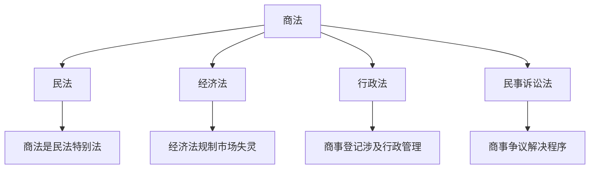
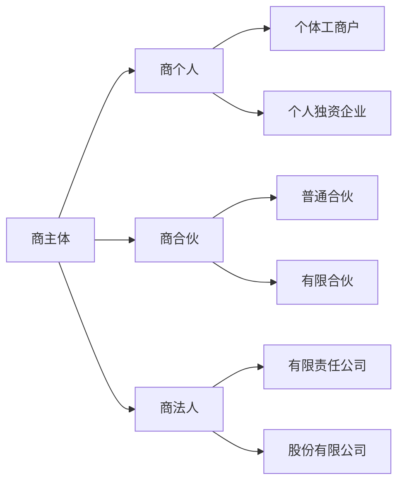
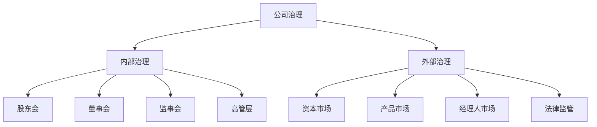
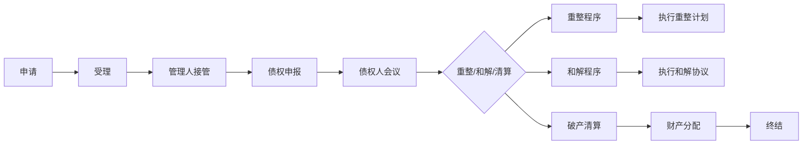

# 商法 (Commercial Law)

## 一、商法概说

### 1.1 定义与调整对象

商法（Commercial Law）是调整商事主体在商事活动中发生的商事关系的法律规范的总称。商法以商事关系为调整对象，包括商事组织关系和商事行为关系。

### 1.2 商法的特征

| 特征 | 说明 |
|------|------|
| 私法属性 | 调整平等主体间的商事关系 |
| 营利性 | 以促进和保护营利为核心 |
| 技术性 | 包含大量技术性规则 |
| 国际性 | 商事规则趋同化趋势明显 |
| 变动性 | 随商业实践发展而快速演进 |

### 1.3 商法与其他法律部门的关系

### 1.4 商法的基本原则

| 原则 | 含义 | 体现 |
|------|------|------|
| 商主体法定原则 | 商事主体的类型、设立条件须依法规定 | 公司法定类型 |
| 促进交易原则 | 简化交易手续，加速流转 | 票据无因性 |
| 维护交易安全原则 | 保护交易中的合理信赖 | 外观主义 |
| 保障交易公平原则 | 维护公平竞争秩序 | 反不正当竞争 |

## 二、商主体制度

### 2.1 商主体的分类

商主体（Commercial Subject）是依法从事商事经营活动的个人和组织。

### 2.2 公司法律制度

公司（Company）是依法设立的以营利为目的的企业法人。

**公司的分类**：
- 有限责任公司（Limited Liability Company, LLC）：股东以其认缴的出资额为限对公司承担责任
- 股份有限公司（Joint Stock Company, JSC）：全部资本分为等额股份，股东以其认购的股份为限承担责任

**公司的组织机构**：

| 机构 | 组成 | 职权 |
|------|------|------|
| 股东会/股东大会 | 全体股东 | 重大事项决策 |
| 董事会 | 董事 | 日常经营管理决策 |
| 监事会 | 监事 | 监督管理层 |
| 高级管理人员 | 经理、财务负责人等 | 具体执行 |

**公司的设立条件**：
- 股东符合法定人数
- 有符合公司章程的全体股东认缴的出资额
- 有股东共同制定的公司章程
- 有公司名称和组织机构
- 有公司住所

### 2.3 合伙企业法律制度

合伙企业（Partnership Enterprise）由合伙人订立合伙协议，共同出资、合伙经营、共享收益、共担风险。

| 类型 | 责任形式 | 事务执行 |
|------|----------|----------|
| 普通合伙企业 | 无限连带责任 | 全体合伙人共同执行 |
| 有限合伙企业 | 普通合伙人无限责任，有限合伙人有限责任 | 普通合伙人执行 |

## 三、商行为制度

### 3.1 商行为的概念和分类

商行为（Commercial Act）是商主体以营利为目的从事的经营行为。

| 分类标准 | 类型 | 示例 |
|----------|------|------|
| 行为主体 | 绝对商行为 | 票据行为、保险行为 |
| 行为主体 | 营业商行为 | 买卖、运输、仓储 |
| 行为方式 | 单方商行为 | 一方为商主体 |
| 行为方式 | 双方商行为 | 双方均为商主体 |

### 3.2 商事合同

商事合同（Commercial Contract）是商主体之间设立、变更、终止商事权利义务关系的协议。与民事合同相比，商事合同更注重效率、安全和可预期性。

### 3.3 票据法律制度

票据（Negotiable Instrument）是出票人依法签发、约定自己或委托他人见票或确定日期无条件支付一定金额的有价证券。

**票据的种类**：
- 汇票（Bill of Exchange）
- 本票（Promissory Note）
- 支票（Cheque）

**票据的特性**：

$$
\text{票据特征} = \text{无因性} + \text{要式性} + \text{文义性} + \text{流通性}
$$

| 特征 | 含义 |
|------|------|
| 无因性 | 票据关系与基础关系分离 |
| 要式性 | 票据行为须依法定形式 |
| 文义性 | 票据权利义务以记载为准 |
| 流通性 | 可通过背书转让 |

### 3.4 保险法律制度

保险（Insurance）是投保人根据合同约定向保险人支付保险费，保险人对合同约定的可能发生的事故造成的损失承担赔偿或给付保险金责任的商业行为。

**保险的分类**：

| 分类 | 类型 | 说明 |
|------|------|------|
| 保险标的 | 财产保险 | 补偿财产损失 |
| 保险标的 | 人身保险 | 保障人身风险 |
| 实施方式 | 强制保险 | 法律强制投保 |
| 实施方式 | 自愿保险 | 自愿投保 |

## 四、商事登记与商业名称

### 4.1 商事登记

商事登记（Commercial Registration）是商主体依法将设立、变更、终止事项向登记机关申请登记的法律制度。

**登记事项**：
- 名称、住所
- 法定代表人
- 注册资本
- 经营范围
- 股东信息

### 4.2 商业名称

商业名称（Trade Name）是商主体在营业活动中使用的名称。商主体对登记注册的名称在规定范围内享有专用使用权。

## 五、商法与公司治理

### 5.1 公司治理结构

公司治理（Corporate Governance）是协调公司与利益相关者之间关系的制度安排。

### 5.2 董事义务

| 义务类型 | 内容 | 违反后果 |
|----------|------|----------|
| 忠实义务（Duty of Loyalty） | 不得利用职权谋取私利 | 所得收入归公司所有 |
| 勤勉义务（Duty of Care） | 以合理注意履行职务 | 赔偿公司损失 |
| 信息披露义务 | 真实、准确、完整披露信息 | 行政处罚、民事赔偿 |

## 六、破产法律制度

### 6.1 破产的概念

破产（Bankruptcy）是债务人不能清偿到期债务时，依法将其全部财产公平分配给债权人的法律程序。

### 6.2 破产程序

### 6.3 破产清偿顺序

$$
\text{清偿顺序：职工债权} \to \text{税款} \to \text{普通债权}
$$

| 顺序 | 债权类型 |
|------|----------|
| 第一顺位 | 破产费用和共益债务 |
| 第二顺位 | 职工工资、社保费用、补偿金 |
| 第三顺位 | 欠缴税款 |
| 第四顺位 | 普通破产债权 |

## 七、海商法律制度

海商法（Maritime Law）是调整海上运输关系和船舶关系的法律规范。

| 制度 | 内容 |
|------|------|
| 船舶物权 | 船舶所有权、抵押权、优先权 |
| 海上货物运输合同 | 提单、租船合同 |
| 海上旅客运输合同 | 旅客人身损害赔偿 |
| 海难救助 | 救助报酬请求权 |
| 共同海损 | 受益方分摊损失 |
| 海事赔偿责任限制 | 责任人赔偿上限 |

## 八、商事仲裁

商事仲裁（Commercial Arbitration）是商事争议的各方当事人通过协议将争议提交仲裁庭裁决的争议解决方式。

| 特征 | 说明 |
|------|------|
| 自愿性 | 须有仲裁协议 |
| 专业性 | 仲裁员通常为行业专家 |
| 保密性 | 仲裁程序不公开 |
| 一裁终局 | 裁决具有法律约束力 |
| 国际执行力 | 纽约公约成员国可执行 |

## 九、商法的当代发展

### 9.1 数字商业与商法

电子商务、数字货币、智能合约等新型商业模式对传统商法产生深远影响。电子签名和电子合同的法律效力已得到普遍认可，但区块链智能合约的责任认定仍存在法律空白。

### 9.2 公司法改革趋势

全球公司法改革的共同趋势包括：
- 简化公司设立程序，降低注册门槛
- 强化董事的勤勉义务和公司社会责任
- 完善股东权利保护机制
- 推动公司治理透明化

## 十、经典案例

**案例一：公司人格否认**——股东滥用公司独立人格逃避债务时，法院可"揭开公司面纱"，要求股东对公司债务承担连带责任。

**案例二：票据无因性**——票据关系独立于基础交易关系，即使基础合同无效，善意持票人仍享有票据权利。

**案例三：保险合同最大诚信原则**——投保人未如实告知重要事实，保险人有权解除合同并不承担赔偿责任。

## 相关条目

- [[03_HumanitiesAndSocialSciences/Law/CivilLaw/INDEX|CivilLaw]]
- [[ProceduralLaw]]
- [[03_HumanitiesAndSocialSciences/Economics/MonetaryEconomics|MonetaryEconomics]]
- [[LaborLaw]]
- [[INDEX|当前目录索引]]
