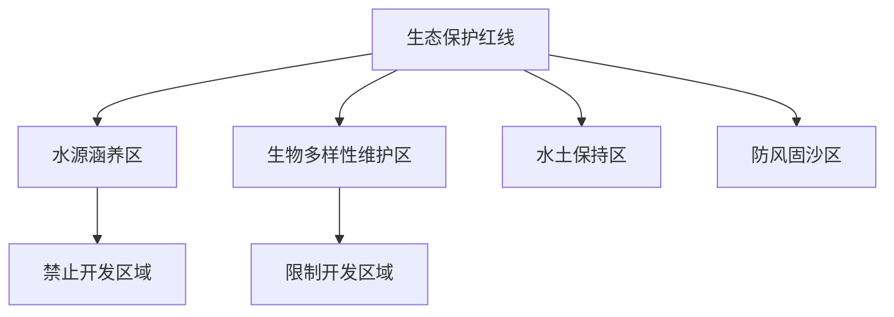
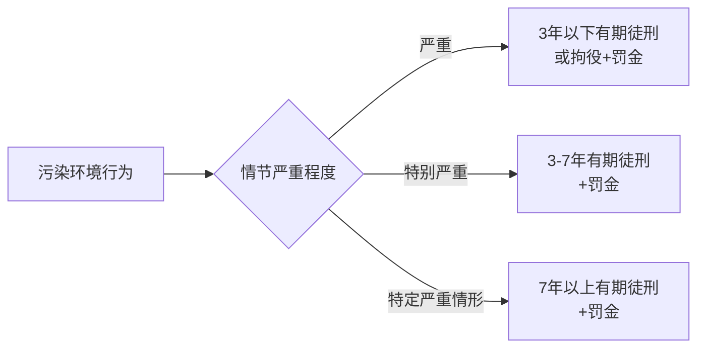
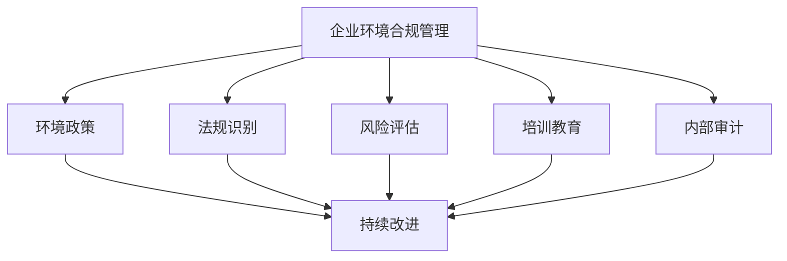

---
aliases:
  - 环境法
  - Environmental Law
  - 环境保护法
  - 污染控制法
tags:
created: 2026-05-17
updated: 2026-05-17
  - law
  - environment
  - regulation
  - international-law
  - pollution
---

# 环境法 (Environmental Law)

环境法 (Environmental Law) 是调整人类与自然环境之间关系的法律规范总称，旨在保护生态环境、防治污染、合理利用自然资源，并促进可持续发展 (sustainable development)。环境法涵盖国内立法、国际条约、行政监管与民事救济等多重维度。

## 环境法的基本原则 (Fundamental Principles)

环境法的构建建立在若干核心原则之上，这些原则为立法、执法与司法提供了基本框架：

- **预防原则 (Precautionary Principle)**：在科学不确定性存在时，应采取预防措施避免潜在的环境损害
- **污染者付费原则 (Polluter Pays Principle)**：造成环境污染的主体应承担治理成本
- **公众参与原则 (Public Participation)**：公民与环境非政府组织 (NGO) 有权参与环境决策
- **共同但有区别的责任 (Common but Differentiated Responsibilities)**：发达国家与发展中国家承担不同责任

## 污染防治法律制度 (Pollution Control Legal System)

### 大气污染防治 (Air Pollution Prevention)

大气污染防治法针对工业排放、机动车尾气、扬尘等污染源进行规制。主要制度包括：

| 制度名称 | 核心内容 | 法律责任 |
| :--- | :--- | :--- |
| 排污许可制度 | 企业须取得排污许可证方可排放 | 无证排污：罚款、责令停产 |
| 总量控制制度 | 设定区域污染物排放总量上限 | 超量排放：按日计罚 |
| 环境监测制度 | 企业自行监测+政府监督性监测 | 数据造假：刑事责任 |
| 重污染天气应急 | 分级预警、限产停产 | 拒不执行：行政拘留 |

污染物浓度计算公式为：

$$
C = \frac{m}{V}
$$

其中 $C$ 为污染物浓度 (mg/m³)，$m$ 为污染物质量 (mg)，$V$ 为气体体积 (m³)。

### 水污染防治 (Water Pollution Prevention)

水污染防治法保护地表水与地下水水质，重点规制工业废水、生活污水与农业面源污染。水质标准以《地表水环境质量标准》(GB 3838) 为依据，将水体分为 I-V 类。

### 固体废物与土壤污染 (Solid Waste and Soil Pollution)

固体废物污染环境防治法确立“减量化、资源化、无害化”原则，土壤污染防治法针对农用地与建设用地分别建立分类管理、风险管控与修复制度。

## 生态保护法律制度 (Ecological Protection Legal System)

### 自然保护区与生态红线 (Nature Reserves and Ecological Red Lines)

生态红线制度将具有重要生态功能的区域划定为严格保护范围，禁止或限制开发建设活动。

### 生物多样性保护 (Biodiversity Conservation)

《生物多样性公约》(Convention on Biological Diversity, CBD) 是保护生物多样性的核心国际条约，三大目标为：保护生物多样性、可持续利用生物资源、公平分享遗传资源惠益。

## 环境影响评价制度 (Environmental Impact Assessment, EIA)

环境影响评价是预防环境污染与生态破坏的前置性制度。建设项目在开工前须编制环境影响报告书、报告表或登记表。

| 项目类别 | 评价文件 | 审批机关 |
| :--- | :--- | :--- |
| 重大建设项目 | 环境影响报告书 | 生态环境主管部门 |
| 轻度建设项目 | 环境影响报告表 | 生态环境主管部门 |
| 极小影响项目 | 环境影响登记表 | 网上备案 |

## 环境法律责任 (Environmental Legal Liability)

### 民事责任 (Civil Liability)

环境侵权责任适用无过错责任原则 (strict liability)，受害人无需证明加害人存在过错。《民法典》第1229条规定，因污染环境、破坏生态造成他人损害的，侵权人应当承担侵权责任。

损害赔偿范围包括：

$$
D = D_d + D_p + D_e + D_r
$$

其中 $D_d$ 为直接损失，$D_p$ 为可得利益损失，$D_e$ 为生态环境修复费用，$D_r$ 为合理诉讼费用。

### 行政责任 (Administrative Liability)

生态环境主管部门可采取行政处罚措施：警告、罚款、责令停产整治、限制生产、吊销许可证、行政拘留等。

### 刑事责任 (Criminal Liability)

《刑法》第六章第六节“破坏环境资源保护罪”规定多种环境犯罪，包括污染环境罪、非法捕捞罪、非法狩猎罪、盗伐林木罪等。污染环境罪的量刑标准为：

## 国际环境法 (International Environmental Law)

### 重要国际环境条约 (Key International Environmental Treaties)

| 条约名称 | 缔结时间 | 核心内容 |
| :--- | :--- | :--- |
| 《联合国气候变化框架公约》(UNFCCC) | 1992年 | 控制温室气体排放 |
| 《京都议定书》(Kyoto Protocol) | 1997年 | 发达国家量化减排义务 |
| 《巴黎协定》(Paris Agreement) | 2015年 | 全球温控目标、国家自主贡献 |
| 《巴塞尔公约》(Basel Convention) | 1989年 | 控制危险废物越境转移 |
| 《斯德哥尔摩公约》(Stockholm Convention) | 2001年 | 消除持久性有机污染物 |

### 气候变化的法律应对 (Legal Responses to Climate Change)

《巴黎协定》确立长期温控目标：将全球平均气温升幅控制在工业化前水平的 $2^\circ C$ 以内，并努力限制在 $1.5^\circ C$。各国提交国家自主贡献 (NDC)，定期更新减排目标。

碳排放强度下降公式：

$$
\eta = \frac{E_t - E_0}{E_0} \times 100\%
$$

其中 $\eta$ 为碳排放强度下降率，$E_t$ 为目标年排放强度，$E_0$ 为基准年排放强度。

## 环境标准体系 (Environmental Standards System)

环境标准是环境法的技术基础，为环境质量目标、污染物排放控制与环境监测提供量化依据。

### 环境标准的层级 (Hierarchy of Environmental Standards)

| 标准类型 | 制定机关 | 适用范围 | 效力 |
| :--- | :--- | :--- | :--- |
| 环境质量标准 | 国务院生态环境主管部门 | 全国或特定区域 | 强制性 |
| 污染物排放标准 | 国务院生态环境主管部门 | 全国或特定行业 | 强制性 |
| 环境监测方法标准 | 国务院生态环境主管部门 | 全国 | 强制性 |
| 环境基础标准 | 国务院生态环境主管部门 | 全国 | 推荐性 |
| 地方环境标准 | 省级人民政府 | 本行政区域 | 可严于国家标准 |

### 环境质量标准的数学表达 (Mathematical Expression)

环境质量指数 (Environmental Quality Index, EQI) 综合反映区域环境质量状况：

$$
EQI = \sum_{i=1}^{n} w_i \times \frac{C_i}{S_i}
$$

其中 $w_i$ 为第 $i$ 项污染物的权重，$C_i$ 为实测浓度，$S_i$ 为评价标准限值，$n$ 为参与评价的污染物项数。当 $EQI \leq 1$ 时，环境质量达标；当 $EQI > 1$ 时，环境质量超标。

## 环境公益诉讼 (Environmental Public Interest Litigation)

环境公益诉讼制度允许符合条件的社会组织与检察机关就污染环境、破坏生态的行为提起诉讼，突破了传统诉讼“直接利害关系”的限制。

| 原告类型 | 起诉条件 | 诉讼请求 |
| :--- | :--- | :--- |
| 环保社会组织 | 连续5年以上无违法记录 | 停止侵害、恢复原状、赔偿损失 |
| 检察机关 | 发现生态环境损害 | 民事公益诉讼或行政公益诉讼 |

### 生态环境损害赔偿制度 (Eco-environmental Damage Compensation)

生态环境损害赔偿制度规定，赔偿权利人（省级、市地级政府及其指定部门）可就造成生态环境损害的行为要求赔偿义务人承担修复或赔偿责任。赔偿范围包括：清除污染费用、生态环境修复费用、生态环境修复期间服务功能的损失、生态环境功能永久性损害造成的损失、调查评估鉴定费用等。

## 企业环境合规管理 (Corporate Environmental Compliance)

企业应建立环境合规管理体系 (Environmental Compliance Management System, ECMS)，包括：环境政策制定、法律法规识别、风险评估、培训教育、内部审计与持续改进。

## 环境法的未来挑战 (Future Challenges)

- 应对气候变化需要更激进的法律转型
- 人工智能与大数据在环境监测中的应用
- 跨国环境损害的司法管辖与执行难题
- 环境正义 (environmental justice) 与代际公平的实现
