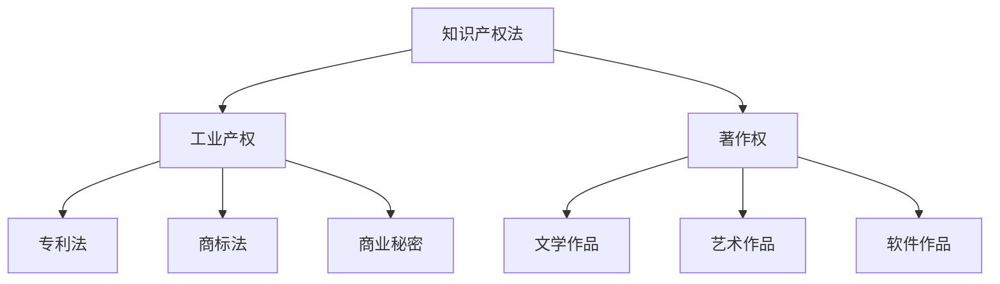
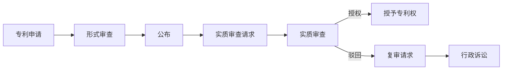
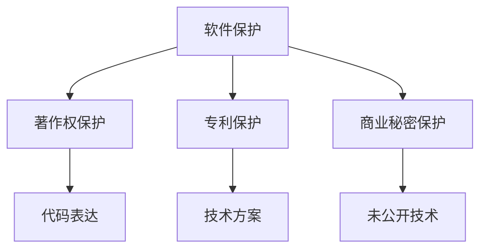
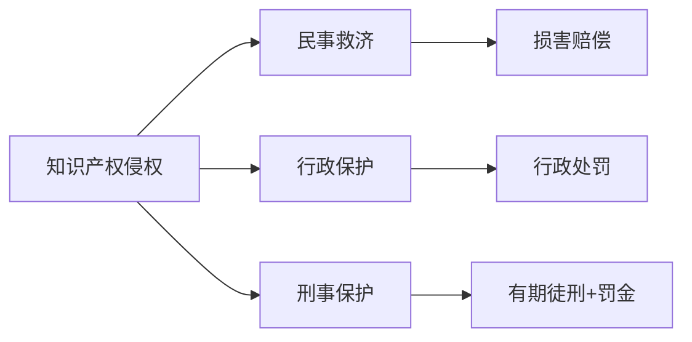

---
aliases:
  - 知识产权法
  - Intellectual Property Law
  - IP Law
  - 专利法
  - 著作权法
tags:
  - law
  - intellectual-property
  - patent
  - copyright
  - trademark
  - innovation
---

# 知识产权法 (Intellectual Property Law)

知识产权法 (Intellectual Property Law) 是保护人类智力创造成果的法律规范总称，旨在激励创新、促进知识传播、维护公平竞争秩序。知识产权 (Intellectual Property, IP) 具有无形性、专有性、地域性与时间性四大特征。

## 知识产权法体系概览 (Overview of IP Law System)

知识产权法主要包括四大分支：专利法 (Patent Law)、著作权法 (Copyright Law)、商标法 (Trademark Law) 与反不正当竞争法中的商业秘密保护 (Trade Secret Protection)。

## 专利法 (Patent Law)

### 专利的客体与类型 (Patentable Subject Matter and Types)

专利法保护的对象为发明创造，包括三类：

| 专利类型 | 保护客体 | 保护期限 | 审查制度 |
| :--- | :--- | :--- | :--- |
| 发明专利 (Invention Patent) | 产品、方法或其改进 | 20年 | 实质审查 |
| 实用新型 (Utility Model) | 产品的形状、构造或其结合 | 10年 | 初步审查 |
| 外观设计 (Design Patent) | 产品的整体或局部形状、图案、色彩 | 15年 | 初步审查 |

### 专利授权条件 (Patentability Requirements)

获得专利权须满足三大实质性条件：

1. **新颖性 (Novelty)**：不属于现有技术，且不存在抵触申请
2. **创造性 (Inventive Step / Non-obviousness)**：对本领域技术人员而言非显而易见
3. **实用性 (Industrial Applicability / Utility)**：能够制造或使用，并产生积极效果

新颖性判断的时间节点为申请日 (filing date)，现有技术指申请日以前在国内外为公众所知的技术。

### 专利申请与审查程序 (Patent Application and Examination)

### 专利权的限制 (Limitations on Patent Rights)

专利权并非绝对权利，存在以下限制：

- **权利用尽 (Exhaustion of Rights)**：专利权人售出专利产品后，不得控制后续流通
- **先用权 (Prior User Rights)**：在申请日前已制造相同产品或做好必要准备的，可在原有范围内继续实施
- **临时过境 (Transit)**：外国运输工具临时过境使用专利设备
- **科学实验 (Scientific Research)**：专为科学研究和实验而使用专利
- **Bolar例外**：为行政审批所需信息进行医药专利实验

## 著作权法 (Copyright Law)

### 著作权的客体 (Subject Matter of Copyright)

著作权法保护文学、艺术和科学领域内具有独创性并能以一定形式表现的智力成果，包括：文字作品、口述作品、音乐作品、戏剧作品、曲艺作品、舞蹈作品、杂技艺术作品、美术作品、建筑作品、摄影作品、视听作品、图形作品、模型作品、计算机软件等。

独创性 (Originality) 是作品受保护的核心要件，仅要求独立创作，不要求首创或新颖。

### 著作权的内容 (Content of Copyright)

著作权包括人身权 (Moral Rights) 与财产权 (Economic Rights) 两大部分：

| 权利类型 | 具体权利 | 保护期限 |
| :--- | :--- | :--- |
| 人身权 | 发表权、署名权、修改权、保护作品完整权 | 署名权等永久保护 |
| 财产权 | 复制权、发行权、出租权、展览权、表演权、放映权、广播权、信息网络传播权、摄制权、改编权、翻译权、汇编权 | 作者终身+死后50年 |

### 合理使用与法定许可 (Fair Use and Statutory License)

合理使用 (Fair Use) 是指在特定情形下使用作品，可以不经著作权人许可，不向其支付报酬，但应当指明作者姓名或名称、作品名称，并且不得影响该作品的正常使用，也不得不合理地损害著作权人的合法权益。

合理使用的情形包括：个人学习研究、评论介绍、新闻报道、课堂教学、国家机关执行公务、免费表演、临摹绘画公共场所艺术品、翻译为少数民族语言文字、阅读障碍者无障碍阅读等。

### 计算机软件著作权 (Software Copyright)

计算机软件受著作权法保护，同时可通过专利法保护其中的技术方案。软件著作权自软件开发完成之日起自动产生，登记为非强制性程序。

## 商标法 (Trademark Law)

### 商标的构成要素与类型 (Trademark Elements and Types)

商标是能够将自然人、法人或其他组织的商品与他人的商品区别开的标志，包括文字、图形、字母、数字、三维标志、颜色组合、声音等，以及上述要素的组合。

| 商标类型 | 说明 | 示例 |
| :--- | :--- | :--- |
| 商品商标 | 用于区分商品来源 | 电子产品商标 |
| 服务商标 | 用于区分服务来源 | 餐饮服务商标 |
| 集体商标 | 供组织成员使用 | 行业协会商标 |
| 证明商标 | 证明特定品质 | 绿色食品标志 |

### 商标注册条件 (Trademark Registration Requirements)

商标注册须满足以下条件：具有显著性 (Distinctiveness)、非功能性 (Non-functionality)、不与他人在先权利冲突、非禁用标志。显著性可通过使用获得 (acquired distinctiveness / secondary meaning)。

### 驰名商标保护 (Well-known Trademark Protection)

驰名商标 (Well-known Trademark) 享有跨类保护，即使在不相同或不类似商品上注册或使用，若误导公众或损害驰名商标注册人利益，亦不予注册并禁止使用。

驰名商标认定考虑因素：

$$
F = f(R, D, S, A, T)
$$

其中 $F$ 为驰名程度，$R$ 为相关公众知晓程度，$D$ 为使用持续时间，$S$ 为宣传持续时间与范围，$A$ 为受保护记录，$T$ 为其他因素。

## 商业秘密 (Trade Secrets)

### 商业秘密的构成要件 (Trade Secret Requirements)

商业秘密是指不为公众所知悉、具有商业价值并经权利人采取相应保密措施的技术信息、经营信息等商业信息。三大要件：

1. **秘密性 (Secrecy)**：不为公众所知悉
2. **价值性 (Value)**：具有现实的或潜在的商业价值
3. **保密性 (Reasonable Efforts)**：权利人采取了合理的保密措施

### 商业秘密侵权行为 (Trade Secret Infringement)

侵犯商业秘密的行为包括：以盗窃、贿赂、欺诈、电子侵入或其他不正当手段获取；披露、使用或允许他人使用以前述手段获取的商业秘密；违反保密义务或权利人有关保守商业秘密的要求，披露、使用或允许他人使用其所掌握的商业秘密；教唆、引诱、帮助他人违反保密义务或权利人要求，获取、披露、使用或允许他人使用权利人的商业秘密。

## 知识产权执法与救济 (IP Enforcement and Remedies)

### 民事救济 (Civil Remedies)

知识产权侵权的民事责任包括：停止侵害、消除影响、赔礼道歉、赔偿损失。损害赔偿数额的确定顺序为：实际损失 → 侵权获利 → 许可费合理倍数 → 法定赔偿。

### 行政保护 (Administrative Protection)

知识产权行政执法机关包括：市场监督管理部门（商标、专利）、版权局（著作权）、海关（边境保护）。行政措施包括：责令停止侵权、没收违法所得、罚款、销毁侵权产品等。

### 刑事保护 (Criminal Protection)

《刑法》第三章第七节“侵犯知识产权罪”规定：假冒注册商标罪、销售假冒注册商标的商品罪、非法制造销售非法制造的注册商标标识罪、假冒专利罪、侵犯著作权罪、销售侵权复制品罪、侵犯商业秘密罪。

## 国际知识产权保护 (International IP Protection)

### 重要国际条约 (Key International Treaties)

| 条约名称 | 缔结时间 | 核心内容 |
| :--- | :--- | :--- |
| 《巴黎公约》(Paris Convention) | 1883年 | 国民待遇、优先权、临时保护 |
| 《伯尔尼公约》(Berne Convention) | 1886年 | 著作权自动保护、国民待遇 |
| 《TRIPS协定》(TRIPS Agreement) | 1994年 | 知识产权最低保护标准、执法程序 |
| 《专利合作条约》(PCT) | 1970年 | 国际专利申请统一程序 |
| 《马德里协定/议定书》(Madrid Protocol) | 1989年 | 商标国际注册 |

### 知识产权与公共健康 (IP and Public Health)

《多哈宣言》(Doha Declaration) 确认《TRIPS协定》的灵活性，允许成员国在公共健康危机时采取强制许可 (Compulsory License) 等措施，保障药品可及性。

## 新兴知识产权议题 (Emerging IP Issues)

- 人工智能生成内容的著作权归属
- 基因序列与生物技术的可专利性
- 标准必要专利 (SEP) 与公平合理无歧视 (FRAND) 许可
- 数据产权与数据库保护
- 区块链与NFT的知识产权问题
