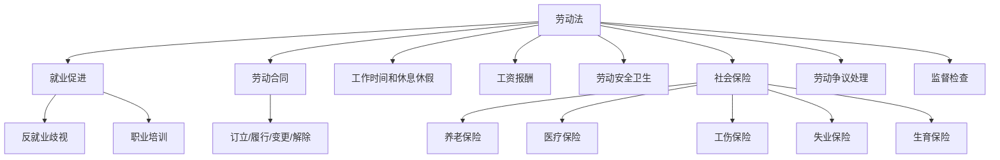
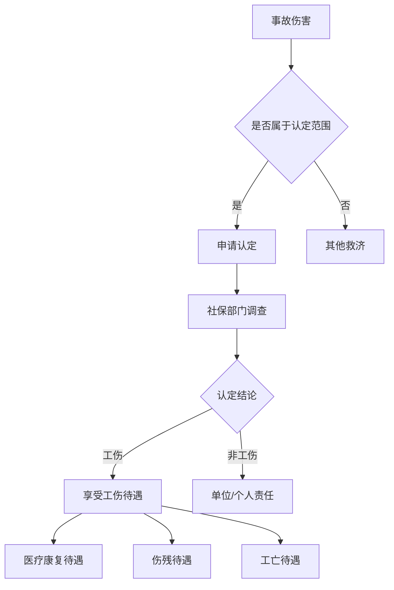
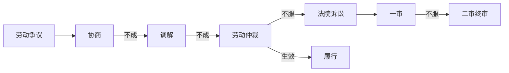

# 劳动法 (Labor Law)

## 一、劳动法概述

### 1.1 定义与调整对象

劳动法（Labor Law）是调整劳动关系以及与劳动关系密切相关的其他社会关系的法律规范的总称。其调整的核心是劳动者与用人单位之间的劳动关系。

### 1.2 劳动法的特征

| 特征 | 说明 |
|------|------|
| 社会法属性 | 兼具公法与私法特征 |
| 保护弱者 | 倾斜保护劳动者权益 |
| 国家干预 | 强制性规范为主 |
| 综合性 | 实体法与程序法交融 |

### 1.3 劳动法的基本原则

| 原则 | 含义 | 法律体现 |
|------|------|----------|
| 劳动自由原则 | 禁止强迫劳动 | 劳动合同自愿签订 |
| 劳动报酬原则 | 按劳分配，同工同酬 | 最低工资制度 |
| 劳动保护原则 | 保障劳动者安全与健康 | 劳动安全卫生制度 |
| 社会保障原则 | 提供基本生活保障 | 社会保险制度 |
| 争议救济原则 | 保障劳动者救济权 | 劳动仲裁+诉讼 |

### 1.4 劳动法体系

## 二、劳动合同法

### 2.1 劳动合同的种类

劳动合同（Employment Contract）是劳动者与用人单位确立劳动关系、明确双方权利义务的协议。

| 类型 | 期限 | 适用情形 |
|------|------|----------|
| 固定期限合同 | 有明确起止时间 | 临时性、季节性工作 |
| 无固定期限合同 | 无确定终止时间 | 长期稳定就业 |
| 以完成一定工作任务为期限 | 任务完成即终止 | 项目制工作 |

**无固定期限合同的法定情形**：
- 劳动者在该单位连续工作满10年
- 连续订立两次固定期限合同且劳动者无过错
- 连续工作满10年且距法定退休年龄不足10年

### 2.2 劳动合同的条款

| 条款类型 | 内容 |
|----------|------|
| 必备条款 | 用人单位信息、劳动者信息、合同期限、工作内容和地点、工作时间、休息休假、劳动报酬、社会保险、劳动保护 |
| 约定条款 | 试用期、培训、保密、竞业限制、补充保险和福利待遇 |

**试用期限制**：

| 合同期限 | 试用期上限 |
|----------|------------|
| 3个月以上不满1年 | 1个月 |
| 1年以上不满3年 | 2个月 |
| 3年以上或无固定期限 | 6个月 |

### 2.3 劳动合同的解除

**劳动者单方解除**：
- 提前30日书面通知解除（试用期内提前3日）
- 即时解除：用人单位未及时足额支付报酬、未缴纳社保、违章指挥强令冒险作业

**用人单位单方解除**：
- 过失性解除：严重违纪、严重失职、被追究刑事责任
- 非过失性解除：医疗期满、不能胜任工作、客观情况重大变化
- 经济性裁员：生产经营严重困难

**经济补偿金**：

$$
\text{经济补偿金} = \text{工作年限} \times \text{月平均工资}
$$

| 解除类型 | 是否支付经济补偿 |
|----------|------------------|
| 劳动者主动辞职 | 否（除非被迫解除） |
| 过失性解除 | 否 |
| 非过失性解除 | 是 |
| 经济性裁员 | 是 |
| 协商解除（单位提议） | 是 |

### 2.4 竞业限制

竞业限制（Non-Compete Clause）是用人单位与高级管理人员、高级技术人员和其他负有保密义务的人员约定的离职后限制条款，期限不超过2年，用人单位须按月支付经济补偿。

## 三、工作时间和休息休假

### 3.1 工作时间制度

| 制度类型 | 内容 |
|----------|------|
| 标准工时制 | 每日不超过8小时，每周不超过40小时 |
| 综合计算工时制 | 以周/月/季/年为周期综合计算 |
| 不定时工作制 | 不固定工作时间 |

### 3.2 加班与加班费

$$
\text{加班费} =
\begin{cases}
\text{小时工资} \times 150\% & \text{平日延长工作时间} \\
\text{日工资} \times 200\% & \text{休息日工作且不安排补休} \\
\text{日工资} \times 300\% & \text{法定休假日工作}
\end{cases}
$$

### 3.3 休息休假

- 每周至少休息1日
- 法定节假日：元旦、春节、清明、劳动节、端午、中秋、国庆
- 年休假：工作满1年不满10年5天；10-20年10天；20年以上15天
- 婚假、产假、陪产假、病假、探亲假

## 四、工资报酬

### 4.1 工资分配原则

- 按劳分配原则
- 同工同酬原则
- 工资支付原则：以货币形式按月支付
- 最低工资保障制度：不得低于当地最低工资标准

### 4.2 工资扣除限制

用人单位扣除工资的限额：违纪罚款扣除每月不超过当月工资的20%。代扣代缴包括个人所得税、社保个人部分、法院判决的抚养费赡养费。

## 五、劳动安全卫生

### 5.1 用人单位的义务

- 建立安全卫生制度
- 提供符合标准的劳动条件
- 配备劳动防护用品
- 定期进行职业健康检查
- 对劳动者进行安全培训

### 5.2 工伤认定

## 六、社会保险

### 6.1 五险一金

| 保险类型 | 缴费比例（单位/个人） | 主要用途 |
|----------|----------------------|----------|
| 养老保险 | 16%/8% | 退休后按月领取养老金 |
| 医疗保险 | 6-10%/2% | 医疗费用报销 |
| 工伤保险 | 0.2-1.9%/0 | 工伤医疗和赔偿 |
| 失业保险 | 0.5-1%/0.5% | 失业期间基本生活保障 |
| 生育保险 | 0.5-1%/0 | 生育医疗费用和津贴 |
| 住房公积金 | 5-12%/5-12% | 住房消费 |

## 七、劳动争议处理

### 7.1 劳动争议的范围

- 因确认劳动关系发生的争议
- 因订立、履行、变更、解除和终止劳动合同发生的争议
- 因除名、辞退和辞职、离职发生的争议
- 因工作时间、休息休假、社会保险、福利、培训以及劳动保护发生的争议
- 因劳动报酬、工伤医疗费、经济补偿或者赔偿金等发生的争议

### 7.2 争议处理程序

**仲裁前置原则**：劳动争议须先经劳动仲裁，对仲裁裁决不服方可向法院起诉。

### 7.3 仲裁时效

劳动争议仲裁时效为1年，自知道或应当知道权利被侵害之日起计算。劳动关系存续期间因拖欠劳动报酬发生争议的，不受1年仲裁时效限制。

## 八、劳动监察

劳动监察（Labor Inspection）是劳动行政部门对用人单位遵守劳动法律法规情况进行监督检查的活动。

| 监察事项 | 检查内容 |
|----------|----------|
| 劳动合同 | 签订情况 |
| 工资支付 | 按时足额支付 |
| 工作时间 | 加班限制和加班费 |
| 社会保险 | 参保缴费情况 |
| 未成年工保护 | 特殊保护措施 |

## 九、劳动法的当代议题

### 9.1 平台用工

外卖骑手、网约车司机等平台从业者的法律身份问题——是劳动者还是独立承包人？如何保障新就业形态下的职业安全、社会保险和最低报酬？

### 9.2 远程工作

远程办公对劳动法的挑战：工作场所的定义、加班时间的认定、职业安全卫生责任的边界。

### 9.3 零工经济与灵活用工

零工经济（Gig Economy）推动灵活用工模式发展，但也带来劳动保障缺失问题。各国正在探索"第三类劳动者"（Third Category Worker）制度，在雇员与自雇者之间设立中间身份。

## 十、经典案例

**案例一：华为奋斗者协议案**——员工签署自愿放弃年休假和加班费的协议是否有效？法院认定该协议违反劳动法强制性规定，属无效。

**案例二：滴滴平台司机劳动关系认定案**——网约车司机与平台之间是否存在劳动关系？各地法院判决不一，反映了新业态用工模式对传统劳动法的挑战。

**案例三：富士康超时加班案**——企业强制延长工作时间违反劳动法规定，被劳动监察部门处罚，推动了制造业加班文化的反思和改革。

## 相关条目

- [[03_HumanitiesAndSocialSciences/Economics/LaborEconomics|LaborEconomics]]
- [[CommercialLaw]]
- [[SocialSecurity]]
- [[ProceduralLaw]]
- [[INDEX|当前目录索引]]
