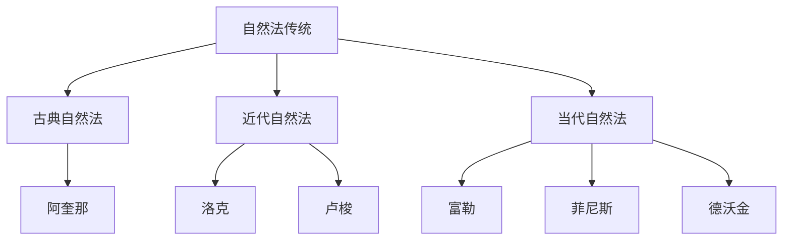
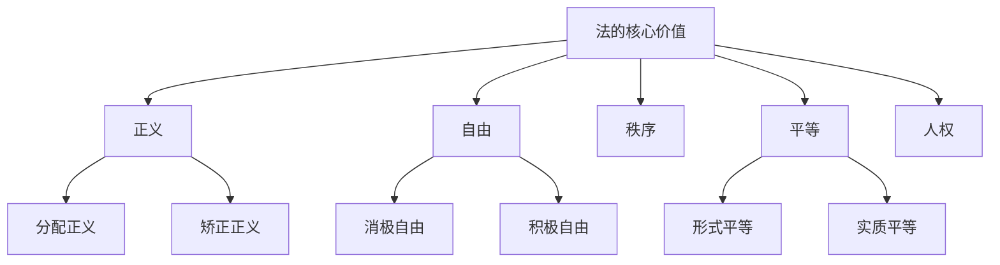

---
aliases:
  - 法哲学
  - Legal Philosophy
  - 法理学
  - Jurisprudence
  - 法学理论
tags:
  - law
  - philosophy
  - legal-theory
  - jurisprudence
  - critical-thinking
---

# 法哲学 (Legal Philosophy)

法哲学 (Legal Philosophy / Jurisprudence) 是以哲学方法研究法律的本质、价值、正当性基础及其与社会关系的学科。法哲学不关注具体法律条文的适用，而是追问“法律是什么”“法律应当是什么”“法律为何具有拘束力”等根本问题。

## 自然法学派 (Natural Law Theory)

### 古典自然法 (Classical Natural Law)

自然法理论认为法律的有效性来源于某种超越实在法的道德秩序或理性法则。古典自然法可追溯至古希腊哲学与古罗马法思想，亚里士多德 (Aristotle) 区分“自然正义”与“约定正义”，西塞罗 (Cicero) 提出“真正的法律是与自然相符合的正确理性”。

托马斯·阿奎那 (Thomas Aquinas) 将法分为四类：永恒法 (Eternal Law)、自然法 (Natural Law)、人法 (Human Law) 与神法 (Divine Law)。自然法是理性受造物对永恒法的参与，人法须符合自然法才具有正当性。

### 近代自然法 (Modern Natural Law)

近代自然法理论与社会契约论相结合，强调个人自然权利 (Natural Rights)。霍布斯 (Hobbes) 认为自然状态下“人对人是狼”，通过社会契约让渡权利给主权者以换取安全。洛克 (Locke) 主张生命、自由、财产是不可剥夺的自然权利，政府违背契约时人民有权反抗。

### 程序自然法 (Procedural Natural Law)

朗·富勒 (Lon L. Fuller) 提出法律的“内在道德”(inner morality of law)，认为法律须满足八项程序原则才能成其为法律：普遍性、公布、不溯及既往、可理解性、不自相矛盾、不要求不可能之事、稳定性、官方行为与法律一致。富勒强调，完全违背这些原则的法律虽仍具“法律”之名，却已丧失法律的道德品格。

### 新自然法 (New Natural Law)

约翰·菲尼斯 (John Finnis) 在阿奎那传统基础上发展出新自然法理论，提出人类的基本善 (basic goods)：生命、知识、游戏、审美体验、社交、实践理性、宗教。法律的功能是促进基本善的实现与协调。

罗纳德·德沃金 (Ronald Dworkin) 虽常被归入自然法传统，但发展出独特的“整体性法律”(law as integrity) 理论。德沃金认为法律不仅包括规则，还包括隐含的原则 (principles) 与政策，法官应在既有法律实践的整体性约束下，找出“唯一正解”(the one right answer)。

## 法律实证主义 (Legal Positivism)

### 经典实证主义 (Classical Positivism)

法律实证主义主张法律与道德分离 (separability thesis)，法律的效力不取决于其道德内容。约翰·奥斯丁 (John Austin) 将法律定义为“主权者的命令”，以制裁为后盾。主权者具有习惯性服从，且自身不服从其他更高主权者。

### 纯粹法学 (Pure Theory of Law)

汉斯·凯尔森 (Hans Kelsen) 创立纯粹法学，将法律视为层级规范体系 (hierarchical system of norms)。每一规范的效力来源于更高层级的规范，最终追溯至基础规范 (Grundnorm)。凯尔森的规范等级：

$$
G_{grund} \rightarrow G_{constitution} \rightarrow G_{statute} \rightarrow G_{regulation} \rightarrow G_{individual}
$$

基础规范本身无法被进一步证成，是整个法律体系的预设前提。凯尔森坚持法律科学的纯粹性，排除道德、心理与社会因素的介入。

### 哈特的新实证主义 (Hart's New Positivism)

H.L.A. 哈特 (H.L.A. Hart) 在《法律的概念》(The Concept of Law) 中批判奥斯丁的命令理论，提出法律是“初级规则”(primary rules) 与“次级规则”(secondary rules) 的结合。

初级规则课以义务，规范人们的行为。次级规则赋予权力，包括：

| 次级规则类型 | 功能 | 示例 |
| :--- | :--- | :--- |
| 承认规则 (Rule of Recognition) | 识别何种规则具有法律效力 | 宪法至上 |
| 变更规则 (Rules of Change) | 创设、修改或废止规则 | 立法程序 |
| 裁判规则 (Rules of Adjudication) | 授权特定机关裁决争议 | 法院管辖权 |

承认规则是整个法律体系的终极判准，是社会实践中官员的一致行为与内在态度的结合。哈特承认“最低限度的自然法”(minimum content of natural law)，认为法律与道德在事实上存在交叉，但坚持概念上的分离。

## 法律现实主义 (Legal Realism)

### 美国法律现实主义 (American Legal Realism)

法律现实主义强调“法律即法官将要作出的判决”，关注法律的实际运作而非规范文本。奥利弗·温德尔·霍姆斯 (Oliver Wendell Holmes Jr.) 提出“法律的生命不在于逻辑，而在于经验”(The life of the law has not been logic: it has been experience)。

杰罗姆·弗兰克 (Jerome Frank) 区分“书本上的法”(law in books) 与“行动中的法”(law in action)，认为法律规则本身无法预测判决结果，法官的个性、偏见与心理因素才是决定性变量。

### 斯堪的纳维亚法律现实主义 (Scandinavian Legal Realism)

阿尔夫·罗斯 (Alf Ross) 等斯堪的纳维亚现实主义者从经验主义立场出发，认为法律规范无法被经验证实，应将其还原为关于法官行为的预测或关于社会事实的描述。

## 批判法学研究 (Critical Legal Studies, CLS)

### 核心主张 (Core Claims)

批判法学运动兴起于20世纪70年代末的美国法学院，深受马克思主义、法兰克福学派与法国后结构主义影响。CLS的核心主张包括：

1. **法律即政治 (Law is Politics)**：法律并非中立客观的裁判，而是政治斗争的场域与意识形态的再生产
2. **规则的不确定性 (Indeterminacy of Law)**：法律规则具有内在矛盾与开放性，任何案件都可找到支持不同结论的规则
3. **法律意识的神秘化 (Reification of Legal Consciousness)**：法律意识形态将特定的社会安排自然化、正当化

### 批判种族理论与女性主义法学 (Critical Race Theory and Feminist Jurisprudence)

批判种族理论 (Critical Race Theory, CRT) 揭示法律中的种族主义结构，主张种族不平等并非偶然偏差，而是嵌入法律体系的系统性问题。德丽克·贝尔 (Derrick Bell) 提出“利益融合”(interest convergence) 理论，认为种族平等进步仅在符合白人精英利益时才会发生。

女性主义法学 (Feminist Jurisprudence) 批判法律的男性中心主义 (androcentrism)，揭示公私领域二分、理性/情感对立等二元结构如何导致对女性经验的排斥。卡罗尔·吉利根 (Carol Gilligan) 提出女性具有不同的“关怀伦理”(ethics of care)。

| 批判法学分支 | 核心批判对象 | 代表性学者 |
| :--- | :--- | :--- |
| 批判法学研究 (CLS) | 法律自由主义与形式主义 | 邓肯·肯尼迪、罗伯托·昂格尔 |
| 批判种族理论 (CRT) | 法律中的种族主义 | 德丽克·贝尔、金伯利·克伦肖 |
| 女性主义法学 | 法律的性别偏见 | 凯瑟琳·麦金农、玛莎·努斯鲍姆 |
| 后现代法学 | 法律宏大叙事的解构 | 雅克·德里达、让-弗朗索瓦·利奥塔 |

## 法律的经济分析 (Law and Economics)

### 效率标准 (Efficiency Criteria)

法律的经济分析将经济学方法引入法学研究，以效率 (efficiency) 作为评价法律制度的核心标准。主要效率标准包括：

- **帕累托效率 (Pareto Efficiency)**：在不使任何人境况变差的前提下，无法使至少一人境况变好
- **卡尔多-希克斯效率 (Kaldor-Hicks Efficiency)**：受益者的收益足以补偿受损者的损失，社会总福利增加

理查德·波斯纳 (Richard Posner) 提出“财富最大化”(wealth maximization) 作为规范目标，认为普通法的发展趋向于促进效率。

### 科斯定理 (Coase Theorem)

罗纳德·科斯 (Ronald Coase) 在《社会成本问题》中证明：在交易成本为零且产权明晰的条件下，无论初始产权如何配置，当事人之间的自愿谈判总能导致资源的最优配置。即：

$$
\text{若 } T_c = 0 \text{ 且产权明晰，则资源配置结果与初始产权分配无关}
$$

科斯定理的现实意义在于：当交易成本为正时，法律的权利初始配置至关重要，法律制度应尽可能降低交易成本。

## 法律与社会理论 (Law and Society Theory)

### 马克斯·韦伯的法律社会学 (Weber's Sociology of Law)

马克斯·韦伯 (Max Weber) 区分四种法律类型：形式理性法、实质理性法、形式非理性法、实质非理性法。现代资本主义的发展与形式理性法律体系 (formally rational law) 的兴起密切相关，后者具有逻辑一贯性、可预测性与可计算性。

### 尼可拉斯·卢曼的系统论法学 (Luhmann's Systems Theory)

卢曼 (Niklas Luhmann) 将法律视为社会子系统 (social subsystem)，具有“规范上封闭、认知上开放”的特征。法律系统通过“合法/非法”(legal/illegal) 的二元符码进行自我再生产 (autopoiesis)，与其他社会子系统（如政治、经济）通过“结构耦合”(structural coupling) 相互作用。

## 法的价值论 (Axiology of Law)

### 正义 (Justice)

正义是法哲学的核心范畴。亚里士多德区分分配正义 (distributive justice) 与矫正正义 (corrective justice)。罗尔斯 (John Rawls) 在《正义论》中提出两条正义原则：

1. 每个人对与所有人拥有的最广泛平等的基本自由体系相容的类似自由体系都应有一种平等的权利
2. 社会和经济的不平等应这样安排，使它们：在与正义的储存原则一致的情况下，适合于最小受惠者的最大利益（差异原则）；依系于在机会公平平等的条件下职务和地位向所有人开放（公平机会原则）

### 自由 (Liberty) 与秩序 (Order)

法律在保障个人自由与维护社会秩序之间寻求平衡。密尔 (John Stuart Mill) 提出“伤害原则”(harm principle)：个人自由的边界在于不伤害他人。哈耶克 (Friedrich Hayek) 区分“自生自发秩序”(spontaneous order) 与“建构秩序”(constructed order)，主张法律应服务于前者。

### 平等 (Equality)

法律面前人人平等 (equality before the law) 是近代法治的基本原则。德沃金提出“平等关怀与尊重”(equal concern and respect) 作为政治道德的基石。阿玛蒂亚·森 (Amartya Sen) 与玛莎·努斯鲍姆 (Martha Nussbaum) 的能力进路 (capabilities approach) 主张以实质自由 (substantive freedom) 而非形式平等衡量社会公正。

## 当代法哲学的前沿议题 (Contemporary Issues)

- 法律的人工智能与算法治理
- 全球正义与国际法治
- 法律多元主义 (legal pluralism) 与习惯法
- 动物权利与生态法哲学
- 数据正义与数字宪政
