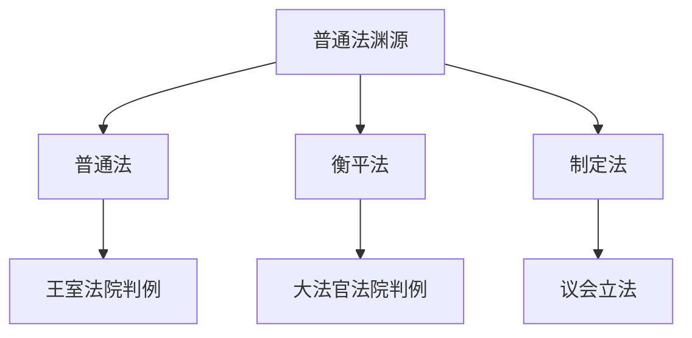
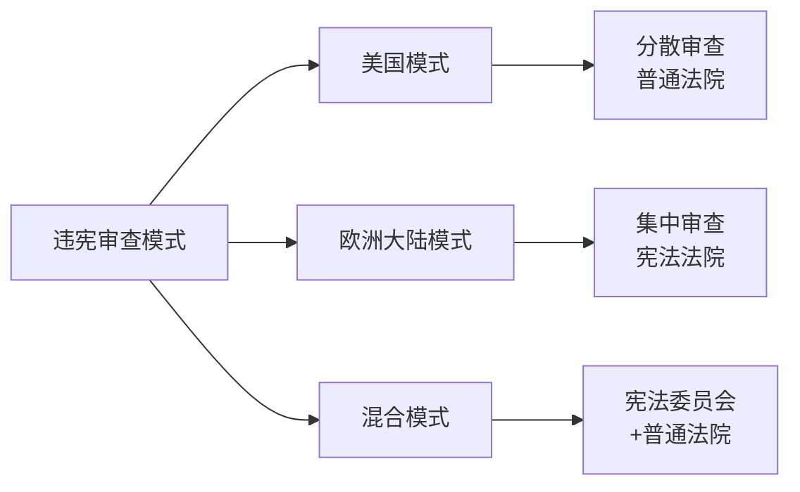
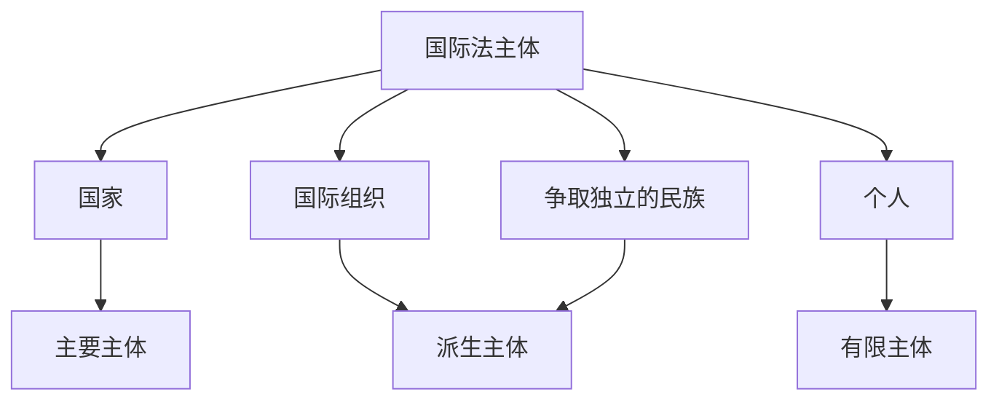
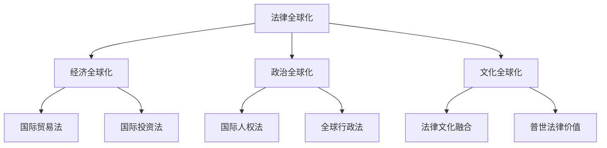

---
aliases:
  - 法律制度
  - Legal System
  - 法系
  - Legal Family
  - 比较法学
tags:
created: 2026-05-17
updated: 2026-05-17
  - law
  - legal-system
  - comparative-law
  - constitution
  - international-law
---

# 法律制度 (Legal System)

法律制度 (Legal System) 是指一个国家或地区法律规范、法律机构、法律程序与法律文化的有机整体。不同国家和地区因历史传统、文化背景与社会条件的差异，形成了各具特色的法律体系。比较法学 (Comparative Law) 通过对不同法律制度的比较研究，揭示法律的普遍规律与特殊形态。

## 法系分类 (Classification of Legal Families)

### 大陆法系 (Civil Law System)

大陆法系 (Civil Law System)，又称民法法系、罗马-日耳曼法系，是以罗马法为基础，以法典化为主要特征的法律体系。大陆法系的历史渊源可追溯至古罗马的《国法大全》(Corpus Juris Civilis)，经中世纪罗马法复兴、近代自然法思想洗礼，于19世纪在《法国民法典》(Code Civil, 1804) 与《德国民法典》(Bürgerliches Gesetzbuch, 1900) 中达到成熟。

大陆法系的主要特征：

| 特征维度 | 大陆法系 | 普通法系 |
| :--- | :--- | :--- |
| 法律渊源 | 制定法为主，判例为辅 | 判例法为主，制定法为辅 |
| 法典化程度 | 高度法典化 | 不存在统一法典 |
| 法官角色 | 法律的执行者，消极中立 | 法律的创造者，积极能动 |
| 诉讼程序 | 纠问式 (inquisitorial) | 对抗式 (adversarial) |
| 法律推理 | 演绎推理 (deductive) | 归纳推理 (inductive) |
| 职业传统 | 法学家法 (Juristenrecht) | 法官法 (Judge-made law) |

### 普通法系 (Common Law System)

普通法系 (Common Law System)，又称英美法系、判例法系，是以英国中世纪普通法为基础，以判例法为主要渊源的法律体系。1066年诺曼征服后，英王通过王室法院的统一司法活动，逐渐在各地习惯法基础上形成全国适用的“普通法”(common law)。

普通法的核心机制是遵循先例 (stare decisis / doctrine of precedent)：上级法院的判决对下级法院具有约束力，同一法院的先前判决对自身具有说服力。判例的拘束力来源于判决理由 (ratio decidendi) 而非附带意见 (obiter dicta)。

衡平法 (Equity) 是为弥补普通法的僵化与不足而发展起来的补充性法律体系。当普通法的救济方式（主要是损害赔偿）不足以实现正义时，大法官法院 (Court of Chancery) 可依良心与衡平原则提供禁令、实际履行等特别救济。

### 其他主要法系 (Other Major Legal Families)

| 法系名称 | 代表国家/地区 | 主要特征 |
| :--- | :--- | :--- |
| 社会主义法系 | 中国、古巴、越南 | 强调国家所有制、计划经济、社会权利 |
| 伊斯兰法系 | 沙特阿拉伯、伊朗 | 以沙里亚法 (Sharia) 为最高法律渊源 |
| 印度教法系 | 印度部分地区 | 属人法适用于婚姻、继承等领域 |
| 混合法系 | 南非、魁北克、苏格兰 | 融合大陆法与普通法要素 |

## 宪法与宪政 (Constitution and Constitutionalism)

### 宪法的概念与特征 (Concept and Characteristics)

宪法 (Constitution) 是规定国家根本制度与根本任务、集中表现各种政治力量对比关系、保障公民基本权利的国家根本法。宪法具有最高法律效力，是“法律的法律”(lex legum)。

宪法的特征：根本性、最高性、稳定性、规范性、政治性。

### 宪法的基本原则 (Fundamental Constitutional Principles)

| 原则 | 内涵 | 典型体现 |
| :--- | :--- | :--- |
| 人民主权 (Popular Sovereignty) | 国家权力来源于人民 | 选举制度、公投制度 |
| 基本人权 (Fundamental Rights) | 国家尊重与保障人权 | 权利法案、宪法诉讼 |
| 权力分立 (Separation of Powers) | 立法、行政、司法相互制衡 | 三权分立、议会内阁制 |
| 法治原则 (Rule of Law) | 依法治国，法律至上 | 合宪性审查、依法行政 |
| 联邦主义 (Federalism) | 中央与地方分权 | 联邦制国家宪法 |

### 违宪审查制度 (Constitutional Review)

违宪审查是保障宪法实施的核心机制，指特定机关审查法律、法规或其他公权力行为是否符合宪法的制度。主要模式包括：

- **美国模式 (American Model)**：由普通法院在具体案件中附带审查法律的合宪性，即“具体审查”(concrete review)，代表国家为美国、日本
- **欧洲大陆模式 (European Model)**：设立专门宪法法院 (Constitutional Court)，可进行抽象审查 (abstract review) 与具体审查，代表国家为德国、意大利
- **法国模式 (French Model)**：设立宪法委员会 (Conseil Constitutionnel)，在法案公布前进行预防性审查，1974年后扩大至议会少数派提请审查

### 基本权利的理论基础 (Theoretical Foundations of Fundamental Rights)

基本权利的理论发展经历了三代演进：

$$
G_1 \rightarrow G_2 \rightarrow G_3
$$

- **第一代权利 (First Generation)**：公民权利与政治权利 (civil and political rights)，如言论自由、人身自由、选举权，对应消极自由 (negative liberty)
- **第二代权利 (Second Generation)**：经济、社会与文化权利 (economic, social and cultural rights)，如工作权、受教育权、社会保障权，对应积极自由 (positive liberty)
- **第三代权利 (Third Generation)**：集体权利或连带权利 (solidarity rights)，如环境权、发展权、和平权、自决权

## 国际法 (International Law)

### 国际法的渊源 (Sources of International Law)

《国际法院规约》第38条规定国际法的渊源包括：

| 渊源类型 | 说明 | 位阶 |
| :--- | :--- | :--- |
| 国际条约 (Treaties) | 国家间缔结的成文协定 | 首要渊源 |
| 国际习惯 (Customary International Law) | 经长期实践形成的法律确信 | 普遍适用 |
| 一般法律原则 (General Principles) | 各国法律体系共有的原则 | 补充渊源 |
| 司法判例与学说 (Jurisprudence and Doctrine) | 辅助确定法律规则的资料 | 辅助渊源 |

国际习惯的形成须满足两个要件：国家实践 (state practice) 与法律确信 (opinio juris)。

### 国际法的主体 (Subjects of International Law)

国际法的主体是指能够独立享有国际法权利并承担国际法义务的国际法律人格者：

国家作为国际法的主要主体，须具备四个要素：永久居民、确定的领土、政府、与他国交往的能力（即主权）。

### 国际法与国内法的关系 (Relationship Between International and Municipal Law)

关于国际法与国内法的关系，存在两种主要理论：

- **一元论 (Monism)**：认为国际法与国内法构成统一的法律体系，国际法在国内自动具有效力
- **二元论 (Dualism / Pluralism)**：认为国际法与国内法是两个独立的法律体系，国际法须经国内立法“转化”(transformation) 才能在国内适用

实践中，各国采取不同模式：

| 国家 | 模式 | 特点 |
| :--- | :--- | :--- |
| 英国 | 转化模式 | 条约须经议会立法才能在国内生效 |
| 美国 | 自动执行/非自动执行 | 依条约性质区分 |
| 德国 | 友好接纳模式 | 国际法优先于国内法 |
| 中国 | 转化与采纳并用 | 条约须经国内法程序方可适用 |

### 国际争端解决 (International Dispute Settlement)

和平解决国际争端的方法包括：

1. **政治/外交方法**：谈判 (negotiation)、斡旋 (good offices)、调停 (mediation)、和解 (conciliation)、调查 (inquiry)
2. **法律方法**：仲裁 (arbitration)、司法解决 (judicial settlement)

国际法院 (International Court of Justice, ICJ) 是联合国的主要司法机关，由15名法官组成，管辖权基于国家同意，判决具有约束力但缺乏强制执行机制。

### 国际责任 (International Responsibility)

国家对其国际不法行为 (internationally wrongful act) 承担国际责任。国际不法行为的构成要件：可归因于国家 (attribution) 且违反国际义务 (breach of international obligation)。

国家责任的法律后果：继续履行、停止和不重复、赔偿 (restitution, compensation, satisfaction)。

## 法律全球化 (Legal Globalization)

### 法律移植与法律继受 (Legal Transplant and Reception)

法律移植 (legal transplant) 是指特定国家或地区的法律制度、规则或理论被另一国家或地区引入并适用的现象。艾伦·沃森 (Alan Watson) 主张法律具有相对独立于社会的自主性，法律移植在历史上频繁发生且成功率较高。

### 全球法律秩序 (Global Legal Order)

全球化催生了超越国家边界的法律规范与制度：

- **商人法 (Lex Mercatoria)**：国际商事交往中自发形成的习惯法规则
- **全球行政法 (Global Administrative Law)**：规制全球治理机构的法律原则与程序
- **国际人权法**：通过国际条约与国内法的互动，形成人权保护的全球网络
- **国际刑事司法**：国际刑事法院 (ICC) 对灭绝种族罪、战争罪、危害人类罪行使管辖权

## 中国法律制度的特色 (Characteristics of China's Legal System)

中国法律制度是社会主义法律制度的典型代表，具有以下特色：坚持中国共产党的领导、以宪法为核心的统一法律体系、依法治国与以德治国相结合、法律面前人人平等、从本国国情出发借鉴国外法治经验。

中国特色社会主义法律体系包括：宪法及宪法相关法、民法商法、行政法、经济法、社会法、刑法、诉讼与非诉讼程序法七个法律部门。
