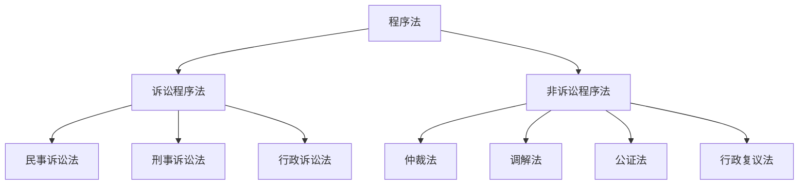
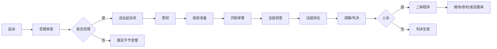
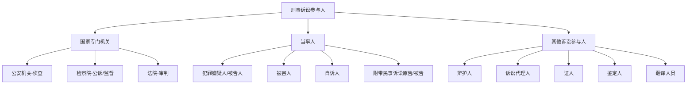

# 程序法 (Procedural Law)

## 一、程序法概述

### 1.1 定义与分类

程序法（Procedural Law / Adjective Law）是规范法律实施过程的法律规范的总称，与实体法（Substantive Law）相对。程序法规定权利实现和义务履行的步骤、方式和救济途径。

**基本分类**：

### 1.2 程序法的价值

| 价值 | 含义 |
|------|------|
| 工具价值 | 保障实体法正确实施 |
| 独立价值 | 程序正义具有独立意义 |
| 规制权力 | 约束裁判者权力行使 |
| 保障权利 | 保障当事人的程序权利 |
| 提升效率 | 规范争议解决效率 |
| 增强公信 | 通过正当程序增强结果可接受性 |

### 1.3 程序公正的基本原则

- 裁判者中立原则（Nemo Judex in Causa Sua）
- 当事人参与原则（Audi Alteram Partem）
- 程序公开原则
- 程序平等原则
- 程序经济原则
- 程序合法性原则

### 1.4 正当程序的理论基础

正当程序（Due Process）源于英国普通法的自然正义原则，后经美国宪法第五和第十四修正案确立为宪法原则。正当程序分为**程序性正当程序**（Procedural Due Process）和**实质性正当程序**（Substantive Due Process），前者要求政府剥夺生命、自由或财产时必须遵循公平程序，后者要求法律本身不得任意剥夺基本权利。

## 二、民事诉讼法

### 2.1 民事诉讼的概念

民事诉讼（Civil Procedure）是法院在当事人和其他诉讼参与人参加下，审理和解决民事纠纷的活动。

### 2.2 民事诉讼的基本原则

| 原则 | 内容 |
|------|------|
| 当事人平等原则 | 当事人诉讼地位完全平等 |
| 辩论原则 | 当事人就案件事实和法律适用进行辩论 |
| 处分原则 | 当事人有权处分自己的实体权利和诉讼权利 |
| 诚实信用原则 | 当事人应善意行使诉讼权利 |
| 法院调解原则 | 自愿合法调解 |

### 2.3 基本制度

| 制度 | 内容 | 例外 |
|------|------|------|
| 合议制度 | 除简易程序外由合议庭审理 | 简易程序、特别程序 |
| 回避制度 | 与案件有利害关系的人员回避 | 当事人同意除外 |
| 公开审判制度 | 审判过程公开 | 涉及国家秘密、个人隐私等 |
| 两审终审制度 | 二审判决为终审判决 | 最高人民法院一审判决 |

### 2.4 诉讼程序

### 2.5 民事诉讼的管辖

| 管辖类型 | 划分标准 | 规则 |
|----------|----------|------|
| 级别管辖 | 案件性质、影响范围 | 基层法院管辖大多数一审案件 |
| 地域管辖 | 地域联系 | 被告住所地法院管辖为一般原则 |
| 专属管辖 | 案件特殊性质 | 不动产纠纷由不动产所在地法院管辖 |
| 协议管辖 | 当事人约定 | 合同纠纷可选择管辖法院 |
| 移送管辖 | 法院间移送 | 无管辖权法院移送有管辖权法院 |
| 指定管辖 | 上级法院指定 | 管辖权争议时的解决方案 |

### 2.6 证据制度

**证据类型**：
- 当事人的陈述
- 书证
- 物证
- 视听资料
- 电子数据
- 证人证言
- 鉴定意见
- 勘验笔录

**证明责任**：

$$
\text{谁主张，谁举证} \quad \text{（一般原则）}
$$

**证明标准**：

$$
\text{高度盖然性} \quad \text{（民事证明标准）}
$$

## 三、刑事诉讼法

### 3.1 刑事诉讼的概念

刑事诉讼（Criminal Procedure）是国家专门机关在当事人和其他诉讼参与人参加下，依法查明犯罪事实、追究犯罪人刑事责任的活动。

### 3.2 刑事诉讼的基本原则

| 原则 | 含义 |
|------|------|
| 无罪推定原则 | 未经法院判决不得确定有罪 |
| 罪刑法定原则 | 法无明文规定不为罪 |
| 控审分离原则 | 控诉与审判职能分离 |
| 辩护原则 | 被告人有权获得辩护 |
| 禁止强迫自证其罪 | 不得强迫自证其罪 |

### 3.3 诉讼参与人

### 3.4 刑事诉讼程序

| 阶段 | 主要内容 | 参与机关 |
|------|----------|----------|
| 立案 | 决定是否展开侦查 | 公安/检察院/法院 |
| 侦查 | 收集证据、查明犯罪 | 公安/检察院 |
| 审查起诉 | 决定是否提起公诉 | 检察院 |
| 审判 | 审理和裁判 | 法院 |
| 执行 | 执行生效判决 | 司法行政机关 |

### 3.5 强制措施

| 措施 | 适用条件 | 期限 |
|------|----------|------|
| 拘传 | 传唤不到案 | 不超过12小时 |
| 取保候审 | 社会危害性低 | 不超过12个月 |
| 监视居住 | 符合逮捕条件但有特殊情形 | 不超过6个月 |
| 拘留 | 现行犯或重大嫌疑分子 | 最长37天 |
| 逮捕 | 有证据证明犯罪、可能判处徒刑以上 | 以法院判决为限 |

### 3.6 刑事证明标准

$$
\text{排除合理怀疑（Beyond Reasonable Doubt）}
$$

这是刑事诉讼的证明标准，要求指控的犯罪事实必须有确实、充分的证据证明，且综合全案证据排除一切合理怀疑。

## 四、行政诉讼法

### 4.1 行政诉讼的概念

行政诉讼（Administrative Procedure）是公民、法人或其他组织认为行政机关的行政行为侵犯其合法权益，依法向人民法院提起诉讼的司法活动。

### 4.2 行政诉讼的特殊原则

| 原则 | 内容 |
|------|------|
| 合法性审查原则 | 法院审查行政行为的合法性 |
| 被告举证原则 | 行政机关对行政行为合法性负举证责任 |
| 不适用调解原则（例外：行政赔偿、行政补偿） | 行政行为一般不适用调解 |
| 诉讼不停止执行原则 | 诉讼期间行政行为不停止执行 |

### 4.3 行政诉讼的判决

| 判决类型 | 适用情形 |
|----------|----------|
| 驳回诉讼请求 | 行政行为合法且合理 |
| 撤销判决 | 行政行为违法 |
| 责令履行判决 | 行政机关不作为 |
| 确认违法或无效 | 行政行为违法但不宣撤销 |
| 赔偿判决 | 行政行为造成损失 |
| 变更判决 | 行政处罚明显不当（限特定情形） |

## 五、仲裁法

### 5.1 仲裁的特征

仲裁（Arbitration）是当事人根据仲裁协议将争议提交仲裁机构裁决的争议解决方式。

| 特征 | 民事诉讼法 | 仲裁法 |
|------|-----------|--------|
| 管辖权基础 | 法律规定 | 当事人协议 |
| 程序公开性 | 公开（除例外） | 保密非公开 |
| 审级制度 | 两审终审 | 一裁终局 |
| 裁判者产生 | 法院指定 | 当事人选定 |
| 适用范围 | 所有民事纠纷 | 合同等商事纠纷 |

### 5.2 仲裁协议

仲裁协议（Arbitration Agreement）必须是书面的，包括合同中订立的仲裁条款和以其他书面方式在纠纷发生前或发生后达成的请求仲裁的协议。

### 5.3 仲裁裁决的撤销与执行

对仲裁裁决不服可向法院申请撤销，理由限于程序性瑕疵。中国是《纽约公约》缔约国，外国仲裁裁决可在中国申请承认和执行。

## 六、调解制度

### 6.1 调解的类型

| 类型 | 调解主体 | 协议效力 |
|------|----------|----------|
| 法院调解 | 审判人员 | 具有强制执行效力 |
| 人民调解 | 人民调解委员会 | 可申请司法确认 |
| 行政调解 | 行政机关 | 民事性质的具有合同效力 |
| 仲裁调解 | 仲裁庭 | 具有强制执行效力 |

### 6.2 调解的原则

- 自愿原则
- 合法原则
- 查明事实、分清是非原则
- 尊重当事人权利原则

## 七、证据法基本原则

### 7.1 可采性与相关性

证据必须同时具备**相关性**（Relevance）和**可采性**（Admissibility）。相关性指证据对证明案件事实有实质帮助；可采性指证据未被排除规则所禁止。非法证据排除规则（Exclusionary Rule）禁止使用以违法手段获取的证据。

### 7.2 证明责任分配

证明责任（Burden of Proof）包括**举证责任**（Burden of Production）和**说服责任**（Burden of Persuasion）。刑事诉讼中控方承担排除合理怀疑的说服责任；民事诉讼中原告对构成要件承担证明责任，被告对抗辩事由承担证明责任。

## 八、程序法的发展趋势

- **电子诉讼**：互联网法院、在线立案、远程庭审
- **替代性纠纷解决机制（ADR）**：调解、仲裁、协商等多元化纠纷解决
- **公益诉讼**：环境公益、消费者权益等公共利益保护
- **程序繁简分流**：小额诉讼、速裁程序
- **跨境诉讼协作**：国际司法协助、跨国破产程序

## 相关条目

- [[03_HumanitiesAndSocialSciences/Law/CivilLaw/INDEX|CivilLaw]]
- [[03_HumanitiesAndSocialSciences/Law/CriminalLaw/INDEX|CriminalLaw]]
- [[AdministrativeLaw]]
- [[LegalSystem]]
- [[CommercialLaw]]
- [[INDEX|当前目录索引]]
