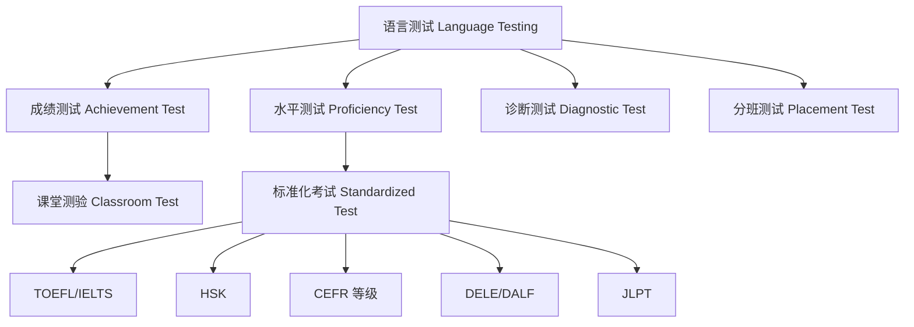

# AppliedLinguistics

**应用语言学** (Applied Linguistics) 是语言学的重要分支，
专注于将语言学理论和方法应用于解决现实世界中的语言相关问题。
它横跨语言教学、翻译、言语治疗、自然语言处理等多个领域。
与理论语言学 (Theoretical Linguistics) 不同，
应用语言学更强调实践性和问题导向性，
旨在将语言研究成果转化为实际应用方案。

## 核心领域 (Core Areas)

### 第二语言习得 (Second Language Acquisition, SLA)

第二语言习得研究人们如何在母语之外学习另一种语言。

- **输入假说** (Input Hypothesis, Krashen):
  $i+1$ 理论主张学习者接触略高于当前水平的
  可理解输入时自然习得语言。
- **输出假说** (Output Hypothesis, Swain):
  可理解输出 (Comprehensible Output)
  促进语法准确性，推动学习者从语义加工
  转向句法加工。
- **互动假说** (Interaction Hypothesis, Long):
  意义协商 (Negotiation of Meaning)
  通过互动反馈促进习得，
  包括澄清请求、确认检查和理解检查三种方式。
- **中介语** (Interlanguage, Selinker):
  学习者在目标语和母语之间建立的
  过渡语言系统，具有三个基本特征：
  系统性、动态性和可渗透性。
- **关键期假说** (Critical Period Hypothesis, Lenneberg):
  青春期前存在语言习得的关键期，
  这一假说在研究中仍有争议，
  但确实观察到年龄对最终习得水平有影响。
- **注意假说** (Noticing Hypothesis, Schmidt):
  学习者必须注意到输入中的语言形式
  才能将输入转化为吸收 (Intake)。
  注意是输入转为吸收的必要条件。
- **技能习得理论** (Skill Acquisition Theory, DeKeyser):
  陈述性知识→程序性知识的转化过程，
  强调练习在语言自动化中的作用。
- **社会文化理论** (Sociocultural Theory, Vygotsky):
  学习发生在最近发展区 (Zone of Proximal
  Development, ZPD) 内，通过支架
  (Scaffolding) 实现从他人调节
  到自我调节的转变。

### 语言教学法 (Language Teaching Methodology)

语言教学法经历了从传统到交际的演变过程。

- **语法翻译法** (Grammar-Translation Method):
  以经典文学文本为基础的翻译教学，
  19 世纪流行，重读写轻听说。
- **直接法** (Direct Method):
  禁止使用母语，直接通过实物和动作教学，
  强调口语领先和自然习得顺序。
- **听说法** (Audio-Lingual Method):
  基于行为主义心理学的句型操练，
  强调模仿、重复和习惯养成。
  结构主义语言学是其语言学基础。
- **认知法** (Cognitive Approach):
  强调对语言规则的理解而非机械操练，
  受乔姆斯基转换生成语法深刻影响。
- **交际语言教学** (Communicative Language Teaching, CLT):
  强调交际能力 (Communicative Competence) 的培养。
  Hymes 提出交际能力包含四个方面：
  语法能力、社会语言学能力、话语能力和策略能力。
- **任务型语言教学** (Task-Based Language Teaching, TBLT):
  以真实任务为核心的教学方式，
  包括信息差任务、观点差任务和推理差任务。
  教学流程分为任务前、任务中和任务后三个阶段。
- **内容与语言融合学习** (CLIL):
  使用目标语言教授学科内容，
  在欧洲广泛推行，强调 4C 框架：
  内容 (Content)、交际 (Communication)、
  认知 (Cognition) 和文化 (Culture)。
- **后方法时代** (Post-Method Pedagogy):
  Kumaravadivelu 提出的超越单一教学法框架，
  强调三个参数：特定性 (Particularity)、
  实践性 (Practicality) 和可能性 (Possibility)。

### 语言测试与评估 (Language Testing and Assessment)

语言评估按功能和用途分为不同类型。

评估的四个黄金标准：
信度 (Reliability)、效度 (Validity)、
可行性 (Practicality) 和后效作用 (Washback Effect)。
交际语言测试强调在真实语境中评估语言使用能力。

### 语料库语言学 (Corpus Linguistics)

语料库语言学利用大规模文本数据库进行语言研究。

常用语料库包括：
- **BNC** (British National Corpus):
  1 亿词，现代英式英语，口语和书面语平衡。
- **COCA** (Corpus of Contemporary American English):
  10 亿+词，覆盖多种文体，实时更新。
- **CCL 语料库** (北京大学中国语言学研究中心):
  现代汉语和古代汉语语料。
- **BCC 语料库** (北京语言大学):
  包含微博、科技、报刊等多元文体。
- **国际英语语料库** (ICE):
  收录全球 20 多个英语变体。
- **学习者语料库** (Learner Corpora):
  如 ICLE、CLEC（中国学习者英语语料库），
  用于分析中介语特征。

### 心理语言学应用 (Psycholinguistic Applications)

- **失语症** (Aphasia) 的评估与治疗：
  Broca 失语症表现为语法缺失和电报式言语；
  Wernicke 失语症表现为理解障碍和流利但无意义的言语。
- **阅读障碍** (Dyslexia) 的识别与干预：
  语音加工缺陷理论是主流解释。
  多感官教学法用于干预。
- **双语认知优势** (Bilingual Cognitive Advantage):
  双语者的执行功能增强，
  特别是在抑制控制和任务切换方面，
  可能延缓认知衰老。

### 计算语言学 (Computational Linguistics)

$$P(w_1, w_2, \dots, w_n)
   = \prod_{i=1}^{n} P(w_i | w_{i-1})$$

这是 N-gram 语言模型的基础概率公式，
用于统计语言建模。
现代大语言模型 (LLMs) 基于 Transformer 架构
和自注意力机制：

$$\text{Attention}(Q, K, V)
   = \text{softmax}\left(\frac{QK^T}{\sqrt{d_k}}\right)V$$

计算语言学的应用包括：
- 机器翻译（神经机器翻译 NMT）
- 语音识别 (ASR)
- 文本到语音 (TTS)
- 信息抽取
- 情感分析
- 对话系统

近年来预训练语言模型（BERT、GPT、T5）
在自然语言处理任务中取得了突破性进展。

## 应用领域 (Application Fields)

应用语言学的实践领域非常广泛：

1. **翻译研究** (Translation Studies):
   机器翻译与译员培训。
   翻译能力模型（PACTE 模型）。
2. **言语病理学** (Speech-Language Pathology):
   沟通障碍的临床干预，
   包括构音障碍、嗓音障碍、口吃。
   言语治疗包括发音训练和辅助沟通系统 (AAC)。
3. **法律语言学** (Forensic Linguistics):
   法庭语言证据分析，
   如作者身份鉴定、诈欺文本分析。
4. **临床语言学** (Clinical Linguistics):
   语言障碍的诊断与治疗，
   包括自闭症谱系障碍、智力障碍、
   特定语言障碍 (SLI)。
5. **教育语言学** (Educational Linguistics):
   课堂话语分析、课程设计、
   教材评估、教师话语研究。
6. **语言规划与政策** (Language Planning & Policy):
   官方语言选择、语言权利立法、
   学校语言教育政策制定。
7. **词典编纂** (Lexicography):
   基于语料库的辞典编写，
   如 COBUILD 词典。
8. **广告与商业语言学**:
   品牌命名、广告语设计、
   市场营销中的语言策略。

## 研究方法 (Research Methods)

| 方法类型 | 具体方法 | 应用场景 |
|---------|---------|---------|
| 定量研究 | 实验研究、问卷调查 | 检验教学效果、语言行为统计 |
| 定性研究 | 案例研究、话语分析 | 课堂互动、学习者策略 |
| 混合方法 | 行动研究 | 教学实践改进与反思 |
| 纵向研究 | 跟踪调查 | 语言发展过程与变化轨迹 |
| 语料库方法 | 频率分析、搭配分析 | 大规模语言使用模式 |

## 当前热点 (Current Trends)

- **人工智能辅助语言教学**:
  ChatGPT 等大语言模型在语言教育中的应用，
  包括自动反馈、对话练习、作文自动评分 (AES)。
- **多模态语言学习**:
  视觉、听觉、触觉整合学习，
  VR/AR 在语言教学中的应用。
  多模态话语分析也日益受到关注。
- **语料库辅助教学** (DDL):
  学生直接使用语料库探索语言模式，
  进行发现式学习 (Discovery Learning)。
- **超语实践** (Translanguaging):
  在双语课堂中灵活切换和使用多种语言资源，
  挑战传统单语教学假设。
- **专门用途英语** (ESP):
  包括学术英语 (EAP) 和职业英语 (EOP)，
  如商务英语、医学英语、法律英语。
- **语言教师教育**:
  教师认知、反思性教学、行动研究的结合。

## 关键学者 (Key Scholars)

- **Stephen Krashen**: 监控理论 (Monitor Model)，
  包含五个假说：习得-学得假说、
  自然顺序假说、监控假说、
  输入假说和情感过滤假说。
- **Rod Ellis**: 任务型语言教学理论与实践，
  SLA 研究的主要贡献者。
- **Michael Long**: 互动假说，
  任务型教学大纲设计，关注焦点 (Focus on Form)。
- **Diane Larsen-Freeman**: 复杂系统理论
  在 SLA 中的运用和语法教学创新。
- **Jack C. Richards**: 交际语言教学，
  教师教育，课程设计。
- **桂诗春** (Gui Shichun):
  中国应用语言学之父，
  心理语言学与语言测试的开拓者。
- **文秋芳** (Wen Qiufang):
  输出驱动-输入促成假设，
  中国大学英语教学改革。

## 相关领域

应用语言学与以下学科紧密交叉：
- [[Sociolinguistics|社会语言学]]
- [[Psycholinguistics|心理语言学]]
- [[Phonetics|语音学]]
- [[Semantics|语义学]]
- [[../ForeignLanguagesAndLiteratures/TranslationStudies/INDEX|翻译研究]]
- [[../ComputerScience/ArtificialIntelligenceAndInterdisciplinary/NaturalLanguageProcessing|自然语言处理]]

---

- [[../../INDEX|当前目录索引]]

## 深入阅读与扩展分析
该领域的知识体系经过长期积累已相当丰富。
以下内容旨在帮助读者进一步把握核心要点。

### 知识结构导引
该学科的理论框架是多层次的。
从最抽象的本体论假设。
到中程理论的实证假设。
再到操作化的研究假设。
每一层都有其独特功能。

### 主要研究范式对比
| 维度 | 实证主义 | 解释主义 | 批判范式 |
|------|---------|---------|---------|
| 本体论 | 实在论 | 建构论 | 历史实在论 |
| 认识论 | 客观主义 | 主观主义 | 解放认知 |
| 方法论 | 定量为主 | 定性为主 | 对话辩证 |
| 目标 | 解释预测 | 理解意义 | 揭露解放 |

### 经典研究案例分析
案例研究的价值在于展示理论的实践应用。
以下是该领域中几个具有代表性的研究。
它们的方法设计和理论贡献值得深入分析。
每个案例都对学科的后续发展产生了影响。

### 跨文化比较视角
不同文化背景下存在显著的差异。
这些差异对理论普适性提出了挑战。
跨文化研究设计需要特别注意文化偏见。
本地化概念的使用需要细致定义。

### 当代前沿热点
1. 数字化与人工智能的社会影响
2. 全球不平等的新形态
3. 气候变化的社会回应
4. 身份政治与民主危机
5. 后疫情时代的社会变迁
6. 技术伦理与人文关怀

### 方法论工具箱
研究人员可以根据研究问题选择方法。
定量方法适合检验假设和推断总体。
定性方法适合探索意义和生成理论。
混合方法整合两类优势以增强说服力。
实验方法旨在建立因果关系。
纵向设计追踪变化和过程。
比较策略揭示制度和文化的差异。

### 学术资源推荐
主要学术期刊发表该领域的前沿研究。
专业学会组织学术会议和交流活动。
在线数据库提供文献检索服务。
开放获取资源降低了知识获取门槛。
学术博客和播客提供了非正式的学习渠道。

### 学习路径设计
初学者应从通论性教材开始学习。
在建立基本框架后阅读经典原著。
然后选择感兴趣的方向深入阅读。
参与讨论和写作有助于深化理解。
独立研究是培养学术能力的核心环节。

### 批判性思维训练
学会质疑前提假设是学术训练的关键。
考察证据是否充分支持结论。
辨别因果关系与相关关系的区别。
识别论证中的逻辑谬误。
评估不同解释的合理性。
反思自身的认知偏见。

### 学术职业发展
学术道路需要长期投入和持续学习。
发表论文是学术生涯的必经之路。
学术网络的建设需要主动参与。
教学与研究之间的平衡值得关注。
跨学科能力在当代学术市场日益重要。

### 研究的公共价值
学术研究应当服务于公共福祉。
知识创新推动社会进步。
政策咨询将学术转化为实践。
公众科普缩小知识鸿沟。
社会批评促进反思和改进。

### 未来展望
该领域将继续回应时代提出的新问题。
技术进步为研究提供了新的工具。
全球化使比较研究更加重要。
跨学科整合是未来的主要趋势。
学术民主化需要更多元的参与者。

## 关键概念辨析
概念定义的清晰度直接影响研究的质量。
以下是该领域中若干容易混淆的概念。

**概念一与概念二的区分**：
前者侧重于外在的形式特征。
后者关注内在的运作机制。
两者在实际分析中往往需要结合使用。

**微观与宏观层面的联系**：
微观现象是宏观结构的基础。
宏观结构又约束微观行为。
理解两者的相互作用是社会分析的核心。

**静态分析与动态分析**：
静态分析关注某一时点的截面特征。
动态分析关注过程和变化的轨迹。
两种视角互补而非替代。

## 综合思考题
1. 该领域与其他相关学科的关系是什么？
2. 该领域最核心的学术贡献有哪些？
3. 经典理论在当代的有效性如何？
4. 该领域的研究方法有什么特点？
5. 数字技术如何改变该领域的研究实践？
6. 该领域存在哪些未解决的重要问题？
7. 全球化如何影响该领域的研究议程？
8. 该领域的知识如何应用于公共政策？
9. 跨学科整合面临哪些机遇和挑战？
10. 未来十年该领域可能有哪些突破？

## 相关条目
- [[INDEX|当前目录索引]]
