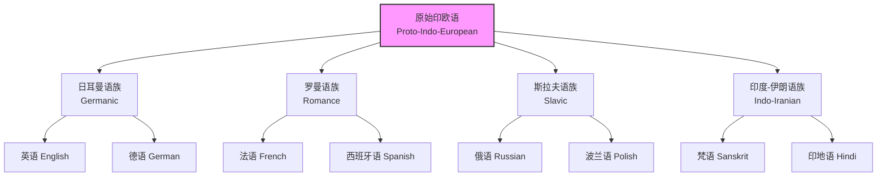
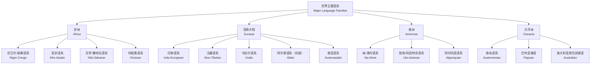

---
aliases:
  - 历史语言学
  - Historical Linguistics
  - 语言演变
  - 比较方法
  - 语言重建
  - 语言系属
tags:
  - linguistics
  - historical_linguistics
  - language_change
  - comparative_method
  - reconstruction
  - language_families
  - philology
  - etymology
---

# 历史语言学 (Historical Linguistics)

历史语言学是语言学中研究语言随时间演变的分支学科，关注语言变化的模式、动因与机制，并通过比较方法与内部重建追溯语言的史前形态与亲缘关系。它不仅重构了语言的过去，也为理解语言的普遍性质——兼具生物遗传性与社会传承性的复杂适应系统——提供了不可或缺的视角。

## 语言变化的类型 (Types of Language Change)

### 语音变化 (Sound Change)

语音变化是历史语言学中研究最充分、最具规律性的变化类型，通常表现出 **规律性 (Regularity)** 与 **条件性 (Conditioning)** 特征。

#### Grimm 定律与 Verner 定律

19 世纪历史比较语言学的里程碑式发现——**Grimm 定律 (Grimm's Law)**——揭示了日耳曼语族辅音系统相对于原始印欧语（Proto-Indo-European, PIE）的系统性对应关系：

| PIE 辅音 | 原始日耳曼语 | 示例 (PIE → English) | 音变类型 |
| :--- | :--- | :--- | :--- |
| *p | *f | *pater → father | 清塞音 → 清擦音 |
| *t | *θ | *tri- → three | 清塞音 → 清擦音 |
| *k | *h | *kard- → heart | 清塞音 → 清擦音 |
| *b | *p | *bhreh₂ter → brother | 浊塞音 → 清塞音 |
| *d | *t | *deḱm → ten | 浊塞音 → 清塞音 |
| *g | *k | *genə- → kin | 浊塞音 → 清塞音 |
| *bh | *b | *bher- → bear (携带) | 浊送气 → 浊塞音 |
| *dh | *d | *dhe- → do | 浊送气 → 浊塞音 |
| *gh | *g | *ghosti- → guest | 浊送气 → 浊塞音 |

然而，Grimm 定律存在系统性例外。Karl Verner 于1875年提出 **Verner 定律 (Verner's Law)** 加以解释：当原始印欧语的重音不在该辅音前的音节上时，清擦音按 Grimm 定律产生后进一步浊化为浊擦音。这证明了语音变化的 **条件性 (Conditioned Change)**，是历史比较方法论的早期重大胜利。

#### 音变规律性的例外

尽管新语法学派（Neogrammarian）主张 "音变无例外"（Ausnahmslosigkeit），但后续研究承认并系统化了多种例外机制：

- **词汇扩散 (Lexical Diffusion)**：William Wang 等学者指出，音变在词汇中逐步扩散，造成过渡期的不规则性。如英语元音大推移中，部分词汇较早变化，部分较晚变化。
- **类推变化 (Analogy)**：基于已有模式的规则化重组。如古英语 help 的过去式原为 holp（强变化），现代英语中变为 helped（弱变化），是通过与 walk/walked 等模式的类比实现的。
- **借用 (Borrowing)**：外来词保留源语言的发音，不服从目标语的音变规律。如英语 beef 借自古法语 boef，而 cow 是日耳曼本土同源词，两者构成英语中罕见的 "同义双层" (etymological doublet)。

### 形态变化 (Morphological Change)

- **类推变化 (Analogical Change)**：不规则形式趋向规则化。古英语名词复数有 -s, -en, -Ø, -u, -an 等多种后缀，现代英语中 -s 通过类推成为绝对主导。
- **语法化 (Grammaticalization)**：实词演变为虚词或语法标记的渐进过程，通常伴随 **语义虚化 (semantic bleaching)**、**形态音系弱化 (phonetic reduction)** 与 **范畴扩展 (category expansion)**。如拉丁语 mente（心智，夺格）演变为罗曼语副词后缀 -mente（西班牙语 rápidamente）。
- **去语法化 (Degrammaticalization)**：反向过程，较为罕见。如英语 ish 从附着语素演变为独立词（"How was the movie? It was OK-ish"）。

### 句法变化 (Syntactic Change)

句法变化研究词序、结构规则与功能范畴的历史演变，往往比语音变化更缓慢但影响更深远：

- **词序变化**：英语从古英语（SOV/SVO 混合，词序较自由）到中古英语再到现代英语（严格 SVO，词序固定）的演变，受重音模式、格系统衰变与法语接触多重驱动。
- **从句结构**：关系从句标记的演变，如英语 that/which/who 的功能分化与竞争。
- **否定循环 (Jespersen's Cycle)**：否定标记从前置到后置再到双重否定的循环演变。古法语单独使用 ne → 中古法语 ne ... pas → 现代法语口语中 pas 单独使用（部分地区）。

### 语义变化 (Semantic Change)

语义变化遵循可概括的方向性模式，Ullmann 的经典分类至今仍是基础：

| 类型 (Type) | 方向 (Direction) | 示例 (Example) |
| :--- | :--- | :--- |
| 语义扩大 (Widening / Generalization) | 意义范围扩大 | dog（特定犬种 → 所有犬） |
| 语义缩小 (Narrowing / Specialization) | 意义范围缩小 | meat（泛指食物 → 仅指肉类） |
| 语义贬降 (Pejoration) | 意义向负面转变 | silly（古义：有福的、天真的 → 愚蠢的） |
| 语义扬升 (Amelioration) | 意义向正面转变 | knight（古义：仆人、青年 → 骑士） |
| 语义转喻 (Metonymy) | 邻近概念转移 | crown（王冠 → 王权 / 王位） |
| 语义隐喻 (Metaphor) | 相似概念映射 | grasp（物理抓住 → 理解掌握） |

## 比较方法 (The Comparative Method)

### 基本原理与操作步骤

比较方法由 19 世纪印欧语学者系统发展，是历史语言学最核心的方法论工具，旨在通过比较现代语言的系统对应关系，重建它们的共同祖先（祖语）。核心操作步骤：

1. **确立语音对应关系 (Establish Correspondences)**：找出不同语言间系统性的语音对应，而非偶然的相似。对应关系必须跨越多个词项呈现规律性模式。
2. **构拟原始形式 (Reconstruct Prototype)**：基于对应关系与音变方向性（如清音化比浊音化更常见），推断祖语中的原始音位与形态。
3. **检验内部一致性 (Check Internal Consistency)**：重建的形式应能解释所有后代语言的发展，并通过内部重建、语义一致性与形态模式相互验证。

### 条件对应与语音定律

真正的对应关系必须是 **条件的 (Conditioned)** 而非随意的：

| 语言 A | 语言 B | 语言 C | 条件环境 | 重建 |
| :--- | :--- | :--- | :--- | :--- |
| p | p | f | 词首位置 | *p |
| p | p | p | 词中 s 后 | *p |
| t | t | θ | 词首位置 | *t |
| t | t | t | 词中 s 后 | *t |
| k | k | h | 词首位置 | *k |
| k | k | k | 词中 s 后 | *k |

这种条件性对应强烈暗示共同来源与规则音变，而非偶然相似或借用。

### 同源词与借词的区分

比较方法要求严格区分 **同源词 (Cognates)** 与 **借词 (Loanwords)**：

- **同源词**：继承自共同祖语，反映系统对应与共享创新。如英语 mother、德语 Mutter、拉丁语 māter、梵语 mātṛ 均源自 PIE *méh₂tēr。
- **借词**：从其他语言借入，通常不服从对应规律，可能反映文化接触。如英语 wine 借自拉丁语 vinum，而 native 词是 vine（葡萄藤），二者在英语中并存。

## 内部重建 (Internal Reconstruction)

当缺乏可比较的语言材料时，可通过单一语言内部的形态交替与不规则性推断更早的语言状态。

### 交替分析

梵语中名词变格存在系统的元音与辅音交替：

| 格 (Case) | 单数 (Singular) | 复数 (Plural) |
| :--- | :--- | :--- |
| 主格 | v\'\'{a}\'\'ka-s（声音） | v\'\'{a}\'\'c-as |
| 宾格 | v\'\'{a}\'\'k-am | v\'\'{a}\'\'c-as |
| 工具格 | v\'\'{a}\'\'k-ena | v\'\'{a}\'\'g-bhis |

单数 /k/ 对应复数 /c/（/k/ 的腭化）。通过分析这种交替，可重建词根级别的元音等级（ablaut）与辅音交替模式，追溯至更早的形态音位过程。

### 语法化链条的内部证据

法语将来时由拉丁语 infinitive + habere（有）结构语法化而来：

- 拉丁语 cantāre habeo → 古法语 chanterai → 现代法语 je chanterai（我将唱）

这种历时分析依赖对动词结构内部的不规则性（如词干边界残留、非词素化的助动词融合）的细致观察。

## 语言系属分类 (Language Families)

### 印欧语系 (Indo-European)

印欧语系是历史比较语言学研究最深入的语言家族，分布遍及欧洲、伊朗高原与印度次大陆：

| 分支 (Branch) | 代表性语言 | 地理分布 | 特点 |
| :--- | :--- | :--- | :--- |
| 日耳曼语族 | 英语、德语、荷兰语、瑞典语 | 西北欧、北美、大洋洲 | 强变化动词、V2词序（部分） |
| 罗曼语族 | 法语、西班牙语、意大利语、葡萄牙语 | 西欧、拉丁美洲、非洲 | 来自拉丁语、性数格变化简化 |
| 斯拉夫语族 | 俄语、波兰语、塞尔维亚语、捷克语 | 东欧、巴尔干、中亚 | 丰富的格系统、体貌对立 |
| 印度-伊朗语族 | 梵语、印地语、波斯语、库尔德语 | 南亚、伊朗、阿富汗 | 复杂的动词系统、施受格语言 |
| 希腊语族 | 希腊语 | 巴尔干、塞浦路斯 | 悠久书面传统、丰富形态 |
| 凯尔特语族 | 爱尔兰语、威尔士语、布列塔尼语 | 不列颠群岛、法国布列塔尼 | VSO词序、辅音交替 |
| 波罗的语族 | 立陶宛语、拉脱维亚语 | 波罗的海地区 | 保守的印欧特征保留 |
| 阿尔巴尼亚语族 | 阿尔巴尼亚语 | 巴尔干 | 独立分支、来源存疑 |
| 亚美尼亚语族 | 亚美尼亚语 | 高加索、中东散居 | 独立分支、丰富借词层 |
| 吐火罗语族（已消亡） | 吐火罗语 A/B | 中国新疆（古代） | centum 语言、佛教文献 |
| 安纳托利亚语族（已消亡） | 赫梯语、卢维语 | 安纳托利亚（古代） | 最早证实印欧语、楔形文字 |

### 汉藏语系 (Sino-Tibetan)

汉藏语系包括汉语诸方言与藏缅语族两大分支：

- **汉语族 (Sinitic)**：官话、粤语、吴语、闽语、客家话、湘语、赣语、徽语、平话等。汉语方言间语音差异巨大（如粤语与官话的互通度极低），但共享基本词汇、汉字书写系统与核心句法结构。
- **藏缅语族 (Tibeto-Burman)**：藏语、缅语、彝语、羌语、景颇语、克伦语等。该语族的内部分类与 "原始汉藏语" 的重建仍是活跃的研究前沿，存在 "汉藏同源" 与 "华澳超语系" 等竞争性假说。

### 世界主要语系概览

## 语言年代学 (Glottochronology)

### 词汇统计年代学

Morris Swadesh 于1950年代提出的 **语言年代学 (Glottochronology)** 试图通过核心词汇（基本词汇表，Swadesh List）的保留率推算语言分化时间：

$$
t = \frac{\ln(c)}{2 \ln(r)}
$$

其中 $c$ 为两种语言间保留的同源词比例，$r$ 为核心词汇的年保留率（Swadesh 最初假设为每千年 $0.86$，即 $86\%$）。

然而，该方法自提出以来面临严峻批评：

- 词汇替换速率并非跨语言恒定，受社会接触强度、语言政策与生态因素显著影响。
- 借用词难以与同源词区分，尤其在长期接触的语群中。
- 即使是核心词汇也可能被替换（如英语 person 逐步替代 man 作为泛指人称词）。

现代研究已转向基于贝叶斯系统发育学（Bayesian Phylogenetics）的概率模型，利用多种特征数据集（词汇、音系、形态）同时估算分化时间、树形拓扑与替换速率。

## 语言接触与语言联盟 (Language Contact and Sprachbund)

### 接触引发的变化类型

语言并非孤立演化，语言接触可引发多种结构性变化：

- **借用 (Borrowing)**：从其他语言借入词汇、音位甚至句法结构。英语从诺曼法语借入大量行政与法律词汇，从拉丁语借入学术词汇，从斯堪的纳维亚语借入基础日常词汇。
- **语码转换 (Code-switching)**：双语者在同一话语中切换语言，可能引发结构融合与混合语的形成。
- **皮钦语与克里奥尔语 (Pidgins and Creoles)**：在特定接触情境（贸易、殖民、种植园）中形成的简化混合语，克里奥尔语进一步发展为母语者的完整语言系统。

### 语言联盟

**语言联盟 (Sprachbund / Linguistic Area)** 指地理上相邻但缺乏亲缘关系的语言因长期深度接触而共享结构特征：

| 语言联盟 (Sprachbund) | 主要成员语言 | 共享结构特征 |
| :--- | :--- | :--- |
| 巴尔干联盟 (Balkan) | 阿尔巴尼亚语、罗马尼亚语、希腊语、保加利亚语、塞尔维亚-克罗地亚语 | 不定式丧失、后置冠词、虚拟式合并、将来时助词 |
| 南亚联盟 (South Asian) | 印地语、泰米尔语、泰卢固语、马拉地语等 | 卷舌音对立、施受格标记、连动结构、敬语系统 |
| 中美洲联盟 (Mesoamerican) | 纳瓦特尔语、玛雅诸语、米斯特克语等 | 名词附置、关系名词、二十进制数词、体貌系统 |
| 东南亚大陆联盟 (Mainland SE Asia) | 泰语、越南语、汉语、缅甸语等 | 声调系统、量词系统、孤立语特征、话题 prominence |

## 历史语言学的现代方法

### 计算历史语言学

计算方法的引入正在革新系属分类与重建研究：

- **系统发育分析 (Phylogenetic Analysis)**：借鉴生物学的系统发育树构建算法（最大简约法、贝叶斯推断），处理语言特征数据并估算分化时间。
- **自动对应检测 (Automated Correspondence Detection)**：利用序列比对算法（编辑距离、Needleman-Wunsch 变体）识别跨语言的语音对应集。
- **概率性重建 (Probabilistic Reconstruction)**：将祖语音位重建建模为隐马尔可夫模型（HMM）或贝叶斯网络，量化不同重建假设的后验概率。

### 古 DNA 与考古语言学的交叉

印欧语起源的 **草原假说 (Steppe Hypothesis)** 通过古 DNA 分析获得有力支持：颜那亚文化（Yamnaya）人群的基因扩张与印欧语向欧洲与亚洲的扩散在时间与空间上高度吻合。这种跨学科方法正重塑我们对语言史前史的理解，但也引发关于基因、语言与文化三者关系的深层理论讨论。

## 结语

历史语言学通过比较、重建与理论建模，揭示了语言演变的深层规律。从 Grimm 定律的系统性对应到语法化的单向性演变，从印欧语的宏大家谱到语言联盟的接触网络，历史语言学不仅重构了人类语言的过去，也为理解语言的本质——作为兼具生物基础与社会传承的复杂符号系统——提供了不可或缺的历时视角。在计算方法与跨学科证据的推动下，历史语言学正迎来新的黄金时代。
