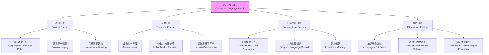
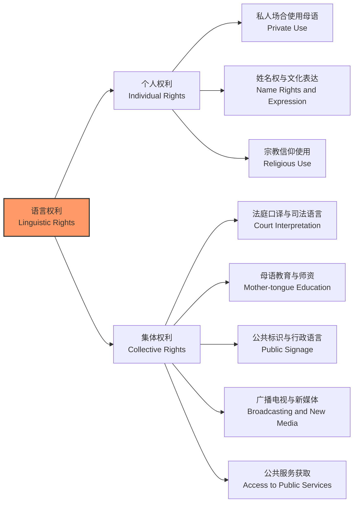
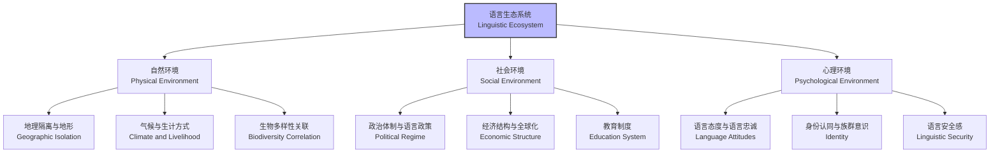

---
aliases:
  - 少数民族语言
  - Minority Languages
  - Endangered Languages
  - Language Preservation
  - Linguistic Diversity
tags:
  - linguistics
  - minority_languages
  - language_preservation
  - multilingualism
  - anthropology
  - documentation
  - language_policy
  - endangered_languages
---

# 少数民族语言 (Minority Languages)

少数民族语言是指在一个国家或地区范围内，由人口比例较小的民族群体所使用、传承和发展的语言系统。这些语言往往承载着独特的文化记忆、世界观与知识体系。在全球化与语言同质化的双重压力下，少数民族语言面临前所未有的濒危风险，因此语言保护、语言记录与多语言主义已成为当代语言学、人类学与社会政策研究中的核心交叉议题。

## 语言濒危与消亡 (Language Endangerment and Extinction)

### 濒危语言的等级划分体系

语言濒危状态并非简单的二元对立，而是一个具有连续性的渐变光谱。联合国教科文组织（UNESCO）于2003年发布的《语言活力与语言濒危》文件建立了目前最权威的六级评估框架：

| 等级 (Level) | 描述 (Description) | 使用者特征 (Speaker Profile) | 典型案例 |
| :--- | :--- | :--- | :--- |
| 安全 (Safe) | 语言在所有语域中被充分使用，儿童自然习得 | 所有年龄段，跨代际传承稳定 | 汉语普通话、英语、西班牙语 |
| 稳定但有危险 (Stable yet threatened) | 多数儿童学习，但使用域受限，受强势语言挤压 | 家庭与社区使用，学校与职场转用 | 威尔士语（20世纪中叶）、毛利语 |
| 不安全 (Unsafe) | 儿童主要在家庭内作为母语学习，社区使用减少 | 祖父母与父母辈，青少年转用 | 许多北美原住民语言 |
| 明确濒危 (Definitely endangered) | 儿童不再作为母语自然习得，仅存于 Older generation | 主要为祖父母辈，父母转用 | 鄂伦春语、满语（日常使用） |
| 严重濒危 (Severely endangered) | 仅老年人在有限语域中使用 | 祖父母辈，极少使用机会 | 赫哲语、锡伯语（部分方言） |
| 极度濒危 (Critically endangered) | 仅剩极少数老年使用者，半语者居多 | 极个别高龄老人 | 多种巴布亚语言、澳大利亚原住民语言 |
| 灭绝 (Extinct) | 无任何存活使用者，仅存在文献记录 | 无 | 吐火罗语、哥特语、塔斯马尼亚语 |

据民族学与语言学界的综合估计，全球现存约 7,000 种语言中，近一半处于不同程度的濒危状态。更令人忧虑的是，平均每两周就有一种语言随着最后一位使用者的离世而彻底灭绝，这意味着人类认知多样性的不可逆丧失。

### 语言消亡的多重动因

语言的消亡很少由单一因素导致，通常是社会、经济、政治与文化力量交织作用的结果：

- **语言压迫与强制同化 (Linguistic oppression and forced assimilation)**：国家层面推行的单一语言政策是语言消亡的最强驱动力。强制性国语教育、行政单语制、媒体垄断以及对少数民族语言的公开污名化，系统性地剥夺了少数语言的使用空间与合法性。
- **经济迁移与城市化 (Economic migration and urbanization)**：少数民族群体为寻求更好的教育、就业与医疗机会而迁入城市后，经济激励促使他们在公共领域甚至家庭内部放弃母语，转向主导语言。
- **文化霸权与媒体渗透 (Cultural hegemony and media penetration)**：主流文化通过电视、互联网与流行文化产品占据信息传播的主导地位，少数语言在媒体生态中被边缘化，导致年轻一代对母语的文化认同感减弱。
- **族际通婚与家庭语言转用 (Intermarriage and family language shift)**：族际婚姻比例上升加速了家庭内部语言环境的转变。当一方配偶不掌握对方语言时，主导语言往往成为家庭通用语，导致子女的母语习得中断。
- **教育体制的结构性排斥 (Structural exclusion in education)**：学校系统完全使用国家通用语授课，少数民族儿童被禁止或 discouraged 在课堂上使用母语，这种制度性安排是代际传承断裂的关键机制。

## 语言记录与档案化 (Language Documentation and Archiving)

### 记录语言学的核心原则

语言记录（Language Documentation）是当代语言学应对语言濒危危机的核心学术实践，其目标不仅是描写语法，更是为后世保存语言的全面语言证据，包括词汇、语法、语篇、会话、歌曲、仪式语言乃至手势与副语言特征。Himmelmann (1998) 提出的记录语言学框架强调以下核心原则：

1. **穷尽性 (Exhaustiveness)**：记录项目应尽可能覆盖该语言在不同语域（narratives, rituals, conversations, procedural texts, songs）中的使用，而非仅采集诱导式语料。
2. **真实性 (Authenticity)**：优先记录自然语境中的真实交际事件，避免研究者主导的话题诱导。自然对话、家庭互动与传统仪式是极高价值的记录对象。
3. **互操作性 (Interoperability)**：所有数据应采用开放标准进行编码与标注（如 XML、TEI、ELAN 时间对齐标注、PHOIBLE 音系数据库标准），确保长期可读与跨项目整合。
4. **社区参与 (Community involvement)**：将母语者视为合作研究者而非被动信息提供者，从项目设计、数据收集到成果回馈的全过程都应纳入社区的声音与需求。

### 多模态记录技术与工具

现代语言记录已发展为一门高度技术化的学科，依赖于多模态语料库的系统建设：

| 数据类型 (Data Type) | 技术标准 (Technical Standards) | 主要用途 (Primary Uses) |
| :--- | :--- | :--- |
| 高保真音频 (High-fidelity Audio) | WAV 或 FLAC 格式，采样率 48kHz，位深 24bit | 语音声学分析、音系与音调研究、词汇采集 |
| 高清视频 (High-definition Video) | MP4 或 MKV，分辨率不低于 1080p | 手势、体态、目光、会话互动、仪式表演 |
| 文本转写与标注 (Transcription and Annotation) | ELAN, FLEx, Praat, Toolbox | 语篇标注、形态分析、句法分析、语义标注 |
| 结构化元数据 (Structured Metadata) | IMDI, CMDI, Dublin Core 标准 | 资源发现、长期保存、跨库检索 |
| 词典与词汇数据库 (Lexical Database) | MDF, LIFT 格式 | 词汇语义、形态变化、历史比较 |
| 地理信息 (Geospatial Data) | GPS 坐标、GIS 图层 | 方言地理学、语言接触与迁移研究 |

国际层面的数字基础设施为濒危语言数据提供了长期存储与开放获取平台。**Pangloss Collection**（法国国家科学研究中心）与 **Endangered Languages Archive (ELAR)**（伦敦大学亚非学院）是全球最具影响力的两大濒危语言数字档案库，分别收藏了数千小时的录音、录像与转写文本。

### 语言记录中的伦理挑战

语言记录不仅是学术活动，更涉及深刻的伦理与权力关系：

- **知情同意的复杂性**：当记录神圣知识或禁忌词汇时，个人同意是否足够？社区集体决策机制如何建立？
- **知识产权的归属**：记录成果归研究者、资助机构还是语言社区？**CARE 原则**（Collective benefit, Authority to control, Responsibility, Ethics）为土著数据治理提供了框架。
- **知识回馈与可持续性**：研究者离开后，社区如何访问、维护与更新语言档案？建立社区本位的本地数字档案是可持续之道。

## 多语言主义与语言权利 (Multilingualism and Linguistic Rights)

### 个体多语言主义与社会多语言主义

多语言主义可在个体层面与社会层面分别加以理解，二者既有联系又有区别：

- **个体多语言主义 (Individual multilingualism)**：指单个说话者掌握并使用两种或两种以上语言的能力。语言能力并非全有或全无，而是呈梯度分布，可用 $L_1, L_2, \dots, L_n$ 表示其在不同语言上的熟练度序列。一个熟练的三语者可能在家庭中使用 $L_1$（母语），在学校中使用 $L_2$（国家通用语），在职场中使用 $L_3$（国际通用语如英语）。
- **社会多语言主义 (Societal multilingualism)**：指一个社区或国家内多种语言共存并各自承担特定社会功能的语言生态。Fishman 的 **语域理论 (Domain Theory)** 指出，不同语言在不同语域（家庭、学校、宗教、行政、职场、媒体）中功能分化，形成稳定的 **语言分工 (language allocation)**。

### 语言权利的国际法框架

少数民族的语言权利受到多项国际人权公约的明确保护：

- **《公民权利和政治权利国际公约》第27条**：明确规定"少数民族成员不得被剥夺与其群体中其他成员共同享有自己的文化、信奉自己的宗教、使用自己的语言的权利"。
- **《欧洲区域或少数民族语言宪章》**：要求缔约国在教育、行政、司法、媒体、文化设施与经济社会生活中采取具体措施保护区域或少数民族语言。
- **《联合国土著人民权利宣言》第13-16条**：强调土著人民有权 "revitalize, use, develop and transmit to future generations their histories, languages, oral traditions, philosophies, writing systems and literatures"。

## 语言复兴与逆转语言转用 (Language Revitalization and Reversing Language Shift)

### Joshua Fishman 的逆转语言转用模型

Fishman 在其经典著作 *Reversing Language Shift* (1991) 中提出了八阶段模型，即 **代际干扰程度分级量表 (Graded Intergenerational Disruption Scale, GIDS)**，用于评估语言濒危程度并制定针对性的复兴策略：

| 阶段 (Stage) | 状态描述 (Status Description) | 复兴策略 (Revitalization Strategies) |
| :--- | :--- | :--- |
| 第8阶段 | 仅剩极少数老年单语者，几乎无任何交际功能 | 建立博物馆式档案、文献记录、口述史采集 |
| 第7阶段 | 老年人在社区外不再使用该语言，内部交际极度有限 | 成人沉浸式项目、语言营地、社区记忆工程 |
| 第6阶段 | 社区内部存在跨代际口头传承，但读写未建立 | 家庭与社区强化计划、亲子语言巢 |
| 第5阶段 | 读写传承存在但无官方地位，学校未纳入 | 学校双语教育、沉浸式教学、教材开发 |
| 第4阶段 | 基础教育中部分使用，面临标准语竞争 | 主流学校体系融入、双语师资培训 |
| 第3阶段 | 地方或地区行政中使用，媒体有限覆盖 | 争取行政权力下放、地方语言法案 |
| 第2阶段 | 低于国家级的公共服务与行政公务中使用 | 扩大服务域、公共服务双语化 |
| 第1阶段 | 国家级公务、高等教育与大众媒体中充分使用 | 制度化巩固、宪法地位确认、国家级媒体 |

Fishman 强调，复兴工作必须 "从家庭开始"（"from the family forward"），因为代际家庭传输是语言存活的最关键节点。缺乏家庭内部使用的语言复兴注定是表面性的。

### 全球语言复兴实践案例

- **希伯来语 (Hebrew)**：19 世纪末至 20 世纪最引人注目的语言复兴案例。Eliezer Ben-Yehuda 等人通过系统性词汇创新、教育体系重建与日常交际推广，成功将希伯来语从仅限于宗教仪式与文学的语言转变为以色列的国语与数百万人的日常母语。
- **毛利语 (Māori)**：新西兰自 1982 年起推行 **Kōhanga Reo**（语言巢）项目，将学龄前儿童置于全毛利语沉浸式环境中，实现了代际传承的显著逆转。Kura Kaupapa Māori（毛利语学校）进一步将沉浸式教育延伸至中小学阶段。
- **威尔士语 (Welsh)**：威尔士议会通过教育立法（如 1988 年《教育改革法》与 2011 年《威尔士语言 measure》），使威尔士语在学校教育中制度化，使用者比例从 20 世纪最低谷回升至约 29%。
- **爱尔兰语 (Irish / Gaeilge)**：爱尔兰共和国将爱尔兰语列为第一官方语言，Gaeltacht（爱尔兰语区）获得特殊文化地位，但城市化进程中仍面临严峻挑战。
- **粤语与吴语 (Cantonese and Wu)**：在中国，粤语（广东话）与吴语（上海话等）虽缺乏官方语言地位，但通过社区自媒体、地方戏曲传承与家庭内部坚持，维持了显著的日常活力。然而，普通话推广政策与城市化进程对这些方言构成了持续性压力。

## 语言生态学与语言多样性 (Linguistic Ecology and Diversity)

### 量化语言多样性

语言多样性可通过多种指标加以量化，为比较研究与政策评估提供依据：

- **Greenberg 多样性指数 (Greenberg's Diversity Index)**：

$$
H = 1 - \sum_{i=1}^{n} p_i^2
$$

其中 $p_i$ 为第 $i$ 种语言使用者占总人口的比例。$H$ 越接近 1，表明语言多样性越高；越接近 0，表明语言同质性越强。

- **语言丰富度指数 (Language Richness Index)**：单位面积或单位人口内的语言种类数量。巴布亚新几内亚以约 840 种语言与不到 900 万人口，成为全球语言最密集的国家。

### 语言生态学视角

Einar Haugen (1972) 提出的 **语言生态学 (Ecology of Language)** 将语言视为生态系统的一部分，强调语言与其物理环境、社会环境及心理环境之间的互动：

语言多样性的丧失不仅意味着沟通工具的减少，更代表着独特世界观、传统知识体系（如药用植物知识、生态管理智慧）与非物质文化遗产的不可逆灭绝。研究显示，生物多样性高的地区往往语言多样性也高，暗示了语言与生态系统之间深刻的共生关系。

## 社区本位记录与参与式行动研究

### 从外部主导到社区合作

传统的语言记录往往由外部研究者主导，导致知识产权纠纷、伦理争议与成果脱离社区需求。当代最佳实践强调 **社区本位 (Community-based)** 方法，其核心要素包括：

1. **合作设计 (Collaborative design)**：研究问题、记录优先项与成果形式由社区与研究团队共同制定，确保项目回应社区的实际需求。
2. **能力构建 (Capacity building)**：培训社区成员掌握记录技术（录音、录像、档案管理、网页设计），使语言记录能力扎根于社区内部。
3. **知识回馈与双向流动 (Knowledge repatriation)**：所有原始数据、转写文本与分析成果的副本应及时归还社区，优先满足社区内部的语言教育与文化传承需求。
4. **可持续数字基础设施 (Sustainable digital infrastructure)**：帮助社区建立本地可维护的数字档案，而非仅依赖外部机构的长期托管。

### 伦理准则的实践

语言记录中的伦理决策往往没有唯一正确答案，但以下框架有助于 navigate 复杂情境：

| 伦理挑战 (Ethical Challenge) | 具体表现 (Manifestation) | 应对策略 (Mitigation Strategy) |
| :--- | :--- | :--- |
| 知情同意的层级问题 | 个人同意 vs. 家族同意 vs. 社区集体同意 | 建立多层次协商机制，尊重传统权威结构 |
| 神圣与敏感知识 | 仪式语言、禁忌词汇、秘传知识 | 分级访问权限，社区控制公开范围 |
| 知识产权归属 | 研究者、资助机构、语言社区的权利冲突 | 签署共同拥有协议，采用知识共享许可 |
| 研究者的离开 | 项目结束后社区如何维护与更新 | 建立可持续本地档案，培训本地技术人员 |
| 利益分配不均 | 部分社区成员获益，其他人被边缘化 | 透明决策，广泛社区参与，利益共享 |

## 结语

少数民族语言是人类认知多样性与文化创造力的珍贵载体。面对全球化、城市化与语言同质化带来的巨大压力，当代语言学家、政策制定者与语言社区本身需要形成协作网络。语言学家从单纯的描述者转变为 **倡导者 (advocate)**、**合作者 (collaborator)** 与 **档案守护者 (archivist)**；政策制定者需要认识到语言多样性不是发展的障碍，而是文化资本与可持续发展的资源；而语言社区自身的能动性则是任何复兴努力能否成功的根本。唯有通过语言记录、政策干预、教育创新与社区自决相结合的综合路径，才能在全球化时代维护人类语言的多元生态，确保每一门语言所承载的独特人类经验不致湮没无闻。
