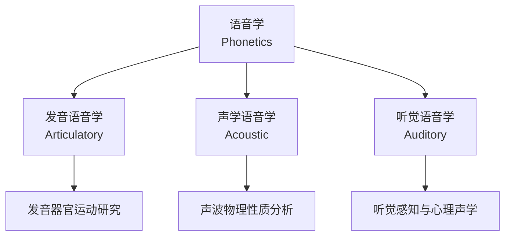

# 语音学 (Phonetics)

> 语音学是语言学中研究人类语音声音的分支，涉及语音的产生、传播和感知。分为**发音语音学** (Articulatory Phonetics)、**声学语音学** (Acoustic Phonetics) 和**听觉语音学** (Auditory Phonetics)。与音系学 (Phonology) 不同，语音学研究语音的物理属性。

## 三大分支

## 发音语音学 (Articulatory Phonetics)

### 发音器官

发音器官包括双唇 (Lips)、牙齿 (Teeth)、齿龈 (Alveolar Ridge)、硬腭 (Hard Palate)、软腭 (Velum)、小舌 (Uvula)、咽腔 (Pharynx)、声门 (Glottis) 和鼻腔 (Nasal Cavity)。灵活的舌部分为舌尖 (Apex)、舌叶 (Blade)、舌面 (Dorsum) 和舌根 (Root)。声道从声带到唇约 17 厘米。

### 元音 (Vowels)

元音按三个参数分类：舌位前后 (Front/Central/Back)、舌位高低 (Close/Open)、唇形圆展 (Rounded/Unrounded)。IPA 元音四边形：

$$V = \begin{bmatrix}
i & \quad & u \\
ɪ & \quad & ʊ \\
e & \quad & o \\
ɛ & \quad & ɔ \\
æ & \quad & ɒ \\
a & \quad &
\end{bmatrix}$$

[i]: 前高不圆唇 (see /siː/)；[u]: 后高圆唇 (too /tuː/)；[a]: 前低不圆唇 (father /ˈfɑːðər/)；[ə]: 中央元音 schwa (about /əˈbaʊt/)；[e]: 前中高不圆唇 (face /feɪs/)；[ɔ]: 后中低圆唇 (thought /θɔːt/)；[æ]: 前次低不圆唇 (trap /træp/)。

### 辅音 (Consonants)

辅音按三个参数分类：发音部位 (Place of Articulation)、发音方式 (Manner of Articulation) 和声带振动 (Voicing)。

| 部位\方式 | 双唇 | 齿龈 | 硬腭 | 软腭 | 声门 |
|----------|------|------|------|------|------|
| 塞音 | p b | t d | | k g | ʔ |
| 鼻音 | m | n | ɲ | ŋ | |
| 擦音 | ɸ β | s z | ʃ ʒ | x ɣ | h ɦ |
| 近音 | | ɹ | j | w | |
| 边近音 | | l | ʎ | ʟ | |

发音方式有七种主要类型：塞音 (Plosive)、擦音 (Fricative)、塞擦音 (Affricate)、鼻音 (Nasal)、近音 (Approximant)、边音 (Lateral)、颤音 (Trill)。发音部位有十个位置：双唇、唇齿、齿、齿龈、龈后、硬腭、软腭、小舌、咽、声门。

### 发声类型 (Phonation Types)

清音 (Voiceless): 声门打开不振动。浊音 (Voiced): 声门靠近声带振动。送气 (Aspiration): 除阻后气流段，如 [pʰ] vs [p]，在汉语中"趴" vs "八"。紧喉音 (Creaky Voice): 声带被压缩。气嗓音 (Breathy Voice): 声带不完全闭合。耳语音 (Whisper): 声门裂收缩。

### Coarticulation 协同发音

语音在语流中相互影响。唇化 (Labialization): 伴随圆唇动作。腭化 (Palatalization): 舌面抬向硬腭。软腭化 (Velarization): 舌根抬向软腭。鼻化 (Nasalization): 软腭提前下降。

## 声学语音学 (Acoustic Phonetics)

### 声波基础

$$f = \frac{1}{T}$$

频率是周期的倒数。语音声波由基频 (Fundamental Frequency) 和谐波 (Harmonics) 组成。

### 共振峰 (Formants)

元音音质由前三个共振峰决定。F1 与舌位高低负相关，F2 与舌位前后相关，F3 与舌尖形状相关。

汉语普通话元音共振峰 (Hz)：

| 元音 | F1 | F2 | F3 |
|-----|----|----|----|
| [i] | 290 | 2360 | 3570 |
| [u] | 380 | 440 | 3660 |
| [a] | 830 | 1480 | 3670 |
| [ɤ] | 450 | 1080 | 3300 |

### 语图 (Spectrogram)

语图展示时间-频率-振幅三维信息。横轴为时间，纵轴为频率，颜色深浅表示能量强度。

### 声调 (Tone)

汉语普通话四个声调：阴平 (T1): 55 高平；阳平 (T2): 35 中升；上声 (T3): 214 降升；去声 (T4): 51 高降。声调的声学相关物是基频变化。

### 重音与语调

重音通过响度、音高和时长突出音节。语调是句子层面的音高变化。英语陈述句用降调，一般疑问句用升调。

## 听觉语音学 (Auditory Phonetics)

### 关键概念

**临界带** (Critical Bands): 人耳对频率的分辨率约 1/3 倍频程。**等响曲线** (Equal-Loudness Contour): 人耳对 2000-5000 Hz 最敏感。**听觉掩蔽** (Auditory Masking): 强声会掩盖弱声。

### 心理声学效应

人耳对频率的感知是对数性的，因此使用 Mel 刻度或 Bark 刻度来表示感知频率：

$$M = 2595 \log_{10}\left(1 + \frac{f}{700}\right)$$

## 国际音标 (IPA)

IPA 由国际语音学协会 (International Phonetic Association) 于 1886 年制定。核心原则是**一音一符** (One Sound, One Symbol)。IPA 图表包含辅音表和元音图，还有附加符号和超音段符号。IPA 扩展用于病理语言学。定期修订由国际语音学协会负责。

### IPA 标记示例

| 语言 | 词语 | IPA 转写 |
|------|------|---------|
| 英语 | "speech" | /spiːtʃ/ |
| 汉语 | "中文" | /ʈʂʊŋ˥ wən˧˥/ |
| 法语 | "rouge" | /ʁuʒ/ |
| 日语 | "寿司" | /sɯɕi/ |

## 源-滤波器模型 (Source-Filter Model)

$$S(f) = G(f) \cdot T(f) \cdot R(f)$$

$G(f)$ 为声源频谱，$T(f)$ 为声道传递函数，$R(f)$ 为辐射特性。该模型是语音合成与识别的基础。声源由声带振动产生（浊音）或湍流产生（清音），滤波器由声道的形状决定。

## 实验语音学方法

### 声学分析工具

- **Praat**: 最广泛使用的语音学分析软件，支持语图分析、标注、合成
- **WaveSurfer**: 轻量级语音分析工具
- **Audacity**: 通用音频编辑软件

### 发音研究技术

| 技术 | 原理 | 应用 |
|------|------|------|
| 动态腭位图 (EPG) | 电极测量舌腭接触 | 辅音发音研究 |
| 超声波 (Ultrasound) | 舌面成像 | 舌位可视化 |
| MRI | 声道三维成像 | 声道解剖研究 |
| 电磁发音仪 (EMA) | 传感器追踪舌运动 | 发音动力学 |

## 相关领域

- [[Phonology|音系学]]
- [[AppliedLinguistics|应用语言学]]
- [[../ChineseLanguageAndLiterature/ClassicalChinesePhilology|中国传统小学]]
- [[ComputationalLinguistics|计算语言学]]

---

- [[../../INDEX|当前目录索引]]
