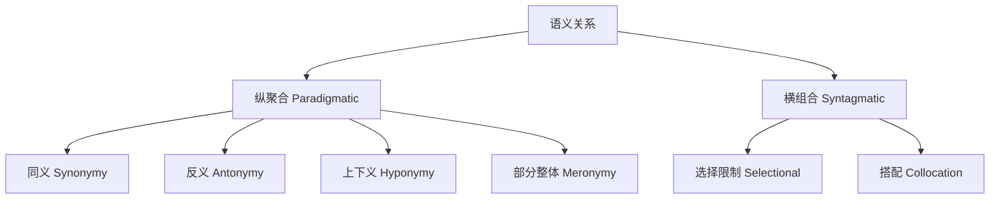

# Semantics

**语义学** (Semantics)
是语言学中研究意义的学科。
它探讨词汇、短语、句子和话语
如何在语言系统中表达意义。
语义学通常分为词汇语义学
(Lexical Semantics) 和
形式/组合语义学
(Formal / Compositional Semantics)。

## 语义学的基本单位 (Basic Units)

### 义素 (Semes) 与义位 (Sememes)

- **义素**: 最小的意义成分，
  如 [+人类]、[+男性]、[+成年]。
- **义位**: 词项的基本意义单位。

### 语义关系 (Semantic Relations)

#### 同义关系 (Synonymy)

两个或多个词具有相同或近似意义：
- 完全同义 (Absolute Synonymy): 罕见
- 近同义 (Near-Synonymy):
  "big" / "large" / "great"
- 方言同义: "lift" vs "elevator"

#### 反义关系 (Antonymy)

- **互补反义** (Complementary):
  dead-alive, 男-女 ($A = \lnot B$)
- **等级反义** (Gradable):
  hot-cold, 大-小（有中间状态）
- **方向反义** (Converse):
  buy-sell, 买-卖（视角转换）
- **反向反义** (Reversive):
  tie-untie, 包-解

#### 上下义关系 (Hyponymy)

上义词包含下义词：
- 动物 → 狗, 猫, 马
- 颜色 → 红, 蓝, 绿
- 家具 → 桌子, 椅子, 床

#### 部分整体关系 (Meronymy)

整体包含部分：
- 手 → 手指, 手掌, 手腕
- 汽车 → 引擎, 车轮, 底盘
- 树 → 树叶, 树干, 树根

### 成分分析法 (Componential Analysis)

$$
\begin{bmatrix}
男人 \\ woman \\ boy \\ girl
\end{bmatrix}
=
\begin{bmatrix}
+人类 \\ +人类 \\ +人类 \\ +人类
\end{bmatrix}
\begin{bmatrix}
+男性 \\ -男性 \\ +男性 \\ -男性
\end{bmatrix}
\begin{bmatrix}
+成年 \\ +成年 \\ -成年 \\ -成年
\end{bmatrix}
$$

这种方法源自结构语义学，
试图用语义特征 (Semantic Features)
的集合来定义词义。

## 形式语义学 (Formal Semantics)

### 真值条件语义学
(Truth-Conditional Semantics)

意义由句子的真值条件决定：
$$[S] = 1 \text{ iff } \text{条件成立}$$

### 语义组合原则
(Principle of Compositionality)

**Frege 原则**:
一个复合表达式的意义
是其组成部分的意义和组合方式的函数。
$$[S] = f([NP], [VP])$$

### 谓词逻辑 (Predicate Logic)

- 一元谓词: $\text{WALK}(x)$ = x 在走路
- 二元谓词: $\text{LOVE}(x, y)$ = x 爱 y
- 量词:
  $\forall x [\text{MAN}(x) \to \text{MORTAL}(x)]$

### 蒙塔古语法 (Montague Grammar)

Richard Montague 证明自然语言
可以用与形式语言相同的数学工具描述，
将句法和语义统一在范畴语法的框架下。

### Lambd 演算 (Lambda Calculus)

$$\lambda x.\text{DOG}(x)$$

语义学家用 $\lambda$ 表达式
表示谓词的语义类型和组合方式。

## 词汇语义学专题
(Topics in Lexical Semantics)

### 词义变化 (Semantic Change Types)

- **隐喻** (Metaphor):
  "瓶颈"、"桌腿"、"山脚"
- **转喻** (Metonymy):
  "白宫"指代美国政府
- **提喻** (Synecdoche):
  "人手不够"——人以部分代整体

### 多义与同形异义
(Polysemy vs Homonymy)

- **多义** (Polysemy):
  同一词的不同义项有关联
  （"口"：嘴巴、出口、人口）
- **同形异义** (Homonymy):
  同一形式不同词源
  （"bank"：河岸/银行）

### 语义场理论 (Semantic Field Theory)

词汇按照意义关系组织成场，
如颜色场、亲属场、军衔场。
Trier 指出语义场具有结构性质。

## 原型理论 (Prototype Theory)

Eleanor Rosch 提出语义范畴
具有原型结构。
例如"鸟"的原型是麻雀而非企鹅。
范畴成员具有家族 resemblance
(Wittgenstein, 1953) 特征。
隶属度可以用模糊逻辑描述：
$$\mu_A(x) \in [0, 1]$$

## 语义与语用 (Semantics vs Pragmatics)

| 维度 | 语义学 | 语用学 |
|-----|-------|-------|
| 关注 | 句子意义 | 说话人意义 |
| 语境依赖 | 不依赖 | 高度依赖 |
| 真值条件 | 核心 | 非核心 |
| 典型现象 | 蕴含、同义 | 含义、预设 |

## 当代语义学热点 (Current Topics)

- **分布语义学** (Distributional Semantics):
  "You shall know a word by the company
   it keeps" (Firth, 1957)。
  基于词向量的语义表示。
- **事件语义学** (Event Semantics):
  Davidson 提出事件论元，
  将事件作为逻辑谓词的基本论元。
- **认知语义学** (Cognitive Semantics):
  Lakoff 的概念隐喻理论，
  Langacker 的认知语法。
- **形式概念分析** (Formal Concept Analysis):
  基于格理论的数学语义分析方法。

## 相关领域

- [[Phonetics|语音学]]
- [[Pragmatics|语用学]]
- [[AppliedLinguistics|应用语言学]]
- [[../ComputerScience/ArtificialIntelligenceAndInterdisciplinary/NaturalLanguageProcessing|自然语言处理]]
- [[../ChineseLanguageAndLiterature/LiteraryCriticism|文学批评]]

---

- [[../../INDEX|当前目录索引]]

## 深入阅读与扩展分析
该领域的知识体系经过长期积累已相当丰富。
以下内容旨在帮助读者进一步把握核心要点。

### 知识结构导引
该学科的理论框架是多层次的。
从最抽象的本体论假设。
到中程理论的实证假设。
再到操作化的研究假设。
每一层都有其独特功能。

### 主要研究范式对比
| 维度 | 实证主义 | 解释主义 | 批判范式 |
|------|---------|---------|---------|
| 本体论 | 实在论 | 建构论 | 历史实在论 |
| 认识论 | 客观主义 | 主观主义 | 解放认知 |
| 方法论 | 定量为主 | 定性为主 | 对话辩证 |
| 目标 | 解释预测 | 理解意义 | 揭露解放 |

### 经典研究案例分析
案例研究的价值在于展示理论的实践应用。
以下是该领域中几个具有代表性的研究。
它们的方法设计和理论贡献值得深入分析。
每个案例都对学科的后续发展产生了影响。

### 跨文化比较视角
不同文化背景下存在显著的差异。
这些差异对理论普适性提出了挑战。
跨文化研究设计需要特别注意文化偏见。
本地化概念的使用需要细致定义。

### 当代前沿热点
1. 数字化与人工智能的社会影响
2. 全球不平等的新形态
3. 气候变化的社会回应
4. 身份政治与民主危机
5. 后疫情时代的社会变迁
6. 技术伦理与人文关怀

### 方法论工具箱
研究人员可以根据研究问题选择方法。
定量方法适合检验假设和推断总体。
定性方法适合探索意义和生成理论。
混合方法整合两类优势以增强说服力。
实验方法旨在建立因果关系。
纵向设计追踪变化和过程。
比较策略揭示制度和文化的差异。

### 学术资源推荐
主要学术期刊发表该领域的前沿研究。
专业学会组织学术会议和交流活动。
在线数据库提供文献检索服务。
开放获取资源降低了知识获取门槛。
学术博客和播客提供了非正式的学习渠道。

### 学习路径设计
初学者应从通论性教材开始学习。
在建立基本框架后阅读经典原著。
然后选择感兴趣的方向深入阅读。
参与讨论和写作有助于深化理解。
独立研究是培养学术能力的核心环节。

### 批判性思维训练
学会质疑前提假设是学术训练的关键。
考察证据是否充分支持结论。
辨别因果关系与相关关系的区别。
识别论证中的逻辑谬误。
评估不同解释的合理性。
反思自身的认知偏见。

### 学术职业发展
学术道路需要长期投入和持续学习。
发表论文是学术生涯的必经之路。
学术网络的建设需要主动参与。
教学与研究之间的平衡值得关注。
跨学科能力在当代学术市场日益重要。

### 研究的公共价值
学术研究应当服务于公共福祉。
知识创新推动社会进步。
政策咨询将学术转化为实践。
公众科普缩小知识鸿沟。
社会批评促进反思和改进。

### 未来展望
该领域将继续回应时代提出的新问题。
技术进步为研究提供了新的工具。
全球化使比较研究更加重要。
跨学科整合是未来的主要趋势。
学术民主化需要更多元的参与者。

## 关键概念辨析
概念定义的清晰度直接影响研究的质量。
以下是该领域中若干容易混淆的概念。

**概念一与概念二的区分**：
前者侧重于外在的形式特征。
后者关注内在的运作机制。
两者在实际分析中往往需要结合使用。

**微观与宏观层面的联系**：
微观现象是宏观结构的基础。
宏观结构又约束微观行为。
理解两者的相互作用是社会分析的核心。

**静态分析与动态分析**：
静态分析关注某一时点的截面特征。
动态分析关注过程和变化的轨迹。
两种视角互补而非替代。

## 综合思考题
1. 该领域与其他相关学科的关系是什么？
2. 该领域最核心的学术贡献有哪些？
3. 经典理论在当代的有效性如何？
4. 该领域的研究方法有什么特点？
5. 数字技术如何改变该领域的研究实践？
6. 该领域存在哪些未解决的重要问题？
7. 全球化如何影响该领域的研究议程？
8. 该领域的知识如何应用于公共政策？
9. 跨学科整合面临哪些机遇和挑战？
10. 未来十年该领域可能有哪些突破？

## 相关条目
- [[INDEX|当前目录索引]]
