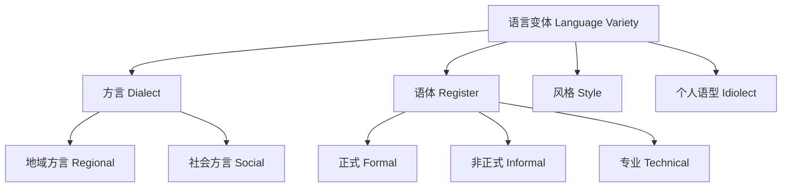

# Sociolinguistics

**社会语言学** (Sociolinguistics)
研究语言与社会之间的互动关系。
它考察语言变体如何与社会因素
（阶层、性别、年龄、地域、种族等）相关联，
并分析语言政策、语言态度
和语言变化的社会动因。
社会语言学与人类语言学、方言学、
语言人类学等学科密切交叉。

## 核心概念 (Core Concepts)

### 语言变体 (Language Variety)

语言并非单一的均质系统，
而是由多种变体构成的复杂系统。

### 社会变量 (Social Variables)

- **社会阶层** (Social Class):
  Labov 的纽约百货公司研究
  发现 [r] 发音与阶层的关联。
- **性别** (Gender):
  男女在语言使用中的差异，
  如女性更倾向于使用标准变体。
- **年龄** (Age):
  年龄级差 (Age-Grading)
  与代际语言变化。
- **社会网络** (Social Network):
  Milroy 的贝尔法斯特研究。
- **语域** (Domain):
  Fishman 提出的家庭、友谊、
  宗教、教育、工作等语域。

## 方言学 (Dialectology)

### 地域方言 (Regional Dialects)

- **等语线** (Isogloss):
  方言特征的地理分界线。
- **方言连续体** (Dialect Continuum):
  地理相邻的方言渐变。
- **方言分类** (Dialect Classification)。
- **中心城市与语言辐射**:
  标准语的形成机制。

汉语七大方言区：

| 方言区 | 代表 | 人口(约) | 分布 |
|-------|------|---------|------|
| 北方方言 | 北京话 | 8.7亿 | 华北东北西南 |
| 吴语 | 上海话 | 9000万 | 苏南浙江 |
| 粤语 | 广州话 | 8000万 | 广东广西香港 |
| 闽语 | 厦门话 | 7500万 | 福建台湾 |
| 湘语 | 长沙话 | 4500万 | 湖南 |
| 赣语 | 南昌话 | 3000万 | 江西 |
| 客家话 | 梅州话 | 4000万 | 粤闽赣 |

### 社会方言 (Social Dialects)

社会经济地位、教育水平和
职业群体的语言差异。
Labov 在 Martha's Vineyard 的研究
显示社会身份认同驱动语言变化。
在职位访谈中，不同社会阶层
在非标准语法结构的使用上
呈现显著差异。

### 言语社区 (Speech Community)

一个群体共享特定的语言规范、
语言态度和评价标准。
言语社区不一定地理相邻，
网络社区和职业群体也构成
言语社区。

## 语言与社会身份
(Language and Social Identity)

### 声望 (Prestige)

- **显性声望** (Overt Prestige):
  标准语言的官方地位和社会认可。
- **隐性声望** (Covert Prestige):
  非标准方言的社区认同价值，
  如工人阶级的团结感。

### 适应理论 (Accommodation Theory)

Giles 提出的话语调整理论：

- **趋同** (Convergence):
  说话者调整语言以靠近对话者，
  减少社会距离。
- **趋异** (Divergence):
  说话者拉开语言距离以强调差异，
  突出群体身份。

### 语码转换 (Code-Switching)

在双语/多语环境中切换语言或变体。

- **语间转换** (Intersentential):
  句子之间的切换。
- **语内转换** (Intrasentential):
  句子内部的切换。
- **附加转换** (Tag-Switching):
  附加问句的转换。
- **情景转换** (Situational):
  根据场合转换。
- **隐喻转换** (Metaphorical):
  为表达特定意图转换。

## 语言规划与政策
(Language Planning & Policy)

### 语言规划类型

1. **地位规划** (Status Planning):
   选择官方语言、国语。
2. **本体规划** (Corpus Planning):
   词汇标准化、文字创制。
3. **习得规划** (Acquisition Planning):
   语言教育政策。
4. **声望规划** (Prestige Planning):
   提升语言的社会形象。

### 语言政策案例 (Case Studies)

- **中国**:
  推广普通话与保护少数民族语言并行。
- **加拿大**:
  英语和法语同为官方语言。
- **新加坡**:
  英语+母语的双语教育政策。
- **印度**:
  印地语和英语为官方语言，
  22 种附表语言。
- **欧盟**:
  24 种官方语言的多元语言主义。
- **法国**:
  杜邦法要求公共领域使用法语。

## 语言态度 (Language Attitudes)

**配对变语法** (Matched-Guise Technique):
让同一双语者使用不同语言
录同一段内容，
请受试者评价说话者特征。
研究揭示社会对语言变体的隐性态度，
以及语言偏见的社会心理学基础。

## 社会语言学研究方法

社会语言学的经典研究方法包括：
- 社会语言学访谈 (Labov)
- 快速匿名调查 (Rapid Anonymous Survey)
- 民族志观察 (Ethnographic Observation)
- 语码选择分析 (Code Choice Analysis)
- 语言景观分析 (Linguistic Landscape)
- 网络语言行为分析

## 当代社会语言学热点

- **网络语言** (Internet Language):
  社交媒体中的语言创新。
- **语言与全球化**:
  英语作为世界语的权力关系。
- **语言景观** (Linguistic Landscape):
  公共空间多语标识研究。
- **语言与性别认同** (Gender Identity):
  非二元性别语言实践。
- **多模态社会语言学**:
  图像、声音、手势的语言功能。

## 相关领域

- [[AppliedLinguistics|应用语言学]]
- [[HistoricalLinguistics|历史语言学]]
- [[MinorityLanguages|少数民族语言]]
- [[../ChineseLanguageAndLiterature/ChineseFolklore|中国民俗]]

---

- [[../../INDEX|当前目录索引]]

## 深入阅读与扩展分析
该领域的知识体系经过长期积累已相当丰富。
以下内容旨在帮助读者进一步把握核心要点。

### 知识结构导引
该学科的理论框架是多层次的。
从最抽象的本体论假设。
到中程理论的实证假设。
再到操作化的研究假设。
每一层都有其独特功能。

### 主要研究范式对比
| 维度 | 实证主义 | 解释主义 | 批判范式 |
|------|---------|---------|---------|
| 本体论 | 实在论 | 建构论 | 历史实在论 |
| 认识论 | 客观主义 | 主观主义 | 解放认知 |
| 方法论 | 定量为主 | 定性为主 | 对话辩证 |
| 目标 | 解释预测 | 理解意义 | 揭露解放 |

### 经典研究案例分析
案例研究的价值在于展示理论的实践应用。
以下是该领域中几个具有代表性的研究。
它们的方法设计和理论贡献值得深入分析。
每个案例都对学科的后续发展产生了影响。

### 跨文化比较视角
不同文化背景下存在显著的差异。
这些差异对理论普适性提出了挑战。
跨文化研究设计需要特别注意文化偏见。
本地化概念的使用需要细致定义。

### 当代前沿热点
1. 数字化与人工智能的社会影响
2. 全球不平等的新形态
3. 气候变化的社会回应
4. 身份政治与民主危机
5. 后疫情时代的社会变迁
6. 技术伦理与人文关怀

### 方法论工具箱
研究人员可以根据研究问题选择方法。
定量方法适合检验假设和推断总体。
定性方法适合探索意义和生成理论。
混合方法整合两类优势以增强说服力。
实验方法旨在建立因果关系。
纵向设计追踪变化和过程。
比较策略揭示制度和文化的差异。

### 学术资源推荐
主要学术期刊发表该领域的前沿研究。
专业学会组织学术会议和交流活动。
在线数据库提供文献检索服务。
开放获取资源降低了知识获取门槛。
学术博客和播客提供了非正式的学习渠道。

### 学习路径设计
初学者应从通论性教材开始学习。
在建立基本框架后阅读经典原著。
然后选择感兴趣的方向深入阅读。
参与讨论和写作有助于深化理解。
独立研究是培养学术能力的核心环节。

### 批判性思维训练
学会质疑前提假设是学术训练的关键。
考察证据是否充分支持结论。
辨别因果关系与相关关系的区别。
识别论证中的逻辑谬误。
评估不同解释的合理性。
反思自身的认知偏见。

### 学术职业发展
学术道路需要长期投入和持续学习。
发表论文是学术生涯的必经之路。
学术网络的建设需要主动参与。
教学与研究之间的平衡值得关注。
跨学科能力在当代学术市场日益重要。

### 研究的公共价值
学术研究应当服务于公共福祉。
知识创新推动社会进步。
政策咨询将学术转化为实践。
公众科普缩小知识鸿沟。
社会批评促进反思和改进。

### 未来展望
该领域将继续回应时代提出的新问题。
技术进步为研究提供了新的工具。
全球化使比较研究更加重要。
跨学科整合是未来的主要趋势。
学术民主化需要更多元的参与者。

## 关键概念辨析
概念定义的清晰度直接影响研究的质量。
以下是该领域中若干容易混淆的概念。

**概念一与概念二的区分**：
前者侧重于外在的形式特征。
后者关注内在的运作机制。
两者在实际分析中往往需要结合使用。

**微观与宏观层面的联系**：
微观现象是宏观结构的基础。
宏观结构又约束微观行为。
理解两者的相互作用是社会分析的核心。

**静态分析与动态分析**：
静态分析关注某一时点的截面特征。
动态分析关注过程和变化的轨迹。
两种视角互补而非替代。

## 综合思考题
1. 该领域与其他相关学科的关系是什么？
2. 该领域最核心的学术贡献有哪些？
3. 经典理论在当代的有效性如何？
4. 该领域的研究方法有什么特点？
5. 数字技术如何改变该领域的研究实践？
6. 该领域存在哪些未解决的重要问题？
7. 全球化如何影响该领域的研究议程？
8. 该领域的知识如何应用于公共政策？
9. 跨学科整合面临哪些机遇和挑战？
10. 未来十年该领域可能有哪些突破？

## 相关条目
- [[INDEX|当前目录索引]]
