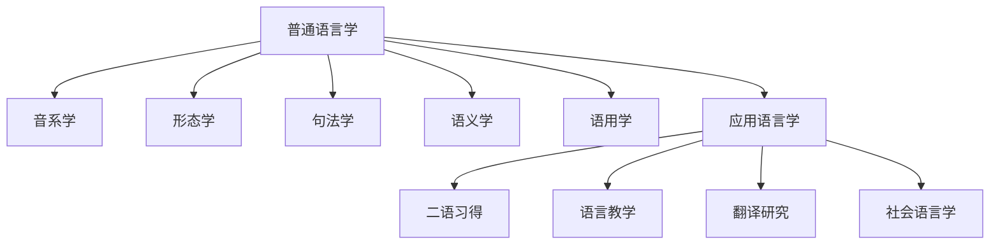

---
aliases:
  - 语言学与应用语言学
  - Linguistics and Applied Linguistics
  - 理论语言学
  - 语言习得
  - 语言教学
tags:
  - linguistics
  - applied_linguistics
  - phonology
  - syntax
  - semantics
  - sociolinguistics
  - language_acquisition
  - second_language_acquisition
  - education
---

# 语言学与应用语言学 (Linguistics and Applied Linguistics)

语言学是对人类语言进行系统科学研究的学科，旨在揭示语言的结构、意义、使用与演化规律。应用语言学则将语言学的理论、研究方法与实证发现应用于解决现实世界中的语言相关问题，涵盖语言教学、言语病理、语言政策、翻译技术与司法语言等领域。



## 音系学 (Phonology)

### 语音、音位与音位变体

音系学研究特定语言中语音的系统组织与功能区分，核心在于区分**语音 (Phone)**、**音位 (Phoneme)** 与**音位变体 (Allophone)**：

- **音位 (Phoneme)**：能够区分词义的最小语音单位。例如英语中 /p/ 与 /b/ 是两个不同音位，因为它们在 pin 与 bin 中构成了最小对立对 (Minimal Pair)
- **音位变体 (Allophone)**：同一音位在不同环境中的不同实现。例如英语中送气的 [pʰ] 和不送气的 [p] 都是 /p/ 的音位变体

### 特征与规则

| 概念 | 定义 | 示例 |
|------|------|------|
| 区别性特征 (Distinctive Features) | 区分音位的最小声学/发音属性 | [±voiced], [±nasal] |
| 音系规则 (Phonological Rules) | 描述语音变化的规律 | 英语复数的清浊同化 |
| 音节结构 (Syllable Structure) | 音节的内部组织方式 | 节首 (Onset) + 韵核 (Nucleus) + 节尾 (Coda) |

## 形态学 (Morphology)

形态学研究词的内在结构：

- **语素 (Morpheme)** — 最小的意义单位
- **自由语素 (Free Morpheme)** — 可独立成词，如 "book"
- **黏着语素 (Bound Morpheme)** — 必须附着在其他语素上，如 "-s", "-ed"
- **派生形态 (Derivational Morphology)** — 创造新词，如 "teach → teacher"
- **屈折形态 (Inflectional Morphology)** — 表达语法关系，如 "walk → walked"

| 语言类型 | 特点 | 示例语言 |
|----------|------|----------|
| 孤立语 (Isolating) | 每个词一个语素 | 汉语、越南语 |
| 黏着语 (Agglutinative) | 语素按序黏合 | 日语、土耳其语 |
| 屈折语 (Inflectional) | 语素融合多重意义 | 俄语、拉丁语 |
| 多式综合语 (Polysynthetic) | 单个词包含整句信息 | 因纽特语 |

## 句法学 (Syntax)

### 生成语法 (Generative Grammar)

乔姆斯基 (Chomsky) 认为人类具有先天的**语言能力 (Linguistic Competence)**，语法规则是对语言知识的描述。

### 短语结构

- **名词短语 (NP)** — A beautiful sunset
- **动词短语 (VP)** — reads a book quietly
- **介词短语 (PP)** — in the garden
- **形容词短语 (AP)** — very happy with the result

### 树形图与成分分析

```
       S
      / \
     NP  VP
    /   /  \
   N   V    NP
   |   |    |
  John saw  N
            |
           Mary
```

## 语义学 (Semantics)

| 概念 | 定义 |
|------|------|
| 指称 (Reference) | 语言表达式与外部世界实体的关系 |
| 含义 (Sense) | 表达式在语言系统内部的意义关系 |
| 蕴涵 (Entailment) | 一个命题蕴含另一个命题 |
| 预设 (Presupposition) | 话语默认的前提信息 |
| 组合原则 (Compositionality) | 整体意义由部分意义与组合规则决定 |

## 语用学 (Pragmatics)

### 言语行为理论 (Speech Act Theory)

奥斯汀 (Austin) 和塞尔 (Searle) 提出：

- **言之发 (Locution)** — 说出有意义的句子
- **言之为 (Illocution)** — 语力，即说话者意图
- **言之效 (Perlocution)** — 对听者产生的影响

### 合作原则 (Cooperative Principle)

格莱斯 (Grice) 的四大准则：

| 准则 | 说明 |
|------|------|
| 量的准则 (Quantity) | 信息量适中 |
| 质的准则 (Quality) | 不说假话、不说无根据的话 |
| 关联准则 (Relevance) | 说相关的话 |
| 方式准则 (Manner) | 表达清晰、避免歧义 |

## 应用语言学 (Applied Linguistics)

### 二语习得 (Second Language Acquisition)

| 理论 | 提出者 | 核心观点 |
|------|--------|----------|
| 输入假说 (Input Hypothesis) | 克拉申 (Krashen) | 可理解输入是习得的关键 |
| 输出假说 (Output Hypothesis) | 斯万 (Swain) | 语言输出促进语言准确性 |
| 互动假说 (Interaction Hypothesis) | 隆 (Long) | 意义协商推动习得 |
| 注意假说 (Noticing Hypothesis) | 施密特 (Schmidt) | 注意是习得的必要条件 |

### 语言教学法 (Language Teaching Methods)

- **语法翻译法 (Grammar-Translation Method)** — 以阅读和翻译为核心
- **听说法 (Audio-Lingual Method)** — 以句型操练为基础
- **交际教学法 (Communicative Language Teaching)** — 以真实交际为目标
- **任务型教学 (Task-Based Language Teaching)** — 以完成任务为驱动

---
*语言学是通向人类心智的窗口。理解语言，就是理解我们自己的思维本质。*
