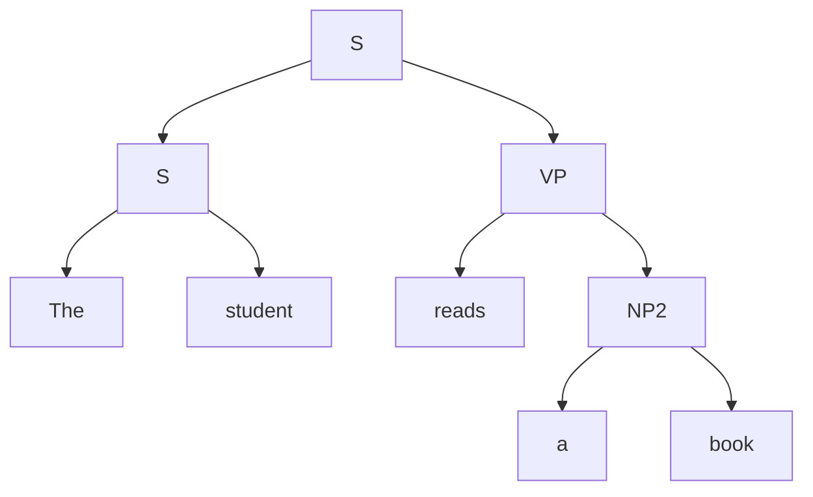
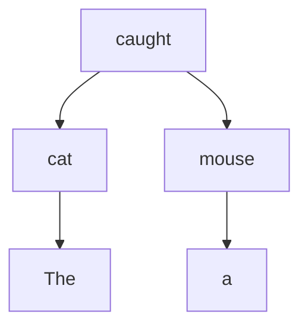

# 语言学核心分支

## 1. 语音学（Phonetics）

### 1.1 发音语音学（Articulatory Phonetics）

发音语音学研究语音的产生过程，涉及发音器官的协调运动：

**发音器官**：肺（气流提供）、喉（声带振动与否）、咽腔、口腔（舌、腭、齿、唇）、鼻腔。

#### 1.1.1 辅音（Consonants）

辅音的描述涉及两个核心参数：**发音部位**和**发音方式**。

| 发音部位 | 说明 | 示例（IPA）|
|---------|------|------------|
| 双唇音（Bilabial）| 上下唇形成阻碍 | [p], [b], [m] |
| 唇齿音（Labiodental）| 下唇触上齿 | [f], [v] |
| 齿音（Dental）| 舌尖触上齿 | [θ], [ð] |
| 齿龈音（Alveolar）| 舌尖触齿龈 | [t], [d], [n], [s], [z], [l], [ɹ] |
| 卷舌音（Retroflex）| 舌尖向后卷 | [ʂ], [ʐ], [ɖ], [ɳ] |
| 腭龈音（Palato-alveolar）| 舌身靠近硬腭后部 | [ʃ], [ʒ], [tʃ], [dʒ] |
| 硬腭音（Palatal）| 舌面靠近硬腭 | [j], [ç] |
| 软腭音（Velar）| 舌后部靠近软腭 | [k], [g], [ŋ] |
| 小舌音（Uvular）| 舌后部靠近小舌 | [ʀ], [ʁ] |
| 声门音（Glottal）| 声门处形成阻碍 | [h], [ʔ] |

| 发音方式 | 说明 | 示例 |
|---------|------|------|
| 塞音（Stop/Plosive）| 完全阻塞后突然释放 | [p], [b], [t], [d], [k], [g] |
| 擦音（Fricative）| 狭窄通道产生湍流 | [f], [v], [s], [z], [ʃ], [ʒ], [h] |
| 塞擦音（Affricate）| 塞音+擦音连续 | [tʃ], [dʒ], [ts], [dz] |
| 鼻音（Nasal）| 气流通过鼻腔 | [m], [n], [ŋ] |
| 边音（Lateral）| 气流从舌两侧通过 | [l] |
| 近音（Approximant）| 发音器官靠近但无湍流 | [j], [w], [ɹ] |
| 颤音（Trill）| 发音器官连续振动 | [r]（西班牙语）|
| 闪音/拍音（Tap/Flap）| 一次快速接触 | [ɾ]（美式英语 butter）|

**辅音的描述公式**：[发音部位] + [发音方式] + [声带振动]

例：[b] = 双唇 + 塞音 + 浊音（声带振动）

#### 1.1.2 元音（Vowels）

元音的描述涉及三个核心参数：**舌位高低**、**舌位前后**、**圆唇度**。

| 舌位\前后 | 前 | 央 | 后 |
|-----------|-----|-----|-----|
| **高** | [i] [y] | [ɨ] [ʉ] | [ɯ] [u] |
| **半高** | [e] [ø] | [ɘ] [ɵ] | [ɤ] [o] |
| **半低** | [ɛ] [œ] | [ɜ] [ɞ] | [ʌ] [ɔ] |
| **低** | [a] [ɶ] | [ä] | [ɑ] [ɒ] |

注：左边为不圆唇，右边为圆唇（如 [i] 不圆唇，[y] 圆唇）。

**基本元音图**（Cardinal Vowels, Daniel Jones）：四个极端点 [i], [a], [ɑ], [u] 构成元音空间的边界。

**汉语普通话单元音**：[i], [u], [y], [ə], [a], [ɤ], [o], [ɨ]（舌尖元音）。

### 1.2 声学语音学（Acoustic Phonetics）

声学语音学研究语音的物理特性。

**核心概念**：
- **频率（Frequency）**：声带振动频率，单位 Hz。基频（F0）决定音高。
- **共振峰（Formants）**：声道共振产生的能量集中区。F1（与舌位高低相关）、F2（与舌位前后相关）、F3。
- **振幅（Amplitude）**：声波的强度，决定响度。
- **时长（Duration）**：语音持续的时间。

| 元音 | F1 (Hz) | F2 (Hz) |
|------|---------|---------|
| [i] | 250-300 | 2200-2600 |
| [a] | 700-900 | 1100-1400 |
| [u] | 300-400 | 600-900 |

### 1.3 听觉语音学（Auditory Phonetics）

听觉语音学研究人耳如何感知和加工语音信号。
- 听觉器官（外耳→中耳→内耳→听觉神经）
- **范畴感知**（Categorical Perception）：人将连续的声学信号感知为离散的语音范畴
- 语音的听觉线索——VOT（Voice Onset Time）区分清浊塞音

### 1.4 国际音标（IPA, International Phonetic Alphabet）

IPA 是精确记录人类语言语音的符号系统，由国际语音学学会制定。

**IPA 图表结构**：
- 辅音表：行=发音部位，列=发音方式
- 元音图：舌位高低（纵轴）× 舌位前后（横轴）
- 附加符号：送气 [pʰ]、唇化 [kʷ]、齿化 [t̪]、长音 [iː]、鼻化 [ã]
- 声调符号：˥ 高、˧ 中、˩ 低；˥˩ 高降

**宽式 vs 严式标音**：宽式 /p/（音位标音），严式 [pʰ]（语音标音）。

---

## 2. 音系学（Phonology）

### 2.1 音位与音位变体

**音位（Phoneme）**：能够区分意义的最小语音单位，以 / / 表示。

**音位变体（Allophone）**：同一音位的不同语音实现。

| 音位 | 变体 | 分布条件 | 示例 |
|------|------|---------|------|
| /p/ | [pʰ] | 音节开头重读音节 | "pin" [pʰɪn] |
| /p/ | [p] | 跟在 /s/ 后 | "spin" [spɪn] |
| /t/ | [tʰ] | 音节开头 | "top" [tʰɑp] |
| /t/ | [ɾ] | 两元音间非重读 | "butter" [bʌɾɚ]（美式）|

### 2.2 最小对立对（Minimal Pairs）

最小对立对是仅有一个音位差异且意义不同的词对：

| 最小对立对 | 音位对立 |
|-----------|---------|
| /bæt/ (bat) vs /pæt/ (pat) | /b/ vs /p/（清浊）|
| /lɪp/ (lip) vs /lɪk/ (lick) | /p/ vs /k/（发音部位）|
| /bɪt/ (bit) vs /biːt/ (beat) | /ɪ/ vs /iː/（元音长短）|

### 2.3 区别特征（Distinctive Features）

Chomsky & Halle 在 **SPE**（The Sound Pattern of English, 1968）中提出的区别特征体系：

| 特征类别 | 特征 | 说明 |
|---------|------|------|
| 主类 | [±consonantal] [±sonorant] [±syllabic] | 基本类别划分 |
| 发音部位 | [±anterior] [±coronal] [±high] [±low] [±back] [±round] | 何处发音 |
| 发音方式 | [±continuant] [±nasal] [±lateral] [±strident] | 如何发音 |
| 声门状态 | [±voice] [±spread glottis] [±constricted glottis] | 声带状态 |

**自然类（Natural Class）**：共享一组区别特征的音段集合。如 [+voice +sonorant] = 所有响音（元音、鼻音、边音、近音）。

### 2.4 音节结构（Syllable Structure）

音节由以下成分构成：

- **节首（Onset）**：音节首辅音（可有可无）
- **韵基（Rhyme）** = **韵核（Nucleus）** + **韵尾（Coda）**
  - 韵核：音节核心，通常为元音（如 [æ] 在 /kæt/）
  - 韵尾：音节尾辅音（可有可无）

**结构图**：
```
         σ (syllable)
        / \
       O   R
      /   / \
     C   N   C
     |   |   |
     k   æ   t    → [kæt]
```

**音节的响度层次**（Sonority Hierarchy）：元音 > 半元音 > 边音 > 鼻音 > 擦音 > 塞音

**音节的普遍限制**（Sonority Sequencing Principle）：节首的响度渐增，韵尾的响度渐减。

### 2.5 超音段特征（Suprasegmentals）

| 特征 | 说明 | 示例 |
|------|------|------|
| **重音（Stress）** | 音节间的相对凸显度 | 英语 "record" /ˈɹekɔːd/ (N.) vs /ɹɪˈkɔːd/ (V.) |
| **声调（Tone）** | 音高区别词义 | 汉语 mā (妈) vs má (麻) vs mǎ (马) vs mà (骂) |
| **语调（Intonation）** | 句子的音高曲线 | 英语陈述句降调 vs 疑问句升调 |

**声调语言**：汉语（4个声调）、越南语（6个声调）、约鲁巴语（3个声调）。

---

## 3. 形态学（Morphology）

### 3.1 语素（Morpheme）

语素是语言中最小的**音义结合体**。

| 分类标准 | 类型 | 说明 | 示例 |
|---------|------|------|------|
| 独立性 | **自由语素** | 可独立成词 | book, run, happy |
| 独立性 | **黏着语素** | 必须附着于其他语素 | -ing, -ed, un-, -ness |
| 功能 | **词根（Root）** | 核心词汇意义 | 在"unhappiness"中为 happy |
| 功能 | **词缀（Affix）** | 附加语法/语义 | un-, -ness |

### 3.2 构词法（Word Formation）

**派生（Derivation）** 与 **屈折（Inflection）** 的区别：

| 特征 | 派生 | 屈折 |
|------|------|------|
| 是否改变词义 | 是 | 否 |
| 是否改变词类 | 可能 | 否 |
| 是否产生新词 | 是 | 否 |
| 是否与句法相关 | 否 | 是 |
| 示例 | happy → **un**happy (Adj) / happi**ness** (N) | walk → walk**s** / walk**ed** / walk**ing** |

**主要构词方式**：

| 构词方式 | 说明 | 示例 |
|---------|------|------|
| **派生** | 加词缀改变词义/词类 | nation → national → nationalize |
| **复合** | 两个自由语素结合 | class + room = classroom；snow + man = snowman |
| **转类** | 不改变形式而改变词类 | email (N.) → to email (V.)；bottle (N.) → to bottle (V.) |
| **缩略** | 缩短原有形式 | examination → exam；influenza → flu |
| **逆构** | 去掉假想词缀 | editor → to edit；beggar → to beg |
| **首字母缩略词** | 取首字母 | NATO /ˈneɪtoʊ/；UN /juːˈen/ |
| **混成** | 两词混合 | breakfast + lunch → brunch |

### 3.3 形态类型学（Morphological Typology）

| 类型 | 描述 | 特征 | 代表性语言 |
|------|------|------|-----------|
| **分析语（孤立语）** | 词=语素，无词形变化 | 以语序和虚词表达语法关系 | 汉语、越南语 |
| **黏着语** | 词缀逐个按顺序附着 | 每个词缀表达一种语法意义 | 土耳其语、日语 |
| **屈折语（融合语）** | 一个词缀含多种语法信息 | 词缀高度融合 | 俄语、拉丁语、阿拉伯语 |
| **多式综合语** | 一个词=一个句子 | 大量词缀包含主宾语信息 | 因纽特语、Mohawk 语 |

**土耳其语黏着示例**（每个词缀一个功能）：
```
ev    -ler   -imiz  -de
house -PL    -1PL   -LOC
"在我们的房子里"
```

**汉语分析语特征**：无时态、数、格等屈折变化，"我昨天看书"vs"我现在看书"中用时间词而非动词变形。

---

## 4. 句法学（Syntax）

### 4.1 句法范畴（Syntactic Categories）

| 词类范畴 | 说明 | 示例 |
|---------|------|------|
| N（名词）| 指称事物、人、地点、概念 | 书、桌子、爱情、张三 |
| V（动词）| 表示动作、状态、过程 | 吃、看、是、认为 |
| Adj（形容词）| 描述性质、状态 | 大、漂亮、高兴 |
| P（介词）| 表示关系 | 在、从、对于、with、in |
| Adv（副词）| 修饰动词/形容词/句子 | 非常、已经、probably |
| Det（限定词）| 限定名词 | 这、那、a、the |

**短语范畴**：NP（名词短语）、VP（动词短语）、AdjP（形容词短语）、PP（介词短语）、AdvP（副词短语）。

### 4.2 短语结构规则（Phrase Structure Rules）

**示例规则**：
```
NP  → (Det) (AdjP*) N (PP)
VP  → V (NP) (PP) (AdvP)
AdjP → (AdvP) Adj
PP  → P NP
S   → NP VP
```

**短语结构树**（"The student reads a book"）：


### 4.3 X-bar 理论（X-bar Theory）

Chomsky (1970) 提出的短语结构普遍模板：

- **Spec（Specifier）**：短语的限定成分
- **Head（中心语）**：短语的核心词
- **Complement（补足语）**：中心语的论元
- **Adjunct（附加语）**：修饰成分

**X-bar 结构**：
```
        XP
       / \
   Spec  X'
        / \
      X°  Complement
```

| 短语 | Specifier | Head | Complement |
|------|-----------|------|-----------|
| NP | 这些 | 书 | 语言学 |
| VP | — | 读 | 一本书 |
| AP | 非常 | 漂亮 | — |

### 4.4 递归性（Recursion）

递归性是人类语言的核心特征——语言规则可以反复应用于自身输出，生成无限长度的句子。

**例**：
```
张三 [认为 李四 [知道 王五 [说 赵六 来了]]]

NP → (Det) (AdjP*) N (PP)
              ↓
        可嵌套 PP 在 NP 中
```

Chomsky 认为递归性是**人类语言的本质特征**，是区分人类语言与动物交流系统的关键。Hauser, Chomsky & Fitch (2002) 提出"狭义语言机能"（FLN）假说。

### 4.5 生成语法（Generative Grammar）

**Chomsky 的语言学革命**：

| 理论阶段 | 核心思想 | 代表著作 |
|---------|---------|---------|
| 早期（1957-1965）| 短语结构+转换规则 | *Syntactic Structures* |
| 标准理论（1965）| 深层结构→表层结构 | *Aspects of the Theory of Syntax* |
| 扩展标准理论（1970s）| 约束、控制、界限原则 | *Lectures on Government and Binding* |
| 最简方案（1990s-）| 经济原则、合并-移位 | *The Minimalist Program* |

**Universal Grammar（普遍语法）**：人类生而有之的语言能力基础。包含：
- **原则（Principles）**：跨语言普遍共有的语法特性（如结构依存性）
- **参数（Parameters）**：语言间的差异值（如 pro-drop 参数：意大利语[+pro-drop]，英语[-pro-drop]）

**约束理论**（Binding Theory）：
- 照应词（himself）在管辖域内受约束
- 代名词（him）在管辖域内自由
- 指称语（John）在任何域内自由

### 4.6 依存语法（Dependency Grammar）

与短语结构语法不同，依存语法直接描述词之间的**依存关系**。

**核心思想**：句子中的词通过"依存弧"（dependency arcs）连接，一个词是**中心词**（head），另一个是**依存词**（dependent）。

**依存关系类型**（Universal Dependencies 框架）：

| 关系 | 说明 | 示例 |
|------|------|------|
| nsubj | 名词性主语 | 他_nsubj 吃 |
| obj | 宾语 | 吃_obj 苹果 |
| amod | 形容词修饰 | 红_amod 苹果 |
| nmod | 名词修饰 | 书_nmod 封面 |
| det | 限定词 | the_det book |

**依存树示例**（"The cat caught a mouse"）：


## 相关条目

- [[语义学语用学与语言类型学]]
- [[07_InterdisciplinarySciences/CognitiveScience/INDEX|CognitiveScience]]
- [[NaturalLanguageProcessing]]
- [[TranslationStudies]]
