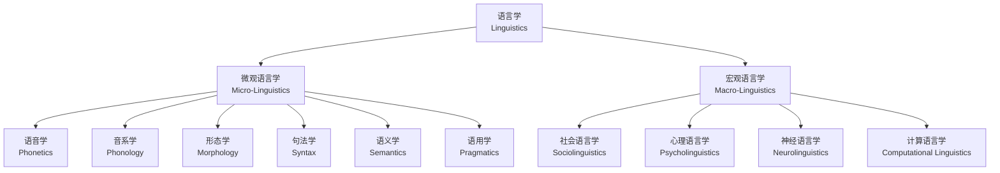
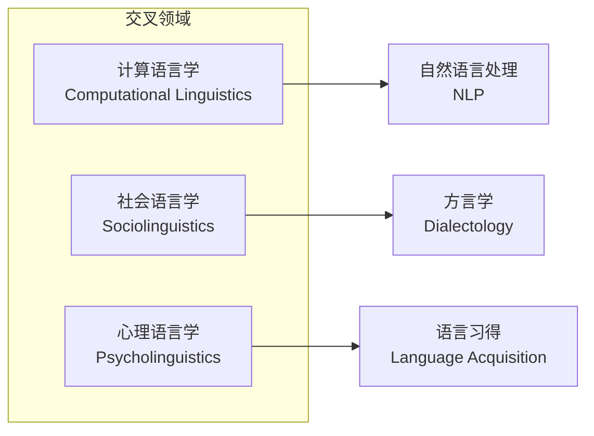

---
aliases:
  - Branches of Linguistics
  - 语言学分支
tags:
  - linguistics
  - phonetics
  - phonology
  - morphology
  - syntax
  - semantics
  - pragmatics
created: 2025-05-17
---

# 语言学的分支 (Branches of Linguistics)

语言学是研究人类语言的科学，主要分为微观语言学和宏观语言学两大领域。

## 核心分支总览 (Core Branches Overview)

## 语音学 (Phonetics)

研究语音的物理属性和生理机制。

| 分支 | 研究对象 | 方法 |
| :--- | :--- | :--- |
| 发音语音学 (Articulatory) | 发音器官的运动 | 观察与仪器测量 |
| 声学语音学 (Acoustic) | 声波的物理特性 | 声谱分析 |
| 听觉语音学 (Auditory) | 人耳的感知过程 | 感知实验 |

国际音标 (International Phonetic Alphabet, IPA) 是语音学的核心工具。

## 音系学 (Phonology)

研究语音在特定语言中的**系统性组织**和**功能**。

核心概念：
- **音位 (Phoneme)**：能够区分意义的最小语音单位
- **最小对立体 (Minimal Pair)**：如 /pɪt/ 与 /bɪt/ 的区别
- **区别性特征 (Distinctive Features)**：[±voice], [±nasal]

标记性理论 (Markedness Theory) 认为某些特征是"无标记的"（更自然、更常见）。

## 形态学 (Morphology)

研究**词**的内部结构和构词规则。

词素 (Morpheme) 分类：

$$
\begin{aligned}
\text{词素 (Morpheme)} &\to \text{自由词素 (Free)} \\
&\to \text{黏着词素 (Bound)} \begin{cases}
\text{派生词缀 (Derivational)} \\
\text{屈折词缀 (Inflectional)}
\end{cases}
\end{aligned}
$$

### 构词方式 (Word Formation)

| 方式 | 描述 | 例词 |
| :--- | :--- | :--- |
| 派生 (Derivation) | 加词缀 | un-happi-ness |
| 复合 (Compounding) | 词根+词根 | blackboard |
| 转类 (Conversion) | 改变词类 | email (n.) → email (v.) |

## 句法学 (Syntax)

研究句子结构，即词如何组合成合法的短语和句子。

### 短语结构规则 (Phrase Structure Rules)

$$
\text{NP} \to (\text{Det}) (\text{AdjP}) \text{N} (\text{PP})
$$

生成语法 (Generative Grammar) 由 Chomsky 创立，核心假设是人类具有**语言官能**（Language Faculty）。

## 语义学 (Semantics)

研究**意义**。核心维度包括：

- **词汇语义学 (Lexical Semantics)**：词义关系（同义、反义、上下义）
- **组合语义学 (Compositional Semantics)**：短语和句子的意义组合

$$
\llbracket \text{S} \rrbracket = \llbracket \text{VP} \rrbracket (\llbracket \text{NP} \rrbracket)
$$

真值条件语义学 (Truth-Conditional Semantics) 将句子的意义定义为使其为真的条件。

## 语用学 (Pragmatics)

研究**语境中的意义**，即语言在实际使用中的理解。

经典理论：

1. **言语行为理论 (Speech Act Theory)** — Austin & Searle
   - 言内行为 (Locutionary)
   - 言外行为 (Illocutionary)
   - 言后行为 (Perlocutionary)

2. **合作原则 (Cooperative Principle)** — Grice
   - 数量准则 (Quantity)
   - 质量准则 (Quality)
   - 关联准则 (Relation)
   - 方式准则 (Manner)

3. **礼貌理论 (Politeness Theory)** — Brown & Levinson

## 交叉学科 (Interdisciplinary Fields)

## 核心参考文献 (Key References)

- Saussure, F. de. (1916). *Course in General Linguistics*
- Chomsky, N. (1965). *Aspects of the Theory of Syntax*
- Lakoff, G. & Johnson, M. (1980). *Metaphors We Live By*
- Pinker, S. (1994). *The Language Instinct*
