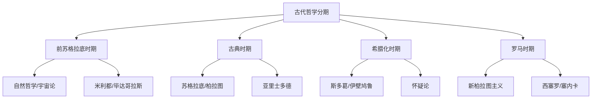
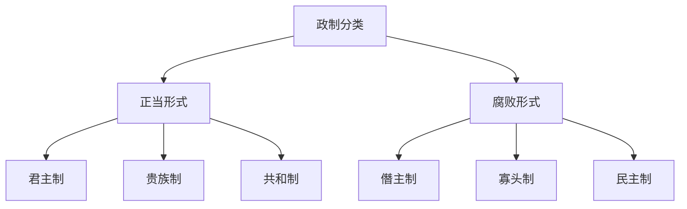

# AncientPhilosophy

古代哲学（Ancient Philosophy）
涵盖从公元前6世纪到公元5世纪
西方哲学的开端与早期发展。
它涵盖古希腊与古罗马时期的思想体系。
它是整个西方哲学的源头。
它奠定了形而上学（Metaphysics）、
认识论（Epistemology）、
伦理学（Ethics）
和政治哲学（Political Philosophy）
的核心问题与基本框架。

古代哲学的核心关切包括：
世界的本原是什么？
如何获得真正的知识？
最好的生活方式是什么？
正义的城邦如何构建？

## 历史分期

## 前苏格拉底哲学

前苏格拉底哲学家关注
宇宙的本原（arche, ἀρχή）。
其思考标志着
从神话思维（Mythos）
到理性思维（Logos）的根本转变。

### 米利都学派（Milesian School）

爱奥尼亚的米利都是
哲学诞生的摇篮。
三位代表人物：

- **泰勒斯（Thales, 约624-546 BCE）**
  第一位哲学家。
  主张水是万物的本原。
  他预言了日食。

- **阿那克西曼德（Anaximander, 约610-546 BCE）**
  提出"无定"（Apeiron）。
  一种无限永恒不定的物质。
  提出了最早的进化论猜想。

- **阿那克西美尼（Anaximenes, 约585-525 BCE）**
  以气（Aer）为本原。
  通过稀薄和凝聚解释变化。

### 毕达哥拉斯学派

毕达哥拉斯（约570-495 BCE）
在南意大利创立了学派。

核心主张：
- **数是万物的原则**
  音乐和声源自弦长整数比。
  万物皆数。

- **灵魂轮回（Metempsychosis）**
  灵魂在不同生命中转世。
  哲学使灵魂得到解脱。

- **对科学的影响**
  数学化自然的假设
  影响了柏拉图和近代科学。

### 爱利亚学派（Eleatic School）

- **巴门尼德（约515-450 BCE）**
  区分真理之路和意见之路。
  存在是不变/永恒/唯一的。
  变化是感官幻觉。
  这是第一次形而上学论证。

- **芝诺（约490-430 BCE）**
  以悖论闻名。
  阿喀琉斯追不上乌龟。
  证明运动不可能。
  2000年后才被微积分解决。

### 多元论与原子论

回应巴门尼德对变化的否定：

- **恩培多克勒（约493-433 BCE）**
  四根说：火/气/水/土。
  爱和争两种力量驱动。

- **阿那克萨戈拉（约500-428 BCE）**
  努斯（Nous）作为原动力。
  物质分为无数种子。

- **德谟克利特（约460-370 BCE）**
  原子论完成者。
  万物由原子和虚空构成。
  宇宙完全是机械论的。
  幸福在于内心的平静。

## 古典时期哲学

### 智者学派与苏格拉底

智者（Sophists）是
公元前5世纪雅典的职业教师。
普罗泰戈拉提出
"人是万物的尺度"。
最早的相对主义表达。

**苏格拉底（469-399 BCE）**
没有留下著作。
苏格拉底式反诘法：
通过持续追问揭示矛盾。

核心伦理主张：
1. 美德即知识——恶行源于无知
2. 未经审视的人生不值得活
3. 真正的智慧在于知道自己无知

公元前399年被判死刑。
饮下毒芹汁而死。
成为哲学史上的殉道象征。

### 柏拉图（427-347 BCE）

苏格拉底的学生。
创立雅典学园（公元前387年）。

**理念论（Theory of Forms）**
存在两个世界：
1. 现象世界——流变不完美的
2. 理念世界——永恒完美的

可感事物是理念的不完美摹本。
知识是关于理念的知识。
感官仅提供意见。

**洞穴比喻（Allegory of the Cave）**
囚徒看到火光照出的影子。
以为影子就是真实世界。
一个囚徒走出洞穴。
看到阳光下的真实世界。
回到洞穴却被杀死。
比喻哲人从虚假意识到真实知识。

**《理想国》**
正义是各司其职。
城邦三阶层各尽所职。
哲学家王应当成为统治者。

**回忆说（Anamnesis）**
在《美诺篇》中展示。
奴隶通过提问回忆几何定理。
知识是灵魂对前世的回忆。

### 亚里士多德（384-322 BCE）

马其顿人。
在雅典学园学习20年。
成为亚历山大大帝的老师。
创立吕克昂学园。

**对理念论的批判**
我爱老师但我更爱真理。
理念不能解释变化和运动。

**四因说（Four Causes）**
1. 质料因：事物由什么构成
2. 形式因：事物的本质定义
3. 动力因：如何被制造
4. 目的因：存在的目的

$$ \text{四因} = \text{质料} + \text{形式}
+ \text{动因} + \text{目的} $$

**形而上学**
研究"存在作为存在"。
实体是个体。
是形式和质料的复合体。

**逻辑学**
形式逻辑创始人。
三段论（Syllogism）：

$$ \text{所有人会死; 苏格拉底是人;}
\text{因此苏格拉底会死} $$

**伦理学**
德性伦理学传统。
幸福是符合德性的理性活动。
德性是过度与不足之间的中道。
勇气是鲁莽和怯懦的中道。

**政治学**
人在本性上是政治动物。

## 希腊化哲学

亚历山大大帝征服后。
哲学重心转向实践伦理学。
如何在动荡世界中获得安宁。

### 斯多葛学派

芝诺创立。

核心教义：
- 宇宙是理性的
  逻各斯统治一切。
- 顺从自然
  幸福在于接受宇宙安排。
- 控制二分法
  关注可控之事。
  接受不可控之事。

代表人物：
塞内卡、埃皮克提图、
马可·奥勒留。
奥勒留的《沉思录》
是斯多葛最广为流传的著作。

### 伊壁鸠鲁学派

伊壁鸠鲁（341-270 BCE）。

物理学：原子论+随机偏斜。
为自由意志留出空间。

伦理学：快乐是最高善。
快乐指安宁和无痛苦。
而非感官放纵。

死亡与我们无关。
当我们存在时死亡不存在。
当死亡存在时我们不存在。

### 怀疑论

皮浪：对所有命题悬搁判断。
任何命题都有同等反论证。
悬搁结果是心灵宁静。

### 新柏拉图主义

普罗提诺（204-270 CE）。
在《九章集》中提出。

$$ \text{太一} \rightarrow \text{理智}
\rightarrow \text{灵魂}
\rightarrow \text{物质世界} $$

太一超越一切范畴。
灵魂通过沉思回归太一。
影响了基督教神学。

## 古代哲学的核心遗产

| 领域 | 古代贡献 | 后世影响 |
|------|---------|---------|
| 形而上学 | 存在/实体 | 实在论/唯名论 |
| 认识论 | 知识与意见 | 理性主义之争 |
| 伦理学 | 德性伦理 | 美德伦理复兴 |
| 逻辑学 | 三段论 | 形式逻辑基础 |
| 政治哲学 | 正义/政体 | 社会契约论 |

## 主要原始文本

- 柏拉图：《理想国》《斐多》
- 亚里士多德：《形而上学》
- 亚里士多德：《伦理学》
- 马可·奥勒留：《沉思录》
- 普罗提诺：《九章集》

## 相关条目
- [[MedievalPhilosophy]]
- [[ModernPhilosophy]]
- [[Metaphysics]]
- [[Epistemology]]
- [[INDEX|当前目录索引]]

## 深入阅读与扩展分析
该领域的知识体系经过长期积累已相当丰富。
以下内容旨在帮助读者进一步把握核心要点。

### 知识结构导引
该学科的理论框架是多层次的。
从最抽象的本体论假设。
到中程理论的实证假设。
再到操作化的研究假设。
每一层都有其独特功能。

### 主要研究范式对比
| 维度 | 实证主义 | 解释主义 | 批判范式 |
|------|---------|---------|---------|
| 本体论 | 实在论 | 建构论 | 历史实在论 |
| 认识论 | 客观主义 | 主观主义 | 解放认知 |
| 方法论 | 定量为主 | 定性为主 | 对话辩证 |
| 目标 | 解释预测 | 理解意义 | 揭露解放 |

### 经典研究案例分析
案例研究的价值在于展示理论的实践应用。
以下是该领域中几个具有代表性的研究。
它们的方法设计和理论贡献值得深入分析。
每个案例都对学科的后续发展产生了影响。

### 跨文化比较视角
不同文化背景下存在显著的差异。
这些差异对理论普适性提出了挑战。
跨文化研究设计需要特别注意文化偏见。
本地化概念的使用需要细致定义。

### 当代前沿热点
1. 数字化与人工智能的社会影响
2. 全球不平等的新形态
3. 气候变化的社会回应
4. 身份政治与民主危机
5. 后疫情时代的社会变迁
6. 技术伦理与人文关怀

### 方法论工具箱
研究人员可以根据研究问题选择方法。
定量方法适合检验假设和推断总体。
定性方法适合探索意义和生成理论。
混合方法整合两类优势以增强说服力。
实验方法旨在建立因果关系。
纵向设计追踪变化和过程。
比较策略揭示制度和文化的差异。

### 学术资源推荐
主要学术期刊发表该领域的前沿研究。
专业学会组织学术会议和交流活动。
在线数据库提供文献检索服务。
开放获取资源降低了知识获取门槛。
学术博客和播客提供了非正式的学习渠道。

### 学习路径设计
初学者应从通论性教材开始学习。
在建立基本框架后阅读经典原著。
然后选择感兴趣的方向深入阅读。
参与讨论和写作有助于深化理解。
独立研究是培养学术能力的核心环节。

### 批判性思维训练
学会质疑前提假设是学术训练的关键。
考察证据是否充分支持结论。
辨别因果关系与相关关系的区别。
识别论证中的逻辑谬误。
评估不同解释的合理性。
反思自身的认知偏见。

### 学术职业发展
学术道路需要长期投入和持续学习。
发表论文是学术生涯的必经之路。
学术网络的建设需要主动参与。
教学与研究之间的平衡值得关注。
跨学科能力在当代学术市场日益重要。

### 研究的公共价值
学术研究应当服务于公共福祉。
知识创新推动社会进步。
政策咨询将学术转化为实践。
公众科普缩小知识鸿沟。
社会批评促进反思和改进。

### 未来展望
该领域将继续回应时代提出的新问题。
技术进步为研究提供了新的工具。
全球化使比较研究更加重要。
跨学科整合是未来的主要趋势。
学术民主化需要更多元的参与者。

## 关键概念辨析
概念定义的清晰度直接影响研究的质量。
以下是该领域中若干容易混淆的概念。

**概念一与概念二的区分**：
前者侧重于外在的形式特征。
后者关注内在的运作机制。
两者在实际分析中往往需要结合使用。

**微观与宏观层面的联系**：
微观现象是宏观结构的基础。
宏观结构又约束微观行为。
理解两者的相互作用是社会分析的核心。

**静态分析与动态分析**：
静态分析关注某一时点的截面特征。
动态分析关注过程和变化的轨迹。
两种视角互补而非替代。

## 综合思考题
1. 该领域与其他相关学科的关系是什么？
2. 该领域最核心的学术贡献有哪些？
3. 经典理论在当代的有效性如何？
4. 该领域的研究方法有什么特点？
5. 数字技术如何改变该领域的研究实践？
6. 该领域存在哪些未解决的重要问题？
7. 全球化如何影响该领域的研究议程？
8. 该领域的知识如何应用于公共政策？
9. 跨学科整合面临哪些机遇和挑战？
10. 未来十年该领域可能有哪些突破？

## 相关条目
- [[INDEX|当前目录索引]]
