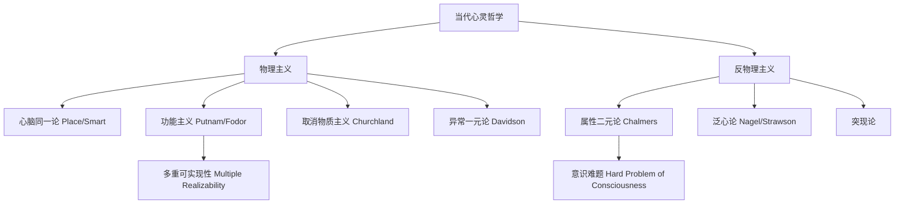
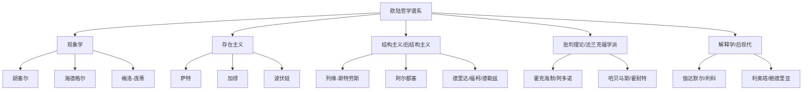

# ContemporaryPhilosophy

当代哲学（Contemporary Philosophy）通常指20世纪至今的哲学发展。这一时期最显著的特征是哲学传统的分裂与多样化——分析哲学（Analytic Philosophy）与欧陆哲学（Continental Philosophy）的深刻分化，以及后分析哲学试图超越这一分裂的努力。与此同时，社会政治议题（正义、性别、种族、环境）进入哲学议程的核心位置。

## 分析哲学（Analytic Philosophy）

分析哲学起源于弗雷格（Gottlob Frege）、罗素（Bertrand Russell）和摩尔（G. E. Moore）对英国唯心主义（Bradley, McTaggart）的反拨。分析哲学的基本方法是通过语言和逻辑分析解决哲学问题，强调清晰性、严格论证和科学相关性。

### 逻辑实证主义（Logical Positivism）

维也纳学派（Vienna Circle）在石里克（Moritz Schlick）领导下于1920年代形成，成员包括卡尔纳普（Rudolf Carnap）、纽拉特（Otto Neurath）和费格尔（Herbert Feigl）。其核心主张：

- **可证实性原则（Verification Principle）**：一个有认知意义的陈述要么是分析命题（逻辑或数学真理），要么在原则上可以被经验证实。形而上学、神学和美学的"伪命题"（Pseudo-propositions）因此被排除在知识范围之外。
- **统一科学（Unified Science）**：所有科学最终可以还原为物理语言，形成统一的科学体系。
- **情感主义伦理学（Emotivism）**（Ayer）：道德判断不表达事实，只表达情感——"杀戮是错的"相当于"杀戮，呸！"

逻辑实证主义在20世纪中期面临严重挑战。奎因（W. V. O. Quine）在《经验论的两个教条》（Two Dogmas of Empiricism, 1951）中摧毁了分析-综合命题的区分——没有"纯粹"的分析真理，所有信念都在经验法庭上接受整体性的审判（整体论 Holism）。

### 日常语言哲学（Ordinary Language Philosophy）

**后期维特根斯坦（Ludwig Wittgenstein）**在《哲学研究》（Philosophical Investigations, 1953）中颠覆了自己早期的《逻辑哲学论》观点。他提出：
- **语言游戏（Language Games）**：语言的使用是嵌入在"生活形式"（Form of Life）中的社会游戏。语言的意义由使用规则决定——"意义即使用"（Meaning is use）
- **家族相似（Family Resemblance）**：概念不有一个共同的本质特征，而是通过重叠交叉的相似性网络联系——游戏（Games）这个概念就是一个典型例子，棋类、球类、纸牌游戏没有共同的本质
- **反私人语言论证（Private Language Argument）**：不存在本质上私有的语言，语言在本质上是社会的

当前书写版本继续：

**牛津学派**：奥斯汀（J. L. Austin）发展了**言语行为理论**（Speech Act Theory），在《如何以言行事》（How to Do Things with Words, 1962）中区分了：
- **言内行为（Locutionary Act）**：说出一个有意义的语句
- **言外行为（Illocutionary Act）**：通过说话实施的行动（许诺、警告、命令、宣告）
- **言后行为（Perlocutionary Act）**：说话带来的后续效果（被说服、被恐吓）

### 分析哲学的核心领域发展

**科学哲学（Philosophy of Science）**：波普尔（Karl Popper）的**证伪主义**（Falsificationism）——科学和非科学的划界标准在于可证伪性，而非可证实性。库恩（Thomas Kuhn）在《科学革命的结构》（Structure of Scientific Revolutions, 1962）中提出**范式**（Paradigm）和**不可通约性**（Incommensurability）——科学进步不是线性累积，而是范式革命。拉卡托斯（Imre Lakatos）的**科学研究纲领方法论**（Methodology of Scientific Research Programmes）调和了波普尔和库恩。费耶阿本德（Paul Feyerabend）的《反对方法》（Against Method, 1975）主张"怎么都行"（Anything goes）的方法论无政府主义。

**心灵哲学（Philosophy of Mind）**：

查默斯（David Chalmers, 1996）的**意识难题**（Hard Problem of Consciousness）区分了容易问题（认知功能的解释）和真正困难的问题——为什么物理过程会产生主观体验（Qualia）？

**语言哲学**：克里普克（Saul Kripke）的《命名与必然性》（Naming and Necessity, 1980）复兴了本质主义形而上学。他提出**固定指示词**（Rigid Designator）和**因果指称论**（Causal Theory of Reference）——名称不是通过描述而是通过因果链条确定其指称。他还区分了**先天真理/必然真理**——真理的认识论和形而上学维度的交叉。刘易斯（David Lewis）的模态实在论（Modal Realism）主张所有可能世界都是具体实在的。

### 分析哲学的发展

当代分析哲学已超越其早期反形而上学姿态。戴维森（Donald Davidson）的意义理论和解释理论、达米特（Michael Dummett）的意义反实在论、斯特劳森（P. F. Strawson）的描述形而上学、罗尔斯和诺齐克的分析风格政治哲学构成了分析传统的重要发展。

## 欧陆哲学（Continental Philosophy）

欧陆哲学的特征是对历史、文化、社会和政治语境的高度敏感，以及更多使用现象学、解释学和批判方法而非形式逻辑。

### 现象学（Phenomenology）

胡塞尔（Edmund Husserl）创立现象学，目标是建立哲学作为"严格科学"——通过**现象学还原**（Epoche / Phenomenological Reduction）"括号"（bracket）超出意识范围的判断，回到意识活动的直接描述。他提出了**意向性**（Intentionality）——意识总是"关于某物的意识"。

海德格尔（Martin Heidegger）在《存在与时间》（Being and Time, 1927）中实现了现象学的存在论转向。他分析**此在**（Dasein）——那种以理解存在本身为存在方式的存在者。其核心概念包括：
- **在世存在**（Being-in-the-world）：人不是在考察世界，而是已经参与、嵌入于世界之中
- **终向存在**（Being-towards-death）：对自身必死性的直面使得本真（Authentic）成为可能
- **上手状态/在手状态**（Ready-to-hand / Present-at-hand）：工具在正常使用时是透明的（上手），只在出现故障时才成为对象

萨特（Jean-Paul Sartre）在《存在与虚无》（Being and Nothingness, 1943）中区分了**自在存在**（Being-in-itself / en-soi，事物的惰性存在）和**自为存在**（Being-for-itself / pour-soi，意识的否定性和自由）。人的存在先于本质——人没有先定本质，通过选择成为自己。

梅洛-庞蒂（Maurice Merleau-Ponty）在《知觉现象学》（Phenomenology of Perception, 1945）中强调**身体主体**（Body-subject）——知觉的"原始"层面先于概念化，身体不是被意识使用的工具，而是我们拥有世界的媒介本身。

### 存在主义（Existentialism）

存在主义的共同关切是：在一个没有预先给定意义的宇宙中，个体如何建立意义和行动？

**萨特**：提出"存在先于本质"（Existence precedes essence）——对于物来说，本质事先被设定（如一把刀的设计图先于刀的存在），而对人来说，人是先存在（被抛入世界），然后通过自由选择和行动定义自己。人"注定自由"（Condemned to be free），因为选择是不可避免的——不选择本身也是一种选择。萨特在《存在主义是一种人道主义》（Existentialism is a Humanism, 1946）中将存在主义与积极的责任伦理相连接。

**加缪（Albert Camus）**：在《西西弗神话》（The Myth of Sisyphus, 1942）中探讨**荒谬**（Absurd）——人类对意义的渴求与宇宙的无意义之间的冲突。面对荒谬，有三种可能：自杀（逃避）、哲学性自杀（投靠宗教或意识形态）、接受荒谬并反抗——像西西弗一样，明知石头会滚落仍然推石上山。"我们必须想象西西弗是幸福的。"

**波伏娃（Simone de Beauvoir）**：在《第二性》（The Second Sex, 1949）中将存在主义方法论应用于女性处境分析。"女人不是天生的，而是后天变成的"——女性是作为相对于男性的"他者"（the Other）被社会建构的。这部著作成为第二波女性主义运动的奠基文本。

### 结构主义与后结构主义（Structuralism & Post-structuralism）

**结构主义**源自索绪尔（Ferdinand de Saussure）的语言学——语言是差异系统，符号的意义来自其在整个语言系统中的位置而非与外部世界的对应。列维-斯特劳斯将结构方法应用于神话、亲属制度和烹饪分析。阿尔都塞（Louis Althusser）将其应用于马克思主义。

**后结构主义**是对结构主义的批判性继承：
- **德里达（Jacques Derrida）**的**解构**（Deconstruction）：批评西方哲学传统中的"逻各斯中心主义"（Logocentrism）和"在场形而上学"（Metaphysics of Presence）。通过拆解文本中的层级对立（言语/文字、自然/文化、男/女），显示其等级化的依赖关系可以被颠倒和颠覆。
- **福柯（Michel Foucault）**：在其《词与物》（The Order of Things, 1966）、《规训与惩罚》（Discipline and Punish, 1975）和《性史》（The History of Sexuality, 1976）中探索了**权力-知识**（Power-Knowledge）关系。权力不仅是压制性的，更是生产性的——它生产知识、主体性和身体规训。福柯分析了从君主权力通过"展示惩罚"到规训社会通过"监视"（边沁的全景监狱 Panopticon）的权力转变。**生命权力**（Biopower / Biopolitics）是对人口的生命过程的调控权力。
- **德勒兹（Gilles Deleuze）**与加塔利合著的《反俄狄浦斯》（Anti-Oedipus, 1972）提出"欲望是机器"——欲望不是缺失而是生产性的。他们用**根茎**（Rhizome）——去中心、多入口的连接结构——对抗树状等级结构。

### 批判理论/法兰克福学派（Critical Theory / Frankfurt School）

霍克海默（Max Horkheimer）在《传统理论与批判理论》（1937）中划定了批判理论的任务——不仅理解世界，而且改造世界，揭示隐藏在"自然化"社会安排背后的统治和异化。

阿多诺（Theodor Adorno）和霍克海默的《启蒙辩证法》（Dialectic of Enlightenment, 1947）提出**文化工业**（Culture Industry）——资本主义文化生产将艺术商品化、标准化，使大众被动消费，丧失批判能力。

哈贝马斯（Jürgen Habermas）在其沟通行动理论（Theory of Communicative Action, 1981）中转向语言哲学，区分了策略行动（Strategic Action）和沟通行动（Communicative Action）。哈贝马斯的**理想言说情境**（Ideal Speech Situation）为民主提供了规范标准。

### 后现代主义（Postmodernism）

利奥塔（Jean-François Lyotard）在《后现代状态》（The Postmodern Condition, 1979）中宣告"元叙事的解体"——宏大叙事（启蒙、进步、解放）在当代失去合法性。鲍德里亚（Jean Baudrillard）在《拟像与仿真》（Simulacra and Simulation, 1981）中论证现代社会进入"超真实"（Hyperreality）——符号不再表征现实，而是构成了独立的拟像秩序。

## 实用主义与后分析哲学（Pragmatism & Post-Analytic Philosophy）

实用主义是美国独特的哲学传统。皮尔士（C. S. Peirce）的**实用主义准则**（Pragmatic Maxim）：一个概念的意义在于其可设想的实践后果的总体。詹姆斯（William James）将其具体化为"一个真理若相信它确实会改善我们生活即是真"。

罗蒂（Richard Rorty）——作为分析哲学"内部叛徒"——在其《哲学与自然之镜》（Philosophy and the Mirror of Nature, 1979）中解构了"心灵作为自然之镜"的知识表象论。他主张放弃对"真理"作为"与实在符合"的形而上学追求，转向**团结**（Solidarity）和**对话**——"保持对话的继续"是哲学的价值所在。

## 当代政治哲学

罗尔斯（John Rawls）的《正义论》（A Theory of Justice, 1971）复兴了规范政治哲学，提出**作为公平的正义**（Justice as Fairness）和**无知之幕**（Veil of Ignorance）。诺齐克（Robert Nozick）的《无政府、国家与乌托邦》（Anarchy, State, and Utopia, 1974）从自由至上主义（Libertarianism）出发挑战罗尔斯。社群主义者桑德尔（Michael Sandel）和麦金太尔（Alasdair MacIntyre）批评自由主义的"无负荷的自我"（Unencumbered Self）。纳斯鲍姆（Martha Nussbaum）和森（Amartya Sen）的能力进路（Capabilities Approach）提供了一种跨文化适用的正义框架。

## 相关条目
- [[ModernPhilosophy]]
- [[Epistemology]]
- [[Metaphysics]]
- [[PoliticalSociology]]
- [[GenderStudies]]
- [[INDEX|当前目录索引]]

## 深入阅读与扩展分析
该领域的知识体系经过长期积累已相当丰富。
以下内容旨在帮助读者进一步把握核心要点。

### 知识结构导引
该学科的理论框架是多层次的。
从最抽象的本体论假设。
到中程理论的实证假设。
再到操作化的研究假设。
每一层都有其独特功能。

### 主要研究范式对比
| 维度 | 实证主义 | 解释主义 | 批判范式 |
|------|---------|---------|---------|
| 本体论 | 实在论 | 建构论 | 历史实在论 |
| 认识论 | 客观主义 | 主观主义 | 解放认知 |
| 方法论 | 定量为主 | 定性为主 | 对话辩证 |
| 目标 | 解释预测 | 理解意义 | 揭露解放 |

### 经典研究案例分析
案例研究的价值在于展示理论的实践应用。
以下是该领域中几个具有代表性的研究。
它们的方法设计和理论贡献值得深入分析。
每个案例都对学科的后续发展产生了影响。

### 跨文化比较视角
不同文化背景下存在显著的差异。
这些差异对理论普适性提出了挑战。
跨文化研究设计需要特别注意文化偏见。
本地化概念的使用需要细致定义。

### 当代前沿热点
1. 数字化与人工智能的社会影响
2. 全球不平等的新形态
3. 气候变化的社会回应
4. 身份政治与民主危机
5. 后疫情时代的社会变迁
6. 技术伦理与人文关怀

### 方法论工具箱
研究人员可以根据研究问题选择方法。
定量方法适合检验假设和推断总体。
定性方法适合探索意义和生成理论。
混合方法整合两类优势以增强说服力。
实验方法旨在建立因果关系。
纵向设计追踪变化和过程。
比较策略揭示制度和文化的差异。

### 学术资源推荐
主要学术期刊发表该领域的前沿研究。
专业学会组织学术会议和交流活动。
在线数据库提供文献检索服务。
开放获取资源降低了知识获取门槛。
学术博客和播客提供了非正式的学习渠道。

### 学习路径设计
初学者应从通论性教材开始学习。
在建立基本框架后阅读经典原著。
然后选择感兴趣的方向深入阅读。
参与讨论和写作有助于深化理解。
独立研究是培养学术能力的核心环节。

### 批判性思维训练
学会质疑前提假设是学术训练的关键。
考察证据是否充分支持结论。
辨别因果关系与相关关系的区别。
识别论证中的逻辑谬误。
评估不同解释的合理性。
反思自身的认知偏见。

### 学术职业发展
学术道路需要长期投入和持续学习。
发表论文是学术生涯的必经之路。
学术网络的建设需要主动参与。
教学与研究之间的平衡值得关注。
跨学科能力在当代学术市场日益重要。

### 研究的公共价值
学术研究应当服务于公共福祉。
知识创新推动社会进步。
政策咨询将学术转化为实践。
公众科普缩小知识鸿沟。
社会批评促进反思和改进。

### 未来展望
该领域将继续回应时代提出的新问题。
技术进步为研究提供了新的工具。
全球化使比较研究更加重要。
跨学科整合是未来的主要趋势。
学术民主化需要更多元的参与者。

## 关键概念辨析
概念定义的清晰度直接影响研究的质量。
以下是该领域中若干容易混淆的概念。

**概念一与概念二的区分**：
前者侧重于外在的形式特征。
后者关注内在的运作机制。
两者在实际分析中往往需要结合使用。

**微观与宏观层面的联系**：
微观现象是宏观结构的基础。
宏观结构又约束微观行为。
理解两者的相互作用是社会分析的核心。

**静态分析与动态分析**：
静态分析关注某一时点的截面特征。
动态分析关注过程和变化的轨迹。
两种视角互补而非替代。

## 综合思考题
1. 该领域与其他相关学科的关系是什么？
2. 该领域最核心的学术贡献有哪些？
3. 经典理论在当代的有效性如何？
4. 该领域的研究方法有什么特点？
5. 数字技术如何改变该领域的研究实践？
6. 该领域存在哪些未解决的重要问题？
7. 全球化如何影响该领域的研究议程？
8. 该领域的知识如何应用于公共政策？
9. 跨学科整合面临哪些机遇和挑战？
10. 未来十年该领域可能有哪些突破？

## 相关条目
- [[INDEX|当前目录索引]]

## 延伸探讨与专题分析
以下内容进一步丰富对该主题的讨论。
提供更深入的理论视角和应用案例。

### 理论与实践的对话
学术研究不是高不可攀的象牙塔。
好的理论必须经得起实践的检验。
实践中的困惑常常激发理论创新。
理论为实践提供系统的分析框架。
两者之间的良性互动推动学科发展。

### 批判性反思
任何理论都有其预设和局限。
批判性思维要求我们识别这些前提。
考察理论在特定历史条件下的适用性。
注意理论的边界条件和适用范围。
不断以新经验修订旧理论。

### 教学与学习建议
学习该学科需要多读多写多讨论。
阅读经典原文是理解思想精髓的最佳方式。
写作帮助梳理和深化自己的思考。
讨论激发新的观点和批判性视角。
跨学科阅读拓展分析问题的视野。

### 基础知识自测
1. 该学科的核心研究对象是什么？
2. 主要理论流派之间有什么根本差异？
3. 经典研究案例的方法论特点是什么？
4. 当代前沿问题与经典理论有何联系？
5. 该学科的研究方法经历了哪些演变？
6. 不同文化背景下的理论适用性如何？
7. 数字化如何改变该学科的研究范式？
8. 该学科对公共政策有何实际贡献？
9. 学科内部存在哪些尚未解决的争论？
10. 未来十年该学科最可能取得突破的方向？

### 热点问题聚焦
当代社会面临诸多复杂挑战。
这些挑战需要跨学科的综合回应。
数字技术重塑了社会交往的方式。
全球化带来了机遇也带来了风险。
气候变化要求重新思考发展模式。
不平等问题挑战社会团结的基础。
身份政治重塑了公共讨论的议程。

### 学科交叉点
在学科边界处常常产生最富创造性的研究。
认知科学为理解人类行为提供新工具。
计算机科学推动大数据研究方法的应用。
环境研究提出关于可持续发展的新问题。
公共健康领域需要社会科学的深度参与。
城市研究整合多学科视角分析空间问题。

### 研究伦理与责任
学术研究不仅是知识生产活动。
研究者对研究对象和社会负有责任。
保护隐私和获得同意是基本要求。
研究结果可能被误用或滥用。
研究者应当预见研究的潜在影响。
开放科学推动知识共享和可重复性。

### 经典段落摘录
以下摘录经过时间检验的经典论述。
它们凝练了该学科的核心洞见。
阅读原始文本可以感受思想的重量。
建议在上下文中理解这些引文的意义。
批判性阅读比被动接受更有收获。

### 重要时间线
| 时间 | 事件 | 意义 |
|------|------|------|
| 学科萌芽期 | 早期思想奠基 | 提出基本问题和框架 |
| 学科形成期 | 制度化与规范化 | 建立学术共同体 |
| 学科繁荣期 | 理论与方法创新 | 研究范式多元化 |
| 当代转型期 | 跨学科整合 | 回应新问题新挑战 |

### 跨文化对话
不同文明传统对同一问题有不同的回答。
西方传统强调个体和理性分析。
东方传统注重整体和谐与实践智慧。
南半球的学术传统需要更多被听见。
全球知识生产格局应当更加平等。
跨文化对话开阔视野促进相互理解。

### 个人学习计划
制定一个切实可行的学习规划。
每周阅读一定量的专业文献。
定期写作练习培养学术表达能力。
参加学术活动获取最新研究信息。
与同行交流拓展学术网络。
持续学习是学术成长的关键。

## 相关条目
- [[INDEX|当前目录索引]]

## 专题研究扩展
以下讨论补充了前述内容的细节和实例。

### 应用场景分析
该领域的知识可以应用于多个实际场景。
政策制定者利用理论框架设计干预方案。
教育工作者将研究成果融入课程设计。
临床工作者使用诊断分类指导治疗。
企业管理者借鉴社会学视角优化组织。

### 研究设计建议
好的研究始于好的问题。
明确研究对象和分析层次。
选择合适的研究方法。
考虑伦理问题和研究偏见。
注意研究的内部效度和外部效度。
充分的文献回顾避免重复劳动。

### 数据解读技巧
数据分析不仅仅是技术操作。
理论框架指导数据解读的方向。
注意相关关系与因果关系的区别。
考虑替代解释的可能性。
报告效应量和置信区间。
敏感性测试检验发现的稳健性。

### 写作表达要点
学术写作追求清晰准确的表达。
避免不必要的术语堆砌。
用具体例子说明抽象概念。
段落之间有明确的过渡。
结论回应研究问题而非重复结果。
摘要简洁传达核心信息。

### 学术辩论示例
该领域存在持续的学术辩论。
不同观点之间的碰撞推动知识进步。
理解这些辩论有助于把握学科脉络。
在辩论中识别自己的学术立场。
有理有据地参与学术讨论。

### 未来研究议程
该领域的未来研究有多个方向。
跨学科整合将持续加深。
新方法技术将拓展研究边界。
全球化背景下需要新理论框架。
气候变化和环境问题亟待回应。
数字技术的社会影响需要系统分析。
不平等问题是持久的核心议题。
文化多样性需要更多比较研究。

## 相关条目
- [[INDEX|当前目录索引]]
