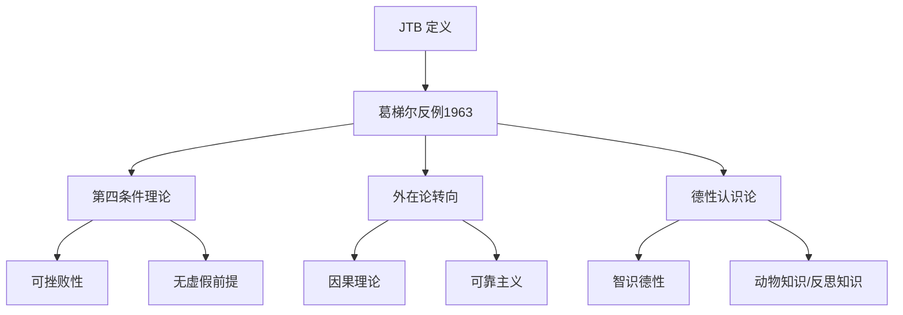

---
aliases: [Epistemology]
tags: ['03_HumanitiesAndSocialSciences', 'Philosophy', 'Epistemology']
created: 2026-05-17
updated: 2026-05-17
---

# Epistemology

认识论（Epistemology）
源自希腊语 episteme（知识）
和 logos（理论）。
它是哲学的核心分支。
研究知识的本质、来源、
范围和确证。

基本问题包括：
什么是知识？
知识如何获得？
知识需要何种确证？
我们能知道什么？
知识的界限在哪里？

## 知识的传统定义：JTB 理论

从柏拉图的《泰阿泰德篇》开始。
知识被分析为
确证的真信念（JTB）。

三个必要条件：

1. **真值条件**
   如果 S 知道 P，P 必须为真。
   假信念不是知识。

2. **信念条件**
   S 必须相信 P。
   否则不能构成知识。

3. **确证条件**
   S 必须有充分的确证。
   单纯真信念不能算知识。

$$ K_S(p) \iff (p)
\land (B_S(p))
\land (J_S(p)) $$

### 葛梯尔问题（Gettier Problem）

1963年，葛梯尔发表论文
《确证的真信念是知识吗？》
仅3页的革命性文章。

他提出反例。
展示满足 JTB 所有条件
但直觉上不构成知识。

**经典案例**：
史密斯有确证相信
琼斯拥有一辆福特车。
据此相信一个析取命题。
事实上琼斯的车是租的。
但析取的另一半为真。
史密斯的信念真且被确证。
但直觉上他不知道。

葛梯尔问题后50年。
认识论很大程度上在回应这一挑战。

## 确证的结构

### 基础主义（Foundationalism）

知识体系像一栋建筑。
基础信念不依赖其他信念。

- 笛卡尔式：基础信念不可错
- 经典基础主义：
  感觉经验/数学真理是基础
- 温和基础主义：
  基础信念只需初始可信度

批评：
感觉材料能否确证物理世界信念？

### 融贯论（Coherentism）

否认基础信念存在。
信念的确证来自
信念系统的内部融贯性。

一个信念被确证当且仅当
它是信念系统中
最大融贯集合的部分。

融贯的判据：
逻辑一致性、解释力、
简洁性、无矛盾。

批评：
脱离现实的幻想者
信念系统也可以融贯。
如何确保与世界的联系？

### 无限主义（Infinitism）

克莱因（Peter Klein, 1999）：
确证链条无限延伸。
主体有潜在无限的
非重复理由链条。

## 内在论与外在论

| 维度 | 内在论 | 外在论 |
|------|--------|--------|
| 确证因素 | 内省可及 | 可包含外部因素 |
| 动机 | 认知责任 | 知识的自然化 |
| 代表 | Chisholm | Goldman |
| 挑战 | 可及性原则非现实 | 无知识主体可能可靠 |

## 知识的来源

### 感知

最基础的知识来源。

核心争论：
- **直接实在论**：直接感知世界
- **表征实在论**：感知心理表征
- **现象主义**：对象是感知的逻辑建构

### 记忆

保存过去获得的知识。
时间鸿沟问题：
今天记得昨天的知觉。
确证基础是什么？

记忆可靠主义：
记忆形成过程过去可靠。
当前记忆信念就得到初始确证。

### 内省

对自身心理状态的直接知识。
"我疼"是自我确证的。
维特根斯坦质疑：
是否存在本质上私人的感觉？

### 证言

大部分知识来自他人证言。
教师/报纸/书籍/专家。

**证言认识论**探讨：
- 还原论：可还原为感知经验
- 非还原论：人类天生适合接受证言

**认识论不正义**
（Fricker, 2007）：
基于身份偏见
不合理贬低他人作为知识主体。

## 先天知识

先天知识不依赖经验。
逻辑真理和数学命题是典型。

**理性主义**：
笛卡尔、斯宾诺莎、莱布尼茨。
存在先天观念。
理性包含原初概念结构。

**经验主义**：
洛克主张心灵是白板。
一切观念来源于感觉。

**康德的中道**：
先天综合判断。
既提供新信息又普遍必然。

$$ \text{先天分析: 一切物体有广延} $$
$$ \text{后天综合: 这朵花是红色的} $$
$$ \text{先天综合: 一切事件有原因} $$

当代争论：
克里普克挑战
先天=必然的等式。
先天属认识论。
必然属形而上学。

奎因的自然化认识论：
取消先天的先验。
认识论应是心理学一章。

## 怀疑论

### 古典怀疑论

皮浪：悬搁判断。
对任何命题找到同等论证。
最好态度是悬搁。

### 笛卡尔式怀疑

三波怀疑：
1. 感官有时欺骗
2. 梦境论证
3. 恶魔论证

最终在"我思"中找到确定基点。

### 当代怀疑论

**普特南的缸中之脑**：
如何知道自己不是缸中之脑？
普特南论证这一假设自我挫败。

**摩尔回应**：
举起一只手说这是一只手。
日常知识比哲学论证更确定。

$$ \text{怀疑论论证: }
\neg K(\neg\text{缸中脑})
\rightarrow \neg K(\text{世界}) $$
$$ \text{摩尔回应: }
K(\text{世界})
\rightarrow K(\neg\text{缸中脑}) $$

## 社会认识论

20世纪末开始
系统考虑知识的社会维度：

- **证言认识论**：依赖他人证词
- **分歧认识论**：同伴分歧如何处理
- **群体认识论**：群体能否拥有知识
- **制度认识论**：同行评议如何影响知识

**知识价值问题**：
为什么知识比真信念更有价值？
柏拉图在《美诺篇》就提出了。

## 相关条目
- [[Metaphysics]]
- [[ModernPhilosophy]]
- [[ContemporaryPhilosophy]]
- [[03_HumanitiesAndSocialSciences/Psychology/Attention|Attention]]
- [[03_HumanitiesAndSocialSciences/Psychology/WorkingMemory|WorkingMemory]]
- [[INDEX|当前目录索引]]

## 深入阅读与扩展分析
该领域的知识体系经过长期积累已相当丰富。
以下内容旨在帮助读者进一步把握核心要点。

### 知识结构导引
该学科的理论框架是多层次的。
从最抽象的本体论假设。
到中程理论的实证假设。
再到操作化的研究假设。
每一层都有其独特功能。

### 主要研究范式对比
| 维度 | 实证主义 | 解释主义 | 批判范式 |
|------|---------|---------|---------|
| 本体论 | 实在论 | 建构论 | 历史实在论 |
| 认识论 | 客观主义 | 主观主义 | 解放认知 |
| 方法论 | 定量为主 | 定性为主 | 对话辩证 |
| 目标 | 解释预测 | 理解意义 | 揭露解放 |

### 经典研究案例分析
案例研究的价值在于展示理论的实践应用。
以下是该领域中几个具有代表性的研究。
它们的方法设计和理论贡献值得深入分析。
每个案例都对学科的后续发展产生了影响。

### 跨文化比较视角
不同文化背景下存在显著的差异。
这些差异对理论普适性提出了挑战。
跨文化研究设计需要特别注意文化偏见。
本地化概念的使用需要细致定义。

### 当代前沿热点
1. 数字化与人工智能的社会影响
2. 全球不平等的新形态
3. 气候变化的社会回应
4. 身份政治与民主危机
5. 后疫情时代的社会变迁
6. 技术伦理与人文关怀

### 方法论工具箱
研究人员可以根据研究问题选择方法。
定量方法适合检验假设和推断总体。
定性方法适合探索意义和生成理论。
混合方法整合两类优势以增强说服力。
实验方法旨在建立因果关系。
纵向设计追踪变化和过程。
比较策略揭示制度和文化的差异。

### 学术资源推荐
主要学术期刊发表该领域的前沿研究。
专业学会组织学术会议和交流活动。
在线数据库提供文献检索服务。
开放获取资源降低了知识获取门槛。
学术博客和播客提供了非正式的学习渠道。

### 学习路径设计
初学者应从通论性教材开始学习。
在建立基本框架后阅读经典原著。
然后选择感兴趣的方向深入阅读。
参与讨论和写作有助于深化理解。
独立研究是培养学术能力的核心环节。

### 批判性思维训练
学会质疑前提假设是学术训练的关键。
考察证据是否充分支持结论。
辨别因果关系与相关关系的区别。
识别论证中的逻辑谬误。
评估不同解释的合理性。
反思自身的认知偏见。

### 学术职业发展
学术道路需要长期投入和持续学习。
发表论文是学术生涯的必经之路。
学术网络的建设需要主动参与。
教学与研究之间的平衡值得关注。
跨学科能力在当代学术市场日益重要。

### 研究的公共价值
学术研究应当服务于公共福祉。
知识创新推动社会进步。
政策咨询将学术转化为实践。
公众科普缩小知识鸿沟。
社会批评促进反思和改进。

### 未来展望
该领域将继续回应时代提出的新问题。
技术进步为研究提供了新的工具。
全球化使比较研究更加重要。
跨学科整合是未来的主要趋势。
学术民主化需要更多元的参与者。

## 关键概念辨析
概念定义的清晰度直接影响研究的质量。
以下是该领域中若干容易混淆的概念。

**概念一与概念二的区分**：
前者侧重于外在的形式特征。
后者关注内在的运作机制。
两者在实际分析中往往需要结合使用。

**微观与宏观层面的联系**：
微观现象是宏观结构的基础。
宏观结构又约束微观行为。
理解两者的相互作用是社会分析的核心。

**静态分析与动态分析**：
静态分析关注某一时点的截面特征。
动态分析关注过程和变化的轨迹。
两种视角互补而非替代。

## 综合思考题
1. 该领域与其他相关学科的关系是什么？
2. 该领域最核心的学术贡献有哪些？
3. 经典理论在当代的有效性如何？
4. 该领域的研究方法有什么特点？
5. 数字技术如何改变该领域的研究实践？
6. 该领域存在哪些未解决的重要问题？
7. 全球化如何影响该领域的研究议程？
8. 该领域的知识如何应用于公共政策？
9. 跨学科整合面临哪些机遇和挑战？
10. 未来十年该领域可能有哪些突破？

## 相关条目
- [[INDEX|当前目录索引]]

## 延伸探讨与专题分析
以下内容进一步丰富对该主题的讨论。
提供更深入的理论视角和应用案例。

### 理论与实践的对话
学术研究不是高不可攀的象牙塔。
好的理论必须经得起实践的检验。
实践中的困惑常常激发理论创新。
理论为实践提供系统的分析框架。
两者之间的良性互动推动学科发展。

### 批判性反思
任何理论都有其预设和局限。
批判性思维要求我们识别这些前提。
考察理论在特定历史条件下的适用性。
注意理论的边界条件和适用范围。
不断以新经验修订旧理论。

### 教学与学习建议
学习该学科需要多读多写多讨论。
阅读经典原文是理解思想精髓的最佳方式。
写作帮助梳理和深化自己的思考。
讨论激发新的观点和批判性视角。
跨学科阅读拓展分析问题的视野。

### 基础知识自测
1. 该学科的核心研究对象是什么？
2. 主要理论流派之间有什么根本差异？
3. 经典研究案例的方法论特点是什么？
4. 当代前沿问题与经典理论有何联系？
5. 该学科的研究方法经历了哪些演变？
6. 不同文化背景下的理论适用性如何？
7. 数字化如何改变该学科的研究范式？
8. 该学科对公共政策有何实际贡献？
9. 学科内部存在哪些尚未解决的争论？
10. 未来十年该学科最可能取得突破的方向？

### 热点问题聚焦
当代社会面临诸多复杂挑战。
这些挑战需要跨学科的综合回应。
数字技术重塑了社会交往的方式。
全球化带来了机遇也带来了风险。
气候变化要求重新思考发展模式。
不平等问题挑战社会团结的基础。
身份政治重塑了公共讨论的议程。

### 学科交叉点
在学科边界处常常产生最富创造性的研究。
认知科学为理解人类行为提供新工具。
计算机科学推动大数据研究方法的应用。
环境研究提出关于可持续发展的新问题。
公共健康领域需要社会科学的深度参与。
城市研究整合多学科视角分析空间问题。

### 研究伦理与责任
学术研究不仅是知识生产活动。
研究者对研究对象和社会负有责任。
保护隐私和获得同意是基本要求。
研究结果可能被误用或滥用。
研究者应当预见研究的潜在影响。
开放科学推动知识共享和可重复性。

### 经典段落摘录
以下摘录经过时间检验的经典论述。
它们凝练了该学科的核心洞见。
阅读原始文本可以感受思想的重量。
建议在上下文中理解这些引文的意义。
批判性阅读比被动接受更有收获。

### 重要时间线
| 时间 | 事件 | 意义 |
|------|------|------|
| 学科萌芽期 | 早期思想奠基 | 提出基本问题和框架 |
| 学科形成期 | 制度化与规范化 | 建立学术共同体 |
| 学科繁荣期 | 理论与方法创新 | 研究范式多元化 |
| 当代转型期 | 跨学科整合 | 回应新问题新挑战 |

### 跨文化对话
不同文明传统对同一问题有不同的回答。
西方传统强调个体和理性分析。
东方传统注重整体和谐与实践智慧。
南半球的学术传统需要更多被听见。
全球知识生产格局应当更加平等。
跨文化对话开阔视野促进相互理解。

### 个人学习计划
制定一个切实可行的学习规划。
每周阅读一定量的专业文献。
定期写作练习培养学术表达能力。
参加学术活动获取最新研究信息。
与同行交流拓展学术网络。
持续学习是学术成长的关键。

## 相关条目
- [[INDEX|当前目录索引]]

