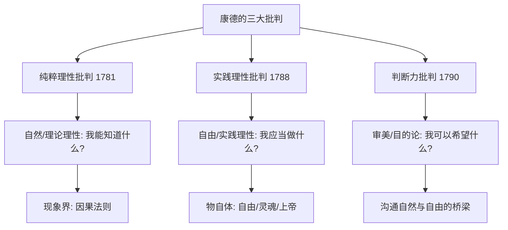

# ModernPhilosophy

近代哲学（Modern Philosophy）大致涵盖17世纪到19世纪末的西方哲学。这一时期以**认识论转向**（Epistemological Turn）为特征——哲学家们寻求知识的确凿基础，反思人类理性的能力和界限。近代哲学的核心张力在于理性主义（Rationalism）与经验主义（Empiricism）之间的对质，以及康德在此基础上进行的综合。

## 理性主义（Rationalism）

欧陆理性主义强调理性是知识的首要来源，主张存在先天观念（Innate Ideas），并以数学为知识模型。

### 笛卡尔（René Descartes, 1596-1650）

"近代哲学之父"。他在《第一哲学沉思集》（Meditations on First Philosophy, 1641）中运用方法论的怀疑（Methodological Doubt），通过三个怀疑波（感官怀疑、梦境论证、恶魔论证）将一切信念置于怀疑之下，最终在"我思故我在"（Cogito, ergo sum）中找到绝对的确定性：

$$ \text{我怀疑} \rightarrow \text{怀疑是一种思维} \rightarrow \text{我在思维} \rightarrow \text{我是思维者} \rightarrow \text{我存在} $$

笛卡尔从"我思"出发，凭借**清晰分明的知觉**（Clear and Distinct Perception）标准证明上帝存在和外部世界的知识。他的**心物二元论**将实在分为思维实体（Res Cogitans）和广延实体（Res Extensa），二者通过松果体相互作用——这一区分构成了心身问题的现代形式。

笛卡尔还是解析几何的创立者——将坐标系引入几何学，用代数方法解决几何问题。

### 斯宾诺莎（Baruch Spinoza, 1632-1677）

《伦理学》（Ethics）以几何学方法（More Geometrico）展开——定义、公理、命题、证明、推论。核心主张：

- **一实体论**：唯一的实体是神即自然（Deus sive Natura）。心与物是这一实体的两种属性（Attributes），被我们认识的两种方式。这否定了笛卡尔的心物二元实体论。
- **必然论**：一切事件遵循严格的必然性——自由意志是幻觉。"石头不会认为自己有自由意志，虽然它被抛向空中。"
- **情感几何学**：情感可以被理解为几何必然，通过理性认识情感可以增加被动的快乐并减少痛苦。达到最高幸福——对神的理智之爱（Amor intellectualis Dei）。斯宾诺莎的道德哲学不在于"应该"（Ought），而在于通过理解接受必然。

### 莱布尼茨（Gottfried Wilhelm Leibniz, 1646-1716）

**单子论（Monadology）**：世界由无数不可分割的精神实体——单子（Monads）组成。单子是"没有窗户的"——彼此不能因果作用，却因上帝预设的**前定和谐**（Pre-established Harmony）而协调一致。莱布尼茨宣称"这个世界是所有可能世界中最好的世界"——这是所有可能世界的集合中最优化配置的结果，遵循充足理由律（Principle of Sufficient Reason）。

莱布尼茨也区分了**必然真理**（理性真理，来自矛盾律）和**偶然真理**（事实真理，来自充足理由律）。他与牛顿各自独立发明了微积分。

## 经验主义（Empiricism）

英国经验主义主张一切知识源于感官经验，否认先天观念的存在。

### 洛克（John Locke, 1632-1704）

《人类理解论》（An Essay Concerning Human Understanding, 1689）提出了心灵是**白板**（Tabula Rasa）——一切观念来源于感觉（Sensation）和反省（Reflection）。

洛克区分了**第一性质**（Primary Qualities，如广延、形状、运动、数目——属于物体本身）和**第二性质**（Secondary Qualities，如颜色、声音、味道——只在心灵中产生感觉的能力）。他还区分了**简单观念**和**复合观念**。

在政治哲学上，洛克的主张远远超越了亚里士多德传统：自然状态（State of Nature）是自由平等的，但自然权利（生命、自由、财产）在没有政府时不确定。政府是人民通过社会契约建立的信托，如果政府侵犯自然权利，人民有权反抗。《政府论》下篇是自由主义和现代宪政的奠基文本。

### 贝克莱（George Berkeley, 1685-1753）

贝克莱的经验主义走向了主观观念论（Subjective Idealism）。"存在即被感知"（Esse est percipi）意味着物质实体不存在，对象只是观念的集合，其持续存在由上帝的感知保证。

贝克莱对洛克的第一性质/第二性质区分进行了机智的解构——第一性质（如广延）和第二性质（如颜色）一样是心灵依赖的：如果大小是相对的，那大小也是感知者相关的。他承认不依赖于心灵的"灵"（Spirits）和被感知的"观念"（Ideas）之间的区分，证明上帝的存在是维持感知世界连续性的必要条件。

### 休谟（David Hume, 1711-1776）

休谟是经验主义的完成者，其怀疑论深刻影响了康德和整个后来的哲学发展。在《人性论》（A Treatise of Human Nature, 1739-1740）和《人类理解研究》（An Enquiry Concerning Human Understanding, 1748）中：

- **印象与观念之分**：印象是强烈、生动的（感觉、情感），观念是印象的微弱副本（记忆、想象）。一切简单观念来自最初的印象——这是经验主义的核心原则。
- **因果关系**：因果关系只是心理习惯（习惯性联想），非客观必然关系。我们观察到事件 B 恒常跟随 A，便产生"A 引起 B"的信念。因果推理不是理性的而是心理的。
- **归纳问题（Problem of Induction）**：我们如何证明未来的事物会像过去的同类事物？不能——所有归纳推理依赖于"自然齐一性"（Uniformity of Nature）原则，但这个原则本身只能通过归纳来"证明"，形成循环论证。
- **自我的束论（Bundle Theory of Self）**：没有持续同一的自我实体——当我们自省时，我们只发现个别知觉（Perceptions）的序列，而不是一个持续的"自我"。"自我只是一束不同知觉的集合，以不可想象的速度相继而过。"
- **理性是激情的奴隶（Reason is the slave of the passions）**：行动的根本动机是情感而非理性。理性只提供实现目的的手段判断。

## 康德（Immanuel Kant, 1724-1804）

康德在《纯粹理性批判》（Critique of Pure Reason, 1781/1787）中进行了哲学上的"哥白尼式革命"（Copernican Revolution）——不再追问知识如何符合对象，而是追问对象必须如何符合我们的认知形式：

$$ \text{哥白尼式转向: 对象符合我们的认知} \rightarrow \text{我们的认知符合对象} $$

### 先验观念论（Transcendental Idealism）

康德区分了**现象**（Phenomena，事物对我们显现的方式）和**物自体**（Noumena / Things-in-themselves，事物本来的样子，不可知）。

知识由两个要素构成：
- **直观（Intuition）**：通过感性（Sensibility）接受感觉印象，被组织进时间和空间的先天形式
- **概念（Concept）**：通过知性（Understanding）运用范畴（Categories）统一直观

$$ \text{知识} = \text{感性直观}(\text{时空形式}) + \text{知性概念}(12\text{范畴}) $$

康德提出了12个知性范畴，分为四组（量、质、关系、模态），其中包括因果性和实体等关键范畴。这些范畴是经验可能性的先天条件，对现象界具有建构功能。

### 先天综合判断

康德回应休谟的挑战——数学和自然科学中的判断既是先天的（普遍且必然）又是综合的（提供新信息）。数学几何命题（如"两点之间直线最短"）就是先天综合判断的典型例子。

### 二律背反（Antinomies）

理性在试图超越经验界限时陷入四个二律背反——双方都同样可合理证明的彼此矛盾的命题。例如：
1. 世界在时间上有起点、在空间上有界限 vs. 世界无限
2. 存在自由原因 vs. 一切遵循自然法则

这些二律背反表明理性不能获得关于世界整体的确定知识。

### 道德哲学

在《实践理性批判》（Critique of Practical Reason, 1788）中，康德以**定言令式**（Categorical Imperative）为核心构建了义务论（Deontological Ethics）体系：

$$ \text{定言令式公式一: 只按照你同时愿意它成为普遍法则的准则行动} $$
$$ \text{定言令式公式二: 永远把人当作目的而非仅仅手段} $$

康德的道德哲学强调动机（Good Will）而非后果，强调义务（Duty）而非倾向（Inclination）。

### 判断力批判

《判断力批判》（Critique of Judgment, 1790）建立了美学（Aesthetic Judgment）和目的论（Teleology）的先天原则。康德分析了**无功利性的愉快**（Disinterested Pleasure）作为审美判断的特征——美是"无目的的合目的性"（Purposiveness without purpose）。

## 德国观念论（German Idealism）

### 费希特（Johann Gottlieb Fichte, 1762-1814）

从"自我"（I / Ich）出发推导整个知识体系。自我设定自身，自我设定非我，自我在自身中统一自身。费希特的《知识学》（Wissenschaftslehre）试图将康德哲学系统化为彻底的唯心主义。

### 谢林（Friedrich Schelling, 1775-1854）

同一哲学——自然和精神的终极同一。谢林的自然哲学将自然视为"可见的精神"，精神是"不可见的自然"。他的思考影响了一代自然哲学家（包括浪漫派和科学家，如奥斯特、法拉第）。

### 黑格尔（G. W. F. Hegel, 1770-1831）

绝对观念论——实在即理性，理性即实在。辩证法三段式——正题（Thesis）、反题（Antithesis）、合题（Synthesis）——推动绝对精神自我认识和自我实现的历史过程。《精神现象学》（Phenomenology of Spirit, 1807）描述了精神从感性确定性到绝对知识的意识发展史。

## 19世纪的反叛

**叔本华**（Arthur Schopenhauer）将世界区分为表象（Representation）和意志（Will）——意志是盲目的非理性冲动，是一切痛苦的根源。审美体验和禁欲是摆脱意志奴役的途径。

**尼采**（Friedrich Nietzsche）宣告"上帝已死"——传统形而上学和基督教道德的终结。他批判基督教为"奴隶道德"（Slave Morality），提出"权力意志"（Will to Power）和"超人"（Übermensch）的理想。他的系谱学（Genealogy）和视角主义（Perspectivism）深刻影响了20世纪欧陆哲学。

**马克思**（Karl Marx）"倒转"黑格尔辩证法——不是精神决定物质，而是物质生活条件（经济基础）决定意识形态（上层建筑）。历史是阶级斗争的历史。

**克尔凯郭尔**（Søren Kierkegaard）——个体主观真理和信仰跳跃——批判黑格尔体系对个体存在的漠视，为存在主义奠基。

## 相关条目
- [[AncientPhilosophy]]
- [[MedievalPhilosophy]]
- [[ContemporaryPhilosophy]]
- [[Epistemology]]
- [[Metaphysics]]
- [[INDEX|当前目录索引]]

## 深入阅读与扩展分析
该领域的知识体系经过长期积累已相当丰富。
以下内容旨在帮助读者进一步把握核心要点。

### 知识结构导引
该学科的理论框架是多层次的。
从最抽象的本体论假设。
到中程理论的实证假设。
再到操作化的研究假设。
每一层都有其独特功能。

### 主要研究范式对比
| 维度 | 实证主义 | 解释主义 | 批判范式 |
|------|---------|---------|---------|
| 本体论 | 实在论 | 建构论 | 历史实在论 |
| 认识论 | 客观主义 | 主观主义 | 解放认知 |
| 方法论 | 定量为主 | 定性为主 | 对话辩证 |
| 目标 | 解释预测 | 理解意义 | 揭露解放 |

### 经典研究案例分析
案例研究的价值在于展示理论的实践应用。
以下是该领域中几个具有代表性的研究。
它们的方法设计和理论贡献值得深入分析。
每个案例都对学科的后续发展产生了影响。

### 跨文化比较视角
不同文化背景下存在显著的差异。
这些差异对理论普适性提出了挑战。
跨文化研究设计需要特别注意文化偏见。
本地化概念的使用需要细致定义。

### 当代前沿热点
1. 数字化与人工智能的社会影响
2. 全球不平等的新形态
3. 气候变化的社会回应
4. 身份政治与民主危机
5. 后疫情时代的社会变迁
6. 技术伦理与人文关怀

### 方法论工具箱
研究人员可以根据研究问题选择方法。
定量方法适合检验假设和推断总体。
定性方法适合探索意义和生成理论。
混合方法整合两类优势以增强说服力。
实验方法旨在建立因果关系。
纵向设计追踪变化和过程。
比较策略揭示制度和文化的差异。

### 学术资源推荐
主要学术期刊发表该领域的前沿研究。
专业学会组织学术会议和交流活动。
在线数据库提供文献检索服务。
开放获取资源降低了知识获取门槛。
学术博客和播客提供了非正式的学习渠道。

### 学习路径设计
初学者应从通论性教材开始学习。
在建立基本框架后阅读经典原著。
然后选择感兴趣的方向深入阅读。
参与讨论和写作有助于深化理解。
独立研究是培养学术能力的核心环节。

### 批判性思维训练
学会质疑前提假设是学术训练的关键。
考察证据是否充分支持结论。
辨别因果关系与相关关系的区别。
识别论证中的逻辑谬误。
评估不同解释的合理性。
反思自身的认知偏见。

### 学术职业发展
学术道路需要长期投入和持续学习。
发表论文是学术生涯的必经之路。
学术网络的建设需要主动参与。
教学与研究之间的平衡值得关注。
跨学科能力在当代学术市场日益重要。

### 研究的公共价值
学术研究应当服务于公共福祉。
知识创新推动社会进步。
政策咨询将学术转化为实践。
公众科普缩小知识鸿沟。
社会批评促进反思和改进。

### 未来展望
该领域将继续回应时代提出的新问题。
技术进步为研究提供了新的工具。
全球化使比较研究更加重要。
跨学科整合是未来的主要趋势。
学术民主化需要更多元的参与者。

## 关键概念辨析
概念定义的清晰度直接影响研究的质量。
以下是该领域中若干容易混淆的概念。

**概念一与概念二的区分**：
前者侧重于外在的形式特征。
后者关注内在的运作机制。
两者在实际分析中往往需要结合使用。

**微观与宏观层面的联系**：
微观现象是宏观结构的基础。
宏观结构又约束微观行为。
理解两者的相互作用是社会分析的核心。

**静态分析与动态分析**：
静态分析关注某一时点的截面特征。
动态分析关注过程和变化的轨迹。
两种视角互补而非替代。

## 综合思考题
1. 该领域与其他相关学科的关系是什么？
2. 该领域最核心的学术贡献有哪些？
3. 经典理论在当代的有效性如何？
4. 该领域的研究方法有什么特点？
5. 数字技术如何改变该领域的研究实践？
6. 该领域存在哪些未解决的重要问题？
7. 全球化如何影响该领域的研究议程？
8. 该领域的知识如何应用于公共政策？
9. 跨学科整合面临哪些机遇和挑战？
10. 未来十年该领域可能有哪些突破？

## 相关条目
- [[INDEX|当前目录索引]]

## 延伸探讨与专题分析
以下内容进一步丰富对该主题的讨论。
提供更深入的理论视角和应用案例。

### 理论与实践的对话
学术研究不是高不可攀的象牙塔。
好的理论必须经得起实践的检验。
实践中的困惑常常激发理论创新。
理论为实践提供系统的分析框架。
两者之间的良性互动推动学科发展。

### 批判性反思
任何理论都有其预设和局限。
批判性思维要求我们识别这些前提。
考察理论在特定历史条件下的适用性。
注意理论的边界条件和适用范围。
不断以新经验修订旧理论。

### 教学与学习建议
学习该学科需要多读多写多讨论。
阅读经典原文是理解思想精髓的最佳方式。
写作帮助梳理和深化自己的思考。
讨论激发新的观点和批判性视角。
跨学科阅读拓展分析问题的视野。

### 基础知识自测
1. 该学科的核心研究对象是什么？
2. 主要理论流派之间有什么根本差异？
3. 经典研究案例的方法论特点是什么？
4. 当代前沿问题与经典理论有何联系？
5. 该学科的研究方法经历了哪些演变？
6. 不同文化背景下的理论适用性如何？
7. 数字化如何改变该学科的研究范式？
8. 该学科对公共政策有何实际贡献？
9. 学科内部存在哪些尚未解决的争论？
10. 未来十年该学科最可能取得突破的方向？

### 热点问题聚焦
当代社会面临诸多复杂挑战。
这些挑战需要跨学科的综合回应。
数字技术重塑了社会交往的方式。
全球化带来了机遇也带来了风险。
气候变化要求重新思考发展模式。
不平等问题挑战社会团结的基础。
身份政治重塑了公共讨论的议程。

### 学科交叉点
在学科边界处常常产生最富创造性的研究。
认知科学为理解人类行为提供新工具。
计算机科学推动大数据研究方法的应用。
环境研究提出关于可持续发展的新问题。
公共健康领域需要社会科学的深度参与。
城市研究整合多学科视角分析空间问题。

### 研究伦理与责任
学术研究不仅是知识生产活动。
研究者对研究对象和社会负有责任。
保护隐私和获得同意是基本要求。
研究结果可能被误用或滥用。
研究者应当预见研究的潜在影响。
开放科学推动知识共享和可重复性。

### 经典段落摘录
以下摘录经过时间检验的经典论述。
它们凝练了该学科的核心洞见。
阅读原始文本可以感受思想的重量。
建议在上下文中理解这些引文的意义。
批判性阅读比被动接受更有收获。

### 重要时间线
| 时间 | 事件 | 意义 |
|------|------|------|
| 学科萌芽期 | 早期思想奠基 | 提出基本问题和框架 |
| 学科形成期 | 制度化与规范化 | 建立学术共同体 |
| 学科繁荣期 | 理论与方法创新 | 研究范式多元化 |
| 当代转型期 | 跨学科整合 | 回应新问题新挑战 |

### 跨文化对话
不同文明传统对同一问题有不同的回答。
西方传统强调个体和理性分析。
东方传统注重整体和谐与实践智慧。
南半球的学术传统需要更多被听见。
全球知识生产格局应当更加平等。
跨文化对话开阔视野促进相互理解。

### 个人学习计划
制定一个切实可行的学习规划。
每周阅读一定量的专业文献。
定期写作练习培养学术表达能力。
参加学术活动获取最新研究信息。
与同行交流拓展学术网络。
持续学习是学术成长的关键。

## 相关条目
- [[INDEX|当前目录索引]]

## 专题研究扩展
以下讨论补充了前述内容的细节和实例。

### 应用场景分析
该领域的知识可以应用于多个实际场景。
政策制定者利用理论框架设计干预方案。
教育工作者将研究成果融入课程设计。
临床工作者使用诊断分类指导治疗。
企业管理者借鉴社会学视角优化组织。

### 研究设计建议
好的研究始于好的问题。
明确研究对象和分析层次。
选择合适的研究方法。
考虑伦理问题和研究偏见。
注意研究的内部效度和外部效度。
充分的文献回顾避免重复劳动。

### 数据解读技巧
数据分析不仅仅是技术操作。
理论框架指导数据解读的方向。
注意相关关系与因果关系的区别。
考虑替代解释的可能性。
报告效应量和置信区间。
敏感性测试检验发现的稳健性。

### 写作表达要点
学术写作追求清晰准确的表达。
避免不必要的术语堆砌。
用具体例子说明抽象概念。
段落之间有明确的过渡。
结论回应研究问题而非重复结果。
摘要简洁传达核心信息。

### 学术辩论示例
该领域存在持续的学术辩论。
不同观点之间的碰撞推动知识进步。
理解这些辩论有助于把握学科脉络。
在辩论中识别自己的学术立场。
有理有据地参与学术讨论。

### 未来研究议程
该领域的未来研究有多个方向。
跨学科整合将持续加深。
新方法技术将拓展研究边界。
全球化背景下需要新理论框架。
气候变化和环境问题亟待回应。
数字技术的社会影响需要系统分析。
不平等问题是持久的核心议题。
文化多样性需要更多比较研究。

## 相关条目
- [[INDEX|当前目录索引]]
