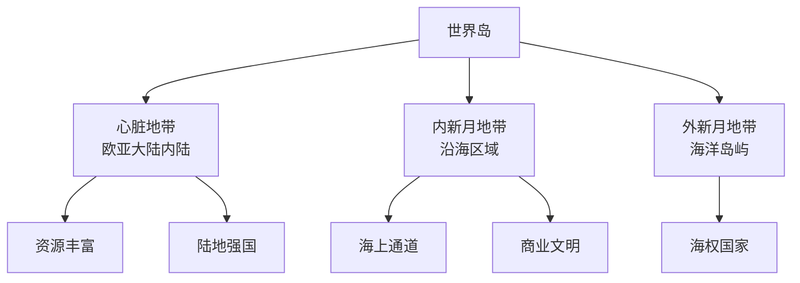
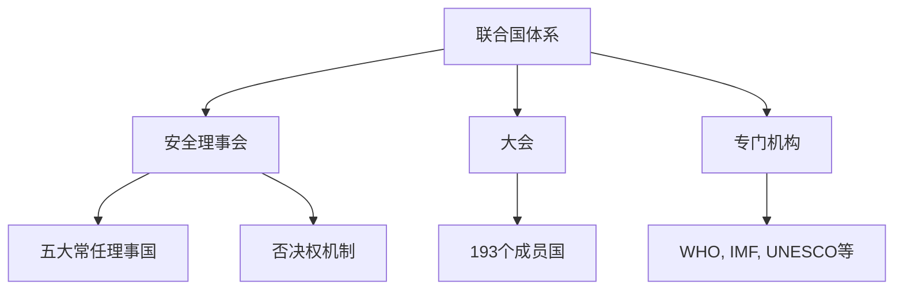

---
aliases:
  - 地缘政治与热点问题
  - Geopolitics and Current Issues
tags:
  - PoliticalScience
  - InternationalRelations
  - Geopolitics
---

# 地缘政治与热点问题 (Geopolitics and Current Issues)

地缘政治学研究地理因素对国家行为和国际关系的塑造作用。当前国际热点问题涵盖大国竞争、地区冲突、新兴技术安全等维度。

## 一、地缘政治理论 (Geopolitical Theories)

### 1.1 麦金德的"心脏地带"理论

哈尔福德·麦金德 (Halford Mackinder) 1904年发表《历史的地理枢纽》。

**核心命题**：
> 谁统治东欧，谁就控制了心脏地带；
> 谁统治心脏地带，谁就控制了世界岛；
> 谁统治世界岛，谁就控制了世界。

**世界划分**：
- **心脏地带 (Heartland)** ：欧亚大陆内陆，从东欧到西伯利亚
- **内新月地带 (Inner Crescent)** ：从德国到印度、中国的沿海区域
- **外新月地带 (Outer Crescent)** ：英国、日本、美洲、澳大利亚

### 1.2 斯皮克曼的"边缘地带"理论

尼古拉斯·斯皮克曼 (Nicholas Spykman) 修正了麦金德的理论：

> 谁控制了边缘地带 (Rimland)，谁就控制了欧亚大陆；
> 谁控制了欧亚大陆，谁就控制了世界的命运。

- **边缘地带**：西欧、中东、南亚、东南亚、东亚沿海
- 斯皮克曼认为边缘地带比心脏地带更具战略价值

### 1.3 马汉的海权论 (Sea Power Theory)

阿尔弗雷德·马汉 (Alfred T. Mahan) 强调：
- 制海权 (Command of the Sea) 是国家强盛的关键
- 关键要素：地理位置、海岸线长度、海军力量、商船队、殖民地

### 1.4 当代地缘政治理论

| 理论 | 提出者 | 核心观点 |
|------|--------|---------|
| 文明冲突论 | 亨廷顿 (Huntington) | 后冷战时代冲突源自文明断层线 |
| 软实力 (Soft Power) | 约瑟夫·奈 (Joseph Nye) | 文化吸引力与价值观的感召力 |
| 地缘经济 (Geoeconomics) | 卢特沃克 (Luttwak) | 经济手段取代军事成为竞争工具 |
| 空间地缘政治 | 新理论方向 | 太空资源与卫星轨道的战略竞争 |

## 二、大国关系 (Great Power Relations)

### 2.1 中美关系

| 维度 | 现状 | 热点议题 |
|------|------|---------|
| 贸易 | 相互依存但摩擦不断 | 关税、技术出口管制 |
| 科技 | 战略竞争 | 芯片、人工智能、5G |
| 安全 | 亚太地区博弈 | 台湾问题、南海争端 |
| 意识形态 | 价值观差异 | 人权、民主与治理模式 |

### 2.2 俄美与欧洲

- **北约东扩** — 俄罗斯的战略安全关切
- **能源博弈** — 天然气管道与欧洲能源依赖
- **军备控制** — 核武器条约的延续与失效

### 2.3 多极化趋势 (Multipolarity)

全球力量对比正从单极向多极转变，新兴国家在国际事务中的影响力持续上升：

- **金砖国家 (BRICS)** — 巴西、俄罗斯、印度、中国、南非的扩容与合作
- **G20** — 全球经济治理的核心平台
- **上海合作组织 (SCO)** — 地区安全与反恐合作

## 三、地区热点 (Regional Hotspots)

### 3.1 中东地区

| 问题 | 原因 | 影响 |
|------|------|------|
| 巴以冲突 | 领土争端、宗教圣地、难民问题 | 地区安全持续恶化 |
| 伊朗核问题 | 核能力与制裁博弈 | 中东军备竞赛风险 |
| 也门内战 | 代理人战争 | 人道主义危机 |
| 叙利亚内战 | 多方势力交织 | 难民潮与恐怖主义 |

### 3.2 印太地区 (Indo-Pacific)

- **南海争端** — 岛礁主权与航行自由
- **朝鲜半岛** — 核问题与无核化谈判
- **印太战略** — 美国"印太战略"框架下的联盟体系
- **AUKUS** — 美英澳三边安全伙伴关系

### 3.3 欧洲安全

- **俄乌冲突** — 领土完整、北约扩大与欧洲安全秩序
- **西巴尔干** — 民族问题与欧盟东扩进程
- **能源安全** — 能源多元化的战略重要性

## 四、非传统安全 (Non-Traditional Security)

### 4.1 新兴技术安全

| 技术领域 | 安全关切 | 治理挑战 |
|---------|---------|---------|
| 人工智能 (AI) | 自主武器、深度伪造 | 国际规范缺失 |
| 网络空间 | 网络攻击、数据窃取 | 溯源困难、责任界定 |
| 太空安全 | 卫星武器化、太空碎片 | 国际太空法滞后 |
| 生物安全 | 基因编辑、生物武器 | 双重用途困境 |

### 4.2 气候变化与全球治理

- **极端天气** — 洪灾、旱灾、风暴的频率和强度上升
- **气候难民** — 海平面上升导致人口迁移
- **碳中和** — 各国减排承诺与执行矛盾

### 4.3 能源与资源安全

- **稀土与关键矿产** — 清洁能源转型的战略资源
- **水资源争端** — 跨国河流的分配冲突
- **粮食安全** — 气候变化与供应链脆弱性

## 五、国际制度与秩序

### 5.1 联合国与多边机制

### 5.2 国际秩序面临的挑战

- **多边主义危机** — 单边主义抬升、国际规则被削弱
- **全球治理赤字** — 跨国问题的治理机制不足
- **新兴力量诉求** — 发展中国家要求更大的话语权

---
*地缘政治是理解国际关系的棱镜。在快速变化的全球格局中，地理的宿命与人的能动性始终在角力。*
