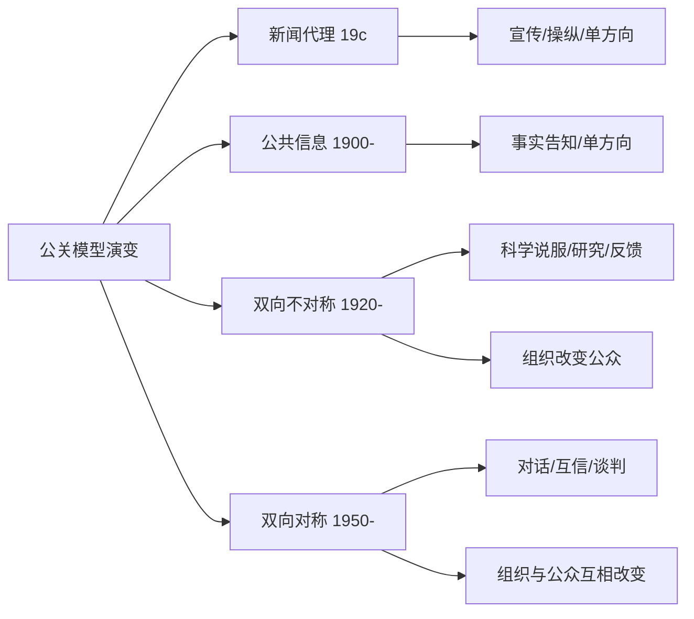

# PublicRelations

公共关系（Public Relations, PR）是组织通过策略性信息管理，与各类公众（Publics）建立和维护互利关系的过程和功能。PR涉及议题管理（Issues Management）、利益相关者关系（Stakeholder Relations）、危机传播（Crisis Communication）和声誉管理（Reputation Management）。

## 公关的定义

格鲁尼格和亨特（Grunig & Hunt, 1984）的定义：公共关系是"组织与其公众之间的沟通管理"（Management of communication between an organization and its publics）。

PRSA（美国公关协会，2012）的现代化定义："公共关系是一个战略性的沟通过程，在组织和公众之间建立互利关系"。"互利关系"——PR不是单向宣传——而是双向的利益对齐。

## 格鲁尼格的四种公关模型

### 1. 新闻代理/宣传模型（Press Agentry / Publicity Model, 19世纪）

单向传播。代表：P. T. Barnum。以"任何宣传都是好宣传"逻辑运作——重点是曝光率，信息可以不完全真实。

### 2. 公共信息模型（Public Information Model, 20世纪初）

单向传播。代表：Ivy Lee。公关人员作为"驻场记者"——传播组织信息但尊重事实（"公众必须被告知"）。1906年Ivy Lee在煤矿罢工中建议公司开放给记者、向公众陈述事实而非说谎——是现代公关的里程碑。

### 3. 双向不对称模型（Two-Way Asymmetric Model, 1920年代-1950年代）

双向传播但效果不平衡。代表：Edward Bernays——公关的"科学说服"并使用社会研究（调查/焦点小组）认清公众的态度和利益，然后设计最有说服力的传播策略（"工程同意Engineering Consent"）。伯奈斯是弗洛伊德的侄子——将佛洛伊德心理学的无意识动机（欲望、恐惧）引入了公关策略设计。

### 4. 双向对称模型（Two-Way Symmetric Model, 1950年代后）

双向传播并且效果平衡。组织不仅改变公众——也根据公众反馈改变自己。格鲁尼格的**卓越公关理论**（Excellence Theory, 1992）认为这是PR的"最高表现"——组织与公众通过协商、对话、谈判共同决策，互利共存。

## 公关的主要职能

### 媒体关系

撰写和发布新闻稿（Press Release）、组织记者发布会、媒体招待和采访安排。但"传统媒体"（纸媒和电视广播）的衰退导致企业选择——"自有媒体"（Owned Media）：自己的网站、博客、社交媒体账户。**内容营销**（Content Marketing）和**故事叙述**（Storytelling）是公关和营销的融合产物。

### 议题管理（Issues Management）

Jones & Chase（1979）：确定组织面临的公共政策和社会问题并准备应对。五阶段过程：议题确认 → 议题分析 → 策略选择 → 行动项目 → 评估。

议题的生命周期（Molnar, 1978；Downs, 1972的关注周期Attention Cycle）：

1. 问题前阶段：只有专家关注（气候变化在1970-80年）
2. 发现和警觉：媒体和公众发现（1988年NASA的James Hansen在国会关于全球变暖的证词）
3. 意识提升：政治反应
4. 衰落：由于其他问题的竞争

### 危机传播（Crisis Communication）

库姆斯的**情境危机传播理论**（Situational Crisis Communication Theory, SCCT, 2007）：

危机类型决定危机责任归因的大小：
- **受害者集群**（Victim Cluster）：自然灾害、谣言、产品被篡改（责任归因低）
- **意外集群**（Accidental Cluster）：技术错误、人为失误（责任中等）
- **可预防集群**（Preventable Cluster）：管理失当、违反法律（责任最高）

根据责任水平选择策略：高责任 → 道歉+补偿；低责任 → 否认+攻击指控者+替罪羊。

**形象修复理论**（Image Repair Theory, Benoit, 1995, 1997）：五种策略——否认（Denial）、逃避责任（Evasion of Responsibility）、减少攻击性（Reducing Offensiveness, 如减损责任对象、攻击指控者、补偿）、纠正行动（Corrective Action）、道歉（Mortification）。

**社交媒体危机**：数字世界的企业危机在线响应需要极快——"黄金时间"从24小时缩短到数十分钟——而且别人对账非常彻底。

### 利益相关者关系

**利益相关者理论**（Freeman, 1984）：企业不仅是股东（Shareholders）的服务员——关于所有利益相关者（Stakeholders）：员工、供应商、消费者、社区、政府、环境、广义公众。PR是"关系管理"——持续对话和互惠型沟通。

## PR伦理

公关被广泛质作为"spin"/欺骗。真实伦理措施是：
- **透明性**（Transparency）：来源披露，反对假grassroots行动（Astroturfing）
- **双向对称**：真正听取公众，而不是单纯说服
- **PRSA伦理准则**：独立、诚实、专业公平

### 关键伦理边界案例

- **食品企业支付科学家发文支持健康声明**：存疑，（烟草和气候变化"怀疑论"机构是秘密行业资助）
- **假草根运动（Astroturfing）**：以为民众自发的运动其实是行业或公司秘密发起和资助的——被全球PR行业伦理准则禁止

## 数字时代的PR转型

- **去中间人**：品牌可以直接与消费者互动—通过Twitter/Instagram/微信公众号/Facebook发布信息、回应粉丝
- **影响者营销**（Influencer Marketing）：企业从媒体（大众广告）转向网上意见领袖（"影响力者"）合作——KOL（关键意见领袖）付费代言商品
- **声誉管理**（Online Reputation Management, ORM）：搜索引擎监控、负面评论应对、社交聆听监控（Social Listening）
- **KPI**（关键绩效指标）：贴子量、覆盖面（Impressions）、互动率（Engagement Rate）、情感分数（Sentiment Analysis）、Mentions、Share of Voice

## 政府与政治PR

- **政府发言人**：政府对口进行对外传播
- **公共外交**（Public Diplomacy）：国家向海外公众塑造该国形象（软实力Soft Power, Nye）
- **选举传播**（Campaign Communication / Political PR）：广告、辩论准备、选民数据分析（微定位Micro-targeting）、议题设定、形象管理
- **叙事管理**（Narrative Management）：政府对危机事件如自然灾害、公共卫生（COVID19信息建立公众沟通框架）故事叙述

## 相关条目
- [[PoliticalSociology]]
- [[SocialMovements]]
- [[CulturalSociology]]
- [[INDEX|当前目录索引]]

## 深入阅读与扩展分析
该领域的知识体系经过长期积累已相当丰富。
以下内容旨在帮助读者进一步把握核心要点。

### 知识结构导引
该学科的理论框架是多层次的。
从最抽象的本体论假设。
到中程理论的实证假设。
再到操作化的研究假设。
每一层都有其独特功能。

### 主要研究范式对比
| 维度 | 实证主义 | 解释主义 | 批判范式 |
|------|---------|---------|---------|
| 本体论 | 实在论 | 建构论 | 历史实在论 |
| 认识论 | 客观主义 | 主观主义 | 解放认知 |
| 方法论 | 定量为主 | 定性为主 | 对话辩证 |
| 目标 | 解释预测 | 理解意义 | 揭露解放 |

### 经典研究案例分析
案例研究的价值在于展示理论的实践应用。
以下是该领域中几个具有代表性的研究。
它们的方法设计和理论贡献值得深入分析。
每个案例都对学科的后续发展产生了影响。

### 跨文化比较视角
不同文化背景下存在显著的差异。
这些差异对理论普适性提出了挑战。
跨文化研究设计需要特别注意文化偏见。
本地化概念的使用需要细致定义。

### 当代前沿热点
1. 数字化与人工智能的社会影响
2. 全球不平等的新形态
3. 气候变化的社会回应
4. 身份政治与民主危机
5. 后疫情时代的社会变迁
6. 技术伦理与人文关怀

### 方法论工具箱
研究人员可以根据研究问题选择方法。
定量方法适合检验假设和推断总体。
定性方法适合探索意义和生成理论。
混合方法整合两类优势以增强说服力。
实验方法旨在建立因果关系。
纵向设计追踪变化和过程。
比较策略揭示制度和文化的差异。

### 学术资源推荐
主要学术期刊发表该领域的前沿研究。
专业学会组织学术会议和交流活动。
在线数据库提供文献检索服务。
开放获取资源降低了知识获取门槛。
学术博客和播客提供了非正式的学习渠道。

### 学习路径设计
初学者应从通论性教材开始学习。
在建立基本框架后阅读经典原著。
然后选择感兴趣的方向深入阅读。
参与讨论和写作有助于深化理解。
独立研究是培养学术能力的核心环节。

### 批判性思维训练
学会质疑前提假设是学术训练的关键。
考察证据是否充分支持结论。
辨别因果关系与相关关系的区别。
识别论证中的逻辑谬误。
评估不同解释的合理性。
反思自身的认知偏见。

### 学术职业发展
学术道路需要长期投入和持续学习。
发表论文是学术生涯的必经之路。
学术网络的建设需要主动参与。
教学与研究之间的平衡值得关注。
跨学科能力在当代学术市场日益重要。

### 研究的公共价值
学术研究应当服务于公共福祉。
知识创新推动社会进步。
政策咨询将学术转化为实践。
公众科普缩小知识鸿沟。
社会批评促进反思和改进。

### 未来展望
该领域将继续回应时代提出的新问题。
技术进步为研究提供了新的工具。
全球化使比较研究更加重要。
跨学科整合是未来的主要趋势。
学术民主化需要更多元的参与者。

## 关键概念辨析
概念定义的清晰度直接影响研究的质量。
以下是该领域中若干容易混淆的概念。

**概念一与概念二的区分**：
前者侧重于外在的形式特征。
后者关注内在的运作机制。
两者在实际分析中往往需要结合使用。

**微观与宏观层面的联系**：
微观现象是宏观结构的基础。
宏观结构又约束微观行为。
理解两者的相互作用是社会分析的核心。

**静态分析与动态分析**：
静态分析关注某一时点的截面特征。
动态分析关注过程和变化的轨迹。
两种视角互补而非替代。

## 综合思考题
1. 该领域与其他相关学科的关系是什么？
2. 该领域最核心的学术贡献有哪些？
3. 经典理论在当代的有效性如何？
4. 该领域的研究方法有什么特点？
5. 数字技术如何改变该领域的研究实践？
6. 该领域存在哪些未解决的重要问题？
7. 全球化如何影响该领域的研究议程？
8. 该领域的知识如何应用于公共政策？
9. 跨学科整合面临哪些机遇和挑战？
10. 未来十年该领域可能有哪些突破？

## 相关条目
- [[INDEX|当前目录索引]]

## 延伸探讨与专题分析
以下内容进一步丰富对该主题的讨论。
提供更深入的理论视角和应用案例。

### 理论与实践的对话
学术研究不是高不可攀的象牙塔。
好的理论必须经得起实践的检验。
实践中的困惑常常激发理论创新。
理论为实践提供系统的分析框架。
两者之间的良性互动推动学科发展。

### 批判性反思
任何理论都有其预设和局限。
批判性思维要求我们识别这些前提。
考察理论在特定历史条件下的适用性。
注意理论的边界条件和适用范围。
不断以新经验修订旧理论。

### 教学与学习建议
学习该学科需要多读多写多讨论。
阅读经典原文是理解思想精髓的最佳方式。
写作帮助梳理和深化自己的思考。
讨论激发新的观点和批判性视角。
跨学科阅读拓展分析问题的视野。

### 基础知识自测
1. 该学科的核心研究对象是什么？
2. 主要理论流派之间有什么根本差异？
3. 经典研究案例的方法论特点是什么？
4. 当代前沿问题与经典理论有何联系？
5. 该学科的研究方法经历了哪些演变？
6. 不同文化背景下的理论适用性如何？
7. 数字化如何改变该学科的研究范式？
8. 该学科对公共政策有何实际贡献？
9. 学科内部存在哪些尚未解决的争论？
10. 未来十年该学科最可能取得突破的方向？

### 热点问题聚焦
当代社会面临诸多复杂挑战。
这些挑战需要跨学科的综合回应。
数字技术重塑了社会交往的方式。
全球化带来了机遇也带来了风险。
气候变化要求重新思考发展模式。
不平等问题挑战社会团结的基础。
身份政治重塑了公共讨论的议程。

### 学科交叉点
在学科边界处常常产生最富创造性的研究。
认知科学为理解人类行为提供新工具。
计算机科学推动大数据研究方法的应用。
环境研究提出关于可持续发展的新问题。
公共健康领域需要社会科学的深度参与。
城市研究整合多学科视角分析空间问题。

### 研究伦理与责任
学术研究不仅是知识生产活动。
研究者对研究对象和社会负有责任。
保护隐私和获得同意是基本要求。
研究结果可能被误用或滥用。
研究者应当预见研究的潜在影响。
开放科学推动知识共享和可重复性。

### 经典段落摘录
以下摘录经过时间检验的经典论述。
它们凝练了该学科的核心洞见。
阅读原始文本可以感受思想的重量。
建议在上下文中理解这些引文的意义。
批判性阅读比被动接受更有收获。

### 重要时间线
| 时间 | 事件 | 意义 |
|------|------|------|
| 学科萌芽期 | 早期思想奠基 | 提出基本问题和框架 |
| 学科形成期 | 制度化与规范化 | 建立学术共同体 |
| 学科繁荣期 | 理论与方法创新 | 研究范式多元化 |
| 当代转型期 | 跨学科整合 | 回应新问题新挑战 |

### 跨文化对话
不同文明传统对同一问题有不同的回答。
西方传统强调个体和理性分析。
东方传统注重整体和谐与实践智慧。
南半球的学术传统需要更多被听见。
全球知识生产格局应当更加平等。
跨文化对话开阔视野促进相互理解。

### 个人学习计划
制定一个切实可行的学习规划。
每周阅读一定量的专业文献。
定期写作练习培养学术表达能力。
参加学术活动获取最新研究信息。
与同行交流拓展学术网络。
持续学习是学术成长的关键。

## 相关条目
- [[INDEX|当前目录索引]]

## 专题研究扩展
以下讨论补充了前述内容的细节和实例。

### 应用场景分析
该领域的知识可以应用于多个实际场景。
政策制定者利用理论框架设计干预方案。
教育工作者将研究成果融入课程设计。
临床工作者使用诊断分类指导治疗。
企业管理者借鉴社会学视角优化组织。

### 研究设计建议
好的研究始于好的问题。
明确研究对象和分析层次。
选择合适的研究方法。
考虑伦理问题和研究偏见。
注意研究的内部效度和外部效度。
充分的文献回顾避免重复劳动。

### 数据解读技巧
数据分析不仅仅是技术操作。
理论框架指导数据解读的方向。
注意相关关系与因果关系的区别。
考虑替代解释的可能性。
报告效应量和置信区间。
敏感性测试检验发现的稳健性。

### 写作表达要点
学术写作追求清晰准确的表达。
避免不必要的术语堆砌。
用具体例子说明抽象概念。
段落之间有明确的过渡。
结论回应研究问题而非重复结果。
摘要简洁传达核心信息。

### 学术辩论示例
该领域存在持续的学术辩论。
不同观点之间的碰撞推动知识进步。
理解这些辩论有助于把握学科脉络。
在辩论中识别自己的学术立场。
有理有据地参与学术讨论。

### 未来研究议程
该领域的未来研究有多个方向。
跨学科整合将持续加深。
新方法技术将拓展研究边界。
全球化背景下需要新理论框架。
气候变化和环境问题亟待回应。
数字技术的社会影响需要系统分析。
不平等问题是持久的核心议题。
文化多样性需要更多比较研究。

## 相关条目
- [[INDEX|当前目录索引]]

## 扩展讨论与深层分析

### 历史发展脉络
该学科经历了漫长的发展过程。
每一次范式转换都带来理论的革新。
外部社会环境的变化推动研究议程。
学科内部的争论推动理论精致化。

### 核心命题再审视
该领域存在一些反复出现的命题。
它们构成了学科的理论内核。
不同时代对同一命题有不同回答。
理解这些命题的演变是掌握学科的关键。

### 方法论反思
研究方法的选择不是中立的。
每种方法都有其优势和局限。
方法应当服务于研究问题而非相反。
混合方法设计可以弥补单一方法的不足。

### 学术写作范例
优秀的学术写作是清晰和有说服力的。
段落的组织结构应符合逻辑顺序。
句子长度应当有变化以保持可读性。
术语的使用应当精确且一致。

## 相关条目
- [[INDEX|当前目录索引]]

## 补充阅读与思考
以下内容提供了额外的分析视角。
有助于加深对该主题的全面理解。

### 学术传承
每个学术传统都有其奠基者。
后人在前人的基础上继续推进。
学术知识的积累是一个接力过程。
理解学术传承有助于定位自己的研究。

### 研究前沿动态
前沿研究往往挑战既有假设。
新方法带来新发现和新认识。
跨学科合作催生创新。
预注册和开放科学提升研究质量。

### 关键文献推荐
原始文献是思想的源头。
综述文献帮助把握研究脉络。
方法论文献提升研究技能。
批评性文献提供反思视角。

## 相关条目
- [[INDEX|当前目录索引]]

## 简要补充
该主题的深入学习需要持续的积累。
建议结合相关条目进行系统性阅读。
通过比较分析加深对核心概念的理解。
跨学科视角有助于拓展分析框架。
理论与实践的结合是最有效的学习方式。
持续的写作和讨论锻炼批判思维。

## 相关条目
- [[INDEX|当前目录索引]]
