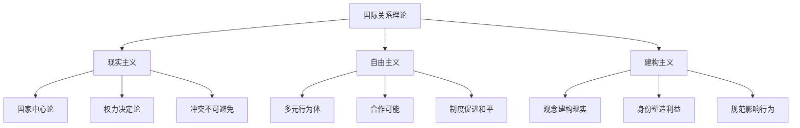

---
aliases: [InternationalRelations, Geopolitics]
tags: ['03_HumanitiesAndSocialSciences', 'PoliticalScience', 'InternationalRelations']
---

# 国际关系与地缘政治 (International Relations and Geopolitics)

## 一、国际关系的核心范式

### 1.1 现实主义（Realism）

现实主义是国际关系理论中最古老也最具影响力的范式，其核心假设如下：

| 核心假设 | 内容 |
|---------|------|
| 国家中心论 | 国家是国际政治的主要行为体 |
| 无政府状态 | 国际体系不存在超越国家的中央政府 |
| 权力政治 | 国家追求权力和安全是核心动机 |
| 理性行为体 | 国家基于利益最大化做出决策 |

**古典现实主义**（Classical Realism, Morgenthau, 1948）：权力是人的本性使然，国际政治受客观规律支配——以权力界定利益（Interest Defined as Power）。

**结构现实主义**（Structural Realism / Neorealism, Waltz, 1979）：国际体系的无政府结构和权力分配（Distribution of Capabilities）塑造国家行为。国际体系是自助理体系（Self-help System）。

**进攻性现实主义**（Offensive Realism, Mearsheimer, 2001）：国家追求权力最大化，大国注定要争夺霸权。

**防御性现实主义**（Defensive Realism）：国家追求安全最大化而非权力最大化，过度扩张反而削弱安全。

### 1.2 自由主义（Liberalism）

自由主义强调合作、制度和相互依存：

| 分支 | 核心论点 | 代表人物 |
|------|---------|---------|
| 理想主义 | 通过国际组织和集体安全实现和平 | Woodrow Wilson |
| 相互依存理论 | 经济相互依存降低冲突倾向 | Keohane & Nye |
| 制度自由主义 | 国际制度促进国家间合作 | Keohane, 1984 |
| 民主和平论 | 民主国家之间很少发生战争 | Doyle, 1983 |
| 共和自由主义 | 代议制政府和分权制衡促进和平 | Kant, 1795 |

**自由制度主义**（Neoliberal Institutionalism）关键概念：

$$
\text{合作可能性} = f(\text{共同利益}, \text{制度设计}, \text{互惠预期}, \text{信息透明度})
$$

### 1.3 建构主义（Constructivism）

建构主义（Wendt, 1992, 1999）挑战物质主义假设，强调观念、身份和规范的作用：

| 核心概念 | 含义 |
|---------|------|
| **观念共享** | 物质力量的意义由社会建构 |
| **身份与利益** | 身份塑造利益，利益塑造行为 |
| **规范** | 行为体的共同期望和适当行为标准 |
| **认同形成** | 通过互动形成集体认同 |

Wendt 的名言："无政府状态是国家造就的"（Anarchy is what states make of it）——无政府状态可以有多种逻辑（霍布斯式、洛克式、康德式）。

### 1.4 批判理论与后实证主义

| 理论流派 | 核心批判 | 方法论特点 |
|---------|---------|---------|
| 新马克思主义 | 世界体系论——核心—半边缘—边缘结构 | 历史唯物主义 |
| 女性主义国际关系 | 国际政治中的性别盲点和男性中心主义 | 性别分析 |
| 后殖民主义 | 国际关系理论中的西方中心主义 | 话语分析、殖民批判 |
| 后结构主义 | 解构主权、安全等核心概念 | 文本分析、谱系学 |

## 二、三大范式比较

| 维度 | 现实主义 | 自由主义 | 建构主义 |
|------|---------|---------|---------|
| 主要行为体 | 国家 | 国家+国际组织+非政府组织 | 国家+观念共同体 |
| 体系性质 | 无政府—自助 | 无政府—合作可能 | 社会建构 |
| 核心动机 | 权力/安全 | 利益/福祉 | 身份/认同 |
| 冲突根源 | 权力竞争 | 信息不对称/背叛 | 身份冲突 |
| 合作前景 | 有限、脆弱 | 制度可以促进 | 规范内化可改变 |
| 变化可能 | 权力转移 | 制度演进 | 身份转变 |

## 三、地缘政治理论

### 3.1 经典地缘政治

| 理论 | 核心观点 | 代表人物 |
|------|---------|---------|
| **海权论** | 控制海洋通道决定世界霸权 | Mahan, 1890 |
| **陆权论** | 控制"世界岛"心脏地带者控制世界 | Mackinder, 1904 |
| **边缘地带论** | 欧亚大陆边缘地区是最关键的 | Spykman, 1944 |
| **空权论** | 空中力量将改变战略格局 | Douhet, 1921 |

### 3.2 当代地缘政治议题

**地缘政治回归**：冷战后地缘政治一度被忽视，但21世纪的大国竞争使其重新成为核心议题：

| 议题 | 地缘政治意义 |
|------|-------------|
| 印太战略 | 美国战略重心东移，遏制中国崛起 |
| 一带一路 | 中国重构欧亚大陆经济地理的战略 |
| 北极竞争 | 气候变化使北极航道和资源争夺加剧 |
| 能源地缘政治 | 油气管道布局和能源安全 |
| 科技地缘政治 | 半导体、5G、AI 领域的技术竞争 |
| 太空地缘政治 | 太空军事化和资源开发 |

## 四、全球治理

### 4.1 国际制度

国际制度（International Institutions）是国际合作的基础：

| 类型 | 实例 | 功能 |
|------|------|------|
| 国际组织 | 联合国、世界贸易组织、国际货币基金组织 | 提供公共产品、促进合作 |
| 国际机制 | 核不扩散机制、气候变化框架 | 协调行为体预期 |
| 国际法 | 海牙公约、日内瓦公约 | 规范国家行为 |

### 4.2 全球治理的挑战

$$
\text{全球治理赤字} = \text{全球化深度} - \text{国际制度有效性}
$$

- **大国竞争加剧**：中美战略竞争削弱多边机制效力
- **非传统安全威胁**：气候变化、大流行病、网络安全
- **治理碎片化**：国际制度重叠、竞争、不一致
- **民主赤字**：国际组织的代表性和问责性不足
- **主权与干预的张力**：人道主义干预与国家主权原则的冲突

## 五、国际关系的研究方法

| 方法 | 特点 | 适用领域 |
|------|------|---------|
| 案例研究 | 深度分析特定事件或国家 | 外交政策分析、危机研究 |
| 大样本统计 | 检验跨国家的普遍规律 | 民主和平论、贸易—冲突关系 |
| 形式模型 | 博弈论分析战略互动 | 军备竞赛、谈判、威慑 |
| 过程追踪 | 揭示因果机制 | 决策过程、规范传播 |
| 话语分析 | 分析文本和修辞 | 身份建构、意识形态 |
| 反事实分析 | 假设性推理 | 历史评价、战略选择 |

## 六、国际关系的重要议题

1. **核威慑与军备控制**（Nuclear Deterrence）：确保相互摧毁（MAD）逻辑与核不扩散
2. **国际冲突与安全**：内战、恐怖主义、网络安全的新安全议程
3. **国际政治经济学**：贸易战、制裁、全球价值链的政治逻辑
4. **人权与国际干预**：保护的责任（R2P）的理念与实践
5. **环境与气候变化治理**：集体行动困境与全球合作
6. **中国与世界**：中国崛起对国际秩序的影响

## 相关条目

- [[03_HumanitiesAndSocialSciences/PoliticalScience/PoliticalTheory/PoliticalTheory|PoliticalTheory]]
- [[07_InterdisciplinarySciences/RegionalAndCountryStudies/ComparativePolitics|ComparativePolitics]]
- [[03_HumanitiesAndSocialSciences/Economics/PoliticalEconomy|PoliticalEconomy]]
- [[INDEX|当前目录索引]]

